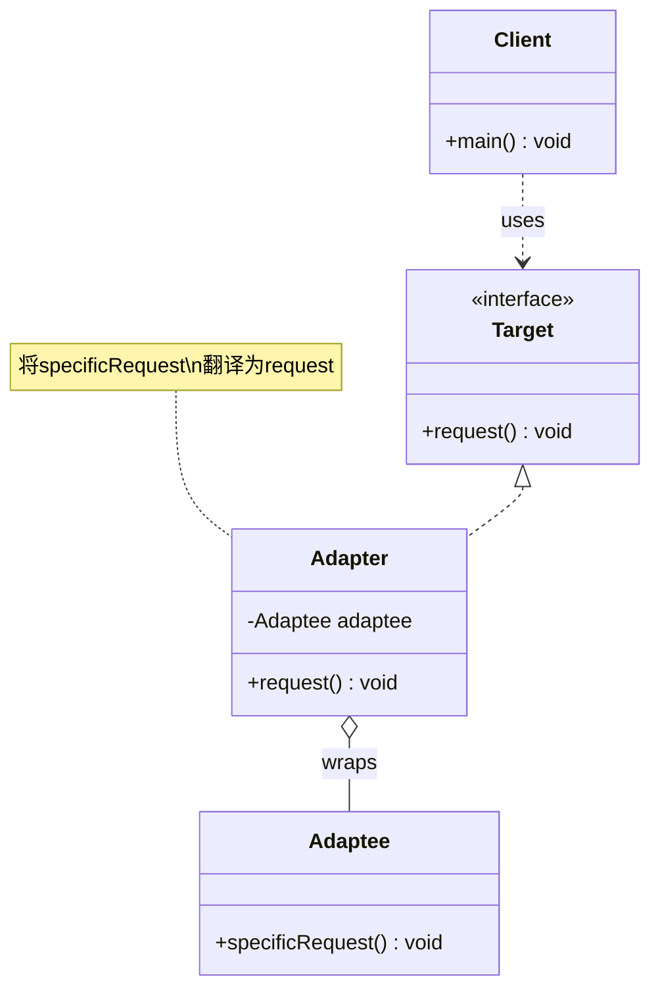

# 适配器 Adapter

> 将一个类的接口转换成客户端期望的另一个接口，使原本不兼容的类可以协同工作。

## 意图

适配器模式就像现实中的电源转换器——你拿着国标插头去国外，需要一个转换器才能插进当地的插座。在代码中，当你有一个已经存在的类，它的接口和你需要的接口不匹配时，可以用适配器模式包装它，让客户端用统一的接口调用。

核心思想是"包装而不改变"——不修改被适配者的代码，而是在外面套一层"翻译"。

打个更贴切的比方：你写了一个日志模块，对外暴露 `info()`、`error()` 方法。后来公司统一要求接入第三方的日志平台，它只提供 `writeLog(level, message)` 这种通用接口。直接改你的日志模块？那所有调用的地方都得改。怎么办？写一个适配器，内部调用第三方接口，对外保持你原来的 `info()`、`error()` 不变。调用的代码一行不动，底层的实现已经换了。

:::tip 适配器 vs 桥接
适配器是在事后补救——两个接口已经存在但不兼容。桥接是在设计阶段主动分离——预防耦合。适配器解决"接口不匹配"问题，桥接解决"维度耦合"问题。
:::

## 适用场景

- 需要使用已有的类，但它的接口与你的系统不兼容时
- 想要创建一个可以复用的类，与不相关的或不可预见的类协同工作
- 需要对接多个第三方服务的不同接口时
- 系统升级时需要兼容旧版本接口时
- 遗留代码重构，不能直接修改旧类时

## UML 类图



## 代码示例

### ❌ 没有使用该模式的问题

```java
// ========== 痛点：系统直接依赖第三方接口，换库就要改一堆代码 ==========

// 第三方日志库的接口（你无法修改，因为是别人的 SDK）
public class ThirdPartyLogger {
    public void writeLog(String level, String message) {
        System.out.println("[" + level + "] " + message);
    }
}

// 又来一个第三方日志库（接口完全不一样）
public class AnotherLogger {
    public void log(LogLevel level, String message, String timestamp) {
        System.out.println(timestamp + " " + level + " - " + message);
    }
}

// 你的系统期望的接口
public interface Logger {
    void info(String message);
    void error(String message);
}

// 痛点1：客户端直接依赖具体第三方类，耦合度极高
public class OrderService {
    // 直接 new 第三方类，想换库？到处改
    private ThirdPartyLogger logger = new ThirdPartyLogger();

    public void processOrder(String orderId) {
        logger.writeLog("INFO", "处理订单: " + orderId);
        // 如果要换 AnotherLogger，所有调用都要改参数格式
    }

    public void cancelOrder(String orderId) {
        logger.writeLog("ERROR", "订单取消: " + orderId);
    }
}

// 痛点2：PaymentService、UserService 里也有同样的 ThirdPartyLogger
// 换库的时候要改 50 个文件，一个漏改就出 bug
```

### ✅ 使用该模式后的改进

```java
// ========== 目标接口：系统期望的统一接口 ==========

public interface Logger {
    void info(String message);
    void error(String message);
}

// ========== 被适配者1：第三方日志库（无法修改源码） ==========

public class ThirdPartyLogger {
    // 第三方接口：level 和 message 放在一个方法里
    public void writeLog(String level, String message) {
        System.out.println("[ThirdParty] [" + level + "] " + message);
    }
}

// ========== 被适配者2：另一个日志库（接口完全不同） ==========

public class AnotherLogger {
    // 另一个第三方接口：需要枚举类型 + 时间戳
    public void log(LogLevel level, String message, String timestamp) {
        System.out.println("[Another] " + timestamp + " " + level + " - " + message);
    }
}

public enum LogLevel {
    INFO, WARN, ERROR
}

// ========== 适配器1：将 ThirdPartyLogger 适配为 Logger ==========

public class ThirdPartyLoggerAdapter implements Logger {
    private final ThirdPartyLogger thirdPartyLogger; // 持有被适配者的引用

    public ThirdPartyLoggerAdapter(ThirdPartyLogger thirdPartyLogger) {
        this.thirdPartyLogger = thirdPartyLogger;
    }

    @Override
    public void info(String message) {
        // 翻译：info() → writeLog("INFO", message)
        thirdPartyLogger.writeLog("INFO", message);
    }

    @Override
    public void error(String message) {
        // 翻译：error() → writeLog("ERROR", message)
        thirdPartyLogger.writeLog("ERROR", message);
    }
}

// ========== 适配器2：将 AnotherLogger 适配为 Logger ==========

public class AnotherLoggerAdapter implements Logger {
    private final AnotherLogger anotherLogger;

    public AnotherLoggerAdapter(AnotherLogger anotherLogger) {
        this.anotherLogger = anotherLogger;
    }

    @Override
    public void info(String message) {
        // 翻译：info() → log(INFO, message, timestamp)
        String timestamp = java.time.LocalDateTime.now().toString();
        anotherLogger.log(LogLevel.INFO, message, timestamp);
    }

    @Override
    public void error(String message) {
        // 翻译：error() → log(ERROR, message, timestamp)
        String timestamp = java.time.LocalDateTime.now().toString();
        anotherLogger.log(LogLevel.ERROR, message, timestamp);
    }
}

// ========== 客户端：只依赖目标接口，完全不关心底层实现 ==========

public class OrderService {
    private final Logger logger; // 只依赖 Logger 接口

    public OrderService(Logger logger) {
        this.logger = logger;
    }

    public void processOrder(String orderId) {
        logger.info("处理订单: " + orderId);
    }

    public void cancelOrder(String orderId) {
        logger.error("订单取消: " + orderId);
    }
}

// ========== 使用示例 ==========

public class Main {
    public static void main(String[] args) {
        System.out.println("===== 使用 ThirdPartyLogger =====");
        // 用适配器包装第三方日志库
        Logger logger1 = new ThirdPartyLoggerAdapter(new ThirdPartyLogger());
        OrderService service1 = new OrderService(logger1);
        service1.processOrder("ORD-001");
        service1.cancelOrder("ORD-002");

        System.out.println("\n===== 切换为 AnotherLogger =====");
        // 只需换一个适配器，业务代码一行不动
        Logger logger2 = new AnotherLoggerAdapter(new AnotherLogger());
        OrderService service2 = new OrderService(logger2);
        service2.processOrder("ORD-003");
        service2.cancelOrder("ORD-004");
    }
}
```

### 变体与扩展

#### 变体 1：类适配器（通过继承）

```java
// 类适配器：通过继承被适配者实现适配（Java 单继承限制）
// 优点：可以直接调用被适配者的 protected 方法
// 缺点：只能适配一个类，且 Java 单继承限制了灵活性
public class ThirdPartyClassAdapter extends ThirdPartyLogger implements Logger {

    @Override
    public void info(String message) {
        // 直接调用继承来的方法
        super.writeLog("INFO", message);
    }

    @Override
    public void error(String message) {
        super.writeLog("ERROR", message);
    }
}
```

#### 变体 2：双向适配器

```java
// 双向适配器：让两个不兼容的接口都能互相调用
public class TwoWayAdapter implements Target, AdapteeInterface {
    private final Target target;
    private final Adaptee adaptee;

    public TwoWayAdapter(Target target, Adaptee adaptee) {
        this.target = target;
        this.adaptee = adaptee;
    }

    // 实现 Target 接口，内部委托给 Adaptee
    @Override
    public void request() {
        adaptee.specificRequest();
    }

    // 实现 Adaptee 接口，内部委托给 Target
    @Override
    public void specificRequest() {
        target.request();
    }
}
```

#### 变体 3：默认适配器（接口适配）

```java
// 当一个接口有很多方法，但客户端只需要其中几个时
// 可以用一个抽象类提供默认空实现，客户端只重写需要的方法

public interface MediaPlayer {
    void playAudio();
    void playVideo();
    void playImage();
    void stop();
    void pause();
    void seek(long position);
    void setVolume(int volume);
    // ... 10+ 个方法
}

// 默认适配器：提供空实现，避免客户端被迫实现所有方法
public abstract class MediaAdapter implements MediaPlayer {
    @Override public void playAudio() {}
    @Override public void playVideo() {}
    @Override public void playImage() {}
    @Override public void stop() {}
    @Override public void pause() {}
    @Override public void seek(long position) {}
    @Override public void setVolume(int volume) {}
}

// 客户端只需实现关心方法
public class AudioPlayer extends MediaAdapter {
    @Override
    public void playAudio() {
        System.out.println("播放音频...");
    }

    @Override
    public void stop() {
        System.out.println("停止播放...");
    }
}
```

### 运行结果

```
===== 使用 ThirdPartyLogger =====
[ThirdParty] [INFO] 处理订单: ORD-001
[ThirdParty] [ERROR] 订单取消: ORD-002

===== 切换为 AnotherLogger =====
[Another] 2024-01-15T10:30:00.123 INFO - 处理订单: ORD-003
[Another] 2024-01-15T10:30:00.124 ERROR - 订单取消: ORD-004
```

## Spring/JDK 中的应用

### Spring 中的应用

#### 1. Spring MVC 的 HandlerAdapter

```java
// Spring MVC 中，不同类型的 Handler 接口完全不同：
// - @Controller 注解的方法
// - 实现 HttpRequestHandler 接口的类
// - 实现 Controller 接口的类（老版本）
// - 实现 Servlet 接口的类
//
// DispatcherServlet 需要统一处理这些不同的 Handler
// HandlerAdapter 就是最典型的适配器模式

public interface HandlerAdapter {
    // 判断当前适配器是否支持这个 Handler
    boolean supports(Object handler);
    // 统一的处理方法，屏蔽不同 Handler 的接口差异
    ModelAndView handle(HttpServletRequest request,
                        HttpServletResponse response,
                        Object handler) throws Exception;
}

// 适配 @Controller 注解的方法
public class RequestMappingHandlerAdapter implements HandlerAdapter {
    @Override
    public boolean supports(Object handler) {
        return handler instanceof HandlerMethod;
    }

    @Override
    public ModelAndView handle(HttpServletRequest request,
                                HttpServletResponse response,
                                Object handler) throws Exception {
        // 将 HandlerMethod 的调用方式适配为统一的 ModelAndView
        HandlerMethod handlerMethod = (HandlerMethod) handler;
        // ... 内部处理反射调用、参数绑定、返回值处理等
        return mav;
    }
}

// DispatcherServlet 只依赖 HandlerAdapter，不关心具体 Handler 类型
public class DispatcherServlet extends FrameworkServlet {
    // 遍历所有 HandlerAdapter，找到支持的那个
    protected ModelAndView handle(HttpServletRequest request, ...) {
        for (HandlerAdapter ha : this.handlerAdapters) {
            if (ha.supports(handler)) {
                return ha.handle(request, response, handler);
            }
        }
    }
}
```

#### 2. Spring AOP 的 AdviceAdapter

```java
// Spring AOP 支持多种 Advice 类型（Before、After、Around、AfterThrowing 等）
// 但底层拦截器链只认 MethodInterceptor
// AdviceAdapter 将各种 Advice 适配为 MethodInterceptor

public interface AdviceAdapter {
    MethodInterceptor getInterceptor(MethodInvocation invocation);
}

// MethodBeforeAdviceAdapter 将 BeforeAdvice 适配为 MethodInterceptor
class MethodBeforeAdviceAdapter implements AdviceAdapter {
    public MethodInterceptor getInterceptor(MethodInvocation mi) {
        return new MethodBeforeAdviceInterceptor(getAdvice());
    }
}

// AfterReturningAdviceAdapter 将 AfterReturningAdvice 适配为 MethodInterceptor
class AfterReturningAdviceAdapter implements AdviceAdapter {
    public MethodInterceptor getInterceptor(MethodInvocation mi) {
        return new AfterReturningAdviceInterceptor(getAdvice());
    }
}
```

### JDK 中的应用

#### 1. java.util.Arrays#asList()

```java
// Arrays.asList() 是一个适配器：将数组适配为 List 接口
String[] array = {"a", "b", "c"};
List<String> list = Arrays.asList(array);

// list 并不是真正的 ArrayList，而是 Arrays 的内部类
// 它适配了数组的功能为 List 接口
// 但注意：不能 add/remove，因为它底层还是那个固定大小的数组
```

#### 2. java.io.InputStreamReader

```java
// InputStreamReader 是字节流到字符流的适配器
// 将 InputStream（字节流）适配为 Reader（字符流）接口

InputStream byteStream = new FileInputStream("data.bin");
// InputStreamReader 在内部做字节→字符的编码转换
Reader charReader = new InputStreamReader(byteStream, "UTF-8");

// 客户端只需要用 Reader 接口读取字符，不用关心底层是字节流
int ch = charReader.read();
```

:::warning 适配器不要滥用
适配器是为了对接不兼容的接口。如果你的接口可以重新设计，直接设计好接口比事后写适配器更合理。适配器用多了说明接口设计有问题，是在"打补丁"而不是"做设计"。
:::

## 优缺点

| 维度 | 优点 | 缺点 |
|------|------|------|
| **复用性** | 让不兼容的已有类复用，不用重写 | — |
| **解耦** | 客户端与被适配者解耦，只依赖目标接口 | — |
| **开闭原则** | 新增适配器不影响已有代码，灵活扩展 | — |
| **透明性** | 客户端不知道底层用了适配器 | 增加了一层间接调用 |
| **性能** | — | 多了一层转发，对性能敏感的场景可能有问题 |
| **结构** | — | 过多适配器会让系统结构混乱，增加理解难度 |
| **设计** | — | 适配器只做接口转换，不能解决根本的接口设计问题 |
| **灵活性** | 对象适配器可以适配多个被适配者 | 类适配器受限于 Java 单继承 |

## 面试追问

**Q1: 类适配器和对象适配器有什么区别？什么时候用哪个？**

A: **类适配器**通过继承被适配者实现适配，Java 单继承限制了它只能适配一个类，但可以直接重写被适配者的方法。**对象适配器**通过组合（持有被适配者引用）实现适配，更灵活，可以适配多个被适配者的子类。实际开发中推荐**对象适配器**，因为：
1. Java 单继承，类适配器已经占了继承位
2. 对象适配器遵循"组合优于继承"原则
3. 对象适配器更灵活，可以动态切换被适配者

**Q2: 适配器模式和装饰器模式的区别？**

A: 结构上确实很像（都是包装一个对象），但**目的完全不同**：
- **适配器**：接口转换，让不兼容的接口能协同工作，不改变原有行为
- **装饰器**：功能增强，在不改变接口的前提下给对象添加新功能

判断方法：看接口是否变了。适配器前后接口不一样，装饰器前后接口一样但行为增强了。

**Q3: 适配器模式和代理模式的区别？**

A:
- **适配器**：改变接口，让 A 接口变成 B 接口
- **代理**：不改变接口，控制对原对象的访问（延迟加载、权限检查等）

适配器是"翻译官"，代理是"门卫"。

**Q4: Spring 中还有哪些适配器模式的应用？**

A:
- `JpaTransactionManager` 适配 JPA 的事务接口为 Spring 的 `PlatformTransactionManager`
- `MethodBeforeAdviceAdapter` 将 AOP 的各种 Advice 适配为统一的 `MethodInterceptor`
- `MessageConverter`（如 `MappingJackson2HttpMessageConverter`）适配不同的消息格式为统一的 HTTP 消息体
- `HandlerExceptionResolver` 将各种异常适配为统一的 ModelAndView 处理

## 相关模式

- **装饰器模式**：结构相似，但装饰器是增强功能，适配器是转换接口
- **桥接模式**：适配器是在事后补救，桥接是在设计阶段预防
- **外观模式**：外观是简化接口（多合一），适配器是转换接口（一对一）
- **代理模式**：代理控制访问，适配器转换接口
- **默认适配器**：抽象类实现接口提供空方法，避免客户端被迫实现所有方法
