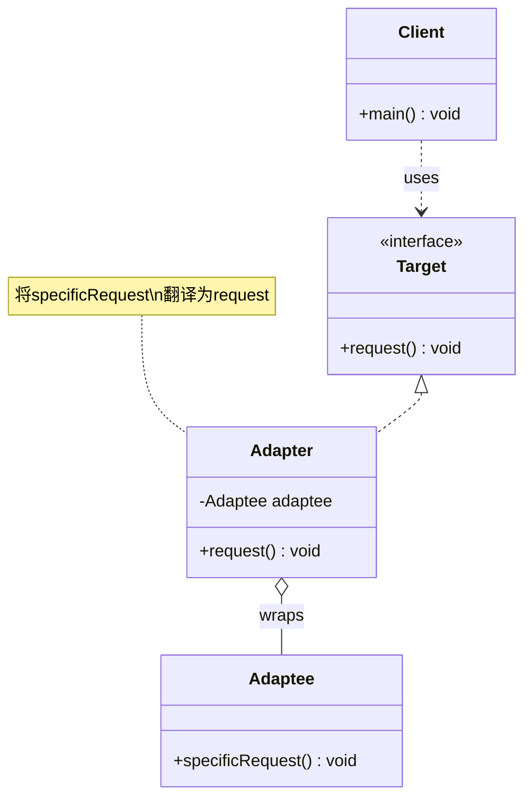

# 适配器 Adapter

> 将一个类的接口转换成客户端期望的另一个接口，使原本不兼容的类可以协同工作。

## 意图

适配器模式就像现实中的电源转换器——你拿着国标插头去国外，需要一个转换器才能插进当地的插座。在代码中，当你有一个已经存在的类，它的接口和你需要的接口不匹配时，可以用适配器模式包装它，让客户端用统一的接口调用。

核心思想是"包装而不改变"——不修改被适配者的代码，而是在外面套一层"翻译"。

## 适用场景

- 需要使用已有的类，但它的接口与你的系统不兼容时
- 想要创建一个可以复用的类，与不相关的或不可预见的类协同工作
- 需要对接多个第三方服务的不同接口时

## UML 类图



## 代码示例

### ❌ 没有使用该模式的问题

```java
// 第三方日志库的接口
public class ThirdPartyLogger {
    public void writeLog(String level, String message) {
        System.out.println("[" + level + "] " + message);
    }
}

// 我们的系统期望的接口
public interface Logger {
    void info(String message);
    void error(String message);
}

// 客户端代码直接依赖第三方接口，耦合度高
public class OrderService {
    private ThirdPartyLogger logger = new ThirdPartyLogger();

    public void processOrder(String orderId) {
        logger.writeLog("INFO", "处理订单: " + orderId);
        // 如果要换日志库，所有调用都要改
    }
}
```

### ✅ 使用该模式后的改进

```java
// 目标接口（系统期望的接口）
public interface Logger {
    void info(String message);
    void error(String message);
}

// 被适配者（第三方库，无法修改）
public class ThirdPartyLogger {
    public void writeLog(String level, String message) {
        System.out.println("[" + level + "] " + message);
    }
}

// 适配器
public class ThirdPartyLoggerAdapter implements Logger {
    private final ThirdPartyLogger thirdPartyLogger;

    public ThirdPartyLoggerAdapter(ThirdPartyLogger thirdPartyLogger) {
        this.thirdPartyLogger = thirdPartyLogger;
    }

    @Override
    public void info(String message) {
        thirdPartyLogger.writeLog("INFO", message);
    }

    @Override
    public void error(String message) {
        thirdPartyLogger.writeLog("ERROR", message);
    }
}

// 客户端只依赖目标接口
public class OrderService {
    private final Logger logger;

    public OrderService(Logger logger) {
        this.logger = logger;
    }

    public void processOrder(String orderId) {
        logger.info("处理订单: " + orderId);
        logger.error("订单处理失败: " + orderId);
    }
}

// 使用
public class Main {
    public static void main(String[] args) {
        Logger logger = new ThirdPartyLoggerAdapter(new ThirdPartyLogger());
        OrderService service = new OrderService(logger);
        service.processOrder("ORD-001");
    }
}
```

### Spring 中的应用

Spring MVC 的 `HandlerAdapter` 是适配器模式的经典应用：

```java
// Spring MVC 中不同类型的 Handler 有不同的处理方法签名
// Controller、HttpRequestHandler、Servlet 等接口各不相同

// HandlerAdapter 将它们统一适配为 ModelAndView
public interface HandlerAdapter {
    boolean supports(Object handler);
    ModelAndView handle(HttpServletRequest request, HttpServletResponse response, Object handler);
}

// RequestMappingHandlerAdapter 适配 @Controller 注解的方法
// HttpRequestHandlerAdapter 适配 HttpRequestHandler 接口
// SimpleControllerHandlerAdapter 适配 Controller 接口

// DispatcherServlet 只依赖 HandlerAdapter，不需要知道具体 Handler 类型
// 这就是适配器模式的力量
```

## 优缺点

| 优点 | 缺点 |
|------|------|
| 让不兼容的接口协同工作，复用已有代码 | 增加了一层间接调用，可能影响性能 |
| 客户端与被适配者解耦 | 过多使用适配器会让系统结构混乱 |
| 符合开闭原则，新增适配器不影响已有代码 | 适配器只做接口转换，不能解决根本的接口设计问题 |
| 灵活，可以适配多个不同的类 | 类适配器（继承方式）在 Java 中受限于单继承 |

## 面试追问

**Q1: 类适配器和对象适配器有什么区别？**

A: 类适配器通过继承被适配者类实现适配（Java 中单继承限制了灵活性），对象适配器通过组合（持有被适配者引用）实现适配（更灵活，推荐使用）。类适配器可以直接重写被适配者的方法，对象适配器只能委托调用。

**Q2: 适配器模式和装饰器模式的区别？**

A: 适配器是为了"接口转换"，让不兼容的接口能协同工作，不改变原有行为。装饰器是为了"增强功能"，在不改变接口的前提下给对象添加新功能。两者的结构相似（都是包装），但目的不同。

**Q3: Spring 中还有哪些适配器模式的应用？**

A: `JpaTransactionManager` 适配 JPA 的事务接口为 Spring 的 `PlatformTransactionManager`；`MethodBeforeAdviceAdapter` 将 AOP 的各种 Advice 适配为统一的 `MethodInterceptor`；`MessageConverter` 适配不同的消息格式（JSON、XML）为统一的 HTTP 消息体。

## 相关模式

- **装饰器模式**：结构相似，但装饰器是增强功能，适配器是转换接口
- **桥接模式**：适配器是在事后补救，桥接是在设计阶段预防
- **外观模式**：外观是简化接口，适配器是转换接口
- **代理模式**：代理控制访问，适配器转换接口
