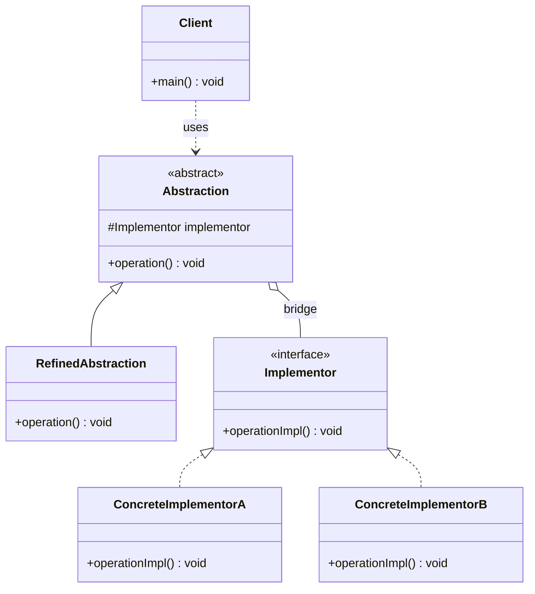

# 桥接 Bridge

> 将抽象部分与实现部分分离，使它们可以独立地变化。

## 意图

桥接模式的核心思想是"组合优于继承"。当一个系统存在两个独立变化的维度时，如果用继承会导致类爆炸（笛卡尔积），桥接模式通过将这两个维度拆分为独立的继承体系，用组合（桥接）连接起来。

比如"形状"和"颜色"两个维度——3 种形状 × 2 种颜色 = 6 个子类。用桥接模式只需要 3 + 2 = 5 个类。

## 适用场景

- 系统有多个独立变化的维度，需要避免多层继承导致类爆炸
- 不希望抽象和实现之间有固定的绑定关系
- 需要在运行时切换实现时
- 抽象和实现都需要独立扩展时

## UML 类图



## 代码示例

### ❌ 没有使用该模式的问题

```java
// 形状和颜色两个维度用继承，导致类爆炸
public class RedCircle extends Circle {
    @Override
    public void draw() {
        System.out.println("画红色圆形");
    }
}

public class BlueCircle extends Circle {
    @Override
    public void draw() {
        System.out.println("画蓝色圆形");
    }
}

public class RedSquare extends Square {
    @Override
    public void draw() {
        System.out.println("画红色正方形");
    }
}

public class BlueSquare extends Square {
    @Override
    public void draw() {
        System.out.println("画蓝色正方形");
    }
}

// 新增一个颜色或形状就要新增大量子类
// 3种形状 × 3种颜色 = 9个类，太多了
```

### ✅ 使用该模式后的改进

```java
// 实现维度：颜色
public interface Color {
    String getColor();
}

public class RedColor implements Color {
    @Override
    public String getColor() { return "红色"; }
}

public class BlueColor implements Color {
    @Override
    public String getColor() { return "蓝色"; }
}

// 抽象维度：形状
public abstract class Shape {
    protected Color color; // 桥接点

    protected Shape(Color color) {
        this.color = color;
    }

    public abstract void draw();
}

public class Circle extends Shape {
    public Circle(Color color) { super(color); }

    @Override
    public void draw() {
        System.out.println("画" + color.getColor() + "圆形");
    }
}

public class Square extends Shape {
    public Square(Color color) { super(color); }

    @Override
    public void draw() {
        System.out.println("画" + color.getColor() + "正方形");
    }
}

// 使用：任意组合
public class Main {
    public static void main(String[] args) {
        Shape redCircle = new Circle(new RedColor());
        Shape blueSquare = new Square(new BlueColor());
        redCircle.draw();  // 画红色圆形
        blueSquare.draw(); // 画蓝色正方形

        // 新增颜色只需新增一个 Color 实现，无需新增 Shape 子类
    }
}
```

### Spring 中的应用

Spring 的事务管理是桥接模式的典型应用：

```java
// 平台抽象（抽象维度）
public interface PlatformTransactionManager {
    TransactionStatus getTransaction(TransactionDefinition definition);
    void commit(TransactionStatus status);
    void rollback(TransactionStatus status);
}

// 具体实现（实现维度）- 桥接到不同的底层事务技术
public class DataSourceTransactionManager implements PlatformTransactionManager {
    // 桥接到 JDBC 事务
}

public class JpaTransactionManager implements PlatformTransactionManager {
    // 桥接到 JPA 事务
}

public class HibernateTransactionManager implements PlatformTransactionManager {
    // 桥接到 Hibernate 事务
}

// @Transactional 注解的代码不关心底层用的是哪种事务技术
// Spring 通过桥接模式让事务管理代码与具体的事务实现解耦
```

## 优缺点

| 优点 | 缺点 |
|------|------|
| 分离抽象和实现，两个维度独立扩展 | 增加系统复杂度，需要识别出两个独立变化的维度 |
| 避免类爆炸问题 | 识别哪些维度需要桥接需要设计经验 |
| 符合开闭原则和单一职责原则 | 引入了抽象层，对初学者不太友好 |
| 可以在运行时切换实现 | 组合关系比继承关系更难理解 |

## 面试追问

**Q1: 桥接模式和适配器模式的区别？**

A: 桥接模式是在设计阶段主动将抽象和实现分离，预防耦合；适配器模式是在事后补救，对接已有但不兼容的接口。桥接的两个维度是独立设计的，适配器的两个接口是已有且不兼容的。

**Q2: 桥接模式和策略模式的区别？**

A: 结构上非常相似，都是"持有接口引用"。区别在于意图：桥接模式关注的是"两个维度的独立变化"，策略模式关注的是"算法族的互换"。桥接模式的抽象部分通常有自己的继承体系，策略模式的上下文通常只有一个。

**Q3: JDBC 驱动管理是不是桥接模式？**

A: 是的。`java.sql.Driver` 是实现接口，`DriverManager` 是抽象层，具体的 `MySQLDriver`、`OracleDriver` 是实现。应用程序只使用 `DriverManager` 和 `Connection` 等抽象接口，不关心具体数据库驱动——这是经典的桥接模式。

## 相关模式

- **适配器模式**：桥接是设计阶段的分离，适配器是事后补救的转换
- **策略模式**：结构相似，但策略模式只关注一个维度的变化
- **抽象工厂模式**：抽象工厂创建的对象可以作为桥接的实现部分
