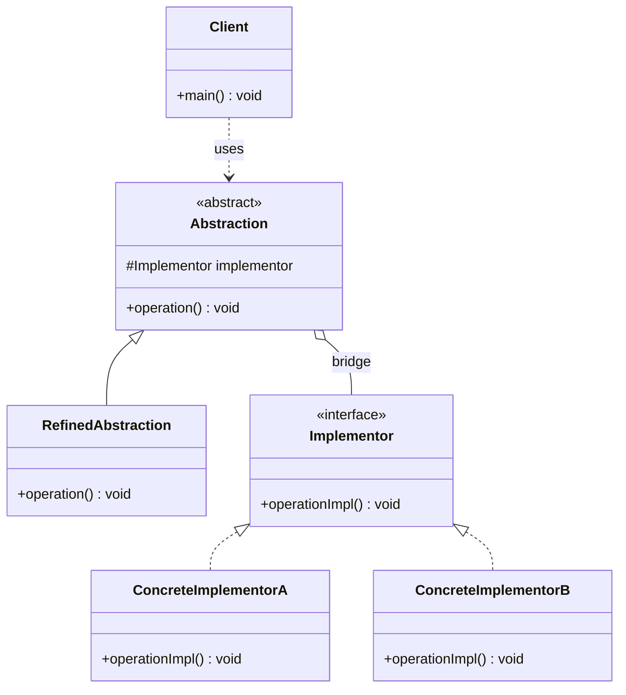

# 桥接 Bridge

> 将抽象部分与实现部分分离，使它们可以独立地变化。

## 意图

桥接模式的核心思想是"组合优于继承"。当一个系统存在两个独立变化的维度时，如果用继承会导致类爆炸（笛卡尔积），桥接模式通过将这两个维度拆分为独立的继承体系，用组合（桥接）连接起来。

打个比方：假设你开一家咖啡店，有 3 种饮品（美式、拿铁、摩卡）和 2 种杯型（中杯、大杯）。如果用继承，你需要 3 × 2 = 6 个类：中杯美式、大杯美式、中杯拿铁、大杯拿铁、中杯摩卡、大杯摩卡。如果再加一种"超大杯"，就要加 3 个类。如果再加一种"卡布奇诺"，又要加 3 个类——这就是**类爆炸**。

用桥接模式呢？饮品是一个维度（3 个类），杯型是另一个维度（2 个类），共 5 个类。加"超大杯"只加 1 个类，加"卡布奇诺"也只加 1 个类。3 种饮品 × 3 种杯型 = 9 种组合，但只需要 6 个类。

核心思想：**当系统有多个独立变化的维度时，用组合替代继承，避免类爆炸**。

:::tip 桥接 vs 适配器
桥接模式是在设计阶段主动将抽象和实现分离——"我知道未来这两个维度会独立变化，所以提前拆开"。适配器模式是在事后补救——"这两个接口已经存在但不兼容，我需要加个中间层"。桥接是"预防"，适配器是"补救"。
:::

## 适用场景

- 系统有多个独立变化的维度，用继承会导致类爆炸（笛卡尔积）
- 不希望抽象和实现之间有固定的绑定关系
- 需要在运行时动态切换实现时
- 抽象和实现都需要独立扩展时
- 一个类存在两个以上的独立变化维度，且都需要扩展时

## UML 类图



## 代码示例

### ❌ 没有使用该模式的问题

```java
// ========== 痛点：用继承表达两个维度的组合，类爆炸 ==========

// 维度1：形状（Circle、Square、Triangle）
// 维度2：颜色（Red、Blue、Green）
// 3 × 3 = 9 个子类！而且每加一种颜色或形状就要加一批类

// 基础形状
public abstract class Shape {
    public abstract void draw();
}

// 红色系列
public class RedCircle extends Shape {
    @Override
    public void draw() { System.out.println("画红色圆形"); }
}

public class RedSquare extends Shape {
    @Override
    public void draw() { System.out.println("画红色正方形"); }
}

public class RedTriangle extends Shape {
    @Override
    public void draw() { System.out.println("画红色三角形"); }
}

// 蓝色系列
public class BlueCircle extends Shape {
    @Override
    public void draw() { System.out.println("画蓝色圆形"); }
}

public class BlueSquare extends Shape {
    @Override
    public void draw() { System.out.println("画蓝色正方形"); }
}

public class BlueTriangle extends Shape {
    @Override
    public void draw() { System.out.println("画蓝色三角形"); }
}

// 绿色系列...又来 3 个类
// 如果再加一个"渐变色"？再加 3 个类
// 如果再加一个"五角星"？再加 3 个类
// 4种形状 × 4种颜色 = 16 个类，完全失控！

// 痛点1：代码重复严重——每个类只有颜色不同，draw 逻辑几乎一样
// 痛点2：新增维度就要创建大量子类
// 痛点3：修改某个颜色的实现要改多个类
```

### ✅ 使用该模式后的改进

```java
// ========== 实现维度：颜色（Implementor） ==========

// 实现接口：定义颜色的操作
public interface Color {
    // 返回颜色的名称和渲染方式
    String apply(String shape);
}

// 具体实现A：红色
public class RedColor implements Color {
    @Override
    public String apply(String shape) {
        return "用红色填充的" + shape;
    }
}

// 具体实现B：蓝色
public class BlueColor implements Color {
    @Override
    public String apply(String shape) {
        return "用蓝色填充的" + shape;
    }
}

// 具体实现C：绿色
public class GreenColor implements Color {
    @Override
    public String apply(String shape) {
        return "用绿色填充的" + shape;
    }
}

// ========== 抽象维度：形状（Abstraction） ==========

// 抽象类：持有实现维度的引用（桥接点）
public abstract class Shape {
    // 桥接点：Shape 不直接实现颜色逻辑，而是委托给 Color
    protected Color color; // 这个引用就是"桥"

    protected Shape(Color color) {
        this.color = color;
    }

    // 抽象方法：由子类实现具体的形状逻辑
    public abstract void draw();
}

// 扩展抽象A：圆形
public class Circle extends Shape {
    public Circle(Color color) {
        super(color); // 传入颜色实现
    }

    @Override
    public void draw() {
        // 圆形 + 颜色 = 完整的渲染结果
        System.out.println(color.apply("圆形 ⭕"));
    }
}

// 扩展抽象B：正方形
public class Square extends Shape {
    public Square(Color color) {
        super(color);
    }

    @Override
    public void draw() {
        System.out.println(color.apply("正方形 ⬜"));
    }
}

// 扩展抽象C：三角形
public class Triangle extends Shape {
    public Triangle(Color color) {
        super(color);
    }

    @Override
    public void draw() {
        System.out.println(color.apply("三角形 △"));
    }
}

// ========== 使用示例 ==========

public class Main {
    public static void main(String[] args) {
        System.out.println("===== 自由组合形状和颜色 =====\n");

        // 任意组合：3 种形状 × 3 种颜色 = 9 种结果
        Shape redCircle = new Circle(new RedColor());
        Shape blueSquare = new Square(new BlueColor());
        Shape greenTriangle = new Triangle(new GreenColor());
        Shape redSquare = new Square(new RedColor());
        Shape blueCircle = new Circle(new BlueColor());

        redCircle.draw();
        blueSquare.draw();
        greenTriangle.draw();
        redSquare.draw();
        blueCircle.draw();

        System.out.println("\n===== 运行时切换颜色 =====");
        // 桥接模式的精髓：可以在运行时动态切换实现
        Shape shape = new Circle(new RedColor());
        shape.draw(); // 红色圆形

        // 运行时换颜色！继承做不到这一点
        shape = new Circle(new BlueColor());
        shape.draw(); // 蓝色圆形

        shape = new Circle(new GreenColor());
        shape.draw(); // 绿色圆形
    }
}
```

### 变体与扩展

#### 变体 1：日志框架的真实场景（多维度桥接）

```java
// 真实场景：日志系统有两个维度
// 维度1：日志级别（Info、Warn、Error）
// 维度2：输出目标（Console、File、Database）

// 实现维度：输出目标
public interface LogOutput {
    void write(String level, String message);
}

public class ConsoleOutput implements LogOutput {
    @Override
    public void write(String level, String message) {
        System.out.println("[Console] " + level + " - " + message);
    }
}

public class FileOutput implements LogOutput {
    @Override
    public void write(String level, String message) {
        System.out.println("[File] 写入日志文件: " + level + " - " + message);
    }
}

public class DatabaseOutput implements LogOutput {
    @Override
    public void write(String level, String message) {
        System.out.println("[DB] 插入日志表: " + level + " - " + message);
    }
}

// 抽象维度：日志器
public abstract class Logger {
    protected LogOutput output; // 桥接点

    protected Logger(LogOutput output) {
        this.output = output;
    }

    public abstract void log(String message);
}

public class InfoLogger extends Logger {
    public InfoLogger(LogOutput output) { super(output); }

    @Override
    public void log(String message) {
        output.write("INFO", message);
    }
}

public class ErrorLogger extends Logger {
    public ErrorLogger(LogOutput output) { super(output); }

    @Override
    public void log(String message) {
        output.write("ERROR", message);
    }
}

// 使用：日志级别 × 输出目标 = 自由组合
Logger logger = new ErrorLogger(new DatabaseOutput());
logger.log("数据库连接失败");
```

#### 变体 2：运行时动态切换实现

```java
// 桥接模式的核心优势：运行时切换实现
public class ShapeWithDynamicColor extends Shape {
    public ShapeWithDynamicColor(Color color) { super(color); }

    // 提供方法在运行时更换颜色
    public void changeColor(Color newColor) {
        this.color = newColor; // 直接替换实现
    }

    @Override
    public void draw() {
        System.out.println(color.apply("动态变色圆形"));
    }
}

// 使用
Shape shape = new ShapeWithDynamicColor(new RedColor());
shape.draw(); // 红色

// 运行时切换
((ShapeWithDynamicColor) shape).changeColor(new BlueColor());
shape.draw(); // 蓝色

// 继承方式完全做不到运行时切换——RedCircle 永远是红色的
```

#### 变体 3：适配器桥接（连接已有的实现体系）

```java
// 当两个已有的继承体系需要互相配合时
// 可以用桥接模式将它们连接起来

// 已有体系A：支付方式
public interface PaymentMethod {
    void pay(BigDecimal amount);
}

public class AlipayPayment implements PaymentMethod {
    @Override
    public void pay(BigDecimal amount) {
        System.out.println("[支付宝] 支付: ¥" + amount);
    }
}

public class WechatPayment implements PaymentMethod {
    @Override
    public void pay(BigDecimal amount) {
        System.out.println("[微信] 支付: ¥" + amount);
    }
}

// 已有体系B：订单类型
public abstract class Order {
    protected PaymentMethod paymentMethod; // 桥接两个体系

    protected Order(PaymentMethod paymentMethod) {
        this.paymentMethod = paymentMethod;
    }

    public abstract void checkout();
}

public class NormalOrder extends Order {
    public NormalOrder(PaymentMethod paymentMethod) { super(paymentMethod); }

    @Override
    public void checkout() {
        System.out.println("[普通订单] 结算");
        paymentMethod.pay(calculateAmount());
    }

    private BigDecimal calculateAmount() { return new BigDecimal("100.00"); }
}

public class VipOrder extends Order {
    public VipOrder(PaymentMethod paymentMethod) { super(paymentMethod); }

    @Override
    public void checkout() {
        System.out.println("[VIP 订单] 结算（打 8 折）");
        paymentMethod.pay(calculateAmount());
    }

    private BigDecimal calculateAmount() { return new BigDecimal("80.00"); }
}
```

### 运行结果

```
===== 自由组合形状和颜色 =====

用红色填充的圆形 ⭕
用蓝色填充的正方形 ⬜
用绿色填充的三角形 △
用红色填充的正方形 ⬜
用蓝色填充的圆形 ⭕

===== 运行时切换颜色 =====
用红色填充的圆形 ⭕
用蓝色填充的圆形 ⭕
用绿色填充的圆形 ⭕
```

## Spring/JDK 中的应用

### Spring 中的应用

#### 1. 事务管理（PlatformTransactionManager）

```java
// Spring 事务管理的抽象维度：PlatformTransactionManager
// 实现维度：各种底层事务技术

// 抽象维度：统一的事务管理接口
public interface PlatformTransactionManager {
    TransactionStatus getTransaction(TransactionDefinition definition) throws TransactionException;
    void commit(TransactionStatus status) throws TransactionException;
    void rollback(TransactionStatus status) throws TransactionException;
}

// 实现维度A：桥接到 JDBC 事务
public class DataSourceTransactionManager implements PlatformTransactionManager {
    private DataSource dataSource; // 底层依赖

    @Override
    public TransactionStatus getTransaction(TransactionDefinition definition) {
        // 通过 JDBC Connection 管理事务
        Connection con = DataSourceUtils.getConnection(this.dataSource);
        return new DefaultTransactionStatus(con, ...);
    }

    @Override
    public void commit(TransactionStatus status) {
        // JDBC commit
    }

    @Override
    public void rollback(TransactionStatus status) {
        // JDBC rollback
    }
}

// 实现维度B：桥接到 JPA 事务
public class JpaTransactionManager extends AbstractPlatformTransactionManager {
    private EntityManagerFactory emf;

    @Override
    protected Object doGetTransaction() {
        // 通过 EntityManager 管理事务
        EntityManager em = EntityManagerFactoryUtils.doGetTransactionalEntityManager(emf);
        return new JpaTransactionObject(em);
    }
}

// 实现维度C：桥接到 Hibernate 事务
public class HibernateTransactionManager extends AbstractPlatformTransactionManager {
    private SessionFactory sessionFactory;

    @Override
    protected Object doGetTransaction() {
        // 通过 Hibernate Session 管理事务
    }
}

// 业务代码只依赖抽象维度，完全不关心底层实现
@Transactional
public void transferMoney(Long fromId, Long toId, BigDecimal amount) {
    // Spring 自动根据配置选择 PlatformTransactionManager 实现
    // 业务代码不知道也不关心底层是 JDBC、JPA 还是 Hibernate
    accountDao.deduct(fromId, amount);
    accountDao.add(toId, amount);
}
```

#### 2. Spring 的 Resource 抽象（资源加载）

```java
// Spring 的 Resource 接口是对各种资源类型的抽象
// 不同实现桥接到不同的资源加载方式

public interface Resource extends InputStreamSource {
    InputStream getInputStream() throws IOException;
    URL getURL() throws IOException;
    File getFile() throws IOException;
    boolean exists();
}

// 桥接到文件系统
public class FileSystemResource implements Resource {
    private final File file;
    public InputStream getInputStream() throws FileNotFoundException {
        return new FileInputStream(this.file);
    }
}

// 桥接到 classpath
public class ClassPathResource implements Resource {
    private final String path;
    public InputStream getInputStream() throws IOException {
        InputStream is = getClass().getClassLoader().getResourceAsStream(this.path);
        if (is == null) throw new FileNotFoundException(this.path);
        return is;
    }
}

// 桥接到 URL
public class UrlResource implements Resource {
    private final URL url;
    public InputStream getInputStream() throws IOException {
        return this.url.openStream();
    }
}

// 客户端代码统一使用 Resource 接口
@Resource
private Resource configResource; // 可以是文件、classpath、URL，对业务透明
```

### JDK 中的应用

#### 1. JDBC 驱动管理（经典桥接模式）

```java
// JDBC 是桥接模式的教科书级应用
// 抽象维度：java.sql 包中的接口（Connection、Statement、ResultSet 等）
// 实现维度：各数据库驱动（MySQL、PostgreSQL、Oracle 等）

// DriverManager 是抽象层（桥接管理器）
Connection conn = DriverManager.getConnection(
    "jdbc:mysql://localhost:3306/test",  // URL 决定用哪个驱动
    "user", "password"
);

// 创建的 Statement、ResultSet 都来自同一个驱动实现
// 它们互相兼容，属于同一个"产品族"
Statement stmt = conn.createStatement();
ResultSet rs = stmt.executeQuery("SELECT * FROM users");

// 换数据库只需改 URL，业务代码完全不动
// Connection conn = DriverManager.getConnection("jdbc:postgresql://...");
```

#### 2. java.util.Collections（算法与数据结构的桥接）

```java
// Collections 类的很多方法用桥接思想将算法与数据结构分离

// synchronizedList：将同步策略"桥接"到任意 List
List<String> list = new ArrayList<>();
List<String> syncList = Collections.synchronizedList(list);
// syncList 是 ArrayList + 同步策略 的桥接

// unmodifiableList：将不可变策略"桥接"到任意 List
List<String> immutable = Collections.unmodifiableList(list);

// checkedList：将类型检查策略"桥接"到任意 List
List rawList = new ArrayList();
List<String> checked = Collections.checkedList(rawList, String.class);
```

:::danger 什么时候不需要桥接
如果两个维度中有一个基本不会变化（比如颜色永远是红蓝绿三种），或者类爆炸问题不严重（比如只有 4-6 个组合类），用桥接模式反而增加了不必要的抽象层。桥接模式适合"两个维度都会频繁扩展"的场景。
:::

## 优缺点

| 维度 | 优点 | 缺点 |
|------|------|------|
| **扩展性** | 两个维度独立扩展，新增形状或颜色只需各加一个类 | — |
| **避免类爆炸** | M 种形状 × N 种颜色只需要 M + N 个类（而非 M × N） | — |
| **运行时切换** | 可以在运行时动态替换实现（组合的优势） | — |
| **开闭原则** | 新增维度不需要修改已有代码 | — |
| **解耦** | 抽象和实现完全分离，互不影响 | — |
| **复杂度** | — | 增加系统复杂度，需要识别出两个独立变化的维度 |
| **设计难度** | — | 识别哪些维度需要桥接需要设计经验，不是所有场景都一目了然 |
| **理解成本** | — | 引入了抽象层，对初学者不太友好 |
| **间接性** | — | 通过组合间接调用实现，调试时调用链更长 |

## 面试追问

**Q1: 桥接模式和适配器模式的区别？**

A:

| 对比项 | 桥接模式 | 适配器模式 |
|--------|---------|-----------|
| 目的 | 分离抽象和实现，让两个维度独立变化 | 转换不兼容的接口，让已有类能协同工作 |
| 时机 | 设计阶段（主动设计） | 事后补救（已有不兼容的接口） |
| 接口关系 | 抽象和实现是独立设计的 | 被适配者的接口已经存在 |
| 变化方向 | 两个维度都可能变化 | 适配器需要适配多个已有的接口 |
| 一句话 | "我知道它们会变，提前拆开" | "它们已经不兼容了，我加个中间层" |

**Q2: 桥接模式和策略模式的区别？结构上看起来很像？**

A: 确实，结构上非常相似——都是"持有接口引用，通过组合实现多态"。但**意图不同**：

- **桥接模式**：关注"两个维度的独立变化"。抽象部分有自己的继承体系，实现部分也有自己的继承体系。比如 Shape（Circle、Square）× Color（Red、Blue），两个维度都是继承体系
- **策略模式**：关注"一个维度的算法族互换"。上下文通常只有一个类（或简单的继承），持有策略接口引用来切换不同算法

判断方法：看抽象部分是否有自己的继承体系。如果有（如 Shape 有 Circle、Square 子类），大概率是桥接模式。如果没有（就一个 Context 类），大概率是策略模式。

**Q3: JDBC 驱动管理是不是桥接模式？**

A: 是的，JDBC 是桥接模式的教科书级应用：
- **抽象维度**：`java.sql` 包中的接口——`Connection`、`Statement`、`PreparedStatement`、`ResultSet`、`DatabaseMetaData` 等
- **实现维度**：各数据库厂商的驱动——`MySQLDriver`、`PostgreSQLDriver`、`OracleDriver` 等
- **桥接点**：`DriverManager` 根据 JDBC URL 选择对应的 Driver 实现

应用程序只使用 `java.sql` 包中的抽象接口，不关心具体数据库驱动。换数据库只需改 URL 和驱动依赖，业务代码完全不动。

**Q4: 桥接模式在实际项目中怎么识别需要用？**

A: 看这几个信号：
1. **代码中出现了笛卡尔积式的子类**：比如 `RedCircle`、`BlueCircle`、`RedSquare`、`BlueSquare`……
2. **一个类的修改触发了连锁反应**：改了颜色逻辑，要改所有形状子类
3. **你想在运行时切换某个维度的实现**：继承做不到，但组合可以
4. **你的类有两个以上独立变化的维度**，且这些维度都可能扩展

如果你发现自己在纠结"这个行为应该放在哪个类里"，说明可能是桥接模式的候选场景。

## 相关模式

- **适配器模式**：桥接是设计阶段的分离，适配器是事后补救的转换
- **策略模式**：结构相似，但策略模式只关注一个维度的算法族互换
- **抽象工厂模式**：抽象工厂创建的对象可以作为桥接的实现部分
- **装饰器模式**：装饰器增强功能，桥接分离维度——两者可以结合使用
- **组合模式**：桥接模式分离的抽象维度可以使用组合模式来构建层次结构
