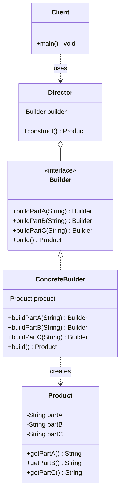

# 建造者 Builder

> 将复杂对象的构建与表示分离，使得同样的构建过程可以创建不同的表示。

## 意图

当一个对象有很多属性、构造参数众多或者需要分步骤构建时，建造者模式可以将复杂的构造过程拆解为一系列简单步骤。客户端通过链式调用设置需要的属性，最后调用一个 build 方法得到完整的对象。

打个比方：你去麦当劳点餐，店员不会让你一次性说出所有要求（汉堡类型 + 温度 + 饮料 + 薯条大小 + 是否加酱），而是会逐步问你——"要什么汉堡？"、"要什么饮料？"、"薯条要大份还是小份？"。每一步你只需要回答一个问题，最终得到一份完整的套餐。建造者模式就是这个点餐过程。

这种模式特别适合参数可选、组合多变的场景——你不需要记住各种构造方法的参数顺序，只需设置你关心的属性。

:::tip 建造者 vs 工厂
工厂模式关注"创建什么类型的对象"，建造者模式关注"如何一步步组装对象"。工厂是"我要一个 iPhone"，建造者是"我要一个 256GB、深空灰、带 AppleCare 的 iPhone"。
:::

## 适用场景

- 类有很多可选参数，构造方法参数列表过长时（telescoping constructor 反模式）
- 需要创建不可变对象（配合 final 字段）
- 多个部件可以按不同顺序或组合装配成不同对象时
- 对象的创建需要多个步骤，且步骤之间有依赖关系时
- 同一个构建过程需要创建不同的表示时

## UML 类图



## 代码示例

### ❌ 没有使用该模式的问题

```java
// ========== 痛点1：telescoping constructor 反模式 ==========

public class HttpRequest {
    private final String url;
    private final String method;
    private final Map<String, String> headers;
    private final String body;
    private final int timeout;
    private final boolean followRedirects;
    private final Proxy proxy;
    private final SSLContext sslContext;

    // 构造方法参数列表爆炸！7 个参数，而且大部分是可选的
    public HttpRequest(String url, String method, Map<String, String> headers,
                       String body, int timeout, boolean followRedirects,
                       Proxy proxy, SSLContext sslContext) {
        this.url = url;
        this.method = method;
        this.headers = headers;
        this.body = body;
        this.timeout = timeout;
        this.followRedirects = followRedirects;
        this.proxy = proxy;
        this.sslContext = sslContext;
    }

    // 为了方便调用，提供各种重载——参数顺序容易搞混
    public HttpRequest(String url, String method) {
        this(url, method, null, null, 30000, true, null, null);
    }

    public HttpRequest(String url, String method, int timeout) {
        this(url, method, null, null, timeout, true, null, null);
    }

    // 还有几十种组合...维护噩梦
}

// 痛点2：使用时完全看不懂每个参数是什么
HttpRequest request = new HttpRequest(
    "https://api.example.com/users",  // url
    "POST",                            // method
    Map.of("Content-Type", "application/json"),  // headers
    "{\"name\":\"张三\"}",             // body
    5000,                              // timeout... 还是 proxy port？
    true,                              // followRedirects
    null,                              // proxy... 还是 sslContext？
    null                               // sslContext
); // 这行代码谁能一眼看懂？

// ========== 痛点3：JavaBean 模式的线程安全问题 ==========

public class HttpRequestBean {
    private String url;     // 非 final，可变
    private String method;
    private int timeout;

    // 无参构造 + setter，参数多了一样痛苦
    public void setUrl(String url) { this.url = url; }
    public void setMethod(String method) { this.method = method; }
    public void setTimeout(int timeout) { this.timeout = timeout; }
}

// JavaBean 模式无法创建不可变对象，在多线程环境下有数据竞争风险
HttpRequestBean req = new HttpRequestBean();
req.setUrl("https://api.example.com");
// 如果此时另一个线程读取 req，可能看到不一致的状态
```

### ✅ 使用该模式后的改进

```java
// ========== 产品类：不可变对象，所有字段 final ==========

public class HttpRequest {
    // 所有字段 final，保证不可变性
    private final String url;                    // 必填
    private final String method;                 // 可选，默认 GET
    private final Map<String, String> headers;   // 可选，默认空
    private final String body;                   // 可选
    private final int timeout;                   // 可选，默认 30s
    private final boolean followRedirects;       // 可选，默认 true
    private final Proxy proxy;                   // 可选
    private final SSLContext sslContext;          // 可选

    // 私有构造方法，只能通过 Builder 创建
    private HttpRequest(Builder builder) {
        this.url = builder.url;
        this.method = builder.method;
        this.headers = Collections.unmodifiableMap(new HashMap<>(builder.headers));
        this.body = builder.body;
        this.timeout = builder.timeout;
        this.followRedirects = builder.followRedirects;
        this.proxy = builder.proxy;
        this.sslContext = builder.sslContext;
    }

    // Getter 方法（没有 setter，保证不可变）
    public String getUrl() { return url; }
    public String getMethod() { return method; }
    public Map<String, String> getHeaders() { return headers; }
    public String getBody() { return body; }
    public int getTimeout() { return timeout; }
    public boolean isFollowRedirects() { return followRedirects; }

    @Override
    public String toString() {
        return "HttpRequest{url='" + url + "', method='" + method
             + "', timeout=" + timeout + ", body='" + body + "'}";
    }

    // ========== Builder 内部类 ==========

    public static class Builder {
        // 必填参数没有默认值，在 build() 时校验
        private String url;
        // 可选参数有默认值
        private String method = "GET";
        private Map<String, String> headers = new HashMap<>();
        private String body = null;
        private int timeout = 30000;          // 默认 30 秒
        private boolean followRedirects = true;
        private Proxy proxy = null;
        private SSLContext sslContext = null;

        // 必填参数通过构造方法设置
        public Builder(String url) {
            this.url = url; // URL 是必填的，没有默认值
        }

        // 每个 setter 返回 this，支持链式调用
        public Builder method(String method) {
            this.method = method;
            return this; // 返回 this 是链式调用的关键
        }

        public Builder header(String key, String value) {
            this.headers.put(key, value);
            return this;
        }

        public Builder headers(Map<String, String> headers) {
            this.headers.putAll(headers);
            return this;
        }

        public Builder body(String body) {
            this.body = body;
            return this;
        }

        public Builder timeout(int timeout) {
            // 参数校验可以在 setter 中做
            if (timeout < 0) {
                throw new IllegalArgumentException("timeout 不能为负数");
            }
            this.timeout = timeout;
            return this;
        }

        public Builder followRedirects(boolean followRedirects) {
            this.followRedirects = followRedirects;
            return this;
        }

        public Builder proxy(Proxy proxy) {
            this.proxy = proxy;
            return this;
        }

        public Builder sslContext(SSLContext sslContext) {
            this.sslContext = sslContext;
            return this;
        }

        // build() 方法：校验参数 + 创建不可变对象
        public HttpRequest build() {
            // 校验必填参数
            if (this.url == null || this.url.isBlank()) {
                throw new IllegalStateException("url 是必填参数");
            }
            // POST/PUT 请求必须有 body
            if (("POST".equals(this.method) || "PUT".equals(this.method))
                    && this.body == null) {
                System.out.println("[警告] " + this.method + " 请求建议设置 body");
            }
            return new HttpRequest(this); // 调用私有构造方法
        }
    }
}

// ========== 使用示例 ==========

public class Main {
    public static void main(String[] args) {
        // 简单请求：只设 URL
        HttpRequest simple = new HttpRequest.Builder("https://api.example.com/health")
                .build();
        System.out.println("简单请求: " + simple);

        // 完整请求：链式调用，可读性极佳
        HttpRequest full = new HttpRequest.Builder("https://api.example.com/users")
                .method("POST")
                .header("Content-Type", "application/json")
                .header("Authorization", "Bearer token123")
                .body("{\"name\":\"张三\",\"age\":25}")
                .timeout(5000)
                .followRedirects(false)
                .build();
        System.out.println("完整请求: " + full);

        // GET 请求带查询参数
        HttpRequest search = new HttpRequest.Builder("https://api.example.com/search")
                .header("Accept", "application/json")
                .timeout(10000)
                .build();
        System.out.println("搜索请求: " + search);
    }
}
```

### 变体与扩展

#### 变体 1：带 Director 的传统 Builder（经典 GoF 模式）

```java
// Director 封装了固定的构建步骤，适用于构建过程固定但配置不同的场景
public class RequestDirector {
    private HttpRequest.Builder builder;

    public RequestDirector(HttpRequest.Builder builder) {
        this.builder = builder;
    }

    // 封装"标准 API 请求"的构建步骤
    public HttpRequest buildStandardApiRequest(String path) {
        return builder
                .method("GET")
                .header("Accept", "application/json")
                .header("X-Api-Version", "v1")
                .timeout(10000)
                .build();
    }

    // 封装"文件上传请求"的构建步骤
    public HttpRequest buildUploadRequest(String path, String contentType) {
        return builder
                .method("POST")
                .header("Content-Type", contentType)
                .timeout(60000) // 上传超时时间长一些
                .build();
    }
}
```

#### 变体 2：Lombok @Builder（实际开发中最常用）

```java
// Lombok 自动生成 Builder，省去手写内部类的麻烦
import lombok.Builder;
import lombok.Getter;
import lombok.Singular;

@Getter
@Builder
public class UserDTO {
    private final Long id;
    private final String name;
    @Builder.Default
    private final String role = "USER"; // 默认值
    @Singular // 处理集合参数，提供单个添加方法
    private final List<String> permissions;
    @Builder.Default
    private final boolean active = true;
}

// 使用 Lombok Builder
UserDTO user = UserDTO.builder()
        .id(1L)
        .name("张三")
        .permission("READ")    // @Singular 生成的单个添加方法
        .permission("WRITE")
        .build();

// 从已有对象创建（需要加 @Builder(toBuilder = true)）
UserDTO updated = user.toBuilder()
        .name("李四")
        .build();
```

#### 变体 3：Builder 实现接口（多态 Builder）

```java
// 当有多个相似的产品类时，Builder 也可以有继承体系
public interface UserBuilder {
    UserBuilder name(String name);
    UserBuilder email(String email);
    UserBuilder age(int age);
    User build();
}

public class EmployeeBuilder implements UserBuilder {
    private String name;
    private String email;
    private int age;
    private String department;
    private double salary;

    @Override
    public EmployeeBuilder name(String name) { this.name = name; return this; }

    @Override
    public EmployeeBuilder email(String email) { this.email = email; return this; }

    @Override
    public EmployeeBuilder age(int age) { this.age = age; return this; }

    public EmployeeBuilder department(String dept) { this.department = dept; return this; }

    public EmployeeBuilder salary(double salary) { this.salary = salary; return this; }

    @Override
    public Employee build() {
        return new Employee(name, email, age, department, salary);
    }
}
```

### 运行结果

```
简单请求: HttpRequest{url='https://api.example.com/health', method='GET', timeout=30000, body='null'}
完整请求: HttpRequest{url='https://api.example.com/users', method='POST', timeout=5000, body='{"name":"张三","age":25}'}
搜索请求: HttpRequest{url='https://api.example.com/search', method='GET', timeout=10000, body='null'}
```

## Spring/JDK 中的应用

### Spring 中的应用

#### 1. UriComponentsBuilder（构建复杂 URI）

```java
// Spring 提供的 URI 建造者，支持链式调用构建复杂的 URL
UriComponents uri = UriComponentsBuilder
        .fromHttpUrl("https://api.example.com")
        .path("/users/{id}")          // 路径参数
        .queryParam("fields", "name,email")  // 查询参数
        .queryParam("page", 1)
        .queryParam("size", 10)
        .encode()                     // URL 编码
        .build()
        .expand(42)                   // 替换路径占位符
        .toUri();

// 结果: https://api.example.com/users/42?fields=name%2Cemail&page=1&size=10
System.out.println(uri);

// RestTemplate 中直接使用
ResponseEntity<User> response = restTemplate.getForEntity(
    UriComponentsBuilder.fromHttpUrl("https://api.example.com/users/{id}")
        .queryParam("detail", "true")
        .buildAndExpand(userId)
        .toUri(),
    User.class
);
```

#### 2. BeanDefinitionBuilder（编程式注册 Bean）

```java
// Spring 提供的 Bean 定义建造者
BeanDefinitionBuilder builder = BeanDefinitionBuilder
        .rootBeanDefinition(MyService.class)
        .addPropertyValue("dataSource", dataSource)   // set 属性注入
        .addConstructorArgValue("configValue")        // 构造参数注入
        .setInitMethodName("init")                     // init-method
        .setDestroyMethodName("cleanup")               // destroy-method
        .setScope("prototype");                        // 作用域

// 注册到 BeanFactory
beanFactory.registerBeanDefinition("myService", builder.getBeanDefinition());
```

#### 3. ResponseEntity.BodyBuilder（构建 HTTP 响应）

```java
// Spring MVC 中构建响应体的建造者
ResponseEntity<User> response = ResponseEntity
        .ok()                                          // 200 状态码
        .header("X-Custom-Header", "value")           // 自定义响应头
        .contentType(MediaType.APPLICATION_JSON)       // Content-Type
        .body(user);                                   // 响应体

// 404 响应
ResponseEntity<Void> notFound = ResponseEntity.notFound().build();

// 201 Created
ResponseEntity<User> created = ResponseEntity
        .created(URI.create("/api/users/" + user.getId()))
        .body(user);
```

### JDK 中的应用

#### 1. StringBuilder（JDK 内置的建造者）

```java
// StringBuilder 是建造者模式的经典实现
// 将字符串的拼接（复杂构建）分步完成
StringBuilder sb = new StringBuilder();
sb.append("Hello");       // 步骤1
sb.append(" ");           // 步骤2
sb.append("World");       // 步骤3
String result = sb.toString(); // 最终构建

// StringBuilder 是可变的建造者
// String 是不可变的产品
// JDK 还提供了 StringBuffer（线程安全版本）
```

#### 2. java.time 包的 Builder 模式

```java
// LocalDate 的建造者模式（通过 of 方法链式构建）
LocalDateTime dateTime = LocalDateTime.of(2024, 1, 15, 10, 30, 0);

// 更灵活的构建方式
LocalDate date = LocalDate.now()
        .withYear(2024)
        .withMonth(1)
        .withDayOfMonth(15);

// java.time.format.DateTimeFormatter.Builder
DateTimeFormatter formatter = new DateTimeFormatterBuilder()
        .appendPattern("yyyy-MM-dd")
        .appendLiteral(" ")
        .appendPattern("HH:mm:ss")
        .toFormatter();
```

:::warning Builder 模式的参数校验陷阱
在 Builder 的 setter 中做校验（如 `timeout < 0`）时要注意：如果同一个 Builder 实例被多次 build()，中间修改了参数可能导致不一致。推荐在 `build()` 方法中做最终校验，而不是在 setter 中。
:::

## 优缺点

| 维度 | 优点 | 缺点 |
|------|------|------|
| **可读性** | 链式调用，参数命名清晰，自文档化 | — |
| **不可变性** | 可以构建不可变对象（final 字段），线程安全 | — |
| **灵活性** | 参数可选，自由组合，不必记忆参数顺序 | — |
| **校验** | 可以在 build() 中集中校验参数合法性 | — |
| **代码量** | — | 需要额外创建 Builder 类，代码量翻倍（Lombok 可缓解） |
| **维护** | — | 产品类新增字段需要同步修改 Builder |
| **性能** | — | 多了一层间接性，创建对象多一次分配（可忽略） |
| **适用范围** | — | 简单对象（少于 4 个参数）不需要 Builder，过度设计 |

## 面试追问

**Q1: Builder 模式和工厂模式的区别？**

A: 两个模式解决不同的问题：
- **工厂模式**：关注"创建什么类型的对象"，侧重于多态性。客户端说"给我一个 X"，工厂决定返回 X 的哪个实现
- **建造者模式**：关注"如何一步步组装对象"，侧重于复杂对象的构建过程。客户端一步步配置参数，最后得到一个配置好的对象

打个比方：工厂是"你告诉厨师要什么菜，厨师决定怎么做"；建造者是"你自己一步步选配菜、调料、火候，最后得到你的专属菜品"。

**Q2: Lombok 的 @Builder 注解做了什么？有什么坑？**

A: `@Builder` 在编译时自动生成：
1. 一个全参私有构造方法
2. 一个 `Builder` 静态内部类，包含所有字段的 setter 和 `build()` 方法
3. 一个 `builder()` 静态方法

常见坑：
- `@Builder.Default` 才能给字段设默认值，不加 `@Default` 的字段默认值会被忽略
- 生成的 Builder 不会自动做参数校验，需要手动在类上加校验注解或自己写校验逻辑
- 继承场景下 `@Builder` 不太好使，子类的 Builder 不会包含父类字段，需要用 `@SuperBuilder`
- `@Builder` 和 JPA 的无参构造方法可能冲突，需要同时加 `@NoArgsConstructor` 和 `@AllArgsConstructor`

**Q3: Builder 模式如何保证不可变对象的线程安全？**

A: 关键是四步：
1. 产品类所有字段用 `final` 修饰，确保创建后不可变
2. 构造方法私有化，只能通过 Builder 的 `build()` 创建
3. 引用类型字段在构造方法中做**防御性拷贝**（如 `new HashMap<>(builder.headers)`）
4. 返回不可变视图（如 `Collections.unmodifiableMap()`）

多线程下每个线程有自己的 Builder 实例，互不影响。最终返回的 Product 对象不可变，天然线程安全。但如果 Builder 本身被多线程共享操作，那就不安全了——Builder 是可变的，不是线程安全的。

**Q4: Builder 模式和原型模式有什么区别？**

A:
- **Builder**：从零开始一步步构建新对象，适合创建过程复杂的场景
- **原型**：从已有对象克隆出新对象，适合创建成本高或需要大量相似对象的场景

Builder 是"搭积木"，原型是"复印"。Builder 可以创建完全不同的对象，原型创建的是和原对象相似的对象。

## 相关模式

- **抽象工厂模式**：抽象工厂可以用 Builder 来创建复杂的产品
- **原型模式**：Builder 的 build 方法可以基于原型来创建对象
- **组合模式**：Builder 模式常用于构建组合模式的树形结构（如 JSON/XML 文档构建）
- **模板方法模式**：Director 的构建步骤可以用模板方法定义
