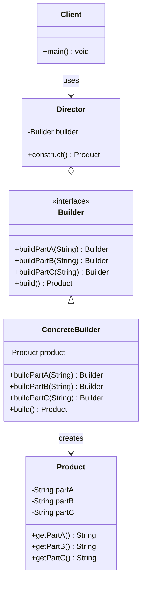

# 建造者 Builder

> 将复杂对象的构建与表示分离，使得同样的构建过程可以创建不同的表示。

## 意图

当一个对象有很多属性、构造参数众多或者需要分步骤构建时，建造者模式可以将复杂的构造过程拆解为一系列简单步骤。客户端通过链式调用设置需要的属性，最后调用一个 build 方法得到完整的对象。

这种模式特别适合参数可选、组合多变的场景——你不需要记住各种构造方法的参数顺序，只需设置你关心的属性。

## 适用场景

- 类有很多可选参数，构造方法参数列表过长时
- 需要创建不可变对象（配合 final 字段）
- 多个部件可以按不同顺序或组合装配成不同对象时
- 对象的创建需要多个步骤时

## UML 类图



## 代码示例

### ❌ 没有使用该模式的问题

```java
// 参数太多，构造方法可读性极差
public class HttpRequest {
    private String url;
    private String method;
    private Map<String, String> headers;
    private String body;
    private int timeout;
    private boolean followRedirects;

    // 构造方法参数列表爆炸
    public HttpRequest(String url, String method, Map<String, String> headers,
                       String body, int timeout, boolean followRedirects) {
        this.url = url;
        this.method = method;
        this.headers = headers;
        this.body = body;
        this.timeout = timeout;
        this.followRedirects = followRedirects;
    }

    // 还要提供多个重载构造方法？太痛苦了
    public HttpRequest(String url, String method) {
        this(url, method, null, null, 30000, true);
    }
}

// 使用时
HttpRequest request = new HttpRequest(
    "https://api.example.com/users",
    "POST",
    Map.of("Content-Type", "application/json"),
    "{\"name\":\"张三\"}",
    5000,
    true
); // 哪个参数是啥？看不出来
```

### ✅ 使用该模式后的改进

```java
// 产品类（不可变）
public class HttpRequest {
    private final String url;
    private final String method;
    private final Map<String, String> headers;
    private final String body;
    private final int timeout;
    private final boolean followRedirects;

    private HttpRequest(Builder builder) {
        this.url = builder.url;
        this.method = builder.method;
        this.headers = builder.headers;
        this.body = builder.body;
        this.timeout = builder.timeout;
        this.followRedirects = builder.followRedirects;
    }

    // Getter 方法...

    public static class Builder {
        private String url;
        private String method = "GET";
        private Map<String, String> headers = new HashMap<>();
        private String body;
        private int timeout = 30000;
        private boolean followRedirects = true;

        public Builder url(String url) {
            this.url = url;
            return this;
        }

        public Builder method(String method) {
            this.method = method;
            return this;
        }

        public Builder header(String key, String value) {
            this.headers.put(key, value);
            return this;
        }

        public Builder body(String body) {
            this.body = body;
            return this;
        }

        public Builder timeout(int timeout) {
            this.timeout = timeout;
            return this;
        }

        public HttpRequest build() {
            return new HttpRequest(this);
        }
    }
}

// 使用：链式调用，可读性极佳
HttpRequest request = new HttpRequest.Builder()
    .url("https://api.example.com/users")
    .method("POST")
    .header("Content-Type", "application/json")
    .body("{\"name\":\"张三\"}")
    .timeout(5000)
    .build();
```

### Spring 中的应用

Spring 中的 `BeanDefinitionBuilder` 和 `UriComponentsBuilder` 都是建造者模式的应用：

```java
// UriComponentsBuilder - 构建复杂 URI
UriComponents uri = UriComponentsBuilder
    .fromHttpUrl("https://api.example.com")
    .path("/users/{id}")
    .queryParam("fields", "name,email")
    .queryParam("page", 1)
    .queryParam("size", 10)
    .encode()
    .build()
    .expand(42)
    .toUri();

// BeanDefinitionBuilder - 编程式注册 Bean
BeanDefinitionBuilder builder = BeanDefinitionBuilder
    .rootBeanDefinition(MyService.class)
    .addPropertyValue("dataSource", dataSource)
    .addConstructorArgValue("configValue")
    .setInitMethodName("init");
beanFactory.registerBeanDefinition("myService", builder.getBeanDefinition());
```

## 优缺点

| 优点 | 缺点 |
|------|------|
| 链式调用，代码可读性高 | 需要额外创建 Builder 类，增加代码量 |
| 可以构建不可变对象，线程安全 | 产品类内部变化需要修改 Builder |
| 参数可选，灵活组合 | 与构造方法相比多了一层间接性 |
| 分步构建，可以校验参数合法性 | 简单对象不需要建造者，过度使用会增加复杂度 |

## 面试追问

**Q1: Builder 模式和工厂模式的区别？**

A: 工厂模式关注"创建什么类型的对象"，侧重于多态性。Builder 模式关注"如何一步步组装对象"，侧重于复杂对象的构建过程。工厂模式通常一步到位返回对象，Builder 模式需要多步设置属性后调用 build。

**Q2: Lombok 的 @Builder 注解做了什么？**

A: Lombok 的 `@Builder` 注解在编译时自动生成 Builder 内部类和全参数构造方法。它支持 `@Builder.Default` 设置默认值，`@Singular` 处理集合参数，`toBuilder` 生成从已有对象创建 Builder 的方法。注意 Lombok 生成的 Builder 不会自动做参数校验，需要在 build 方法中手动添加。

**Q3: Builder 模式如何保证不可变对象的线程安全？**

A: 关键是产品类用 final 修饰所有字段，构造方法私有化（只能通过 Builder 构建），Builder 在 build 方法中创建新对象。多线程下每个线程有自己的 Builder 实例，互不影响。最终返回的 Product 对象不可变，天然线程安全。

## 相关模式

- **抽象工厂模式**：抽象工厂可以用 Builder 来创建复杂的产品
- **原型模式**：Builder 的 build 方法可以基于原型来创建对象
- **组合模式**：Builder 模式常用于构建组合模式的树形结构
