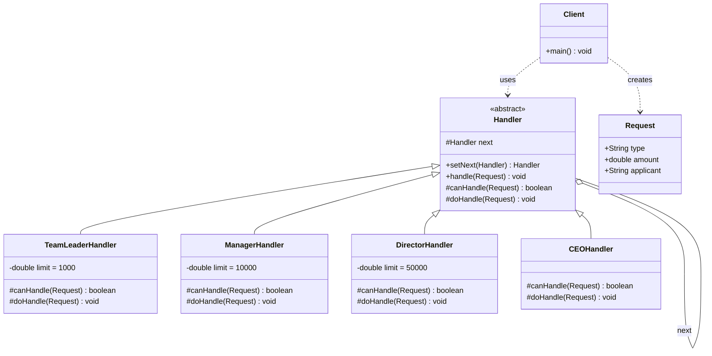

# 责任链 Chain of Responsibility

> 将请求沿着处理者链传递，直到有一个处理者处理它为止。

## 意图

责任链模式将多个处理者连成一条链，请求沿着链传递，每个处理者决定自己处理请求或传给下一个。客户端不需要知道哪个处理者会处理请求，也不需要知道链的结构。

通俗来说，就像公司请假审批——员工请假先找组长审批，组长权限不够就自动转到经理，经理不够再转到总监，总监不够转到 CEO。每个审批人只关心自己能否处理（金额是否在权限范围内），不关心最终谁审批通过。员工也不需要知道具体谁会审批，只需要把请假单交给组长就行了。

**核心角色**：

| 角色 | 职责 | 类比 |
|------|------|------|
| Handler（抽象处理者） | 定义处理接口和下一个处理者的引用 | 审批人基类 |
| ConcreteHandler（具体处理者） | 判断能否处理，不能则传给下一个 | 组长/经理/总监 |
| Client（客户端） | 组装责任链并发送请求 | 员工 |

:::tip 纯责任链 vs 不纯责任链
- **纯责任链**：一个请求只被一个处理者处理（要么处理，要么传递，不能既处理又传递）
- **不纯责任链**：一个请求可以被多个处理者处理（类似 Filter，每个处理者都做一部分工作然后传递）
实际开发中不纯责任链更常见，比如 Servlet Filter、Spring Interceptor。
:::

## 适用场景

- 有多个对象可以处理同一个请求，但具体由哪个处理在运行时决定
- 需要动态指定处理顺序时
- 需要向多个对象提交请求，但不希望明确指定接收者时
- 处理请求的对象集合需要动态变化时
- 需要对请求做一系列处理（如校验、过滤、日志、转换），每一步由不同处理者负责

## UML 类图



## 代码示例

### ❌ 没有使用该模式的问题

```java
// 糟糕的设计：所有审批逻辑都写在一个方法里，if-else 嵌套
public class ApprovalService {
    public void approve(ApprovalRequest request) {
        if (request.getAmount() <= 1000) {
            // 组长审批逻辑
            System.out.println("组长审批通过: " + request.getAmount() + " 元");
            sendNotification("组长", request.getApplicant());
        } else if (request.getAmount() <= 10000) {
            // 经理审批逻辑
            System.out.println("经理审批通过: " + request.getAmount() + " 元");
            sendNotification("经理", request.getApplicant());
        } else if (request.getAmount() <= 50000) {
            // 总监审批逻辑
            System.out.println("总监审批通过: " + request.getAmount() + " 元");
            sendNotification("总监", request.getApplicant());
        } else {
            // CEO 审批逻辑
            System.out.println("CEO 审批通过: " + request.getAmount() + " 元");
            sendNotification("CEO", request.getApplicant());
        }
        // 问题1：新增审批级别？继续加 else if？代码越来越长
        // 问题2：想调整审批顺序？要改 if-else 的顺序，容易改错
        // 问题3：想对某级审批添加额外逻辑？在 if 块里加，逻辑越来越乱
        // 问题4：审批人离职了？要改代码重新编译部署
    }

    private void sendNotification(String approver, String applicant) {
        System.out.println("通知 " + applicant + ": 您的申请已被 " + approver + " 审批");
    }
}
```

**运行结果**：

```
组长审批通过: 500.0 元
通知 张三: 您的申请已被 组长 审批
```

### ✅ 使用该模式后的改进

```java
// ============ 请求对象 ============
public class ApprovalRequest {
    private final String applicant;  // 申请人
    private final double amount;     // 申请金额
    private final String reason;     // 申请理由

    public ApprovalRequest(String applicant, double amount, String reason) {
        this.applicant = applicant;
        this.amount = amount;
        this.reason = reason;
    }

    public String getApplicant() { return applicant; }
    public double getAmount() { return amount; }
    public String getReason() { return reason; }
}

// ============ 抽象处理者 ============
public abstract class ApprovalHandler {
    protected ApprovalHandler next;  // 下一个处理者

    // 设置下一个处理者，返回 next 支持链式调用
    public ApprovalHandler setNext(ApprovalHandler next) {
        this.next = next;
        return next;
    }

    // 模板方法：先判断能否处理，不能则传递给下一个
    public final void handle(ApprovalRequest request) {
        if (canHandle(request)) {
            doHandle(request);  // 当前处理者处理
        } else if (next != null) {
            next.handle(request);  // 传递给下一个处理者
        } else {
            System.out.println("❌ 无人能审批该请求，金额: " + request.getAmount());
        }
    }

    // 子类实现：判断当前处理者能否处理该请求
    protected abstract boolean canHandle(ApprovalRequest request);

    // 子类实现：具体的处理逻辑
    protected abstract void doHandle(ApprovalRequest request);
}

// ============ 具体处理者：组长 ============
public class TeamLeaderHandler extends ApprovalHandler {
    private static final double LIMIT = 1000;  // 组长审批上限

    @Override
    protected boolean canHandle(ApprovalRequest request) {
        return request.getAmount() <= LIMIT;  // 1000元以内组长审批
    }

    @Override
    protected void doHandle(ApprovalRequest request) {
        System.out.println("✅ 组长审批通过");
        System.out.println("   申请人: " + request.getApplicant());
        System.out.println("   金额: " + request.getAmount() + " 元");
        System.out.println("   理由: " + request.getReason());
        notifyApplicant("组长", request.getApplicant());
    }

    private void notifyApplicant(String approver, String applicant) {
        System.out.println("   📧 已通知 " + applicant + ": 申请已被 " + approver + " 审批通过");
    }
}

// ============ 具体处理者：经理 ============
public class ManagerHandler extends ApprovalHandler {
    private static final double LIMIT = 10000;

    @Override
    protected boolean canHandle(ApprovalRequest request) {
        return request.getAmount() <= LIMIT;
    }

    @Override
    protected void doHandle(ApprovalRequest request) {
        System.out.println("✅ 经理审批通过");
        System.out.println("   申请人: " + request.getApplicant());
        System.out.println("   金额: " + request.getAmount() + " 元");
        System.out.println("   理由: " + request.getReason());
        notifyApplicant("经理", request.getApplicant());
    }

    private void notifyApplicant(String approver, String applicant) {
        System.out.println("   📧 已通知 " + applicant + ": 申请已被 " + approver + " 审批通过");
    }
}

// ============ 具体处理者：总监 ============
public class DirectorHandler extends ApprovalHandler {
    private static final double LIMIT = 50000;

    @Override
    protected boolean canHandle(ApprovalRequest request) {
        return request.getAmount() <= LIMIT;
    }

    @Override
    protected void doHandle(ApprovalRequest request) {
        System.out.println("✅ 总监审批通过");
        System.out.println("   申请人: " + request.getApplicant());
        System.out.println("   金额: " + request.getAmount() + " 元");
        System.out.println("   理由: " + request.getReason());
        notifyApplicant("总监", request.getApplicant());
    }

    private void notifyApplicant(String approver, String applicant) {
        System.out.println("   📧 已通知 " + applicant + ": 申请已被 " + approver + " 审批通过");
    }
}

// ============ 具体处理者：CEO（兜底） ============
public class CEOHandler extends ApprovalHandler {
    @Override
    protected boolean canHandle(ApprovalRequest request) {
        return true;  // CEO 能审批所有金额的请求
    }

    @Override
    protected void doHandle(ApprovalRequest request) {
        System.out.println("✅ CEO 审批通过");
        System.out.println("   申请人: " + request.getApplicant());
        System.out.println("   金额: " + request.getAmount() + " 元");
        System.out.println("   理由: " + request.getReason());
        System.out.println("   ⚠️ 大额申请，CEO 亲自审批");
        notifyApplicant("CEO", request.getApplicant());
    }

    private void notifyApplicant(String approver, String applicant) {
        System.out.println("   📧 已通知 " + applicant + ": 申请已被 " + approver + " 审批通过");
    }
}

// ============ 客户端使用 ============
public class Main {
    public static void main(String[] args) {
        // 构建责任链：组长 → 经理 → 总监 → CEO
        ApprovalHandler leader = new TeamLeaderHandler();
        ApprovalHandler manager = new ManagerHandler();
        ApprovalHandler director = new DirectorHandler();
        ApprovalHandler ceo = new CEOHandler();

        leader.setNext(manager).setNext(director).setNext(ceo);

        // 测试不同金额的审批请求
        System.out.println("=== 测试1: 500元（组长审批） ===");
        leader.handle(new ApprovalRequest("张三", 500, "买办公用品"));

        System.out.println("\n=== 测试2: 5000元（经理审批） ===");
        leader.handle(new ApprovalRequest("李四", 5000, "团建活动"));

        System.out.println("\n=== 测试3: 50000元（总监审批） ===");
        leader.handle(new ApprovalRequest("王五", 50000, "服务器采购"));

        System.out.println("\n=== 测试4: 100000元（CEO审批） ===");
        leader.handle(new ApprovalRequest("赵六", 100000, "年度预算"));
    }
}
```

**运行结果**：

```
=== 测试1: 500元（组长审批） ===
✅ 组长审批通过
   申请人: 张三
   金额: 500.0 元
   理由: 买办公用品
   📧 已通知 张三: 申请已被 组长 审批通过

=== 测试2: 5000元（经理审批） ===
✅ 经理审批通过
   申请人: 李四
   金额: 5000.0 元
   理由: 团建活动
   📧 已通知 李四: 申请已被 经理 审批通过

=== 测试3: 50000元（总监审批） ===
✅ 总监审批通过
   申请人: 王五
   金额: 50000.0 元
   理由: 服务器采购
   📧 已通知 王五: 申请已被 总监 审批通过

=== 测试4: 100000元（CEO审批） ===
✅ CEO 审批通过
   申请人: 赵六
   金额: 100000.0 元
   理由: 年度预算
   ⚠️ 大额申请，CEO 亲自审批
   📧 已通知 赵六: 申请已被 CEO 审批通过
```

### 变体与扩展

**1. 管道模式（Pipeline）——不纯责任链**

每个处理者都处理一部分，然后传递给下一个（类似 Servlet Filter）：

```java
// 管道式责任链：每个处理者都执行，不是"谁处理谁不处理"
public abstract class PipelineHandler {
    protected PipelineHandler next;

    public PipelineHandler link(PipelineHandler next) {
        this.next = next;
        return next;
    }

    // 每个处理者都会执行自己的逻辑，然后传递给下一个
    public void handle(String data) {
        data = doProcess(data);  // 处理数据
        if (next != null) {
            next.handle(data);   // 传递处理后的数据
        }
    }

    protected abstract String doProcess(String data);
}

// 具体处理者：去除空白字符
public class TrimHandler extends PipelineHandler {
    @Override
    protected String doProcess(String data) {
        System.out.println("TrimHandler: 去除空白");
        return data.trim();
    }
}

// 具体处理者：转大写
public class UpperCaseHandler extends PipelineHandler {
    @Override
    protected String doProcess(String data) {
        System.out.println("UpperCaseHandler: 转大写");
        return data.toUpperCase();
    }
}

// 使用
PipelineHandler pipeline = new TrimHandler();
pipeline.link(new UpperCaseHandler());
pipeline.handle("  hello world  ");
// 输出:
// TrimHandler: 去除空白
// UpperCaseHandler: 转大写
```

**2. 动态构建责任链**

```java
// 用 List 动态管理处理者，运行时可以增删
public class DynamicHandlerChain {
    private final List<ApprovalHandler> handlers = new ArrayList<>();

    public void addHandler(ApprovalHandler handler) {
        handlers.add(handler);  // 动态添加
    }

    public void removeHandler(ApprovalHandler handler) {
        handlers.remove(handler);  // 动态移除
    }

    public void handle(ApprovalRequest request) {
        for (ApprovalHandler handler : handlers) {
            if (handler.canHandle(request)) {  // 这里假设 canHandle 是 public 的
                handler.doHandle(request);
                return;  // 找到处理者后停止
            }
        }
        System.out.println("❌ 无处理者能处理该请求");
    }
}
```

:::warning 链式调用 vs 动态链
链式调用（`setNext`）构建的是静态链，运行时结构不变。动态链用 List 管理，运行时可以增删处理者。动态链更灵活，但失去了链式调用的优雅语法。根据实际需求选择。
:::

### 运行结果

上面代码的完整运行输出已在代码示例中展示。核心要点：

- 请求沿着链传递，直到找到能处理的处理者
- CEO 作为兜底处理者，确保请求一定被处理
- 每个处理者独立判断、独立处理，互不影响
- 链的构建通过 `setNext` 链式调用，代码简洁

## Spring/JDK 中的应用

### 1. Spring Security 的 Filter 链

Spring Security 的安全过滤链是责任链模式的经典应用——每个 Filter 负责一种安全检查：

```java
// Spring Security 自动构建了一条 Filter 链
// 请求到达时依次经过每个 Filter
@Bean
public SecurityFilterChain filterChain(HttpSecurity http) throws Exception {
    http
        // Filter1: CORS 过滤器
        .addFilterBefore(new CorsFilter(), ChannelProcessingFilter.class)
        // Filter2: 认证过滤器
        .addFilterBefore(new JwtAuthenticationFilter(), UsernamePasswordAuthenticationFilter.class)
        // Filter3: 授权过滤器
        .addFilterAfter(new AuthorizationFilter(), ExceptionTranslationFilter.class)
        // Filter4: 日志过滤器
        .addFilterAfter(new LoggingFilter(), AuthorizationFilter.class);
    return http.build();
}

// 每个 Filter 的处理逻辑大致如下：
public class JwtAuthenticationFilter extends OncePerRequestFilter {
    @Override
    protected void doFilterInternal(HttpServletRequest request,
                                    HttpServletResponse response,
                                    FilterChain filterChain) throws ServletException, IOException {
        // 1. 尝试从请求头提取 JWT token
        String token = extractToken(request);

        if (token != null && validateToken(token)) {
            // 2. token 有效，设置认证信息
            Authentication auth = getAuthentication(token);
            SecurityContextHolder.getContext().setAuthentication(auth);
        }

        // 3. 无论成功失败，都传递给下一个 Filter
        // 如果不调用这行，请求就会被截断（链断裂）
        filterChain.doFilter(request, response);
    }
}
```

### 2. Spring MVC 的 HandlerInterceptor 链

Spring MVC 的拦截器链也是责任链模式：

```java
// 拦截器1：日志记录
@Component
public class LoggingInterceptor implements HandlerInterceptor {
    @Override
    public boolean preHandle(HttpServletRequest request, HttpServletResponse response,
                             Object handler) {
        System.out.println("[LOG] " + request.getMethod() + " " + request.getRequestURI());
        return true;  // 返回 true 继续链，false 终止链
    }

    @Override
    public void afterCompletion(HttpServletRequest request, HttpServletResponse response,
                                Object handler, Exception ex) {
        System.out.println("[LOG] 响应状态: " + response.getStatus());
    }
}

// 拦截器2：权限校验
@Component
public class AuthInterceptor implements HandlerInterceptor {
    @Override
    public boolean preHandle(HttpServletRequest request, HttpServletResponse response,
                             Object handler) throws Exception {
        String token = request.getHeader("Authorization");
        if (token == null || !isValid(token)) {
            response.setStatus(401);  // 未认证
            return false;  // 终止链，不再执行后续拦截器和 Controller
        }
        return true;  // 认证通过，继续链
    }
}

// 注册拦截器链
@Configuration
public class WebConfig implements WebMvcConfigurer {
    @Autowired
    private LoggingInterceptor loggingInterceptor;

    @Autowired
    private AuthInterceptor authInterceptor;

    @Override
    public void addInterceptors(InterceptorRegistry registry) {
        // 拦截器按注册顺序执行
        registry.addInterceptor(authInterceptor).addPathPatterns("/api/**");
        registry.addInterceptor(loggingInterceptor).addPathPatterns("/api/**");
    }
}
```

### 3. JDK 的异常处理链

Java 的异常处理也是责任链的一种体现——`catch` 块从上到下匹配：

```java
try {
    // 业务代码
} catch (SQLException e) {
    // 处理 SQL 异常
} catch (IOException e) {
    // 处理 IO 异常
} catch (Exception e) {
    // 兜底处理
}
// 每个 catch 块就是一个 Handler
// 异常从上到下匹配，第一个匹配的处理
```

## 优缺点

| 优点 | 详细说明 |
|------|----------|
| **解耦请求发送者和接收者** | 发送者不需要知道具体谁会处理，只需要把请求交给链头 |
| **动态调整链结构** | 可以在运行时添加、移除、重新排列处理者 |
| **单一职责** | 每个处理者只处理自己关心的请求，职责清晰 |
| **符合开闭原则** | 新增处理者不需要修改已有的处理者代码 |
| **灵活的处理策略** | 可以选择"纯链"（只一个处理）或"管道"（全部处理） |

| 缺点 | 详细说明 |
|------|----------|
| **请求可能不被处理** | 如果没有兜底处理者，请求可能到达链尾被丢弃 |
| **调试困难** | 请求在链中传递，不容易追踪到底谁处理了（需要加日志） |
| **性能开销** | 链过长时，请求需要经过每个节点才能找到处理者 |
| **循环引用风险** | 如果 A.setNext(B), B.setNext(A)，会造成无限循环 |
| **顺序敏感** | 处理者的顺序影响结果，配置错误可能导致逻辑错误 |

## 面试追问

### Q1: 责任链模式和装饰器模式的区别？

**A:** 核心区别在于**处理方式不同**：

- **责任链**：每个处理者决定**是否处理**请求。通常只有一个处理者会真正处理（纯责任链），或者每个处理者做一部分然后传递（管道）。关注"**谁来处理**"
- **装饰器**：每个装饰者**都会执行**，且**都会调用下一个**装饰者。所有装饰者都参与处理。关注"**如何增强**"

```java
// 责任链：有人处理，有人不处理
if (canHandle(request)) {
    handle(request);  // 处理后可能不传递了
} else {
    next.handle(request);  // 传递给下一个
}

// 装饰器：每个都会执行
doSomething();           // 自己的逻辑
super.method();          // 一定会调用下一个装饰者
```

### Q2: 责任链中的请求一定能被处理吗？如果没人处理怎么办？

**A:** 不一定。解决方案有三种：

1. **添加兜底处理者**：在链尾添加一个能处理所有请求的 DefaultHandler
2. **在链尾抛出异常**：让调用者知道请求未被处理
3. **使用管道模式**：让每个处理者都执行一部分，而不是"谁处理谁不处理"

```java
// 方案1：兜底处理者
public class DefaultHandler extends ApprovalHandler {
    @Override
    protected boolean canHandle(ApprovalRequest request) {
        return true;  // 能处理所有请求
    }

    @Override
    protected void doHandle(ApprovalRequest request) {
        throw new RuntimeException("无法审批金额为 " + request.getAmount() + " 的请求");
    }
}

// 方案2：在抽象处理者中兜底
public abstract class ApprovalHandler {
    public final void handle(ApprovalRequest request) {
        if (canHandle(request)) {
            doHandle(request);
        } else if (next != null) {
            next.handle(request);
        } else {
            throw new RuntimeException("无处理者能处理该请求");
        }
    }
}
```

### Q3: Spring Security 的 Filter 链和经典责任链模式有什么区别？

**A:** Spring Security 的 Filter 链更接近**管道模式**（Pipeline），而不是纯责任链：

| 维度 | 纯责任链 | Spring Security Filter 链 |
|------|----------|--------------------------|
| 处理方式 | 通常只有一个处理者处理 | 每个 Filter 都处理，然后传递 |
| 是否终止 | 处理后可以选择不传递 | 通常都调用 `chain.doFilter()` |
| 关注点 | "谁来处理" | "如何增强/过滤" |
| 本质 | 互斥选择 | 组合增强 |

不过，Filter 也可以选择不调用 `chain.doFilter()` 来终止链（比如认证失败直接返回 401），所以它**兼具了两种模式的特性**。

### Q4: 如何避免责任链中的循环引用？

**A:** 有几种防护策略：

```java
public abstract class ApprovalHandler {
    private final Set<ApprovalHandler> visited = new HashSet<>();  // 记录已访问的处理者

    public ApprovalHandler setNext(ApprovalHandler next) {
        // 检测循环引用
        if (visited.contains(next)) {
            throw new IllegalArgumentException("检测到循环引用: " + next.getClass().getSimpleName());
        }
        this.next = next;
        return next;
    }

    public final void handle(ApprovalRequest request) {
        visited.add(this);  // 标记为已访问
        if (canHandle(request)) {
            doHandle(request);
        } else if (next != null) {
            next.handle(request);
        }
        visited.remove(this);  // 处理完成后移除标记
    }
}
```

实际项目中，更好的做法是在构建链时用拓扑排序检测环，而不是在运行时检测。

## 相关模式

- **装饰器模式**：装饰器增强功能（每个都执行），责任链选择处理者（通常只有一个执行）
- **组合模式**：可以用组合模式构建树形责任链（比如文件系统的事件传播）
- **状态模式**：状态模式在不同状态间切换行为，责任链在不同处理者间传递请求
- **命令模式**：命令封装请求对象，责任链传递请求——经常结合使用
- **策略模式**：策略选择一个算法执行，责任链尝试多个处理者直到匹配
