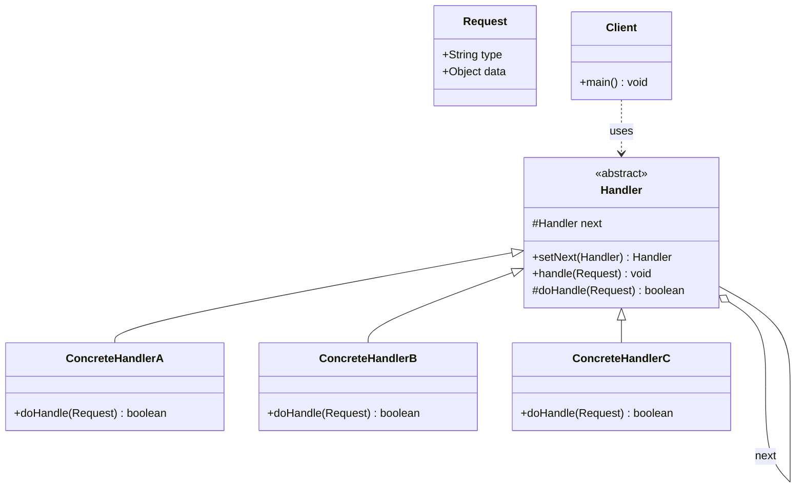

# 责任链 Chain of Responsibility

> 将请求沿着处理者链传递，直到有一个处理者处理它为止。

## 意图

责任链模式将多个处理者连成一条链，请求沿着链传递，每个处理者决定自己处理请求或传给下一个。客户端不需要知道哪个处理者会处理请求，也不需要知道链的结构。

就像公司请假审批——员工请假先找组长审批，组长权限不够就找经理，经理不够就找总监。每个审批人只关心自己能否处理，不关心最终谁审批通过。

## 适用场景

- 有多个对象可以处理同一个请求，但具体由哪个处理在运行时决定
- 需要动态指定处理顺序时
- 需要向多个对象提交请求，但不希望明确指定接收者时
- 处理请求的对象集合需要动态变化时

## UML 类图



## 代码示例

### ❌ 没有使用该模式的问题

```java
// 所有的审批逻辑都写在一个方法里，if-else 嵌套
public class ApprovalService {
    public void approve(ApprovalRequest request) {
        if (request.getAmount() <= 1000) {
            // 组长审批
            System.out.println("组长审批通过: " + request.getAmount());
        } else if (request.getAmount() <= 10000) {
            // 经理审批
            System.out.println("经理审批通过: " + request.getAmount());
        } else if (request.getAmount() <= 50000) {
            // 总监审批
            System.out.println("总监审批通过: " + request.getAmount());
        } else {
            // CEO 审批
            System.out.println("CEO 审批通过: " + request.getAmount());
        }
        // 新增审批级别？继续加 else if？
    }
}
```

### ✅ 使用该模式后的改进

```java
// 处理者抽象类
public abstract class ApprovalHandler {
    protected ApprovalHandler next;

    public ApprovalHandler setNext(ApprovalHandler next) {
        this.next = next;
        return next; // 支持链式调用
    }

    public final void handle(ApprovalRequest request) {
        if (canHandle(request)) {
            doHandle(request);
        } else if (next != null) {
            next.handle(request);
        } else {
            System.out.println("无人能审批该请求");
        }
    }

    protected abstract boolean canHandle(ApprovalRequest request);
    protected abstract void doHandle(ApprovalRequest request);
}

// 具体处理者
public class TeamLeaderHandler extends ApprovalHandler {
    @Override
    protected boolean canHandle(ApprovalRequest request) {
        return request.getAmount() <= 1000;
    }

    @Override
    protected void doHandle(ApprovalRequest request) {
        System.out.println("组长审批通过，金额: " + request.getAmount());
    }
}

public class ManagerHandler extends ApprovalHandler {
    @Override
    protected boolean canHandle(ApprovalRequest request) {
        return request.getAmount() <= 10000;
    }

    @Override
    protected void doHandle(ApprovalRequest request) {
        System.out.println("经理审批通过，金额: " + request.getAmount());
    }
}

public class DirectorHandler extends ApprovalHandler {
    @Override
    protected boolean canHandle(ApprovalRequest request) {
        return request.getAmount() <= 50000;
    }

    @Override
    protected void doHandle(ApprovalRequest request) {
        System.out.println("总监审批通过，金额: " + request.getAmount());
    }
}

// 使用
public class Main {
    public static void main(String[] args) {
        ApprovalHandler leader = new TeamLeaderHandler();
        ApprovalHandler manager = new ManagerHandler();
        ApprovalHandler director = new DirectorHandler();

        leader.setNext(manager).setNext(director); // 构建责任链

        leader.handle(new ApprovalRequest(500));   // 组长审批
        leader.handle(new ApprovalRequest(5000));  // 经理审批
        leader.handle(new ApprovalRequest(50000)); // 总监审批
    }
}
```

### Spring 中的应用

Spring MVC 的 `Filter` 链和 `Interceptor` 链就是责任链模式：

```java
// Spring Security 的 Filter 链
@Bean
public SecurityFilterChain filterChain(HttpSecurity http) throws Exception {
    http
        .addFilterBefore(new CorsFilter(), ChannelProcessingFilter.class)
        .addFilterBefore(new AuthenticationFilter(), UsernamePasswordAuthenticationFilter.class)
        .addFilterAfter(new LoggingFilter(), BasicAuthenticationFilter.class)
        // 每个Filter决定是否处理请求或传给下一个
        ;
    return http.build();
}

// Spring MVC 的 HandlerInterceptor
@Component
public class AuthInterceptor implements HandlerInterceptor {
    @Override
    public boolean preHandle(HttpServletRequest request, HttpServletResponse response,
                             Object handler) {
        // 认证逻辑
        if (!isAuthenticated(request)) {
            response.setStatus(401);
            return false; // 终止链
        }
        return true; // 传递给下一个拦截器
    }
}
```

## 优缺点

| 优点 | 缺点 |
|------|------|
| 降低请求发送者和接收者的耦合 | 请求可能不被任何处理者处理 |
| 可以动态调整链的结构和顺序 | 调试困难，不容易追踪请求处理路径 |
| 单一职责，每个处理者只处理自己关心的请求 | 链过长可能导致性能问题 |
| 符合开闭原则，新增处理者不影响已有代码 | 可能产生循环引用（A→B→A） |

## 面试追问

**Q1: 责任链模式和装饰器模式的区别？**

A: 责任链中每个处理者决定是否处理请求或传给下一个，通常只有一个处理者处理。装饰器中每个装饰者都会执行，且都会调用下一个装饰者，所有装饰者都会参与处理。责任链关注"谁来处理"，装饰器关注"如何增强"。

**Q2: 责任链中的请求一定能被处理吗？如果没人处理怎么办？**

A: 不一定。如果没有处理者能处理请求，请求就会到达链尾被丢弃。解决方案：1) 在链尾添加一个默认处理者；2) 在链尾抛出异常；3) 让每个处理者都处理一部分（纯管道模式，类似 Filter）。

**Q3: Spring Security 的 Filter 链和责任链模式有什么区别？**

A: Spring Security 的 Filter 链更接近管道模式——每个 Filter 都会执行，且都会调用 `chain.doFilter()` 传递给下一个，而不是选择性地处理。不过从结构上看，它仍然是责任链模式的变体，因为 Filter 可以选择不调用 `chain.doFilter()` 来终止链。

## 相关模式

- **装饰器模式**：装饰器增强功能，责任链选择处理者
- **组合模式**：可以用组合模式来构建责任链的树形结构
- **状态模式**：状态模式在不同状态间切换，责任链在不同处理者间传递
- **命令模式**：命令封装请求，责任链传递请求
