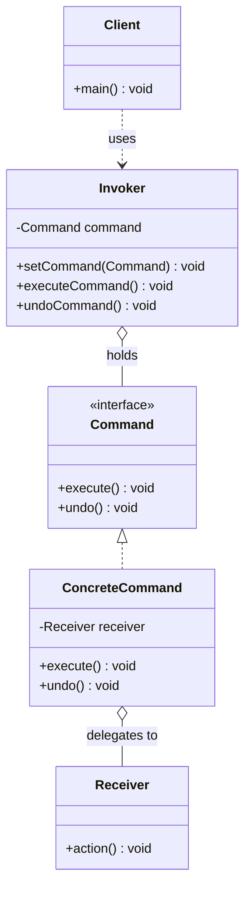

# 命令 Command

> 将请求封装成对象，使你可以用不同的请求对客户进行参数化、排队或记录日志。

## 意图

命令模式将"动作"封装成对象。每个命令对象包含一个接收者和一组动作，调用者只需要调用命令的 `execute()` 方法，不需要知道具体做了什么、谁做的。这样就可以把命令存储、排队、撤销、记录日志。

就像遥控器——遥控器上的每个按钮都是一个命令，按下按钮就执行对应的操作。你可以用同一个遥控器控制不同的设备，也可以实现撤销操作。

## 适用场景

- 需要将请求调用者和请求接收者解耦时
- 需要支持撤销/重做操作时
- 需要将请求排队、记录日志或支持事务操作时
- 需要支持宏命令（组合多个命令）时

## UML 类图



## 代码示例

### ❌ 没有使用该模式的问题

```java
// 客户端直接调用接收者的方法，紧耦合
public class RemoteControl {
    private Light light;
    private Stereo stereo;

    public void turnOnLight() {
        light.on(); // 直接调用，无法撤销、无法记录
    }

    public void turnOffLight() {
        light.off();
    }

    public void playMusic() {
        stereo.on();
        stereo.setCD();
        stereo.setVolume(10);
    }
    // 每增加一个设备，就要新增方法
    // 无法实现撤销、宏命令等功能
}
```

### ✅ 使用该模式后的改进

```java
// 命令接口
public interface Command {
    void execute();
    void undo();
}

// 接收者
public class Light {
    private String name;

    public Light(String name) { this.name = name; }

    public void on() { System.out.println(name + " 灯已打开"); }
    public void off() { System.out.println(name + " 灯已关闭"); }
}

// 具体命令
public class LightOnCommand implements Command {
    private final Light light;

    public LightOnCommand(Light light) { this.light = light; }

    @Override
    public void execute() { light.on(); }

    @Override
    public void undo() { light.off(); }
}

public class LightOffCommand implements Command {
    private final Light light;

    public LightOffCommand(Light light) { this.light = light; }

    @Override
    public void execute() { light.off(); }

    @Override
    public void undo() { light.on(); }
}

// 调用者（遥控器）
public class RemoteControl {
    private final Command[] onCommands;
    private final Command[] offCommands;
    private Command undoCommand;

    public RemoteControl() {
        onCommands = new Command[7];
        offCommands = new Command[7];
    }

    public void setCommand(int slot, Command onCommand, Command offCommand) {
        onCommands[slot] = onCommand;
        offCommands[slot] = offCommand;
    }

    public void onButtonPressed(int slot) {
        onCommands[slot].execute();
        undoCommand = onCommands[slot];
    }

    public void offButtonPressed(int slot) {
        offCommands[slot].execute();
        undoCommand = offCommands[slot];
    }

    public void undoButtonPressed() {
        undoCommand.undo();
    }
}

// 使用
public class Main {
    public static void main(String[] args) {
        RemoteControl remote = new RemoteControl();
        Light livingRoomLight = new Light("客厅");

        remote.setCommand(0, new LightOnCommand(livingRoomLight),
                              new LightOffCommand(livingRoomLight));

        remote.onButtonPressed(0);   // 客厅 灯已打开
        remote.offButtonPressed(0);  // 客厅 灯已关闭
        remote.undoButtonPressed();  // 客厅 灯已打开（撤销）
    }
}
```

### Spring 中的应用

Spring 中的 `@Scheduled` 和 `JdbcTemplate` 都体现了命令模式的思想：

```java
// Spring 的 JdbcTemplate.execute() 就是命令模式
jdbcTemplate.execute(new ConnectionCallback<Void>() {
    @Override
    public Void doInConnection(Connection con) throws SQLException {
        // 这就是一个命令对象
        Statement stmt = con.createStatement();
        stmt.execute("CREATE TABLE IF NOT EXISTS users (...)");
        return null;
    }
});

// Spring Batch 中的 Job 和 Step 也是命令模式
// 每个 Step 是一个命令，可以被顺序执行、并行执行、回滚
```

## 优缺点

| 优点 | 缺点 |
|------|------|
| 将请求发送者和接收者完全解耦 | 命令类数量可能很多，增加系统复杂度 |
| 可以轻松实现撤销/重做 | 每个命令都需要一个类，代码量增大 |
| 支持命令排队、日志记录、事务管理 | 接收者需要提供撤销操作的逻辑 |
| 可以组合成宏命令 | 某些简单的操作用命令模式显得过度设计 |

## 面试追问

**Q1: 命令模式和策略模式的区别？**

A: 命令模式关注"做什么"——封装一个动作和它的接收者，强调执行。策略模式关注"怎么做"——封装一个算法，强调替换。命令对象通常有接收者，策略对象没有。命令可以撤销，策略不能。

**Q2: 如何实现宏命令（组合命令）？**

A: 创建一个 `MacroCommand` 类，内部维护一个 `List<Command>`。`execute()` 时遍历执行所有命令，`undo()` 时反向遍历撤销所有命令。这就是命令模式和组合模式的结合。

**Q3: 命令模式如何实现事务？**

A: 将一组相关的命令封装成一个事务命令。`execute()` 时按顺序执行所有命令，如果其中某个命令失败，则调用之前已执行命令的 `undo()` 方法回滚。这本质上是命令模式 + 补偿事务的模式。

## 相关模式

- **组合模式**：宏命令是命令模式和组合模式的结合
- **责任链模式**：命令沿链传递，责任链选择处理者
- **备忘录模式**：备忘录保存状态用于撤销，命令模式封装操作用于撤销
- **策略模式**：策略封装算法，命令封装操作
