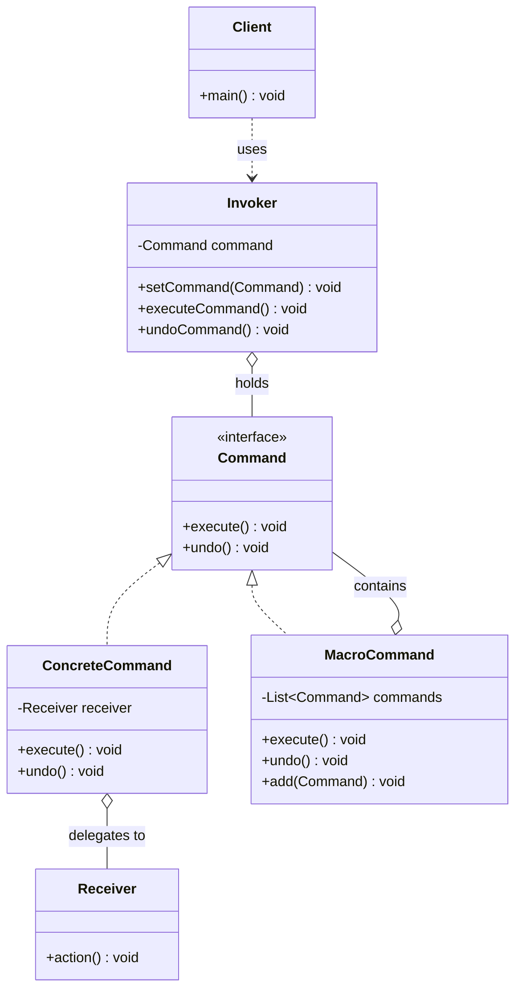

# 命令 Command

> 将请求封装成对象，使你可以用不同的请求对客户进行参数化、排队或记录日志。

## 意图

命令模式将"动作"封装成对象。每个命令对象包含一个接收者和一组动作，调用者只需要调用命令的 `execute()` 方法，不需要知道具体做了什么、谁做的。这样就可以把命令存储、排队、撤销、记录日志。

通俗来说，就像你去餐厅吃饭——你跟服务员说"来份宫保鸡丁"，服务员把你的请求写在小票上（命令对象），然后交给厨房（接收者）去做。你不需要知道厨师是谁、怎么做，服务员也不需要知道。如果你不想吃了，就把小票撤回来（撤销）。如果同时来了十个客人，小票可以排队（命令队列）。

**核心角色**：

| 角色 | 职责 | 类比 |
|------|------|------|
| Command（命令接口） | 声明执行和撤销方法 | 小票的格式 |
| ConcreteCommand（具体命令） | 绑定接收者和动作 | 写好的具体菜品小票 |
| Receiver（接收者） | 真正执行动作的对象 | 厨房 |
| Invoker（调用者） | 触发命令执行 | 服务员 |
| Client（客户端） | 组装命令对象 | 你（点菜的人） |

## 适用场景

- 需要将请求调用者和请求接收者解耦时
- 需要支持撤销/重做操作时（文本编辑器、IDE）
- 需要将请求排队、记录日志或支持事务操作时（任务队列、消息队列）
- 需要支持宏命令（组合多个命令）时（快捷键组合、批处理脚本）
- GUI 中的按钮点击、菜单操作、快捷键绑定

:::tip 命令模式的关键洞察
命令模式的本质是**把"行为"当"数据"来处理**。方法调用本来是代码层面的行为，但命令模式把它变成了一个可以传递、存储、排队的数据对象。这也是函数式编程中"一等函数"的面向对象实现方式。
:::

## UML 类图



## 代码示例

### ❌ 没有使用该模式的问题

```java
// 糟糕的设计：遥控器直接操作设备，紧耦合
public class RemoteControl {
    private Light light;      // 直接持有设备引用
    private Stereo stereo;    // 每加一个设备就要加一个字段

    public RemoteControl(Light light, Stereo stereo) {
        this.light = light;
        this.stereo = stereo;
    }

    // 每个按钮都硬编码了具体操作
    public void turnOnLight() {
        light.on();  // 直接调用，无法撤销、无法记录日志
    }

    public void turnOffLight() {
        light.off();
    }

    public void playMusic() {
        stereo.on();
        stereo.setCD();
        stereo.setVolume(10);
    }

    // 想加个空调？改构造函数、加字段、加方法……
    // 想实现撤销？没有命令历史，根本做不到
    // 想实现宏命令（一键观影模式）？要写一堆 if-else
}

// 客户端代码也很丑陋
public class Client {
    public static void main(String[] args) {
        Light light = new Light("客厅");
        Stereo stereo = new Stereo();
        RemoteControl remote = new RemoteControl(light, stereo);

        remote.turnOnLight();   // 操作和调用者紧耦合
        remote.playMusic();

        // 想撤销？做不到
        // 想延迟执行？做不到
        // 想记录操作日志？做不到
    }
}
```

**运行结果**：

```
客厅 灯已打开
音响已打开，播放CD，音量: 10
```

**问题总结**：调用者和接收者紧耦合、无法撤销、无法排队、无法记录日志、扩展困难。

### ✅ 使用该模式后的改进

```java
// ============ 命令接口 ============
// 所有命令的统一契约，只关心"执行"和"撤销"
public interface Command {
    void execute();  // 执行命令
    void undo();     // 撤销命令
}

// ============ 接收者：灯光 ============
public class Light {
    private final String name;  // 灯的位置标识

    public Light(String name) {
        this.name = name;
    }

    public void on() {
        System.out.println(name + " 灯已打开");
    }

    public void off() {
        System.out.println(name + " 灯已关闭");
    }
}

// ============ 接收者：音响 ============
public class Stereo {
    public void on() {
        System.out.println("音响已打开");
    }

    public void off() {
        System.out.println("音响已关闭");
    }

    public void setCD() {
        System.out.println("音响切换到CD模式");
    }

    public void setVolume(int level) {
        System.out.println("音响音量设为: " + level);
    }
}

// ============ 具体命令：开灯 ============
public class LightOnCommand implements Command {
    private final Light light;  // 持有接收者引用

    public LightOnCommand(Light light) {
        this.light = light;
    }

    @Override
    public void execute() {
        light.on();  // 委托给接收者执行
    }

    @Override
    public void undo() {
        light.off();  // 撤销 = 反向操作
    }
}

// ============ 具体命令：关灯 ============
public class LightOffCommand implements Command {
    private final Light light;

    public LightOffCommand(Light light) {
        this.light = light;
    }

    @Override
    public void execute() {
        light.off();
    }

    @Override
    public void undo() {
        light.on();  // 撤销关灯 = 打开灯
    }
}

// ============ 具体命令：播放音乐 ============
public class PlayMusicCommand implements Command {
    private final Stereo stereo;  // 持有音响引用

    public PlayMusicCommand(Stereo stereo) {
        this.stereo = stereo;
    }

    @Override
    public void execute() {
        stereo.on();
        stereo.setCD();
        stereo.setVolume(10);
    }

    @Override
    public void undo() {
        stereo.off();  // 撤销播放 = 关闭音响
    }
}

// ============ 空命令（Null Object 模式）============
// 避免空指针检查，每个槽位默认放一个空命令
public class NoCommand implements Command {
    @Override
    public void execute() {
        System.out.println("[空命令] 该槽位未绑定命令");
    }

    @Override
    public void undo() {
        // 什么也不做
    }
}

// ============ 宏命令：组合多个命令 ============
public class MacroCommand implements Command {
    private final List<Command> commands = new ArrayList<>();  // 命令列表

    public void addCommand(Command command) {
        commands.add(command);  // 动态添加子命令
    }

    @Override
    public void execute() {
        // 顺序执行所有子命令
        for (Command cmd : commands) {
            cmd.execute();
        }
    }

    @Override
    public void undo() {
        // 反向撤销所有子命令（栈的 LIFO 特性）
        for (int i = commands.size() - 1; i >= 0; i--) {
            commands.get(i).undo();
        }
    }
}

// ============ 调用者：遥控器 ============
public class RemoteControl {
    private final Command[] onCommands;     // 开按钮对应的命令
    private final Command[] offCommands;    // 关按钮对应的命令
    private Command undoCommand;            // 最近执行的命令，用于撤销

    public RemoteControl() {
        // 默认7个槽位，实际项目中可以用 List 动态扩容
        onCommands = new Command[7];
        offCommands = new Command[7];
        Command noCommand = new NoCommand();  // 初始化为空命令
        for (int i = 0; i < 7; i++) {
            onCommands[i] = noCommand;
            offCommands[i] = noCommand;
        }
    }

    // 设置某个槽位的开/关命令
    public void setCommand(int slot, Command onCommand, Command offCommand) {
        onCommands[slot] = onCommand;
        offCommands[slot] = offCommand;
    }

    // 按下开按钮
    public void onButtonPressed(int slot) {
        onCommands[slot].execute();
        undoCommand = onCommands[slot];  // 记录用于撤销
    }

    // 按下关按钮
    public void offButtonPressed(int slot) {
        offCommands[slot].execute();
        undoCommand = offCommands[slot];  // 记录用于撤销
    }

    // 按下撤销按钮
    public void undoButtonPressed() {
        if (undoCommand != null) {
            undoCommand.undo();
        }
    }
}

// ============ 客户端使用 ============
public class Main {
    public static void main(String[] args) {
        // 创建接收者
        Light livingRoomLight = new Light("客厅");
        Light bedroomLight = new Light("卧室");
        Stereo stereo = new Stereo();

        // 创建命令对象
        Command livingRoomOn = new LightOnCommand(livingRoomLight);
        Command livingRoomOff = new LightOffCommand(livingRoomLight);
        Command bedroomOn = new LightOnCommand(bedroomLight);
        Command bedroomOff = new LightOffCommand(bedroomLight);
        Command playMusic = new PlayMusicCommand(stereo);

        // 创建宏命令：一键观影模式
        MacroCommand movieMode = new MacroCommand();
        movieMode.addCommand(livingRoomOff);  // 关客厅灯
        movieMode.addCommand(playMusic);       // 播放音乐

        // 创建调用者
        RemoteControl remote = new RemoteControl();

        // 绑定命令到槽位
        remote.setCommand(0, livingRoomOn, livingRoomOff);
        remote.setCommand(1, bedroomOn, bedroomOff);
        remote.setCommand(2, movieMode, new NoCommand());  // 槽位2绑定宏命令

        // 测试基本操作
        System.out.println("=== 基本操作 ===");
        remote.onButtonPressed(0);    // 打开客厅灯
        remote.offButtonPressed(0);   // 关闭客厅灯

        // 测试撤销
        System.out.println("\n=== 测试撤销 ===");
        remote.onButtonPressed(1);    // 打开卧室灯
        remote.undoButtonPressed();   // 撤销 → 关闭卧室灯

        // 测试宏命令
        System.out.println("\n=== 一键观影模式 ===");
        remote.onButtonPressed(2);    // 执行宏命令

        // 撤销宏命令
        System.out.println("\n=== 撤销宏命令 ===");
        remote.undoButtonPressed();   // 反向撤销宏命令中的所有子命令
    }
}
```

**运行结果**：

```
=== 基本操作 ===
客厅 灯已打开
客厅 灯已关闭

=== 测试撤销 ===
卧室 灯已打开
卧室 灯已关闭

=== 一键观影模式 ===
客厅 灯已关闭
音响已打开
音响切换到CD模式
音响音量设为: 10

=== 撤销宏命令 ===
音响已关闭
客厅 灯已打开
```

### 变体与扩展

**1. 带参数的命令**

```java
// 有些命令需要参数，比如调音量
public class VolumeCommand implements Command {
    private final Stereo stereo;
    private final int level;       // 目标音量
    private int previousLevel;     // 记住之前的音量，用于撤销

    public VolumeCommand(Stereo stereo, int level) {
        this.stereo = stereo;
        this.level = level;
    }

    @Override
    public void execute() {
        // 假设 Stereo 提供了获取当前音量的方法
        previousLevel = stereo.getCurrentVolume();  // 保存当前状态
        stereo.setVolume(level);                     // 设置新音量
    }

    @Override
    public void undo() {
        stereo.setVolume(previousLevel);  // 恢复之前的音量
    }
}
```

**2. 智能命令（无接收者）**

```java
// 有些命令不需要接收者，命令本身就包含了全部逻辑
// 这种情况下命令对象 = 策略对象
public class PrintHelloCommand implements Command {
    @Override
    public void execute() {
        System.out.println("Hello, World!");
    }

    @Override
    public void undo() {
        System.out.println("撤销: Hello, World!");
    }
}
```

**3. 命令队列（异步执行）**

```java
// 命令队列：命令可以排队异步执行
public class CommandQueue {
    private final Queue<Command> queue = new LinkedList<>();  // FIFO 队列

    // 生产者：添加命令到队列
    public void addCommand(Command command) {
        queue.offer(command);
    }

    // 消费者：从队列取命令执行
    public void processCommands() {
        while (!queue.isEmpty()) {
            Command cmd = queue.poll();  // 取出队头命令
            cmd.execute();               // 执行
        }
    }
}
```

:::warning 智能命令 vs 普通命令
智能命令（也叫"聪明命令"）自身包含业务逻辑，不需要接收者。普通命令只是把请求转发给接收者。智能命令本质上是命令模式 + 策略模式的结合体，好处是简单直接，坏处是命令类变重、不好复用。
:::

### 运行结果

上面代码的完整运行输出已在代码示例中展示。核心要点：

- 基本命令执行正确
- 撤销功能正常工作
- 宏命令可以组合多个命令顺序执行
- 宏命令的撤销是反向执行的（LIFO）

## Spring/JDK 中的应用

### 1. Spring 的 JdbcTemplate（命令模式 + 回调）

Spring 的 `JdbcTemplate` 大量使用命令模式，把 SQL 操作封装成回调对象：

```java
// ConnectionCallback 就是一个命令对象
// execute() 方法接收命令并执行
jdbcTemplate.execute(new ConnectionCallback<Void>() {
    @Override
    public Void doInConnection(Connection con) throws SQLException {
        // 命令的具体逻辑：创建表
        Statement stmt = con.createStatement();
        stmt.execute("CREATE TABLE IF NOT EXISTS users (id BIGINT PRIMARY KEY, name VARCHAR(100))");
        return null;  // 命令执行结果
    }
});

// PreparedStatementCreator 也是一个命令对象
jdbcTemplate.update(new PreparedStatementCreator() {
    @Override
    public PreparedStatement createPreparedStatement(Connection con) throws SQLException {
        // 命令：准备带参数的 SQL
        PreparedStatement ps = con.prepareStatement("INSERT INTO users (id, name) VALUES (?, ?)");
        ps.setLong(1, 1L);
        ps.setString(2, "张三");
        return ps;  // JdbcTemplate 会负责执行这个 PreparedStatement
    }
});

// RowMapper 也是一种命令——封装"如何映射一行数据"的逻辑
List<User> users = jdbcTemplate.query("SELECT * FROM users", new RowMapper<User>() {
    @Override
    public User mapRow(ResultSet rs, int rowNum) throws SQLException {
        return new User(rs.getLong("id"), rs.getString("name"));
    }
});
```

### 2. JDK 的 Runnable（最经典的命令模式）

`Runnable` 是 JDK 中命令模式的最经典体现——它把"一段要执行的代码"封装成对象：

```java
// Runnable 就是 Command 接口
// Thread 就是 Invoker
public interface Runnable {
    void run();  // 相当于 execute()
}

// 使用方式
Executor executor = Executors.newFixedThreadPool(4);  // Invoker

// 把任务封装成 Runnable 对象，提交给线程池执行
executor.execute(() -> {
    System.out.println("任务1执行中...");  // 具体命令逻辑
});

executor.execute(() -> {
    System.out.println("任务2执行中...");
});

// 线程池（Invoker）不需要知道任务具体做什么
// 只需要调用 run() 方法即可
```

### 3. Spring MVC 的 HandlerMapping

Spring MVC 中，每个 HTTP 请求被封装成 `HandlerExecutionChain`，包含一个 handler 和多个 interceptor，本质上是命令链：

```java
// DispatcherServlet（调用者）通过 HandlerAdapter（适配器）执行 handler（命令）
// HandlerMapping 负责找到对应的 handler
// 整个流程：request → HandlerMapping → HandlerAdapter → Handler.execute()
```

## 优缺点

| 优点 | 详细说明 |
|------|----------|
| **解耦调用者和接收者** | 调用者只依赖 Command 接口，不依赖具体的接收者。新增设备（接收者）不影响遥控器（调用者） |
| **支持撤销/重做** | 命令对象保存了执行前的状态，可以反向操作。这是命令模式最经典的应用场景 |
| **支持命令排队** | 命令是对象，可以放入队列，实现异步执行、延迟执行、定时执行 |
| **支持宏命令** | 组合多个命令为一个宏命令，实现批量操作。本质是命令模式 + 组合模式 |
| **支持日志和事务** | 可以在命令执行前后添加日志记录、事务管理、权限校验等横切关注点 |
| **新增命令容易** | 新增操作只需要新建一个命令类，符合开闭原则 |

| 缺点 | 详细说明 |
|------|----------|
| **类数量膨胀** | 每个操作需要一个具体命令类，系统中可能有大量命令类。可以用匿名类/Lambda 缓解 |
| **接收者需要支持撤销** | 不是所有操作都有自然的反向操作，有些操作（如网络请求）很难撤销 |
| **过度设计风险** | 简单场景下使用命令模式会增加不必要的复杂度。如果不需要撤销、排队等功能，直接调用更简单 |
| **命令对象的内存开销** | 如果命令对象保存了大量状态信息（用于撤销），会占用较多内存 |

## 面试追问

### Q1: 命令模式和策略模式的区别？

**A:** 核心区别在于**意图不同**：

- **命令模式**关注"做什么"——封装一个**动作和它的接收者**，强调**执行**。命令对象有生命周期（创建→存储→执行→撤销）
- **策略模式**关注"怎么做"——封装一个**算法**，强调**替换**。策略对象没有生命周期概念，只是提供不同的算法实现

具体来说：

| 维度 | 命令模式 | 策略模式 |
|------|----------|----------|
| 封装对象 | 动作（Action） | 算法（Algorithm） |
| 是否有接收者 | 通常有（Receiver） | 没有 |
| 能否撤销 | 能（undo） | 不能 |
| 通信方向 | 单向（Invoker → Command → Receiver） | 双向（Context ↔ Strategy） |
| 典型场景 | 撤销/重做、宏命令、任务队列 | 排序算法选择、支付方式选择 |

### Q2: 如何实现带撤销/重做的命令模式？重做的实现思路是什么？

**A:** 需要两个栈：

```java
public class CommandHistory {
    private final Stack<Command> undoStack = new Stack<>();  // 撤销栈
    private final Stack<Command> redoStack = new Stack<>();  // 重做栈

    // 执行命令
    public void executeCommand(Command cmd) {
        cmd.execute();
        undoStack.push(cmd);      // 执行后压入撤销栈
        redoStack.clear();        // 新操作清空重做栈（否则历史链会乱）
    }

    // 撤销
    public void undo() {
        if (!undoStack.isEmpty()) {
            Command cmd = undoStack.pop();  // 从撤销栈弹出
            cmd.undo();                     // 执行撤销
            redoStack.push(cmd);            // 压入重做栈
        }
    }

    // 重做
    public void redo() {
        if (!redoStack.isEmpty()) {
            Command cmd = redoStack.pop();  // 从重做栈弹出
            cmd.execute();                  // 重新执行
            undoStack.push(cmd);            // 压回撤销栈
        }
    }
}
```

:::tip 撤销栈和重做栈的关系
这跟浏览器的前进/后退按钮原理一样。每次新操作都会清空重做栈，因为新的操作分支让之前的历史变得不可达了。
:::

### Q3: 命令模式如何实现事务？如果中间某步失败了怎么办？

**A:** 将一组相关的命令封装成一个"事务命令"：

```java
public class TransactionCommand implements Command {
    private final List<Command> commands;      // 参与事务的所有命令
    private int executedCount = 0;             // 已成功执行的命令数

    public TransactionCommand(List<Command> commands) {
        this.commands = commands;
    }

    @Override
    public void execute() {
        executedCount = 0;  // 重置计数
        try {
            // 按顺序执行所有命令
            for (Command cmd : commands) {
                cmd.execute();
                executedCount++;  // 成功一个，计数+1
            }
        } catch (Exception e) {
            // 某个命令失败了，回滚已执行的命令
            rollback();
            throw new RuntimeException("事务执行失败，已回滚", e);
        }
    }

    // 补偿事务：反向撤销已执行的命令
    private void rollback() {
        for (int i = executedCount - 1; i >= 0; i--) {
            try {
                commands.get(i).undo();  // 尽力撤销，忽略撤销失败
            } catch (Exception ex) {
                System.err.println("撤销第" + i + "步失败: " + ex.getMessage());
            }
        }
    }

    @Override
    public void undo() {
        // 整体撤销 = 反向撤销所有命令
        for (int i = commands.size() - 1; i >= 0; i--) {
            commands.get(i).undo();
        }
    }
}
```

这本质上就是 **Saga 模式**的简化版——每个步骤都有对应的补偿操作。

### Q4: 命令模式和函数式编程中的 Lambda 有什么关系？

**A:** 命令模式是函数式编程中"一等函数"的面向对象等价物。Java 8 的 Lambda 可以大大简化命令模式：

```java
// 传统方式：需要一个 LightOnCommand 类
Command lightOn = new LightOnCommand(livingRoomLight);

// Lambda 方式：一行搞定
Command lightOn = () -> livingRoomLight.on();
Command lightOff = () -> livingRoomLight.off();

// 带撤销的命令可以用函数式接口
@FunctionalInterface
public interface UndoableCommand extends Command {
    default void undo() {
        System.out.println("默认撤销实现：不支持撤销");
    }
}

// 如果撤销逻辑也简单，可以用 BiConsumer 或自定义函数式接口
```

:::tip 什么时候用 Lambda，什么时候用命令类
- 操作逻辑简单（一两行）→ Lambda
- 操作逻辑复杂、需要保存状态、需要复用 → 命令类
- 需要序列化（持久化命令到数据库/MQ）→ 命令类（Lambda 不可序列化）
:::

## 相关模式

- **组合模式**：宏命令是命令模式和组合模式的经典结合
- **责任链模式**：命令沿链传递（责任链），或命令被链中的某个处理者处理
- **备忘录模式**：备忘录保存状态用于撤销，命令模式封装操作用于撤销——两种撤销思路
- **策略模式**：策略封装算法（关注怎么做），命令封装操作（关注做什么）
- **适配器模式**：适配器可以让不兼容的接口变成 Command 接口
- **原型模式**：可以用原型模式来复制命令对象，实现命令的排队和重放
