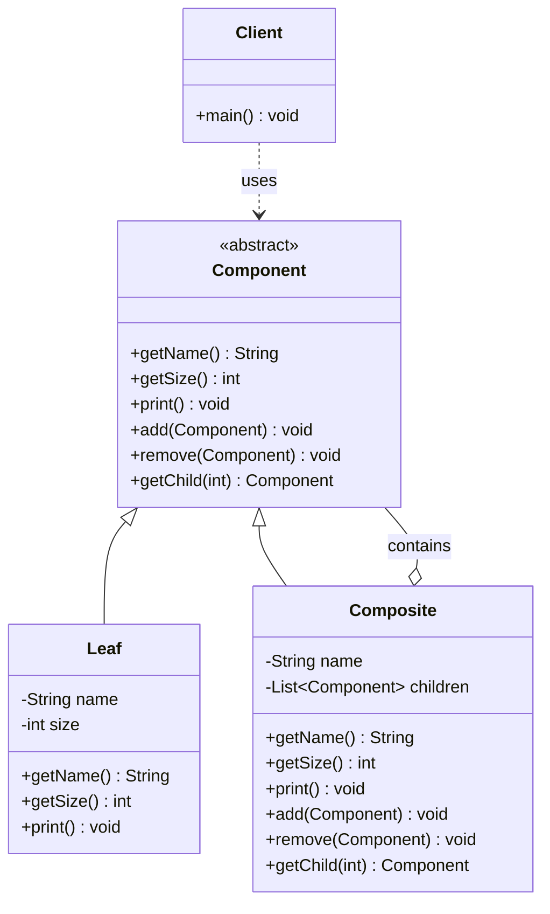

# 组合 Composite

> 将对象组合成树形结构，使单个对象和组合对象的使用保持一致。

## 意图

组合模式让你可以统一处理单个对象和对象组合。树形结构中的每个节点（无论是叶子节点还是分支节点）都实现相同的接口，客户端不需要区分当前处理的是单个对象还是组合对象。

最直观的例子就是文件系统——文件和文件夹都可以有"名称"、"大小"等属性，都可以进行"删除"操作，但文件夹还可以包含子项。组合模式让你用统一的方式操作它们。

## 适用场景

- 需要表示"部分-整体"的层次结构时
- 希望客户端忽略单个对象和组合对象的区别，统一使用时
- 处理树形结构数据时（如文件系统、组织架构、菜单、UI 组件树）

## UML 类图



## 代码示例

### ❌ 没有使用该模式的问题

```java
// 分别处理文件和文件夹，代码重复且难以统一管理
public class File {
    private String name;
    private int size;
    public File(String name, int size) {
        this.name = name;
        this.size = size;
    }
    public int getSize() { return size; }
}

public class Folder {
    private String name;
    private List<File> files = new ArrayList<>();
    private List<Folder> subFolders = new ArrayList<>();

    public int getSize() {
        int total = 0;
        for (File f : files) total += f.getSize();
        for (Folder f : subFolders) total += f.getSize();
        return total;
    }

    // 客户端需要判断类型分别处理
    public void process(Object item) {
        if (item instanceof File) {
            // 处理文件
        } else if (item instanceof Folder) {
            // 处理文件夹
        }
    }
}
```

### ✅ 使用该模式后的改进

```java
// 统一的组件接口
public abstract class FileSystemNode {
    protected String name;

    protected FileSystemNode(String name) {
        this.name = name;
    }

    public abstract int getSize();
    public abstract void print(String indent);
}

// 叶子节点：文件
public class FileNode extends FileSystemNode {
    private int size;

    public FileNode(String name, int size) {
        super(name);
        this.size = size;
    }

    @Override
    public int getSize() {
        return size;
    }

    @Override
    public void print(String indent) {
        System.out.println(indent + "📄 " + name + " (" + size + " KB)");
    }
}

// 组合节点：文件夹
public class FolderNode extends FileSystemNode {
    private List<FileSystemNode> children = new ArrayList<>();

    public FolderNode(String name) {
        super(name);
    }

    public void add(FileSystemNode node) {
        children.add(node);
    }

    public void remove(FileSystemNode node) {
        children.remove(node);
    }

    @Override
    public int getSize() {
        int total = 0;
        for (FileSystemNode child : children) {
            total += child.getSize();
        }
        return total;
    }

    @Override
    public void print(String indent) {
        System.out.println(indent + "📁 " + name + "/");
        for (FileSystemNode child : children) {
            child.print(indent + "  ");
        }
    }
}

// 使用：统一处理文件和文件夹
public class Main {
    public static void main(String[] args) {
        FolderNode root = new FolderNode("项目根目录");
        FolderNode src = new FolderNode("src");
        FolderNode test = new FolderNode("test");

        src.add(new FileNode("Main.java", 10));
        src.add(new FileNode("Utils.java", 5));
        test.add(new FileNode("MainTest.java", 3));

        root.add(src);
        root.add(test);
        root.add(new FileNode("pom.xml", 2));

        root.print(""); // 打印整棵树
        System.out.println("总大小: " + root.getSize() + " KB"); // 20 KB
    }
}
```

### Spring 中的应用

Spring WebMVC 中处理多级 URL 路径就用到了组合模式的思想：

```java
// Spring 的 multipart 解析
// CompositeResolver 组合多个视图解析器
public class ViewResolverComposite implements ViewResolver, Ordered {
    private final List<ViewResolver> viewResolvers = new ArrayList<>();

    @Override
    public View resolveViewName(String viewName, Locale locale) {
        for (ViewResolver viewResolver : viewResolvers) {
            View view = viewResolver.resolveViewName(viewName, locale);
            if (view != null) return view;
        }
        return null;
    }
}

// MyBatis 中的 SqlNode 也是组合模式
// MixedSqlNode 包含多个子 SqlNode，可以嵌套组合
// DynamicSqlSource 递归处理整棵 SQL 树
```

## 优缺点

| 优点 | 缺点 |
|------|------|
| 统一单个对象和组合对象的处理 | 设计时需要区分叶子节点和组合节点的操作 |
| 简化客户端代码，不需要类型判断 | 限制了对叶子节点的操作（如 add 方法在叶子上无意义） |
| 方便扩展新的组件类型 | 透明型组合会让叶子节点暴露不必要的方法 |
| 树形结构灵活，可以随意组合 | 复杂的树结构可能导致性能问题（递归遍历） |

## 面试追问

**Q1: 透明型组合和安全型组合有什么区别？**

A: 透明型组合在 Component 接口中声明所有管理子节点的方法（add/remove/getChild），Leaf 也需要实现（通常抛出异常或不做任何事），优点是客户端完全不需要区分类型。安全型组合只在 Composite 中声明管理子节点的方法，Leaf 不需要实现这些方法，更安全但客户端需要类型判断。

**Q2: 组合模式和装饰器模式有什么区别？**

A: 结构上很像（都递归组合），但目的不同。组合模式关注的是"部分-整体"的层次结构，目的是统一处理单个和组合对象。装饰器模式关注的是"动态添加功能"，目的是在不修改对象的前提下扩展行为。

**Q3: 组合模式在什么场景下不适合使用？**

A: 当树结构非常深时，递归操作可能导致栈溢出；当叶子节点和组合节点的操作差异很大时，强行统一接口会违反里氏替换原则；当数据结构不是树形而是图或网络时，组合模式不适用。

## 相关模式

- **装饰器模式**：结构相似，但装饰器是增强功能，组合是表示层次结构
- **迭代器模式**：组合模式可以用迭代器来遍历树形结构
- **访问者模式**：对组合结构中的不同节点执行不同操作时结合使用
- **责任链模式**：组合模式中的树形结构可以与责任链结合
