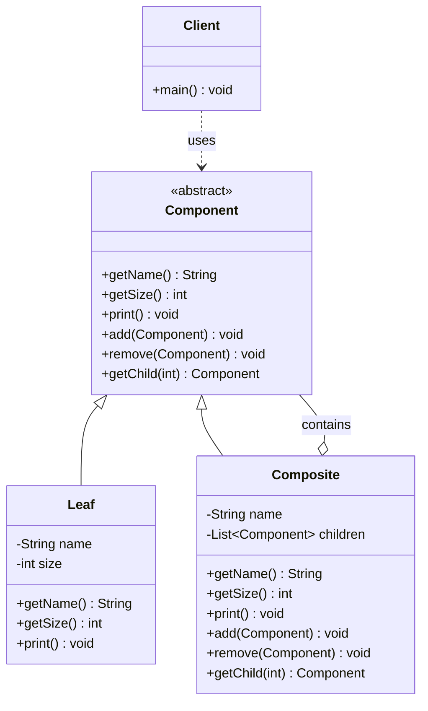

# 组合 Composite

> 将对象组合成树形结构，使单个对象和组合对象的使用保持一致。

## 意图

组合模式让你可以统一处理单个对象和对象组合。树形结构中的每个节点（无论是叶子节点还是分支节点）都实现相同的接口，客户端不需要区分当前处理的是单个对象还是组合对象。

通俗点说，就像文件系统——文件和文件夹都可以有"名称"、"大小"等属性，都可以进行"删除"操作，但文件夹还可以包含子项。你不需要写 `if (item.isFile())` 和 `else if (item.isFolder())` 这种分支判断，直接调用 `item.delete()` 就行，文件系统自己知道该怎么处理。

再举个例子，公司的组织架构——员工和部门都有"名字"，都有"计算成本"的操作。员工计算自己的薪资成本，部门计算所有下属员工和子部门的总成本。对财务来说，不需要区分是员工还是部门，统一调 `getCost()` 就行。

## 适用场景

- 需要表示"部分-整体"的层次结构时（文件系统、组织架构、菜单）
- 希望客户端忽略单个对象和组合对象的区别，统一使用时
- 处理树形结构数据时（DOM 树、UI 组件树、目录结构）
- 需要递归遍历树形结构并执行操作时
- 需要统一管理单个对象和组合对象的生命周期时

## UML 类图



## 代码示例

### ❌ 没有使用该模式的问题

没有组合模式的时候，文件和文件夹是两个独立的类，客户端需要大量类型判断：

```java
/**
 * 没有组合模式的文件系统——客户端需要到处做类型判断
 * 问题：新增文件类型要改客户端代码，违反开闭原则
 */
public class File {
    private String name;
    private int size;

    public File(String name, int size) {
        this.name = name;
        this.size = size;
    }

    public String getName() { return name; }
    public int getSize() { return size; }
}

public class Folder {
    private String name;
    private List<Object> items = new ArrayList<>(); // 混装 File 和 Folder

    public Folder(String name) { this.name = name; }
    public String getName() { return name; }

    public void addItem(Object item) { items.add(item); }

    // 计算总大小——需要类型判断
    public int getTotalSize() {
        int total = 0;
        for (Object item : items) {
            if (item instanceof File) {
                total += ((File) item).getSize(); // 处理文件
            } else if (item instanceof Folder) {
                total += ((Folder) item).getTotalSize(); // 递归处理子文件夹
            }
        }
        return total;
    }

    // 删除所有内容——又是类型判断
    public void deleteAll() {
        for (Object item : items) {
            if (item instanceof File) {
                System.out.println("删除文件: " + ((File) item).getName());
            } else if (item instanceof Folder) {
                System.out.println("删除文件夹: " + ((Folder) item).getName());
                ((Folder) item).deleteAll(); // 递归删除
            }
        }
    }
}

public class Client {
    public static void main(String[] args) {
        Folder root = new Folder("项目根目录");
        Folder src = new Folder("src");
        src.addItem(new File("Main.java", 10));
        src.addItem(new File("Utils.java", 5));
        root.addItem(src);
        root.addItem(new File("pom.xml", 2));

        // 客户端需要知道具体类型才能操作
        for (Object item : root.getItems()) {
            if (item instanceof File) {
                System.out.println("文件: " + ((File) item).getName()
                    + " 大小: " + ((File) item).getSize());
            } else if (item instanceof Folder) {
                System.out.println("文件夹: " + ((Folder) item).getName()
                    + " 大小: " + ((Folder) item).getTotalSize());
            }
        }

        // 新增快捷方式（Shortcut）？所有类型判断的地方都要改！
        // 这就是没有组合模式的痛苦
    }
}
```

运行结果：

```
文件夹: src 大小: 15
文件: pom.xml 大小: 2
```

:::danger 核心问题
1. 客户端到处都是 `instanceof` 判断，代码又臭又长
2. 新增节点类型（如快捷方式）要修改所有判断逻辑，违反开闭原则
3. `List<Object>` 类型不安全，什么都能往里塞
4. 每个需要遍历树的方法都要重新写一遍递归逻辑
:::

### ✅ 使用该模式后的改进

用统一的组件接口，让客户端完全不用关心是文件还是文件夹：

```java
/**
 * 抽象组件——文件和文件夹的公共接口
 * 定义了所有节点共有的操作
 * 这里采用"安全型组合"：add/remove 方法只在 Composite 中实现
 */
public abstract class FileSystemNode {
    protected String name; // 节点名称

    protected FileSystemNode(String name) {
        this.name = name;
    }

    public String getName() { return name; }

    // 计算大小——叶子节点返回自身大小，组合节点递归计算子节点
    public abstract int getSize();

    // 打印结构——叶子节点打印自己，组合节点递归打印子节点
    public abstract void print(String indent);

    // 搜索——在整棵树中搜索匹配的文件名
    public abstract List<FileSystemNode> search(String keyword);
}
```

叶子节点（文件）：

```java
/**
 * 叶子节点——文件
 * 没有子节点，是最小粒度的单元
 */
public class FileNode extends FileSystemNode {
    private final int size; // 文件大小（KB）

    public FileNode(String name, int size) {
        super(name);
        this.size = size;
    }

    @Override
    public int getSize() {
        return size; // 文件直接返回自身大小
    }

    @Override
    public void print(String indent) {
        System.out.println(indent + "📄 " + name + " (" + size + " KB)");
    }

    @Override
    public List<FileSystemNode> search(String keyword) {
        List<FileSystemNode> result = new ArrayList<>();
        if (name.contains(keyword)) {
            result.add(this); // 文件名匹配，加入结果
        }
        return result;
    }
}
```

组合节点（文件夹）：

```java
/**
 * 组合节点——文件夹
 * 可以包含任意 FileSystemNode（文件或子文件夹）
 * 所有操作都是递归的——对子节点执行相同的操作
 */
public class FolderNode extends FileSystemNode {
    private final List<FileSystemNode> children = new ArrayList<>();

    public FolderNode(String name) {
        super(name);
    }

    /** 添加子节点——可以是文件或文件夹 */
    public void add(FileSystemNode node) {
        children.add(node);
    }

    /** 移除子节点 */
    public void remove(FileSystemNode node) {
        children.remove(node);
    }

    /** 获取指定位置的子节点 */
    public FileSystemNode getChild(int index) {
        return children.get(index);
    }

    /** 获取所有子节点 */
    public List<FileSystemNode> getChildren() {
        return Collections.unmodifiableList(children);
    }

    @Override
    public int getSize() {
        int total = 0;
        for (FileSystemNode child : children) {
            total += child.getSize(); // 递归计算每个子节点的大小
        }
        return total;
    }

    @Override
    public void print(String indent) {
        System.out.println(indent + "📁 " + name + "/");
        for (FileSystemNode child : children) {
            child.print(indent + "  "); // 递归打印子节点，缩进增加
        }
    }

    @Override
    public List<FileSystemNode> search(String keyword) {
        List<FileSystemNode> result = new ArrayList<>();
        for (FileSystemNode child : children) {
            result.addAll(child.search(keyword)); // 递归搜索子节点
        }
        return result;
    }
}
```

客户端使用——统一接口，无需类型判断：

```java
public class Client {
    public static void main(String[] args) {
        // 构建文件系统树
        FolderNode root = new FolderNode("java-fullstack-knowledge");

        FolderNode src = new FolderNode("src");
        FolderNode main = new FolderNode("main");
        FolderNode java = new FolderNode("java");
        FolderNode test = new FolderNode("test");

        java.add(new FileNode("Application.java", 8));
        java.add(new FileNode("UserService.java", 12));
        java.add(new FileNode("OrderService.java", 15));

        test.add(new FileNode("UserServiceTest.java", 6));
        test.add(new FileNode("OrderServiceTest.java", 7));

        main.add(java);
        src.add(main);
        src.add(test);
        root.add(src);
        root.add(new FileNode("pom.xml", 3));
        root.add(new FileNode("README.md", 2));

        // 1. 打印整棵树——不需要区分文件和文件夹
        System.out.println("===== 文件结构 =====");
        root.print("");

        // 2. 计算总大小——递归计算，客户端不关心内部结构
        System.out.println("\n===== 总大小 =====");
        System.out.println("总大小: " + root.getSize() + " KB");

        // 3. 搜索文件——递归搜索整棵树
        System.out.println("\n===== 搜索包含 'Service' 的文件 =====");
        List<FileSystemNode> results = root.search("Service");
        for (FileSystemNode node : results) {
            System.out.println("找到: " + node.getName());
        }

        // 4. 统一操作——对每个节点做同样的事
        System.out.println("\n===== 统计各节点大小 =====");
        printSize(root, "");
    }

    /** 递归打印每个节点的大小 */
    private static void printSize(FileSystemNode node, String indent) {
        System.out.println(indent + node.getName() + ": " + node.getSize() + " KB");
        if (node instanceof FolderNode) {
            for (FileSystemNode child : ((FolderNode) node).getChildren()) {
                printSize(child, indent + "  ");
            }
        }
    }
}
```

### 变体与扩展

#### 安全型 vs 透明型组合

上面用的是 **安全型组合**——`add/remove` 方法只在 `FolderNode` 中定义，`FileNode` 没有。客户端如果需要添加子节点，必须先判断类型。

**透明型组合**把 `add/remove` 提到抽象基类中：

```java
public abstract class FileSystemNode {
    // ... 其他方法

    /** 透明型：在基类中声明，叶子节点抛异常 */
    public void add(FileSystemNode node) {
        throw new UnsupportedOperationException("叶子节点不能添加子节点");
    }

    public void remove(FileSystemNode node) {
        throw new UnsupportedOperationException("叶子节点不能移除子节点");
    }
}

// FileNode 不需要重写 add/remove，默认抛异常
// 客户端可以统一调用 node.add(child)，不需要类型判断
// 但风险是：编译时不报错，运行时才抛异常
```

:::tip 怎么选？
- **安全型**：类型安全，编译期就能发现问题，推荐在大多数场景使用
- **透明型**：客户端代码更简洁，但运行时可能抛异常，适合节点类型不会频繁变化的场景
:::

#### 带操作命令的组合

给组合模式加上命令模式，可以对整棵树执行批量操作：

```java
/**
 * 文件系统操作命令——可以对任意节点执行
 */
public interface FileCommand {
    void execute(FileSystemNode node);
}

/** 删除命令 */
public class DeleteCommand implements FileCommand {
    @Override
    public void execute(FileSystemNode node) {
        System.out.println("删除: " + node.getName());
    }
}

/** 统计命令 */
public class CountCommand implements FileCommand {
    private int fileCount = 0;
    private int folderCount = 0;

    @Override
    public void execute(FileSystemNode node) {
        if (node instanceof FileNode) fileCount++;
        else folderCount++;
    }

    public int getFileCount() { return fileCount; }
    public int getFolderCount() { return folderCount; }
}

// 对整棵树执行命令
public class TreeWalker {
    public static void walk(FileSystemNode node, FileCommand command) {
        command.execute(node);
        if (node instanceof FolderNode) {
            for (FileSystemNode child : ((FolderNode) node).getChildren()) {
                walk(child, command); // 递归对每个子节点执行命令
            }
        }
    }
}
```

### 运行结果

```
===== 文件结构 =====
📁 java-fullstack-knowledge/
  📁 src/
    📁 main/
      📁 java/
        📄 Application.java (8 KB)
        📄 UserService.java (12 KB)
        📄 OrderService.java (15 KB)
    📁 test/
      📄 UserServiceTest.java (6 KB)
      📄 OrderServiceTest.java (7 KB)
  📄 pom.xml (3 KB)
  📄 README.md (2 KB)

===== 总大小 =====
总大小: 53 KB

===== 搜索包含 'Service' 的文件 =====
找到: UserService.java
找到: OrderService.java
找到: UserServiceTest.java
找到: OrderServiceTest.java

===== 统计各节点大小 =====
java-fullstack-knowledge: 53 KB
  src: 48 KB
    main: 35 KB
      java: 35 KB
        Application.java: 8 KB
        UserService.java: 12 KB
        OrderService.java: 15 KB
    test: 13 KB
      UserServiceTest.java: 6 KB
      OrderServiceTest.java: 7 KB
  pom.xml: 3 KB
  README.md: 2 KB
```

## Spring/JDK 中的应用

### 1. Spring MVC 的 `ViewResolverComposite`

Spring MVC 中可以配置多个视图解析器（JSP、Thymeleaf、FreeMarker 等），`ViewResolverComposite` 用组合模式统一管理：

```java
// Spring 源码中的 ViewResolverComposite
public class ViewResolverComposite implements ViewResolver, Ordered, ApplicationContextAware {

    // 内部持有一组 ViewResolver，每个都可以解析视图
    private final List<ViewResolver> viewResolvers = new ArrayList<>();
    private int order = Ordered.LOWEST_PRECEDENCE;

    public void setViewResolvers(List<ViewResolver> viewResolvers) {
        this.viewResolvers.clear();
        if (viewResolvers != null) {
            this.viewResolvers.addAll(viewResolvers);
        }
    }

    // 按顺序尝试每个 ViewResolver，哪个能解析就用哪个
    @Override
    @Nullable
    public View resolveViewName(String viewName, Locale locale) throws Exception {
        for (ViewResolver viewResolver : this.viewResolvers) {
            View view = viewResolver.resolveViewName(viewName, locale);
            if (view != null) {
                return view; // 找到能解析的就返回
            }
        }
        return null; // 没有任何 resolver 能解析
    }
}

// 配置多个视图解析器
@Configuration
public class WebConfig implements WebMvcConfigurer {
    @Override
    public void configureViewResolvers(ViewResolverRegistry registry) {
        registry.viewResolver(thymeleafViewResolver()); // Thymeleaf
        registry.viewResolver(internalResourceViewResolver()); // JSP
        // ViewResolverComposite 会按顺序尝试
    }
}
```

### 2. MyBatis 的 `SqlNode` 组合树

MyBatis 的动态 SQL（`<if>`、`<foreach>`、`<where>` 等标签）就是用组合模式实现的：

```java
// MyBatis 源码中的 SqlNode 接口
public interface SqlNode {
    // 每个 SqlNode 负责将自己的 SQL 片段追加到 context 中
    boolean apply(DynamicContext context);
}

// MixedSqlNode 包含多个子 SqlNode（组合节点）
public class MixedSqlNode implements SqlNode {
    private final List<SqlNode> contents; // 子节点列表

    public MixedSqlNode(List<SqlNode> contents) {
        this.contents = contents;
    }

    @Override
    public boolean apply(DynamicContext context) {
        for (SqlNode sqlNode : contents) {
            sqlNode.apply(context); // 递归应用每个子节点
        }
        return true;
    }
}

// IfSqlNode 对应 <if> 标签（条件判断节点）
public class IfSqlNode implements SqlNode {
    private final ExpressionEvaluator evaluator;
    private final String test;       // test 表达式
    private final SqlNode contents;  // 条件成立时的子节点

    @Override
    public boolean apply(DynamicContext context) {
        if (evaluator.evaluateBoolean(test, context.getBindings())) {
            contents.apply(context); // 条件成立，递归处理子节点
            return true;
        }
        return false; // 条件不成立，跳过
    }
}

// ForEachSqlNode 对应 <foreach> 标签
// WhereSqlNode 对应 <where> 标签
// 每个 SQL 标签都是一个 SqlNode，组合起来形成完整的 SQL 树
```

### 3. JDK 中的 AWT/Swing 组件树

Java GUI 中的组件体系也是典型的组合模式：

```java
// java.awt.Container 和 java.awt.Component 的关系
// Component 是抽象组件（相当于 FileSystemNode）
// Container 是组合组件（相当于 FolderNode），可以包含子组件
// Button、Label 是叶子组件（相当于 FileNode）

Container frame = new Frame("我的窗口");
Container panel = new Panel();

panel.add(new Button("确定"));   // 叶子组件
panel.add(new Button("取消"));   // 叶子组件
panel.add(new Label("请选择：")); // 叶子组件

frame.add(panel); // 组合组件包含子组件

// 统一操作：遍历所有组件
frame.forEach(c -> System.out.println(c.getClass().getSimpleName()));
```

### 4. JDK 中的 `java.nio.file` 文件树遍历

```java
// Java NIO 提供了 Files.walkFileTree 来遍历文件树
// FileVisitor 就是组合模式 + 访问者模式的应用
Files.walkFileTree(Paths.get("/tmp/project"), new SimpleFileVisitor<Path>() {
    @Override
    public FileVisitResult visitFile(Path file, BasicFileAttributes attrs) {
        System.out.println("文件: " + file); // 处理叶子节点
        return FileVisitResult.CONTINUE;
    }

    @Override
    public FileVisitResult preVisitDirectory(Path dir, BasicFileAttributes attrs) {
        System.out.println("进入目录: " + dir); // 处理组合节点
        return FileVisitResult.CONTINUE;
    }
});
```

## 优缺点

| 优点 | 详细说明 | 缺点 | 详细说明 |
|------|---------|------|---------|
| 统一接口 | 客户端不需要区分叶子节点和组合节点 | 设计约束 | 透明型组合会让叶子节点暴露无意义的 add/remove 方法 |
| 简化客户端 | 不需要到处写 instanceof 判断 | 安全风险 | 透明型组合运行时才抛异常，编译期不报错 |
| 易于扩展 | 新增节点类型只需继承 Component | 递归深度 | 树太深可能栈溢出 |
| 灵活组合 | 可以自由组合任意层级的树结构 | 性能开销 | 遍历整棵树可能很耗时 |
| 符合开闭原则 | 新增节点类型不需要修改客户端代码 | 类型限制 | 叶子节点和组合节点差异太大时，统一接口会很别扭 |

:::tip 组合模式的本质
组合模式的核心思想是 **"部分和整体的一致性"**——让客户端用同样的方式对待单个对象和组合对象。当你发现代码里到处都是 `if (x instanceof A) ... else if (x instanceof B)` 这种类型判断时，就该考虑组合模式了。
:::

## 面试追问

### Q1: 透明型组合和安全型组合有什么区别？各自适合什么场景？

**A:** 这是组合模式最经典的面试题。

**透明型组合：**
- `add/remove/getChild` 定义在 `Component` 基类中
- 叶子节点继承这些方法但抛 `UnsupportedOperationException`
- 客户端完全不需要类型判断，可以统一调用
- 缺点：编译期不报错，运行时才发现叶子节点不支持 add 操作
- 适合：节点类型比较稳定、客户端需要高度统一处理的场景

**安全型组合：**
- `add/remove/getChild` 只在 `Composite` 中定义
- 叶子节点根本没有这些方法
- 客户端如果需要操作子节点，必须先判断类型
- 缺点：客户端需要 instanceof 判断
- 适合：叶子节点和组合节点差异较大、追求类型安全的场景

**实际项目中安全型用得更多**，因为运行时异常比编译期错误更难排查。

### Q2: 组合模式和装饰器模式有什么区别？

**A:** 结构上确实很像（都是递归组合，都实现相同接口），但目的完全不同：

| 维度 | 组合模式 | 装饰器模式 |
|------|---------|-----------|
| 目的 | 表示"部分-整体"的层次结构 | 动态添加新功能 |
| 组合方式 | 树形结构（一个节点可以有多个子节点） | 链式结构（一个装饰器包装一个对象） |
| 接口变化 | 所有节点实现相同的接口 | 装饰器可以添加新方法（但通常保持接口不变） |
| 使用方式 | 递归遍历 | 逐层委托 |
| 典型例子 | 文件系统、组织架构 | IO 流（BufferedInputStream 包装 FileInputStream） |

简单记：**组合模式做"树"，装饰器模式做"链"**。

### Q3: 组合模式在什么场景下不适合使用？

**A:** 以下场景要慎重考虑：

1. **树非常深**：递归遍历可能导致栈溢出。解决方案：用迭代代替递归，或者限制树的深度
2. **叶子节点和组合节点差异很大**：强行统一接口会导致接口膨胀，违反接口隔离原则。比如文件不能有"添加子项"的操作
3. **不是树形结构**：如果数据结构是图或网状结构（有环），组合模式的递归遍历会死循环
4. **需要频繁在节点间移动**：组合模式不适合频繁调整树结构的场景，因为每次移动都要维护父子关系
5. **需要精确定位某个节点**：组合模式没有内置的索引机制，查找特定节点效率不高

### Q4: 组合模式如何处理循环引用？

**A:** 如果树的节点之间出现循环引用（A 包含 B，B 又包含 A），递归遍历会无限循环。解决方案：

```java
public class FolderNode extends FileSystemNode {
    // 用 Set 记录已经访问过的节点，防止循环
    public void printWithCycleCheck(String indent, Set<FileSystemNode> visited) {
        if (visited.contains(this)) {
            System.out.println(indent + "📁 " + name + "/ (循环引用，已跳过)");
            return;
        }
        visited.add(this); // 标记为已访问
        System.out.println(indent + "📁 " + name + "/");
        for (FileSystemNode child : children) {
            if (child instanceof FolderNode) {
                ((FolderNode) child).printWithCycleCheck(indent + "  ", visited);
            } else {
                child.print(indent + "  ");
            }
        }
        visited.remove(this); // 回溯，不影响其他路径的遍历
    }
}
```

## 相关模式

- **装饰器模式**：结构相似，但装饰器是增强功能，组合是表示层次结构
- **迭代器模式**：组合模式可以用迭代器来遍历树形结构
- **访问者模式**：对组合结构中的不同节点执行不同操作时结合使用
- **责任链模式**：组合模式中的树形结构可以与责任链结合
- **命令模式**：对整棵树执行批量操作时，可以用命令模式封装操作
