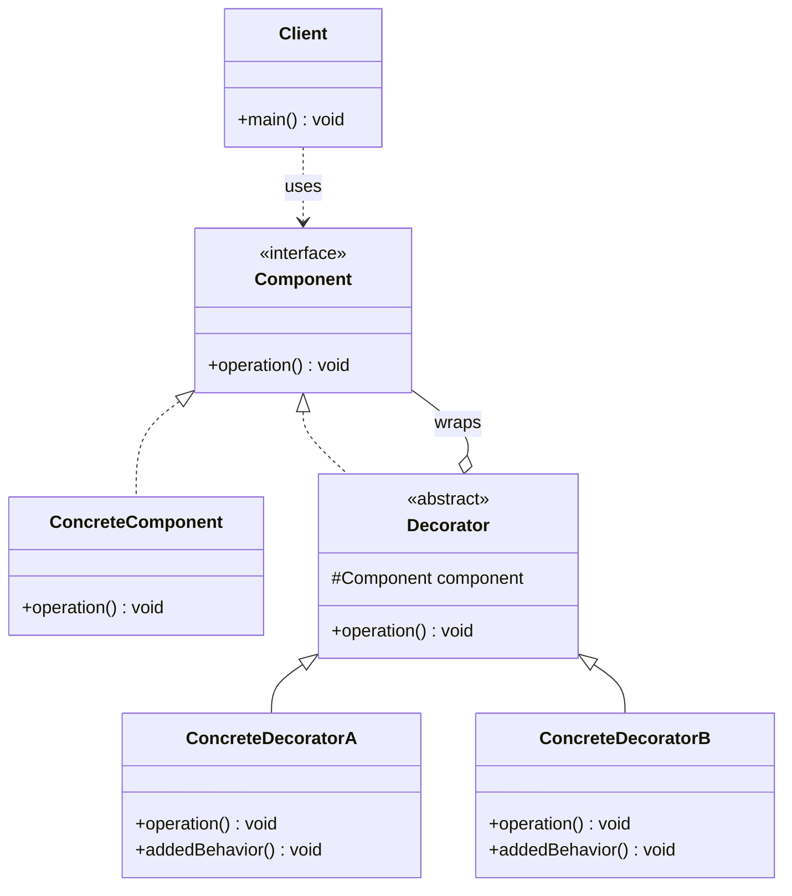

# 装饰器 Decorator

> 动态地给一个对象添加额外职责，比继承更灵活的替代方案。

## 意图

装饰器模式允许你在不修改原始类代码的情况下，通过"包装"对象来动态添加新功能。每个装饰器都实现与被装饰对象相同的接口，并在内部持有被装饰对象的引用，调用时先执行自己的逻辑再委托给被装饰对象。

想象一下咖啡店——你可以点一杯黑咖啡，然后动态地加上牛奶、加奶泡、加焦糖——每种添加都是一个装饰器，可以自由组合。

## 适用场景

- 需要动态、透明地给对象添加职责时
- 需要大量排列组合产生不同功能时
- 不方便使用继承来扩展功能时（类被 final 修饰、类层次过深）
- 需要在运行时撤销添加的功能时

## UML 类图



## 代码示例

### ❌ 没有使用该模式的问题

```java
// 用继承扩展功能，导致类爆炸
public class Coffee { }
public class MilkCoffee extends Coffee { }
public class WhipCoffee extends Coffee { }
public class MilkWhipCoffee extends MilkCoffee { }  // 牛奶+奶泡
public class MochaCoffee extends Coffee { }
public class MilkMochaCoffee extends MochaCoffee { } // 牛奶+摩卡
public class WhipMochaCoffee extends MochaCoffee { } // 奶泡+摩卡
// 3种配料需要 2^3 = 8 个子类，根本无法维护
```

### ✅ 使用该模式后的改进

```java
// 组件接口
public interface Coffee {
    String getDescription();
    double getCost();
}

// 具体组件
public class SimpleCoffee implements Coffee {
    @Override
    public String getDescription() {
        return "简单咖啡";
    }

    @Override
    public double getCost() {
        return 10.0;
    }
}

// 装饰器基类
public abstract class CoffeeDecorator implements Coffee {
    protected final Coffee coffee;

    protected CoffeeDecorator(Coffee coffee) {
        this.coffee = coffee;
    }
}

// 具体装饰器：牛奶
public class MilkDecorator extends CoffeeDecorator {
    public MilkDecorator(Coffee coffee) {
        super(coffee);
    }

    @Override
    public String getDescription() {
        return coffee.getDescription() + " + 牛奶";
    }

    @Override
    public double getCost() {
        return coffee.getCost() + 3.0;
    }
}

// 具体装饰器：奶泡
public class WhipDecorator extends CoffeeDecorator {
    public WhipDecorator(Coffee coffee) {
        super(coffee);
    }

    @Override
    public String getDescription() {
        return coffee.getDescription() + " + 奶泡";
    }

    @Override
    public double getCost() {
        return coffee.getCost() + 5.0;
    }
}

// 使用：自由组合
public class Main {
    public static void main(String[] args) {
        // 简单咖啡 + 牛奶 + 奶泡
        Coffee coffee = new WhipDecorator(new MilkDecorator(new SimpleCoffee()));
        System.out.println(coffee.getDescription()); // 简单咖啡 + 牛奶 + 奶泡
        System.out.println(coffee.getCost());         // 18.0

        // 只加牛奶
        Coffee milkCoffee = new MilkDecorator(new SimpleCoffee());
        System.out.println(milkCoffee.getDescription()); // 简单咖啡 + 牛奶
    }
}
```

### Spring 中的应用

Spring 中大量使用了装饰器模式：

```java
// Spring 的 BeanWrapper 就是装饰器模式
// 它包装了普通 JavaBean，添加了属性访问、类型转换等功能

// Spring MVC 的 HandlerInterceptor 也是一种装饰
// 在 Controller 方法前后添加日志、权限校验等逻辑

// 最典型的：Spring 的 DataSource 包装
// 在原始 DataSource 外层包装连接池、监控、日志等功能
@Bean
public DataSource dataSource() {
    // 底层数据源
    DriverManagerDataSource rawDataSource = new DriverManagerDataSource();
    rawDataSource.setUrl("jdbc:mysql://localhost:3306/mydb");

    // 用 HikariCP 包装（装饰器），添加连接池功能
    HikariDataSource pooledDataSource = new HikariDataSource();
    pooledDataSource.setDataSource(rawDataSource);
    return pooledDataSource;
}
```

## 优缺点

| 优点 | 缺点 |
|------|------|
| 比继承更灵活，动态添加/撤销功能 | 装饰器层过多会导致调试困难（堆栈很深） |
| 符合开闭原则，无需修改已有代码 | 小装饰器类太多，增加代码量 |
| 可以排列组合产生大量不同行为 | 顺序敏感，装饰器顺序不同结果可能不同 |
| 保持接口一致性 | 客户端需要区分 Component 和 Decorator |

## 面试追问

**Q1: 装饰器模式和代理模式的区别？**

A: 结构上相似，但意图不同。装饰器关注"添加功能"，代理关注"控制访问"。装饰器通常由客户端主动组合，代理隐藏了被代理对象的存在。装饰器可以多层嵌套，代理通常只有一层。装饰器增强行为，代理控制访问。

**Q2: Java IO 中的装饰器模式是怎么体现的？**

A: `InputStream` 是抽象组件，`FileInputStream` 是具体组件，`BufferedInputStream`、`DataInputStream` 等是装饰器。`new BufferedInputStream(new FileInputStream("file.txt"))` 就是经典的装饰器用法——给文件输入流添加缓冲功能。这种嵌套式的 API 设计就是装饰器模式的标准体现。

**Q3: 装饰器模式如何避免装饰器过多导致的问题？**

A: 1) 合并功能相似的装饰器，减少装饰器数量；2) 使用建造者模式来管理装饰器的组装过程，让组装逻辑更清晰；3) 对于固定的功能组合，可以直接创建一个具体的装饰器类来封装常用的组合。

## 相关模式

- **适配器模式**：适配器改变接口，装饰器保持接口不变
- **代理模式**：代理控制访问，装饰器增强功能
- **策略模式**：策略替换算法，装饰器添加功能
- **组合模式**：结构相似，组合关注层次结构，装饰器关注功能增强
