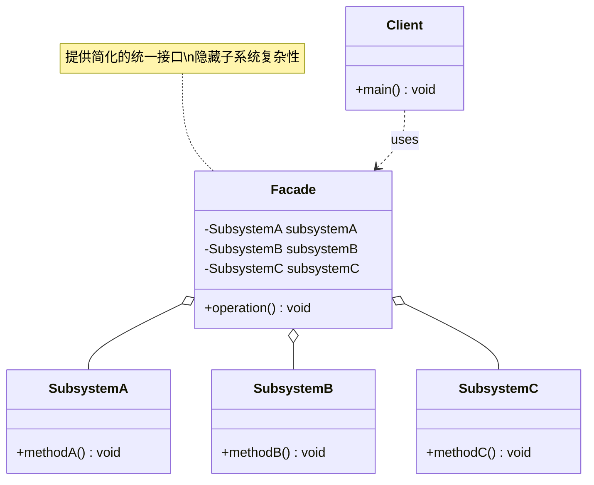

# 外观 Facade

> 为子系统中的一组接口提供一个统一的高层接口，使子系统更容易使用。

## 意图

外观模式就像智能家居的中控面板——你不需要分别操作灯光、空调、窗帘、音响，只需按一个"回家模式"按钮，所有设备自动调整到预设状态。在代码中，当你的系统有很多复杂的子系统需要协同工作时，外观模式提供一个简化的接口，隐藏内部复杂性。

外观模式不是封装子系统，而是提供一个便捷的入口。客户端仍然可以直接使用子系统，但简单场景下用外观就够了。

## 适用场景

- 为复杂的子系统提供简单接口时
- 需要分层架构，让各层通过外观交互时
- 子系统独立演化，但需要对外提供统一入口时

## UML 类图



## 代码示例

### ❌ 没有使用该模式的问题

```java
// 客户端需要了解所有子系统，直接调用多个子系统的 API
public class Client {
    public static void main(String[] args) {
        // 发送一封邮件需要调用多个子系统
        TemplateEngine templateEngine = new TemplateEngine();
        String content = templateEngine.render("welcome", Map.of("name", "张三"));

        EmailValidator validator = new EmailValidator();
        if (!validator.validate("zhangsan@example.com")) {
            throw new RuntimeException("邮箱格式不正确");
        }

        EmailSender sender = new EmailSender();
        sender.setSmtpHost("smtp.example.com");
        sender.setPort(587);
        sender.send("zhangsan@example.com", "欢迎", content);

        EmailLogger logger = new EmailLogger();
        logger.log("zhangsan@example.com", "欢迎邮件已发送");

        // 客户端代码复杂，耦合多个子系统
        // 换一个场景（比如发短信）又要重新编排这些调用
    }
}
```

### ✅ 使用该模式后的改进

```java
// 子系统（不变）
public class TemplateEngine {
    public String render(String templateName, Map<String, String> params) {
        return "亲爱的 " + params.get("name") + "，欢迎加入！";
    }
}

public class EmailValidator {
    public boolean validate(String email) { return email.contains("@"); }
}

public class EmailSender {
    public void send(String to, String subject, String content) {
        System.out.println("发送邮件给: " + to + ", 主题: " + subject);
    }
}

public class EmailLogger {
    public void log(String to, String subject) {
        System.out.println("记录日志: " + to + " - " + subject);
    }
}

// 外观
public class EmailServiceFacade {
    private final TemplateEngine templateEngine = new TemplateEngine();
    private final EmailValidator validator = new EmailValidator();
    private final EmailSender sender = new EmailSender();
    private final EmailLogger logger = new EmailLogger();

    public void sendWelcomeEmail(String email, String name) {
        if (!validator.validate(email)) {
            throw new RuntimeException("邮箱格式不正确: " + email);
        }
        String content = templateEngine.render("welcome", Map.of("name", name));
        sender.send(email, "欢迎", content);
        logger.log(email, "欢迎邮件");
    }
}

// 客户端代码极简
public class Client {
    public static void main(String[] args) {
        EmailServiceFacade emailService = new EmailServiceFacade();
        emailService.sendWelcomeEmail("zhangsan@example.com", "张三");
    }
}
```

### Spring 中的应用

Spring 的 `JdbcTemplate` 就是外观模式的经典应用：

```java
// 没有 JdbcTemplate 时，直接使用 JDBC 非常繁琐
Connection conn = dataSource.getConnection();
PreparedStatement ps = conn.prepareStatement("SELECT * FROM users WHERE id = ?");
ps.setLong(1, id);
ResultSet rs = ps.executeQuery();
// 还要处理异常、关闭资源...

// JdbcTemplate 作为外观，隐藏了 JDBC 的所有复杂性
@Repository
public class UserRepository {
    @Autowired
    private JdbcTemplate jdbcTemplate;

    public User findById(Long id) {
        return jdbcTemplate.queryForObject(
            "SELECT * FROM users WHERE id = ?",
            new Object[]{id},
            new BeanPropertyRowMapper<>(User.class)
        );
    }
}

// RestTemplate、RedisTemplate 等都是类似的外观模式
```

## 优缺点

| 优点 | 缺点 |
|------|------|
| 简化客户端代码，降低使用门槛 | 不符合开闭原则，新增子系统可能需要修改外观 |
| 减少客户端与子系统之间的耦合 | 可能成为"上帝对象"，承担过多职责 |
| 分层架构中限制层与层之间的依赖 | 隐藏了子系统的灵活性，特殊场景可能绕不过去 |
| 子系统可以独立变化不影响客户端 | 过度封装可能降低系统的灵活性 |

## 面试追问

**Q1: 外观模式和中介者模式的区别？**

A: 外观模式关注的是"简化接口"，是单向的（客户端 → 子系统），外观不参与子系统之间的通信。中介者模式关注的是"解耦通信"，是双向的（子系统 ↔ 子系统），中介者负责协调多个对象之间的交互。

**Q2: 外观模式和代理模式的区别？**

A: 外观模式是为了简化使用，提供高层接口，通常包装多个子系统。代理模式是为了控制访问，通常包装单个对象。外观侧重"简化"，代理侧重"控制"。

**Q3: 外观模式在微服务架构中有什么应用？**

A: API Gateway 就是外观模式在微服务中的体现——客户端不需要分别调用用户服务、订单服务、支付服务，而是统一通过 API Gateway 访问。Gateway 负责路由、鉴权、限流等横切关注点，为客户端提供统一的入口。

## 相关模式

- **中介者模式**：外观简化子系统接口，中介者协调子系统通信
- **代理模式**：外观简化接口，代理控制访问
- **适配器模式**：外观提供简化接口，适配器转换不兼容接口
- **抽象工厂模式**：外观可以结合抽象工厂，根据配置选择不同子系统
