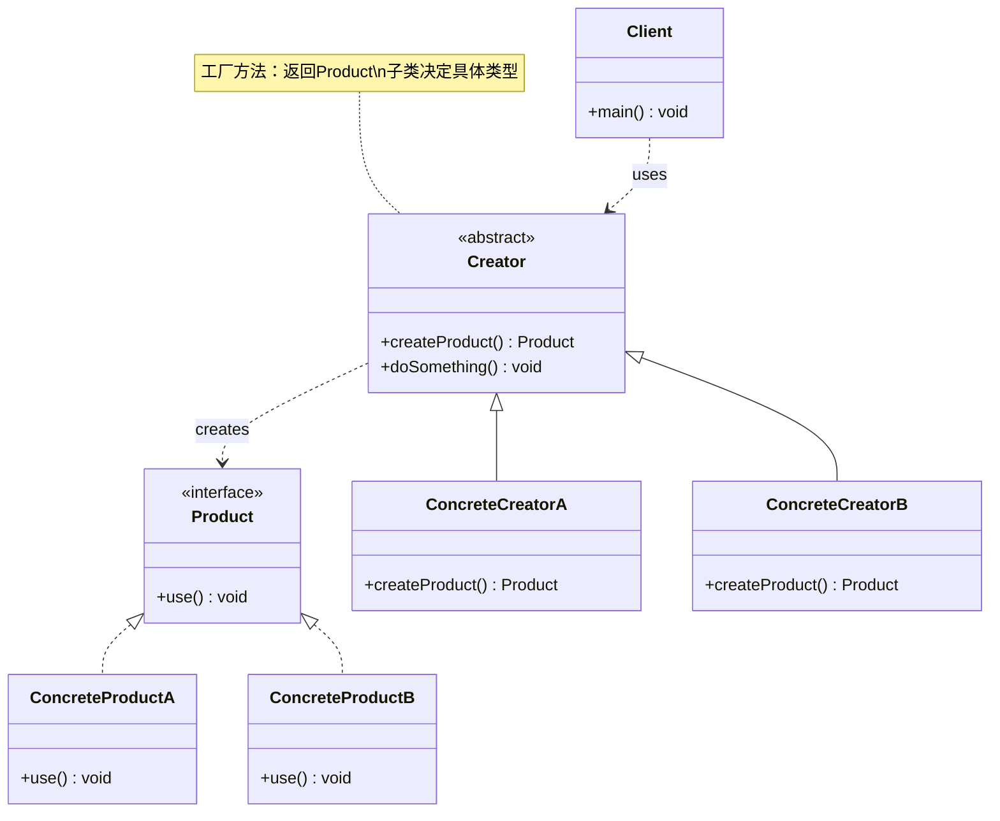

# 工厂方法 Factory Method

> 定义创建对象的接口，让子类决定实例化哪个类，将对象创建延迟到子类。

## 意图

工厂方法模式将对象的创建过程抽象出来，由父类定义创建方法的接口，具体的创建逻辑交给子类实现。这样客户端不需要知道具体创建了哪个类的对象，只需要调用工厂方法即可。

核心思想是"让创建跟随变化"——当需要新增产品类型时，只需新增一个具体工厂和具体产品，无需修改已有代码，完美符合开闭原则。

## 适用场景

- 创建对象需要大量重复代码时
- 客户端不知道应该创建哪个具体类时
- 系统需要根据不同条件创建不同对象时

## UML 类图



## 代码示例

### ❌ 没有使用该模式的问题

```java
// 客户端直接 new，与具体类强耦合
public class NotificationService {
    public void sendNotification(String type, String message) {
        if (type.equals("email")) {
            EmailNotification notification = new EmailNotification();
            notification.send(message);
        } else if (type.equals("sms")) {
            SmsNotification notification = new SmsNotification();
            notification.send(message);
        } else if (type.equals("push")) {
            PushNotification notification = new PushNotification();
            notification.send(message);
        }
        // 每增加一种通知方式都要修改这个方法
    }
}
```

### ✅ 使用该模式后的改进

```java
// 产品接口
public interface Notification {
    void send(String message);
}

// 具体产品
public class EmailNotification implements Notification {
    @Override
    public void send(String message) {
        System.out.println("发送邮件: " + message);
    }
}

public class SmsNotification implements Notification {
    @Override
    public void send(String message) {
        System.out.println("发送短信: " + message);
    }
}

// 工厂接口
public interface NotificationFactory {
    Notification createNotification();
}

// 具体工厂
public class EmailNotificationFactory implements NotificationFactory {
    @Override
    public Notification createNotification() {
        return new EmailNotification();
    }
}

public class SmsNotificationFactory implements NotificationFactory {
    @Override
    public Notification createNotification() {
        return new SmsNotification();
    }
}

// 客户端代码
public class Client {
    public static void main(String[] args) {
        NotificationFactory factory = new EmailNotificationFactory();
        Notification notification = factory.createNotification();
        notification.send("你好，欢迎注册！");
    }
}
```

### Spring 中的应用

Spring 的 `FactoryBean` 接口就是工厂方法模式的应用：

```java
// 自定义 FactoryBean
@Component
public class MyServiceFactoryBean implements FactoryBean<MyService> {
    @Override
    public MyService getObject() {
        // 复杂的创建逻辑
        return new MyService("custom-config");
    }

    @Override
    public Class<?> getObjectType() {
        return MyService.class;
    }

    @Override
    public boolean isSingleton() {
        return true;
    }
}

// 使用时直接注入 MyService，Spring 会自动通过 FactoryBean 创建
@Autowired
private MyService myService;
```

## 优缺点

| 优点 | 缺点 |
|------|------|
| 符合开闭原则，新增产品无需修改已有代码 | 每新增一种产品就要新增两个类（产品+工厂），增加系统复杂度 |
| 客户端与具体产品解耦 | 引入了抽象层，理解成本增加 |
| 子类可以灵活决定创建哪种产品 | 简单场景下使用显得过度设计 |

## 面试追问

**Q1: 工厂方法模式和简单工厂有什么区别？**

A: 简单工厂通过一个静态方法根据参数创建不同对象，新增产品需要修改工厂方法（违反开闭原则）。工厂方法将工厂抽象为接口，每种产品对应一个工厂子类，新增产品只需新增工厂子类。简单工厂也叫静态工厂方法，适合产品种类少且稳定的场景。

**Q2: Spring 中的 FactoryBean 和 BeanFactory 有什么区别？**

A: `BeanFactory` 是 Spring 容器的顶层接口，负责管理 Bean 的生命周期。`FactoryBean` 是一种特殊的 Bean，用于创建复杂对象——当注入一个 FactoryBean 类型的 Bean 时，实际注入的是它的 `getObject()` 返回值。比如 MyBatis 的 `SqlSessionFactoryBean` 就是一个 FactoryBean。

**Q3: 工厂方法模式和抽象工厂模式的区别？**

A: 工厂方法每个工厂只生产一种产品，侧重于"谁来生产"。抽象工厂每个工厂生产一族相关产品，侧重于"生产哪些产品"。抽象工厂的实现通常包含工厂方法。

## 相关模式

- **抽象工厂模式**：抽象工厂的每个工厂方法就是工厂方法模式
- **模板方法模式**：工厂方法通常在模板方法中被调用
- **原型模式**：可以用原型模式来替代工厂方法创建对象
