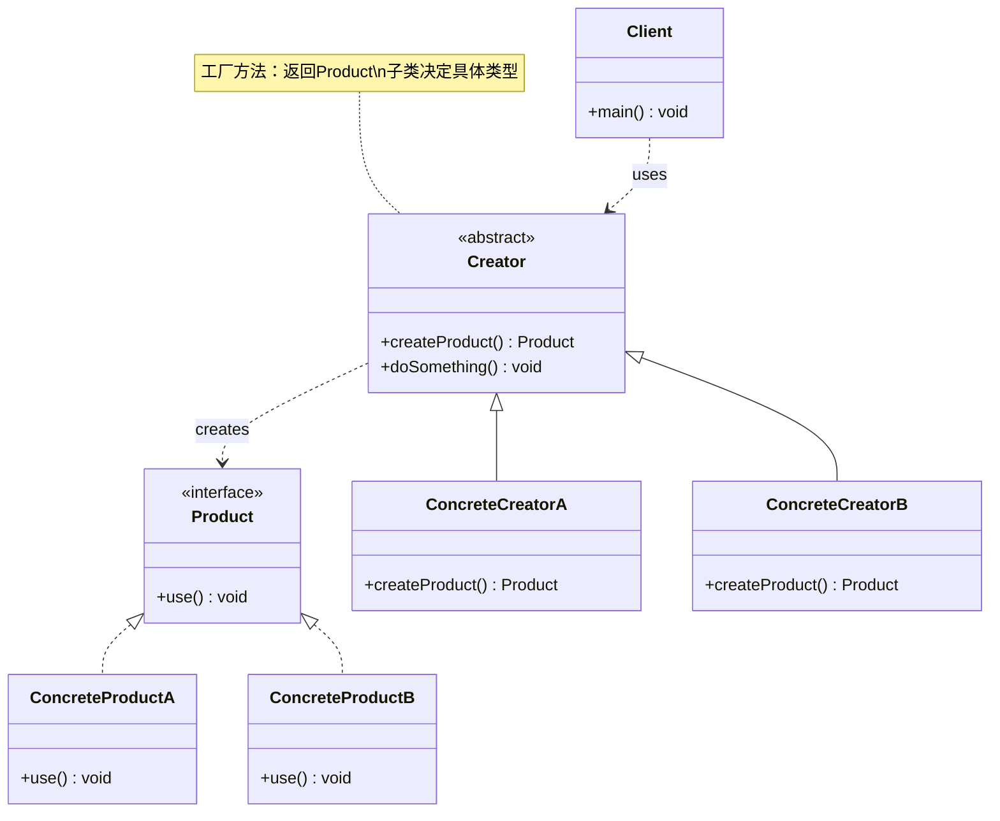

# 工厂方法 Factory Method

> 定义创建对象的接口，让子类决定实例化哪个类，将对象创建延迟到子类。

## 意图

工厂方法模式将对象的创建过程抽象出来，由父类定义创建方法的接口，具体的创建逻辑交给子类实现。这样客户端不需要知道具体创建了哪个类的对象，只需要调用工厂方法即可。

打个比方：你开了一家连锁奶茶店，总店只制定标准——"每家店必须能做出奶茶"。但具体做什么口味、用什么原料，由各分店自己决定。客户走进任何一家分店，只需说"来一杯奶茶"，分店就给你做出来。客户不需要知道这家店用的是哪种原料、什么配方——这就是工厂方法的核心：**客户端只关心"要什么"，不关心"怎么创建"**。

核心思想是"让创建跟随变化"——当需要新增产品类型时，只需新增一个具体工厂和具体产品，无需修改已有代码，完美符合开闭原则。

:::tip 工厂方法 vs 简单工厂
简单工厂把所有创建逻辑塞进一个类（if-else 或 switch），新增产品要改工厂代码。工厂方法把创建逻辑分散到各子类，新增产品只需新增子类。简单工厂是"一锅炖"，工厂方法是"分灶做饭"。
:::

## 适用场景

- 创建对象需要大量重复代码时（如复杂的初始化逻辑）
- 客户端不知道应该创建哪个具体类时（根据运行时条件决定）
- 系统需要根据不同条件创建不同对象时
- 想要将对象创建委托给子类，利用多态性时
- 需要解耦"使用对象"和"创建对象"的代码时

## UML 类图



## 代码示例

### ❌ 没有使用该模式的问题

```java
// ========== 痛点：if-else 地狱，每加一种类型就要改代码 ==========

// 客户端直接 new 具体类，与具体实现强耦合
public class NotificationService {
    public void sendNotification(String type, String message) {
        // 痛点1：大量的 if-else，违反开闭原则
        if (type.equals("email")) {
            EmailNotification notification = new EmailNotification();
            notification.send(message);
        } else if (type.equals("sms")) {
            SmsNotification notification = new SmsNotification();
            notification.send(message);
        } else if (type.equals("push")) {
            PushNotification notification = new PushNotification();
            notification.send(message);
        } else if (type.equals("wechat")) {
            WeChatNotification notification = new WeChatNotification();
            notification.send(message);
        }
        // 每增加一种通知方式都要改这个方法
        // 如果这个 if-else 散落在 10 个地方呢？改到哭
    }
}

// 痛点2：具体的创建逻辑散落在各处，难以统一管理
public class UserService {
    public void register(String username) {
        // 又一堆 if-else，和 NotificationService 里重复了
        Notification notification;
        if (userPrefs.equals("email")) {
            notification = new EmailNotification();
        } else {
            notification = new SmsNotification();
        }
        notification.send("欢迎注册: " + username);
    }
}

// 痛点3：客户端直接依赖具体类，无法做单元测试 mock
// 想在测试中用 MockNotification？做不到，因为代码里写死了 new
```

### ✅ 使用该模式后的改进

```java
// ========== 产品接口：定义所有通知类型的公共行为 ==========

public interface Notification {
    // 发送通知的统一接口
    void send(String message);
}

// ========== 具体产品：每种通知类型实现自己的发送逻辑 ==========

// 邮件通知
public class EmailNotification implements Notification {
    private final String smtpServer;
    private final int port;

    public EmailNotification() {
        this.smtpServer = "smtp.example.com"; // 复杂的初始化逻辑封装在内部
        this.port = 587;
        System.out.println("[初始化] 连接邮件服务器: " + smtpServer + ":" + port);
    }

    @Override
    public void send(String message) {
        System.out.println("[邮件] 发送到 user@example.com: " + message);
    }
}

// 短信通知
public class SmsNotification implements Notification {
    private final String gateway;

    public SmsNotification() {
        this.gateway = "sms://api.sms-provider.com";
        System.out.println("[初始化] 连接短信网关: " + gateway);
    }

    @Override
    public void send(String message) {
        System.out.println("[短信] 发送到 138****1234: " + message);
    }
}

// 推送通知
public class PushNotification implements Notification {
    private final String pushService;

    public PushNotification() {
        this.pushService = "fcm.googleapis.com";
        System.out.println("[初始化] 连接推送服务: " + pushService);
    }

    @Override
    public void send(String message) {
        System.out.println("[推送] 发送到设备 ABC123: " + message);
    }
}

// ========== 工厂接口：定义创建产品的接口 ==========

public interface NotificationFactory {
    // 工厂方法：返回抽象产品类型，具体创建什么由子类决定
    Notification createNotification();
}

// ========== 具体工厂：每个工厂负责创建一种产品 ==========

// 邮件工厂
public class EmailNotificationFactory implements NotificationFactory {
    @Override
    public Notification createNotification() {
        // 封装了 EmailNotification 的复杂创建逻辑
        // 客户端不需要知道这些细节
        return new EmailNotification();
    }
}

// 短信工厂
public class SmsNotificationFactory implements NotificationFactory {
    @Override
    public Notification createNotification() {
        return new SmsNotification();
    }
}

// 推送工厂
public class PushNotificationFactory implements NotificationFactory {
    @Override
    public Notification createNotification() {
        return new PushNotification();
    }
}

// ========== 客户端：只依赖抽象接口，不依赖具体实现 ==========

public class NotificationService {
    // 依赖抽象工厂接口，不依赖具体工厂
    private final NotificationFactory factory;

    public NotificationService(NotificationFactory factory) {
        this.factory = factory;
    }

    // 业务逻辑只依赖 Notification 接口
    public void notifyUser(String message) {
        Notification notification = factory.createNotification();
        notification.send(message);
    }
}

// ========== 使用示例 ==========

public class Main {
    public static void main(String[] args) {
        // 根据用户偏好选择工厂（实际中可以从配置文件读取）
        String userPreference = "email";

        NotificationFactory factory;
        switch (userPreference) {
            case "sms":
                factory = new SmsNotificationFactory();
                break;
            case "push":
                factory = new PushNotificationFactory();
                break;
            default:
                factory = new EmailNotificationFactory();
        }

        // 创建服务，注入工厂
        NotificationService service = new NotificationService(factory);
        service.notifyUser("你好，欢迎注册！");
    }
}
```

### 变体与扩展

#### 变体 1：参数化工厂方法（一个工厂创建多种产品）

```java
// 当产品类型不多且稳定时，可以合并为一个工厂
public class NotificationFactoryImpl implements NotificationFactory {
    @Override
    public Notification createNotification() {
        // 默认创建邮件通知
        return new EmailNotification();
    }

    // 参数化工厂方法：通过参数决定创建什么产品
    public Notification createNotification(String type) {
        switch (type.toLowerCase()) {
            case "sms": return new SmsNotification();
            case "push": return new PushNotification();
            default: return new EmailNotification();
        }
    }
}

// 使用
NotificationFactory factory = new NotificationFactoryImpl();
Notification email = factory.createNotification();           // 默认：邮件
Notification sms = factory.createNotification("sms");       // 短信
Notification push = factory.createNotification("push");     // 推送
```

#### 变体 2：延迟初始化（缓存已创建的产品）

```java
// 有些产品创建成本高，可以缓存起来避免重复创建
public class CachedNotificationFactory implements NotificationFactory {
    // 缓存已创建的产品实例
    private final Map<String, Notification> cache = new HashMap<>();

    @Override
    public Notification createNotification() {
        return createNotification("email");
    }

    public Notification createNotification(String type) {
        // 如果缓存中已有，直接返回
        return cache.computeIfAbsent(type, t -> {
            switch (t) {
                case "sms": return new SmsNotification();
                case "push": return new PushNotification();
                default: return new EmailNotification();
            }
        });
    }
}
```

#### 变体 3：工厂方法 + 模板方法（Creator 中定义业务骨架）

```java
// Creator 不只是一个工厂，还定义了使用产品的模板方法
public abstract class NotificationProcessor {
    // 模板方法：定义了发送通知的流程骨架
    public final void processNotification(String message) {
        Notification notification = createNotification(); // 工厂方法（由子类实现）
        validateMessage(message);
        notification.send(message);
        logResult();
    }

    // 工厂方法：子类决定创建什么类型的通知
    protected abstract Notification createNotification();

    // 通用步骤（已有默认实现）
    private void validateMessage(String message) {
        if (message == null || message.isBlank()) {
            throw new IllegalArgumentException("消息不能为空");
        }
        System.out.println("[验证] 消息校验通过");
    }

    private void logResult() {
        System.out.println("[日志] 通知发送完成");
    }
}

// 具体处理器：实现工厂方法
public class EmailProcessor extends NotificationProcessor {
    @Override
    protected Notification createNotification() {
        return new EmailNotification();
    }
}

public class SmsProcessor extends NotificationProcessor {
    @Override
    protected Notification createNotification() {
        return new SmsNotification();
    }
}
```

### 运行结果

```
[初始化] 连接邮件服务器: smtp.example.com:587
[邮件] 发送到 user@example.com: 你好，欢迎注册！
```

当切换为短信工厂时：

```
[初始化] 连接短信网关: sms://api.sms-provider.com
[短信] 发送到 138****1234: 你好，欢迎注册！
```

## Spring/JDK 中的应用

### Spring 中的应用

#### 1. FactoryBean 接口（Spring 的核心扩展点）

```java
// FactoryBean 是 Spring 中最经典的工厂方法模式应用
// 它是一个特殊的 Bean，用于创建复杂对象

// 自定义 FactoryBean：创建一个需要复杂初始化的 Service
@Component("myServiceFactory")
public class MyServiceFactoryBean implements FactoryBean<MyService> {

    @Autowired
    private DataSource dataSource; // 可以注入其他 Bean

    @Override
    public MyService getObject() {
        // 复杂的创建逻辑：读取配置、初始化连接池、设置参数等
        MyService service = new MyService();
        service.setDataSource(dataSource);
        service.init(); // 自定义初始化逻辑
        System.out.println("[FactoryBean] 创建 MyService 实例");
        return service;
    }

    @Override
    public Class<?> getObjectType() {
        return MyService.class; // 声明创建的对象类型
    }

    @Override
    public boolean isSingleton() {
        return true; // 默认单例
    }
}

// 使用时：注入的是 getObject() 的返回值，不是 FactoryBean 本身
@Autowired
private MyService myService; // 实际上由 MyServiceFactoryBean.getObject() 创建

// 如果需要 FactoryBean 本身，用 & 前缀
@Autowired
private FactoryBean<MyService> factory; // 注入 FactoryBean 本身
```

#### 2. Spring MVC 的 ViewResolver

```java
// ViewResolver 是工厂方法模式：根据视图名创建对应的 View 对象
public interface ViewResolver {
    // 工厂方法：根据视图名创建 View
    View resolveViewName(String viewName, Locale locale) throws Exception;
}

// 具体工厂1：解析 JSP 视图
public class InternalResourceViewResolver implements ViewResolver {
    @Override
    public View resolveViewName(String viewName, Locale locale) {
        return new InternalResourceView("/WEB-INF/views/" + viewName + ".jsp");
    }
}

// 具体工厂2：解析 Thymeleaf 视图
public class ThymeleafViewResolver implements ViewResolver {
    @Override
    public View resolveViewName(String viewName, Locale locale) {
        return new ThymeleafView(viewName);
    }
}

// DispatcherServlet 遍历所有 ViewResolver，找到能解析的那个
```

### JDK 中的应用

#### 1. Iterator 的工厂方法

```java
// Collection 接口定义了 iterator() 工厂方法
// 不同的 Collection 实现返回不同的 Iterator

Collection<String> list = new ArrayList<>();
Iterator<String> listIterator = list.iterator(); // ArrayListIterator

Collection<String> set = new HashSet<>();
Iterator<String> setIterator = set.iterator();   // HashSetIterator

// 客户端代码只依赖 Iterator 接口，不关心底层是什么集合
public void printAll(Iterable<String> iterable) {
    Iterator<String> it = iterable.iterator(); // 工厂方法
    while (it.hasNext()) {
        System.out.println(it.next());
    }
}
```

#### 2. Calendar.getInstance()

```java
// Calendar.getInstance() 是一个参数化工厂方法
// 根据 Locale 和 TimeZone 创建不同的 Calendar 实现

// 默认：当前时区的日历
Calendar cal1 = Calendar.getInstance();

// 指定时区：美国纽约时区
Calendar cal2 = Calendar.getInstance(TimeZone.getTimeZone("America/New_York"));

// 指定 Locale：泰国日历
Calendar cal3 = Calendar.getInstance(Locale.THAILAND);

// 内部实现根据参数决定创建 GregorianCalendar、JapaneseImperialCalendar 等
```

:::danger 工厂方法 ≠ new 的替代品
工厂方法是为了解耦和扩展性，不是为了消灭 `new`。如果对象创建很简单（就一个无参构造），直接 `new` 没问题。只有当创建逻辑复杂或需要根据条件选择类型时，才值得用工厂方法。
:::

## 优缺点

| 维度 | 优点 | 缺点 |
|------|------|------|
| **开闭原则** | 新增产品只需新增工厂子类，无需修改已有代码 | — |
| **解耦** | 客户端与具体产品解耦，只依赖抽象接口 | — |
| **单一职责** | 创建逻辑集中在工厂类中，不散落在客户端 | — |
| **灵活性** | 子类可以灵活决定创建哪种产品，支持延迟初始化 | — |
| **代码量** | — | 每新增一种产品就要新增两个类（产品 + 工厂），类数量增长快 |
| **复杂度** | — | 引入了抽象层，理解成本增加 |
| **简单场景** | — | 只有两三种产品时，用工厂方法显得过度设计 |

## 面试追问

**Q1: 工厂方法模式和简单工厂有什么区别？**

A: 核心区别在于**是否符合开闭原则**：

| 对比项 | 简单工厂 | 工厂方法 |
|--------|---------|---------|
| 创建逻辑 | 集中在一个类的静态方法中（if-else） | 分散到各工厂子类中 |
| 新增产品 | 修改工厂类（违反开闭原则） | 新增工厂子类（符合开闭原则） |
| 工厂数量 | 一个 | 多个（每种产品一个） |
| 使用复杂度 | 简单，客户端传参数即可 | 稍复杂，客户端需要选择工厂 |
| 适用场景 | 产品种类少且稳定 | 产品种类多且经常新增 |

简单工厂也叫静态工厂方法（Static Factory Method），适合产品种类少且不常变化的场景。工厂方法适合产品种类多且经常扩展的场景。

**Q2: Spring 中的 FactoryBean 和 BeanFactory 有什么区别？**

A: 两个东西完全不同，只是名字像：
- **BeanFactory**：Spring 容器的顶层接口，负责管理 Bean 的完整生命周期（创建、注入、销毁）。它是 IoC 容器的"大脑"
- **FactoryBean**：一种特殊的 Bean，是一个工厂。当 Spring 容器发现一个 Bean 实现了 FactoryBean 接口时，注入的不是这个 Bean 本身，而是它 `getObject()` 返回的对象

典型应用：MyBatis 的 `SqlSessionFactoryBean`（创建 SqlSessionFactory）、Spring AMQP 的 `ConnectionFactoryFactoryBean`（创建 RabbitMQ 连接工厂）等。

**Q3: 工厂方法模式和抽象工厂模式的区别？什么时候用哪个？**

A:

| 对比项 | 工厂方法 | 抽象工厂 |
|--------|---------|---------|
| 产品数量 | 一个工厂创建一种产品 | 一个工厂创建一族产品（多种） |
| 扩展维度 | 新增产品类型 → 新增工厂子类 | 新增产品族 → 新增工厂 |
| 抽象层 | 产品接口 + 工厂接口 | 多个产品接口 + 工厂接口 |
| 使用场景 | 一种产品有多种变体 | 多种相关产品需要配套使用 |

选择标准：如果你只需要创建一种产品（如日志、通知），用工厂方法。如果你需要创建多种相关产品（如跨平台 UI 的按钮+文本框+菜单），用抽象工厂。

**Q4: 工厂方法如何实现延迟初始化？**

A: 在工厂方法内部使用缓存（Map 或 HashMap），第一次调用时创建并缓存，后续调用直接返回缓存实例：

```java
public class LazyFactory {
    private final Map<String, Product> cache = new ConcurrentHashMap<>();

    public Product getProduct(String key) {
        return cache.computeIfAbsent(key, k -> createProduct(k));
    }

    private Product createProduct(String key) {
        // 复杂的创建逻辑
        return new ConcreteProduct();
    }
}
```

Spring 的单例 Bean 就是延迟初始化的工厂方法——第一次 `getBean()` 时创建，后续直接从缓存返回。

## 相关模式

- **抽象工厂模式**：抽象工厂的每个工厂方法就是工厂方法模式
- **模板方法模式**：工厂方法通常在模板方法中被调用（Creator 定义骨架，工厂方法是其中一步）
- **原型模式**：可以用原型模式来替代工厂方法创建对象
- **单例模式**：具体工厂通常实现为单例，避免重复创建工厂
