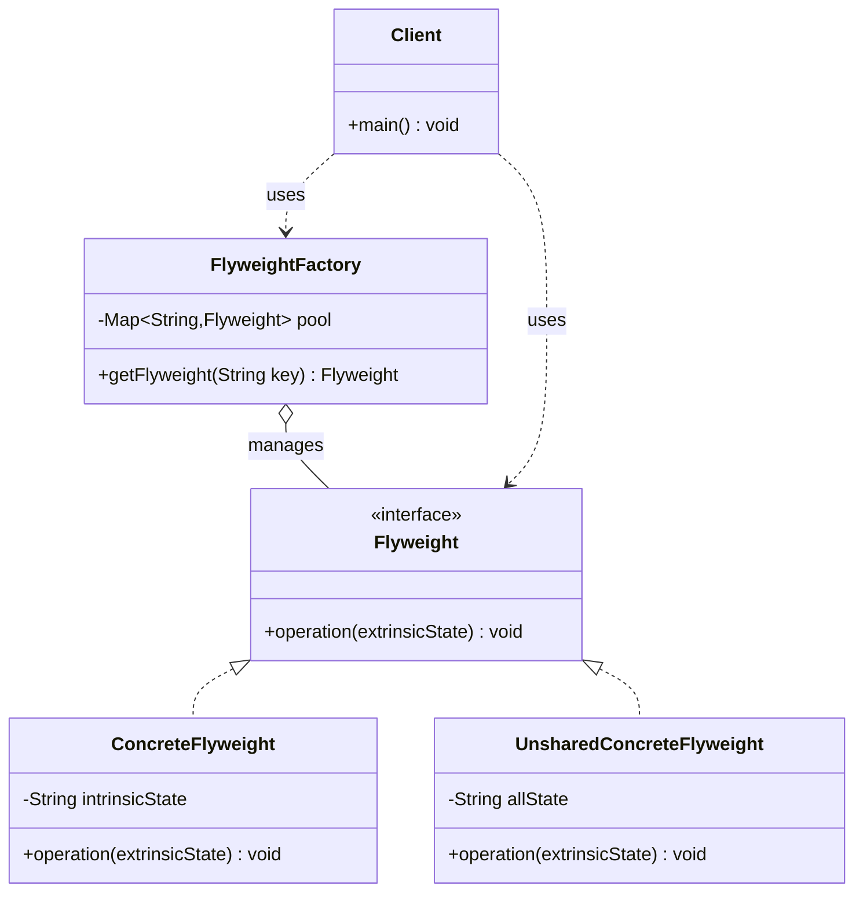

# 享元 Flyweight

> 运用共享技术有效地支持大量细粒度对象，减少内存使用。

## 意图

当你需要创建大量相似的对象时，如果这些对象中有很多相同的部分（内部状态），就可以将这些相同的部分提取出来共享，每个对象只保留自己独有的部分（外部状态）。

就像围棋棋盘——黑白两色棋子是共享的（内部状态），但每个棋子的位置不同（外部状态）。300 多个棋子实际只需要 2 个棋子对象。

## 适用场景

- 系统中存在大量相同或相似的对象时
- 对象的大部分状态可以外部化时
- 使用大量对象会导致内存开销过大时
- 需要缓冲池的场景（线程池、连接池、字符串常量池）

## UML 类图



## 代码示例

### ❌ 没有使用该模式的问题

```java
// 每棵树都创建独立对象，大量重复的属性浪费内存
public class Tree {
    private String type;       // 树种
    private String color;      // 颜色
    private String texture;    // 纹理
    private int x;             // 位置
    private int y;
    private int height;

    public Tree(String type, String color, String texture, int x, int y, int height) {
        this.type = type;
        this.color = color;
        this.texture = texture;
        this.x = x;
        this.y = y;
        this.height = height;
    }
}

// 创建 10000 棵树，其中大量树种和颜色相同，内存浪费严重
List<Tree> forest = new ArrayList<>();
for (int i = 0; i < 10000; i++) {
    forest.add(new Tree("松树", "深绿", "粗糙", x, y, height));
    // 每棵树都存储了相同的 type、color、texture
}
```

### ✅ 使用该模式后的改进

```java
// 享元接口
public interface TreeFlyweight {
    void display(int x, int y, int height);
}

// 具体享元：共享内部状态
public class TreeType implements TreeFlyweight {
    private final String type;
    private final String color;
    private final String texture;

    public TreeType(String type, String color, String texture) {
        this.type = type;
        this.color = color;
        this.texture = texture;
    }

    @Override
    public void display(int x, int y, int height) {
        System.out.println(type + " (颜色:" + color + ", 纹理:" + texture
            + ") 位置:(" + x + "," + y + ") 高度:" + height);
    }
}

// 享元工厂
public class TreeFactory {
    private static final Map<String, TreeFlyweight> treePool = new HashMap<>();

    public static TreeFlyweight getTreeType(String type, String color, String texture) {
        String key = type + ":" + color + ":" + texture;
        return treePool.computeIfAbsent(key,
            k -> new TreeType(type, color, texture));
    }

    public static int getPoolSize() {
        return treePool.size();
    }
}

// 使用
public class Forest {
    private List<int[]> trees = new ArrayList<>(); // x, y, height

    public void plantTree(String type, String color, String texture,
                          int x, int y, int height) {
        TreeFlyweight treeType = TreeFactory.getTreeType(type, color, texture);
        trees.add(new int[]{x, y, height});
    }

    public void display() {
        // 实际使用时需要外部状态和内部状态结合
    }
}

// 10000棵树只有几种TreeType对象，大幅减少内存占用
```

### Spring 中的应用

Spring 中的各种池技术都是享元模式的应用：

```java
// 1. String 常量池（JVM 层面的享元）
String s1 = "hello";
String s2 = "hello";
System.out.println(s1 == s2); // true，共享同一个对象

// 2. Integer 缓存（-128 到 127）
Integer a = 127;
Integer b = 127;
System.out.println(a == b); // true

// 3. Spring 中的连接池（HikariCP）
// 数据库连接被多个请求共享使用
@Bean
public DataSource dataSource() {
    HikariConfig config = new HikariConfig();
    config.setJdbcUrl("jdbc:mysql://localhost:3306/mydb");
    config.setMaximumPoolSize(20); // 最多 20 个连接对象被共享
    return new HikariDataSource(config);
}

// 4. 线程池（ThreadPoolExecutor）
// 线程对象被复用，执行不同的任务
```

## 优缺点

| 优点 | 缺点 |
|------|------|
| 大幅减少内存占用，提升性能 | 需要区分内部状态和外部状态，增加设计复杂度 |
| 共享的对象越多，节省的内存越多 | 外部状态需要由客户端管理，增加了客户端的复杂度 |
| 集中管理共享对象，方便统一控制 | 使系统逻辑变得更复杂 |
| 适合处理海量对象的场景 | 读取外部状态可能带来运行时间损耗 |

## 面试追问

**Q1: 享元模式的内部状态和外部状态如何区分？**

A: 内部状态（Intrinsic State）是对象共享的部分，不随环境变化，存储在享元对象内部。外部状态（Extrinsic State）是对象独有的部分，随环境变化，由客户端在使用时传入。判断标准：如果多个对象可以共享某个属性值，它就是内部状态；否则是外部状态。

**Q2: Java 中的 String 常量池是享元模式吗？**

A: 是的。String 常量池是 JVM 实现的享元模式。字符串字面量和 `String.intern()` 的结果会被放入常量池，相同内容的字符串共享同一个对象。注意 Java 7 之后常量池从永久代移到了堆中，`intern()` 的行为也有变化。

**Q3: 享元模式和单例模式的区别？**

A: 单例模式保证一个类只有一个实例。享元模式可以有多个实例，但通过共享相同内部状态来减少总数。单例关注"唯一性"，享元关注"共享性"。单例通常只有一个对象，享元通常有一个对象池。

## 相关模式

- **单例模式**：单例是享元的特例（池中只有一个对象）
- **组合模式**：享元通常与组合模式结合使用，共享组合结构中的叶子节点
- **工厂方法模式**：享元工厂用工厂方法来创建和管理享元对象
- **代理模式**：代理可以管理享元对象的访问
