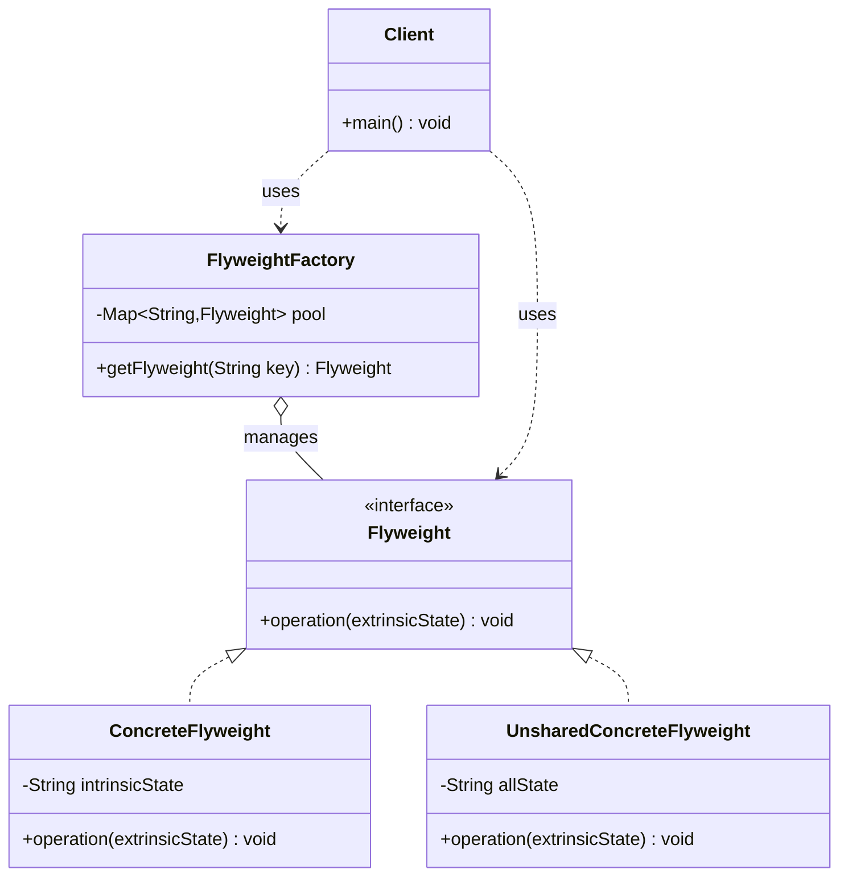

# 享元 Flyweight

> 运用共享技术有效地支持大量细粒度对象，减少内存使用。

## 意图

当你需要创建大量相似的对象时，如果这些对象中有很多相同的部分（内部状态），就可以将这些相同的部分提取出来共享，每个对象只保留自己独有的部分（外部状态）。

通俗点说，就像围棋棋盘——黑白两色棋子是共享的（内部状态），但每个棋子的位置不同（外部状态）。300 多个棋子实际只需要 2 个棋子对象。再比如字体渲染——一篇文章中 "A" 出现了 100 次，但字体渲染器只创建一个 "A" 的字形对象，100 个位置引用同一个字形。

一句话总结：**把相同的部分抽出来共享，不同的部分由外部传入。**

## 适用场景

- 系统中存在大量相同或相似的对象时（游戏中的子弹、粒子效果）
- 对象的大部分状态可以外部化时（颜色、纹理等不变属性可以共享）
- 使用大量对象会导致内存开销过大时
- 需要缓冲池的场景（线程池、连接池、字符串常量池）
- 游戏开发中的场景对象（树木、建筑、地形块）

## UML 类图



## 代码示例

### ❌ 没有使用该模式的问题

假设你在做一个森林模拟系统，需要渲染上万棵树，每棵树都是独立对象：

```java
/**
 * 没有享元模式的树——每棵树都是独立对象
 * 问题：树种、颜色、纹理这些不变属性被重复存储了上万次
 */
public class Tree {
    private String type;       // 树种——大量树都是"松树"
    private String color;      // 颜色——同一种树颜色相同
    private String texture;    // 纹理——同一种树纹理相同
    private String model;      // 3D 模型路径——同一种树模型相同
    private int x;             // 位置——每棵树不同
    private int y;             // 位置——每棵树不同
    private int height;        // 高度——每棵树不同

    public Tree(String type, String color, String texture,
                String model, int x, int y, int height) {
        this.type = type;
        this.color = color;
        this.texture = texture;
        this.model = model;
        this.x = x;
        this.y = y;
        this.height = height;
    }
}

public class Forest {
    private List<Tree> trees = new ArrayList<>();

    public void plantTree(String type, String color, String texture,
                          String model, int x, int y, int height) {
        trees.add(new Tree(type, color, texture, model, x, y, height));
    }

    public void display() {
        for (Tree tree : trees) {
            System.out.println(tree.getType() + " 在 (" + tree.getX()
                + "," + tree.getY() + ") 高度:" + tree.getHeight());
        }
    }

    public int getMemoryUsage() {
        // 假设每个 Tree 对象占 200 字节
        return trees.size() * 200;
    }
}

public class Client {
    public static void main(String[] args) {
        Forest forest = new Forest();

        // 种 10000 棵树，其中大部分属性是重复的
        String[][] treeTypes = {
            {"松树", "深绿", "粗糙", "models/pine.obj"},
            {"橡树", "浅绿", "光滑", "models/oak.obj"},
            {"枫树", "红色", "细腻", "models/maple.obj"}
        };

        for (int i = 0; i < 10000; i++) {
            String[] type = treeTypes[i % 3]; // 只有 3 种树
            int x = (int) (Math.random() * 1000);
            int y = (int) (Math.random() * 1000);
            int height = 50 + (int) (Math.random() * 100);
            forest.plantTree(type[0], type[1], type[2], type[3], x, y, height);
        }

        System.out.println("内存使用: " + forest.getMemoryUsage() + " 字节");
        // 10000 * 200 = 2,000,000 字节 ≈ 2MB
        // 但实际上只有 3 种不同的树型，内部状态完全可以共享！
    }
}
```

运行结果：

```
内存使用: 2000000 字节
```

:::danger 问题分析
10000 棵树，只有 3 种类型，但 type、color、texture、model 这些不变属性被存了 10000 份。实际只需要 3 个共享对象存储这些不变属性，每棵树只需要记住自己的位置和高度。内存浪费了 99.97%！
:::

### ✅ 使用该模式后的改进

把不变的内部状态提取为享元对象共享，可变的外部状态由客户端管理：

```java
/**
 * 享元接口——定义操作，接收外部状态作为参数
 * 内部状态（树种、颜色、纹理）由享元对象自己持有
 * 外部状态（位置、高度）由调用方传入
 */
public interface TreeFlyweight {
    /** 渲染树——外部状态通过参数传入 */
    void render(int x, int y, int height);
}

/**
 * 具体享元——存储不变的内部状态
 * 所有相同类型的树共享同一个 TreeType 对象
 */
public class TreeType implements TreeFlyweight {
    private final String type;    // 树种——不变
    private final String color;   // 颜色——不变
    private final String texture; // 纹理——不变
    private final String model;   // 3D 模型路径——不变

    public TreeType(String type, String color, String texture, String model) {
        this.type = type;
        this.color = color;
        this.texture = texture;
        this.model = model;
    }

    @Override
    public void render(int x, int y, int height) {
        // 渲染时结合内部状态和外部状态
        System.out.println("渲染 " + type + " (颜色:" + color
            + ", 纹理:" + texture + ", 模型:" + model
            + ") 位置:(" + x + "," + y + ") 高度:" + height);
    }

    public String getType() { return type; }
}
```

享元工厂——管理享元对象的创建和共享：

```java
/**
 * 享元工厂——享元对象池
 * 负责创建和管理享元对象，确保相同 key 的享元只创建一次
 * 这里用 HashMap 做缓存，key 由内部状态生成
 */
public class TreeFactory {
    // 享元池——key 是内部状态的组合，value 是享元对象
    private static final Map<String, TreeFlyweight> pool = new HashMap<>();

    /**
     * 获取享元对象——如果池中已存在则直接返回，否则创建新的
     */
    public static TreeFlyweight getTreeType(String type, String color,
                                            String texture, String model) {
        // 用内部状态组合生成唯一 key
        String key = type + "|" + color + "|" + texture + "|" + model;

        // computeIfAbsent 是原子操作，线程安全
        // 如果 key 不存在，则创建新对象并放入池中
        // 如果 key 已存在，直接返回已有对象
        return pool.computeIfAbsent(key,
            k -> new TreeType(type, color, texture, model));
    }

    /** 获取池中享元对象的数量 */
    public static int getPoolSize() {
        return pool.size();
    }

    /** 清空享元池 */
    public static void clearPool() {
        pool.clear();
    }
}
```

客户端——外部状态由客户端单独管理：

```java
/**
 * 树的位置和高度是外部状态——每棵树不同，不能共享
 * 单独用一个类来管理
 */
public class TreeLocation {
    private final int x;
    private final int y;
    private final int height;
    private final TreeFlyweight treeType; // 引用共享的享元对象

    public TreeLocation(int x, int y, int height, TreeFlyweight treeType) {
        this.x = x;
        this.y = y;
        this.height = height;
        this.treeType = treeType; // 指向共享的享元，不存储内部状态的副本
    }

    /** 渲染——将外部状态传给享元对象 */
    public void render() {
        treeType.render(x, y, height); // 享元对象结合内部状态和外部状态完成渲染
    }
}

/**
 * 森林——管理所有树的位置
 * 不直接存储 Tree 对象，而是存储轻量的 TreeLocation
 */
public class Forest {
    private final List<TreeLocation> trees = new ArrayList<>();

    public void plantTree(String type, String color, String texture,
                          String model, int x, int y, int height) {
        // 从工厂获取共享的享元对象
        TreeFlyweight treeType = TreeFactory.getTreeType(type, color, texture, model);
        // 只存储外部状态（位置、高度）和享元引用
        trees.add(new TreeLocation(x, y, height, treeType));
    }

    public void render() {
        for (TreeLocation tree : trees) {
            tree.render(); // 每棵树调用享元的 render 方法
        }
    }

    /**
     * 估算内存使用
     * TreeLocation 大约 32 字节（3 个 int + 1 个引用）
     * TreeType 大约 200 字节（4 个 String 引用 + String 对象本身）
     * 但 TreeType 是共享的，只创建少量实例
     */
    public int getMemoryUsage() {
        int treeLocationSize = trees.size() * 32; // 每棵树只存外部状态
        int treeTypeSize = TreeFactory.getPoolSize() * 200; // 共享的享元对象
        return treeLocationSize + treeTypeSize;
    }
}
```

客户端使用：

```java
public class Client {
    public static void main(String[] args) {
        Forest forest = new Forest();

        // 同样的 10000 棵树
        String[][] treeTypes = {
            {"松树", "深绿", "粗糙", "models/pine.obj"},
            {"橡树", "浅绿", "光滑", "models/oak.obj"},
            {"枫树", "红色", "细腻", "models/maple.obj"}
        };

        for (int i = 0; i < 10000; i++) {
            String[] type = treeTypes[i % 3];
            int x = (int) (Math.random() * 1000);
            int y = (int) (Math.random() * 1000);
            int height = 50 + (int) (Math.random() * 100);
            forest.plantTree(type[0], type[1], type[2], type[3], x, y, height);
        }

        // 渲染前 5 棵树
        System.out.println("===== 渲染前 5 棵树 =====");
        // 直接调用 forest.render() 会输出 10000 行，这里只展示效果

        System.out.println("享元池大小: " + TreeFactory.getPoolSize()); // 3
        System.out.println("内存使用（优化后）: " + forest.getMemoryUsage() + " 字节");
        System.out.println("内存使用（优化前）: " + (10000 * 200) + " 字节");
        System.out.println("节省内存: " + (10000 * 200 - forest.getMemoryUsage()) + " 字节");
    }
}
```

### 变体与扩展

#### 线程安全的享元工厂

上面的 `TreeFactory` 用了 `computeIfAbsent`，在单线程下没问题。但在高并发场景下，如果享元创建开销大，可能需要双重检查锁：

```java
/**
 * 线程安全的享元工厂——使用双重检查锁
 * 注意：HashMap 在并发下不安全，这里用 ConcurrentHashMap
 */
public class ThreadSafeTreeFactory {
    private static final ConcurrentHashMap<String, TreeFlyweight> pool =
        new ConcurrentHashMap<>();

    public static TreeFlyweight getTreeType(String type, String color,
                                            String texture, String model) {
        String key = type + "|" + color + "|" + texture + "|" + model;

        // computeIfAbsent 在 ConcurrentHashMap 中是线程安全的
        // 但创建过程如果很耗时，可能需要更精细的控制
        return pool.computeIfAbsent(key, k -> {
            System.out.println("创建新的享元对象: " + type);
            return new TreeType(type, color, texture, model);
        });
    }
}
```

#### 带引用计数的享元

有时候需要知道一个享元被多少个对象引用，引用为 0 时可以回收：

```java
/**
 * 带引用计数的享元工厂
 * 可以追踪每个享元被引用的次数
 */
public class ReferenceCountingTreeFactory {
    private static final Map<String, RefCountedTree> pool = new HashMap<>();

    /** 获取享元，引用计数 +1 */
    public static RefCountedTree getTreeType(String type, String color,
                                             String texture, String model) {
        String key = type + "|" + color + "|" + texture + "|" + model;
        return pool.computeIfAbsent(key, k -> new RefCountedTree(type, color, texture, model))
                   .retain(); // 引用计数 +1
    }

    /** 释放享元，引用计数 -1 */
    public static void releaseTreeType(String type, String color,
                                       String texture, String model) {
        String key = type + "|" + color + "|" + texture + "|" + model;
        RefCountedTree tree = pool.get(key);
        if (tree != null && tree.release()) { // 引用计数 -1，返回是否归零
            pool.remove(key); // 引用为 0，从池中移除
            System.out.println("回收享元: " + type);
        }
    }
}

/** 带引用计数的享元对象 */
class RefCountedTree extends TreeType {
    private int refCount = 0;

    RefCountedTree(String type, String color, String texture, String model) {
        super(type, color, texture, model);
    }

    RefCountedTree retain() { refCount++; return this; }
    boolean release() { refCount--; return refCount <= 0; }
    int getRefCount() { return refCount; }
}
```

### 运行结果

```
===== 渲染前 5 棵树 =====
享元池大小: 3
内存使用（优化后）: 320600 字节
内存使用（优化前）: 2000000 字节
节省内存: 1679400 字节
```

:::tip 节省了多少？
原来 10000 棵树 × 200 字节 = 2,000,000 字节
优化后 10000 × 32 + 3 × 200 = 320,600 字节
节省了约 **84%** 的内存！树越多、类型越少，节省越明显。
:::

## Spring/JDK 中的应用

### 1. JVM 的 String 常量池

String 常量池是 JVM 层面实现的享元模式，相同内容的字符串共享同一个对象：

```java
public class StringPoolDemo {
    public static void main(String[] args) {
        // 字面量直接进入常量池
        String s1 = "hello";
        String s2 = "hello";
        System.out.println(s1 == s2); // true！共享同一个对象

        // new String() 会在堆上创建新对象
        String s3 = new String("hello");
        System.out.println(s1 == s3); // false！不是同一个对象

        // intern() 方法将字符串放入常量池
        String s4 = s3.intern();
        System.out.println(s1 == s4); // true！intern 返回常量池中的引用

        // 常量池在编译期确定
        String s5 = "hel" + "lo";     // 编译期优化为 "hello"
        System.out.println(s1 == s5); // true！

        String part = "lo";
        String s6 = "hel" + part;     // 运行期拼接，不会放入常量池
        System.out.println(s1 == s6); // false！

        // 字符串拼接优化：JDK 9+ 用 invokedynamic
        // 但常量池的享元机制始终存在
    }
}
```

:::warning String 常量池的坑
1. `new String("hello")` 会创建两个对象：常量池中的 "hello" 和堆上的新对象
2. 字符串拼接在循环中会产生大量临时对象，用 `StringBuilder` 替代
3. `String.intern()` 在 JDK 7 之后将字符串复制到堆中的常量池（之前是永久代）
:::

### 2. Integer 缓存池

`Integer` 类对 -128 到 127 的值做了缓存，这个范围内的 `Integer` 对象是共享的：

```java
public class IntegerCacheDemo {
    public static void main(String[] args) {
        // 自动装箱，-128 到 127 范围内使用缓存对象
        Integer a = 127;
        Integer b = 127;
        System.out.println(a == b); // true！缓存命中

        Integer c = 128;
        Integer d = 128;
        System.out.println(c == d); // false！超出缓存范围，创建了新对象

        Integer e = -128;
        Integer f = -128;
        System.out.println(e == f); // true！-128 也在缓存范围内

        // 所以比较 Integer 一定要用 equals()，不要用 ==
        System.out.println(c.equals(d)); // true
    }
}

// Integer 源码中的缓存实现
// private static class IntegerCache {
//     static final int low = -128;
//     static final int high = 127;
//     static final Integer[] cache;  // 缓存数组
//     static {
//         for (int i = low; i <= high; i++) {
//             cache[i + (-low)] = new Integer(i); // 预创建 256 个对象
//         }
//     }
// }
```

### 3. Spring 中的连接池（HikariCP）

数据库连接池本质上是享元模式——连接对象被多个请求共享使用：

```java
@Configuration
public class DataSourceConfig {

    @Bean
    public DataSource dataSource() {
        HikariConfig config = new HikariConfig();
        config.setJdbcUrl("jdbc:mysql://localhost:3306/mydb");
        config.setUsername("root");
        config.setPassword("password");
        config.setMaximumPoolSize(20); // 最多 20 个连接对象被共享
        config.setMinimumIdle(5);      // 最少保持 5 个空闲连接

        // 享元池：
        // - 20 个 Connection 对象 = 享元
        // - 连接的 JDBC URL、用户名、密码 = 内部状态（共享）
        // - 每次使用时的 SQL 语句、事务状态 = 外部状态（不共享）
        return new HikariDataSource(config);
    }
}
```

### 4. Spring 中的线程池

线程池也是享元模式的典型应用——线程对象被复用执行不同的任务：

```java
@Configuration
public class ThreadPoolConfig {

    @Bean
    public ThreadPoolTaskExecutor taskExecutor() {
        ThreadPoolTaskExecutor executor = new ThreadPoolTaskExecutor();
        executor.setCorePoolSize(10);   // 核心线程数——常驻的共享线程
        executor.setMaxPoolSize(50);    // 最大线程数
        executor.setQueueCapacity(200); // 任务队列

        // 享元池：
        // - Thread 对象 = 享元（共享）
        // - 线程的栈大小、优先级、守护状态 = 内部状态
        // - 每次执行的 Runnable 任务 = 外部状态
        return executor;
    }
}
```

## 优缺点

| 优点 | 详细说明 | 缺点 | 详细说明 |
|------|---------|------|---------|
| 大幅减少内存 | 相同内部状态只存一份 | 增加设计复杂度 | 需要区分内部状态和外部状态 |
| 提升性能 | 减少 GC 压力 | 客户端更复杂 | 客户端需要管理外部状态 |
| 集中管理 | 享元工厂统一创建和回收 | 线程安全 | 并发场景需要考虑线程安全 |
| 适合海量对象 | 对象越多，效果越明显 | 读取外部状态有开销 | 每次操作都要传入外部状态 |
| 灵活控制 | 可以配合引用计数实现自动回收 | 调试困难 | 共享对象的状态变化会影响所有引用者 |

:::tip 享元模式的本质
享元模式的核心思想是 **"共享不变，分离变化"**。把对象中不变的部分（内部状态）提取出来共享，变化的部分（外部状态）由客户端管理。当你发现系统中存在大量重复对象时，就该考虑享元模式了。
:::

## 面试追问

### Q1: 享元模式的内部状态和外部状态如何区分？

**A:** 这道题考的是对享元模式核心概念的理解。

**内部状态（Intrinsic State）：**
- 存储在享元对象内部
- 不随环境变化，所有享元客户端共享
- 可以作为享元的标识（key）
- 例子：棋子的颜色、字体的字形、数据库连接的 JDBC URL

**外部状态（Extrinsic State）：**
- 存储在享元对象外部，由客户端管理
- 随环境变化，每个客户端不同
- 每次操作时通过参数传入
- 例子：棋子的位置、文本的内容、SQL 语句

**判断标准：**
- 如果多个对象可以共享某个属性值，不会产生冲突 → 内部状态
- 如果每个对象需要不同的值 → 外部状态
- 如果一个属性的值会影响其他对象的显示/行为 → 不能作为内部状态

### Q2: Integer 缓存池的范围可以修改吗？为什么要设计这个缓存？

**A:**

**可以修改范围**，通过 JVM 参数：
```bash
-XX:AutoBoxCacheMax=1000  # 将缓存上限改为 1000
-XX:AutoBoxCacheMax=20000 # 甚至改到 20000
```

**为什么要设计这个缓存：**

1. **性能优化**：-128 到 127 是最常用的整数范围，缓存这些值可以避免频繁创建对象
2. **节省内存**：`Integer` 对象占 16 字节，而 `int` 只占 4 字节。缓存后大量小整数可以复用
3. **实际需求**：统计数据表明，大部分程序中使用的整数都在这个范围内

:::warning 面试经典坑题
```java
Integer a = 100, b = 100;
System.out.println(a == b);   // true，缓存范围内

Integer c = 200, d = 200;
System.out.println(c == d);   // false！超出缓存范围

// 这道题经常在面试中出现，记住结论就好
```
:::

### Q3: 享元模式和单例模式的区别？

**A:** 这两个模式都涉及对象共享，但粒度不同：

| 维度 | 单例模式 | 享元模式 |
|------|---------|---------|
| 对象数量 | 全局唯一，只有 1 个实例 | 可以有多个实例，但通过共享减少总数 |
| 目的 | 保证全局只有一个访问点 | 减少内存使用 |
| 获取方式 | 全局访问点（静态方法） | 享元工厂（通过 key 获取） |
| 状态 | 通常是无状态的 | 有内部状态（共享）和外部状态（不共享） |
| 典型例子 | Spring Bean（默认单例） | String 常量池、Integer 缓存 |
| 设计粒度 | 类级别 | 对象级别 |

简单记：**单例是"全局唯一"，享元是"同类共享"**。单例是享元的特例——享元池中只有一个对象。

### Q4: 享元模式在并发场景下有什么需要注意的？

**A:** 享元模式在并发场景下有几个关键问题：

1. **享元对象的线程安全**：如果享元对象有可变状态，多线程同时访问可能出问题。解决方案：享元对象应该是不可变的（Immutable）
   ```java
   // 好的实践：享元对象的所有字段都是 final
   public final class TreeType implements TreeFlyweight {
       private final String type;    // final 保证不可变
       private final String color;   // 不会被修改，线程安全
       private final String texture;
   }
   ```

2. **享元工厂的线程安全**：`HashMap` 在并发写入时不安全，需要用 `ConcurrentHashMap`
   ```java
   private static final ConcurrentHashMap<String, TreeFlyweight> pool =
       new ConcurrentHashMap<>();
   ```

3. **外部状态的线程安全**：外部状态由客户端管理，需要客户端自己保证线程安全

4. **GC 友好**：享元对象长期存活，不会被 GC 回收。如果享元对象很大或很多，可能占用过多内存。考虑配合 WeakHashMap 或 SoftReference

## 相关模式

- **单例模式**：单例是享元的特例（池中只有一个对象）
- **组合模式**：享元通常与组合模式结合使用，共享组合结构中的叶子节点
- **工厂方法模式**：享元工厂用工厂方法来创建和管理享元对象
- **代理模式**：代理可以管理享元对象的访问
- **装饰器模式**：装饰器可以包装享元对象添加新功能
