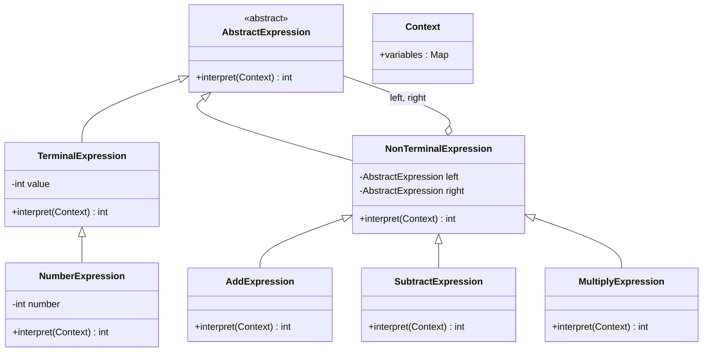

# 解释器 Interpreter

> 给定一种语言，定义它的语法表示，并定义一个解释器来解释这种语法。

## 意图

解释器模式将一种语言的语法规则表示为一棵抽象语法树（AST），然后通过解释器来遍历这棵树并执行对应的操作。每个语法规则对应一个类，语法规则的组合形成语法树。

就像计算器——它能理解 "1 + 2 * 3" 这样的表达式，将其解析成语法树，然后按照运算规则计算出结果。每个数字、运算符都是语法树上的一个节点。

## 适用场景

- 需要解析和执行某种简单语言或表达式时
- 语法规则相对简单且不频繁变化时
- 需要自定义 DSL（领域特定语言）时
- SQL 解析、正则表达式、规则引擎等场景

## UML 类图



## 代码示例

### ❌ 没有使用该模式的问题

```java
// 用 if-else 解析表达式，难以扩展
public class ExpressionParser {
    public int evaluate(String expression) {
        if (expression.contains("+")) {
            String[] parts = expression.split("\\+");
            return evaluate(parts[0]) + evaluate(parts[1]);
        } else if (expression.contains("-")) {
            String[] parts = expression.split("-");
            return evaluate(parts[0]) - evaluate(parts[1]);
        }
        // 不支持优先级、括号、变量等
        // 新增运算符？继续加 else if
        return Integer.parseInt(expression.trim());
    }
}
```

### ✅ 使用该模式后的改进

```java
// 抽象表达式
public interface Expression {
    int interpret();
}

// 终结符表达式：数字
public class NumberExpression implements Expression {
    private final int number;

    public NumberExpression(int number) { this.number = number; }

    @Override
    public int interpret() {
        return number;
    }
}

// 终结符表达式：变量
public class VariableExpression implements Expression {
    private final String name;

    public VariableExpression(String name) { this.name = name; }

    @Override
    public int interpret() {
        return Context.get(name);
    }
}

// 非终结符表达式：加法
public class AddExpression implements Expression {
    private final Expression left;
    private final Expression right;

    public AddExpression(Expression left, Expression right) {
        this.left = left;
        this.right = right;
    }

    @Override
    public int interpret() {
        return left.interpret() + right.interpret();
    }
}

// 非终结符表达式：乘法
public class MultiplyExpression implements Expression {
    private final Expression left;
    private final Expression right;

    public MultiplyExpression(Expression left, Expression right) {
        this.left = left;
        this.right = right;
    }

    @Override
    public int interpret() {
        return left.interpret() * right.interpret();
    }
}

// 上下文（存储变量值）
public class Context {
    private static final Map<String, Integer> variables = new HashMap<>();

    public static void put(String name, int value) {
        variables.put(name, value);
    }

    public static int get(String name) {
        return variables.getOrDefault(name, 0);
    }
}

// 解析器：将字符串解析为表达式树
public class ExpressionParser {
    public static Expression parse(String expression) {
        expression = expression.replaceAll("\\s+", "");
        return parseAddSub(expression);
    }

    private static Expression parseAddSub(String expr) {
        int index = findLastOperator(expr, '+', '-');
        if (index > 0) {
            char op = expr.charAt(index);
            Expression left = parseAddSub(expr.substring(0, index));
            Expression right = parseMulDiv(expr.substring(index + 1));
            return op == '+' ? new AddExpression(left, right)
                             : new SubtractExpression(left, right);
        }
        return parseMulDiv(expr);
    }

    private static Expression parseMulDiv(String expr) {
        int index = findLastOperator(expr, '*', '/');
        if (index > 0) {
            Expression left = parseMulDiv(expr.substring(0, index));
            Expression right = parseNumber(expr.substring(index + 1));
            return new MultiplyExpression(left, right);
        }
        return parseNumber(expr);
    }

    private static Expression parseNumber(String expr) {
        try {
            return new NumberExpression(Integer.parseInt(expr));
        } catch (NumberFormatException e) {
            return new VariableExpression(expr);
        }
    }

    private static int findLastOperator(String expr, char... ops) {
        String opSet = new String(ops);
        for (int i = expr.length() - 1; i > 0; i--) {
            if (opSet.indexOf(expr.charAt(i)) >= 0) return i;
        }
        return -1;
    }
}

// 使用
public class Main {
    public static void main(String[] args) {
        // 解析 "3 + 5 * 2"
        Expression expr = ExpressionParser.parse("3 + 5 * 2");
        System.out.println(expr.interpret()); // 13（正确处理优先级）

        // 使用变量
        Context.put("x", 10);
        Expression varExpr = ExpressionParser.parse("x + 5");
        System.out.println(varExpr.interpret()); // 15
    }
}
```

### Spring 中的应用

Spring Expression Language (SpEL) 就是解释器模式的应用：

```java
// SpEL 表达式求值
ExpressionParser parser = new SpelExpressionParser();
Expression expression = parser.parseExpression("'Hello ' + #name");

StandardEvaluationContext context = new StandardEvaluationContext();
context.setVariable("name", "World");
String result = expression.getValue(context, String.class);
// result = "Hello World"

// SpEL 支持复杂表达式
// - 属性访问：#user.name
// - 方法调用：#user.getName()
// - 三元运算：#score > 60 ? '及格' : '不及格'
// - 正则匹配：#email matches '^[\\w.-]+@[\\w.-]+\\.\\w+$'
// - 集合选择：#users.?[age > 18]

// Spring Security 的 @PreAuthorize 也使用 SpEL
@PreAuthorize("#userId == authentication.principal.id")
public User getUser(Long userId) { ... }
```

## 优缺点

| 优点 | 缺点 |
|------|------|
| 语法规则的扩展性好，新增规则只需新增表达式类 | 复杂语法难以维护，类数量爆炸 |
| 语法规则的表示清晰，易于理解和修改 | 对于复杂语法，解释器性能较差 |
| 可以自定义 DSL，灵活度高 | 增加了系统的抽象层和复杂度 |
| 容易实现语法树的遍历和操作 | 通常需要配合语法分析器使用 |

## 面试追问

**Q1: 解释器模式适合什么场景？不适合什么场景？**

A: 适合：语法规则简单、需要自定义 DSL、表达式求值、规则引擎等。不适合：语法规则复杂（用编译器生成工具如 ANTLR 更好）、性能要求高（解释器模式通常比编译执行慢）、语法规则频繁变化（修改抽象语法树代价大）。

**Q2: 解释器模式和策略模式有什么关系？**

A: 解释器模式中的每个表达式类都是一个策略——它们实现了相同的接口（interpret），但解释方式不同。解释器模式通过组合表达式形成语法树，策略模式通常是平级替换。解释器是"递归组合的策略"。

**Q3: 如何提高解释器模式的性能？**

A: 1) 缓存解析结果，避免重复解析同一表达式；2) 预编译表达式为字节码（如 SpEL 会编译成字节码）；3) 对于频繁执行的表达式，考虑用编译器生成工具（ANTLR + visitor 模式）替代纯解释器；4) 使用 Flyweight 模式共享相同的终结符表达式对象。

## 相关模式

- **组合模式**：语法树就是组合模式的应用
- **访问者模式**：访问者可以遍历和操作语法树
- **迭代器模式**：遍历语法树节点
- **工厂方法模式**：用工厂创建语法树节点
- **装饰器模式**：装饰器可以包装表达式节点添加新功能
