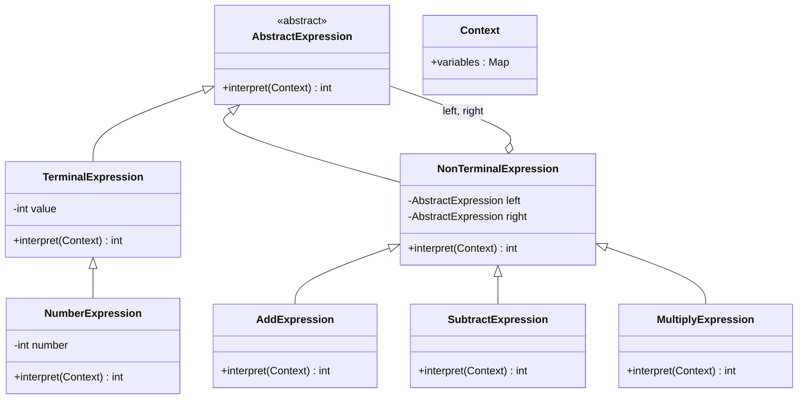

# 解释器 Interpreter

> 给定一种语言，定义它的语法表示，并定义一个解释器来解释这种语法。

## 意图

解释器模式将一种语言的语法规则表示为一棵抽象语法树（AST），然后通过解释器来遍历这棵树并执行对应的操作。每个语法规则对应一个类，语法规则的组合形成语法树。

通俗点说，就像计算器——它能理解 "1 + 2 * 3" 这样的表达式，将其解析成语法树，然后按照运算规则计算出结果。每个数字、运算符都是语法树上的一个节点。再比如 SQL 解析器——你写的 `SELECT name FROM user WHERE age > 18` 会被解析成一棵语法树，然后遍历这棵树来执行查询。

一句话总结：**把语法规则拆成一个个小类，通过组合这些小类来解释复杂的表达式。**

## 适用场景

- 需要解析和执行某种简单语言或表达式时
- 语法规则相对简单且不频繁变化时
- 需要自定义 DSL（领域特定语言）时
- SQL 解析、正则表达式、规则引擎等场景
- 表达式求值、条件判断、配置文件解析

## UML 类图



## 代码示例

### ❌ 没有使用该模式的问题

用一堆 if-else 硬编码解析逻辑，难以扩展和维护：

```java
/**
 * 没有解释器模式的表达式求值器
 * 问题：不支持运算优先级、不支持括号、不支持变量
 * 新增运算符？继续加 else if，代码越来越烂
 */
public class BadCalculator {
    public int evaluate(String expression) {
        expression = expression.replaceAll("\\s+", ""); // 去掉空格

        // 最简单的解析——从左到右，不支持优先级
        if (expression.contains("+")) {
            int idx = expression.indexOf('+');
            String left = expression.substring(0, idx);
            String right = expression.substring(idx + 1);
            return evaluate(left) + evaluate(right);
        } else if (expression.contains("-")) {
            int idx = expression.indexOf('-');
            String left = expression.substring(0, idx);
            String right = expression.substring(idx + 1);
            return evaluate(left) - evaluate(right);
        } else if (expression.contains("*")) {
            int idx = expression.indexOf('*');
            String left = expression.substring(0, idx);
            String right = expression.substring(idx + 1);
            return evaluate(left) * evaluate(right);
        } else if (expression.contains("/")) {
            int idx = expression.indexOf('/');
            String left = expression.substring(0, idx);
            String right = expression.substring(idx + 1);
            return evaluate(left) / evaluate(right);
        }

        // 无法处理的情况
        return Integer.parseInt(expression.trim());
    }
}

public class Client {
    public static void main(String[] args) {
        BadCalculator calc = new BadCalculator();

        // 简单的加法——能工作
        System.out.println("1 + 2 = " + calc.evaluate("1 + 2")); // 3

        // 但不支持优先级！3 + 5 * 2 应该是 13，但结果是 16
        System.out.println("3 + 5 * 2 = " + calc.evaluate("3 + 5 * 2")); // 16 ❌

        // 不支持括号
        // 不支持变量
        // 不支持负数
        // 新增取模运算？再加一个 else if...
    }
}
```

运行结果：

```
1 + 2 = 3
3 + 5 * 2 = 16
```

:::danger 核心问题
1. 不支持运算优先级——`3 + 5 * 2` 算出来是 16 而不是 13
2. 不支持括号——无法改变运算顺序
3. 不支持变量——无法做动态计算
4. 扩展性差——每加一个运算符就要加一个 else if 分支
5. 无法复用——解析逻辑和计算逻辑耦合在一起
:::

### ✅ 使用该模式后的改进

把每种语法规则拆成独立的表达式类，组合成语法树：

```java
/**
 * 抽象表达式——所有表达式节点的基类
 * 定义统一的解释接口
 */
public interface Expression {
    /** 解释表达式，返回计算结果 */
    int interpret();
}
```

终结符表达式——数字和变量：

```java
/**
 * 数字表达式——终结符表达式
 * 语法树中的叶子节点，没有子节点
 * 直接返回数字值
 */
public class NumberExpression implements Expression {
    private final int number; // 存储的数字值

    public NumberExpression(int number) {
        this.number = number;
    }

    @Override
    public int interpret() {
        return number; // 终结符直接返回值
    }

    @Override
    public String toString() {
        return String.valueOf(number);
    }
}

/**
 * 变量表达式——终结符表达式
 * 从上下文中获取变量值
 */
public class VariableExpression implements Expression {
    private final String name; // 变量名

    public VariableExpression(String name) {
        this.name = name;
    }

    @Override
    public int interpret() {
        // 从上下文中获取变量值
        return Context.getInstance().get(name);
    }

    @Override
    public String toString() {
        return name;
    }
}
```

非终结符表达式——运算符：

```java
/**
 * 加法表达式——非终结符表达式
 * 有两个子表达式：左操作数和右操作数
 * 解释时递归计算左右子表达式，然后相加
 */
public class AddExpression implements Expression {
    private final Expression left;  // 左操作数
    private final Expression right; // 右操作数

    public AddExpression(Expression left, Expression right) {
        this.left = left;
        this.right = right;
    }

    @Override
    public int interpret() {
        return left.interpret() + right.interpret(); // 递归解释并相加
    }

    @Override
    public String toString() {
        return "(" + left + " + " + right + ")";
    }
}

/**
 * 减法表达式
 */
public class SubtractExpression implements Expression {
    private final Expression left;
    private final Expression right;

    public SubtractExpression(Expression left, Expression right) {
        this.left = left;
        this.right = right;
    }

    @Override
    public int interpret() {
        return left.interpret() - right.interpret();
    }

    @Override
    public String toString() {
        return "(" + left + " - " + right + ")";
    }
}

/**
 * 乘法表达式
 */
public class MultiplyExpression implements Expression {
    private final Expression left;
    private final Expression right;

    public MultiplyExpression(Expression left, Expression right) {
        this.left = left;
        this.right = right;
    }

    @Override
    public int interpret() {
        return left.interpret() * right.interpret();
    }

    @Override
    public String toString() {
        return "(" + left + " * " + right + ")";
    }
}

/**
 * 除法表达式
 */
public class DivideExpression implements Expression {
    private final Expression left;
    private final Expression right;

    public DivideExpression(Expression left, Expression right) {
        this.left = left;
        this.right = right;
    }

    @Override
    public int interpret() {
        int denominator = right.interpret();
        if (denominator == 0) {
            throw new ArithmeticException("除数不能为零！");
        }
        return left.interpret() / denominator;
    }

    @Override
    public String toString() {
        return "(" + left + " / " + right + ")";
    }
}
```

上下文——存储变量值：

```java
/**
 * 上下文——存储变量名到值的映射
 * 变量表达式从这里获取值
 */
public class Context {
    private static final Context INSTANCE = new Context(); // 单例
    private final Map<String, Integer> variables = new HashMap<>();

    private Context() {} // 私有构造，保证单例

    public static Context getInstance() {
        return INSTANCE;
    }

    /** 设置变量值 */
    public void put(String name, int value) {
        variables.put(name, value);
    }

    /** 获取变量值，不存在则返回 0 */
    public int get(String name) {
        return variables.getOrDefault(name, 0);
    }

    /** 清空所有变量 */
    public void clear() {
        variables.clear();
    }
}
```

表达式解析器——将字符串转换为语法树：

```java
/**
 * 表达式解析器——将字符串解析为抽象语法树（AST）
 * 支持 +, -, *, / 四则运算和变量
 * 运算优先级：先乘除后加减（通过递归下降解析实现）
 */
public class ExpressionParser {

    /**
     * 解析入口——将字符串表达式解析为语法树
     * 解析策略：递归下降解析（Recursive Descent Parsing）
     * - 先解析加减法（低优先级）
     * - 加减法内部解析乘除法（高优先级）
     * - 乘除法内部解析数字/变量（终结符）
     */
    public static Expression parse(String expression) {
        // 预处理：去掉所有空格
        expression = expression.replaceAll("\\s+", "");
        return parseAddSub(expression, new int[]{0});
    }

    /**
     * 解析加减法——优先级最低，最后解析
     * 从左到右扫描，找到最后一个 + 或 - 号
     * 左边递归解析加减法（处理连续加减），右边解析乘除法
     * 从右向左找运算符保证了左结合性
     */
    private static Expression parseAddSub(String expr, int[] pos) {
        Expression left = parseMulDiv(expr, pos); // 先解析更高优先级的

        while (pos[0] < expr.length()) {
            char op = expr.charAt(pos[0]);
            if (op == '+' || op == '-') {
                pos[0]++; // 跳过运算符
                Expression right = parseMulDiv(expr, pos); // 右边继续解析高优先级
                if (op == '+') {
                    left = new AddExpression(left, right);
                } else {
                    left = new SubtractExpression(left, right);
                }
            } else {
                break; // 不是加减运算符，停止
            }
        }
        return left;
    }

    /**
     * 解析乘除法——优先级比加减法高
     * 同样从左到右扫描
     */
    private static Expression parseMulDiv(String expr, int[] pos) {
        Expression left = parseAtom(expr, pos); // 先解析最基本的单元

        while (pos[0] < expr.length()) {
            char op = expr.charAt(pos[0]);
            if (op == '*' || op == '/') {
                pos[0]++; // 跳过运算符
                Expression right = parseAtom(expr, pos); // 右边解析基本单元
                if (op == '*') {
                    left = new MultiplyExpression(left, right);
                } else {
                    left = new DivideExpression(left, right);
                }
            } else {
                break; // 不是乘除运算符，停止
            }
        }
        return left;
    }

    /**
     * 解析原子——数字或变量或括号表达式
     * 括号内的表达式需要递归解析（回到加减法级别）
     */
    private static Expression parseAtom(String expr, int[] pos) {
        // 处理负数：-3 → 0 - 3
        if (pos[0] < expr.length() && expr.charAt(pos[0]) == '-') {
            pos[0]++;
            Expression atom = parseAtom(expr, pos);
            return new SubtractExpression(new NumberExpression(0), atom);
        }

        // 处理括号表达式
        if (pos[0] < expr.length() && expr.charAt(pos[0]) == '(') {
            pos[0]++; // 跳过 '('
            Expression inner = parseAddSub(expr, pos); // 括号内递归解析
            if (pos[0] < expr.length() && expr.charAt(pos[0]) == ')') {
                pos[0]++; // 跳过 ')'
            }
            return inner;
        }

        // 处理数字
        StringBuilder sb = new StringBuilder();
        while (pos[0] < expr.length() && Character.isDigit(expr.charAt(pos[0]))) {
            sb.append(expr.charAt(pos[0]));
            pos[0]++;
        }

        if (sb.length() > 0) {
            return new NumberExpression(Integer.parseInt(sb.toString()));
        }

        // 处理变量名
        sb = new StringBuilder();
        while (pos[0] < expr.length() && Character.isLetter(expr.charAt(pos[0]))) {
            sb.append(expr.charAt(pos[0]));
            pos[0]++;
        }

        if (sb.length() > 0) {
            return new VariableExpression(sb.toString());
        }

        throw new IllegalArgumentException("无法解析: " + expr.substring(pos[0]));
    }
}
```

客户端使用：

```java
public class Client {
    public static void main(String[] args) {
        Context context = Context.getInstance();
        context.clear();

        // 1. 基本四则运算——支持优先级
        System.out.println("===== 基本运算 =====");
        test("3 + 5 * 2");       // 3 + (5*2) = 13
        test("10 - 3 + 2");      // (10-3) + 2 = 9
        test("20 / 4 * 3");      // (20/4) * 3 = 15
        test("2 * 3 + 4 * 5");   // (2*3) + (4*5) = 26

        // 2. 括号运算
        System.out.println("\n===== 括号运算 =====");
        test("(3 + 5) * 2");     // 8 * 2 = 16
        test("2 * (3 + 4)");     // 2 * 7 = 14
        test("(10 - 3) * (2 + 1)"); // 7 * 3 = 21

        // 3. 变量运算
        System.out.println("\n===== 变量运算 =====");
        context.put("a", 10);
        context.put("b", 20);
        context.put("c", 5);
        test("a + b");            // 10 + 20 = 30
        test("a * b - c");       // 10 * 20 - 5 = 195
        test("(a + b) / c");     // (10 + 20) / 5 = 6

        // 4. 复杂表达式
        System.out.println("\n===== 复杂表达式 =====");
        test("a * 2 + b * 3 - c * 4"); // 20 + 60 - 20 = 60
    }

    /** 解析并打印结果 */
    private static void test(String exprStr) {
        Expression expr = ExpressionParser.parse(exprStr);
        System.out.println(exprStr + " = " + expr.interpret()
            + "  [语法树: " + expr + "]");
    }
}
```

### 变体与扩展

#### 支持比较运算符和布尔表达式

扩展解释器来支持 `>`, `<`, `==`, `&&`, `||` 等比较和逻辑运算：

```java
/**
 * 大于表达式——比较两个值
 */
public class GreaterThanExpression implements Expression {
    private final Expression left;
    private final Expression right;

    public GreaterThanExpression(Expression left, Expression right) {
        this.left = left;
        this.right = right;
    }

    @Override
    public int interpret() {
        // 比较结果转为 int：true = 1, false = 0
        return left.interpret() > right.interpret() ? 1 : 0;
    }

    @Override
    public String toString() {
        return "(" + left + " > " + right + ")";
    }
}

/**
 * 与表达式——逻辑 AND
 */
public class AndExpression implements Expression {
    private final Expression left;
    private final Expression right;

    public AndExpression(Expression left, Expression right) {
        this.left = left;
        this.right = right;
    }

    @Override
    public int interpret() {
        return (left.interpret() != 0 && right.interpret() != 0) ? 1 : 0;
    }

    @Override
    public String toString() {
        return "(" + left + " && " + right + ")";
    }
}

// 使用示例：
// Context.put("age", 25);
// Context.put("minAge", 18);
// Expression rule = new AndExpression(
//     new GreaterThanExpression(new VariableExpression("age"),
//                               new VariableExpression("minAge")),
//     new GreaterThanExpression(new VariableExpression("age"),
//                               new NumberExpression(65))
// );
// rule.interpret(); // 判断 18 < age <= 65
```

#### 规则引擎——用解释器实现简单的业务规则

```java
/**
 * 简单规则引擎——用解释器模式实现
 * 规则示例："age > 18 && score >= 60"
 */
public class RuleEngine {
    private Expression ruleExpression;

    public RuleEngine(String rule) {
        this.ruleExpression = ExpressionParser.parse(rule);
    }

    /** 判断规则是否满足 */
    public boolean evaluate(Map<String, Integer> facts) {
        // 将 facts 设置到上下文
        Context context = Context.getInstance();
        context.clear();
        facts.forEach(context::put);

        // 解释规则表达式，非零为 true
        return ruleExpression.interpret() != 0;
    }
}

// 使用示例：
// RuleEngine engine = new RuleEngine("age > 18 && score >= 60");
// Map<String, Integer> facts = Map.of("age", 20, "score", 75);
// engine.evaluate(facts); // true
```

### 运行结果

```
===== 基本运算 =====
3 + 5 * 2 = 13  [语法树: (3 + (5 * 2))]
10 - 3 + 2 = 9  [语法树: ((10 - 3) + 2)]
20 / 4 * 3 = 15  [语法树: ((20 / 4) * 3)]
2 * 3 + 4 * 5 = 26  [语法树: ((2 * 3) + (4 * 5))]

===== 括号运算 =====
(3 + 5) * 2 = 16  [语法树: ((3 + 5) * 2)]
2 * (3 + 4) = 14  [语法树: (2 * (3 + 4))]
(10 - 3) * (2 + 1) = 21  [语法树: ((10 - 3) * (2 + 1))]

===== 变量运算 =====
a + b = 30  [语法树: (a + b)]
a * b - c = 195  [语法树: ((a * b) - c)]
(a + b) / c = 6  [语法树: ((a + b) / c)]

===== 复杂表达式 =====
a * 2 + b * 3 - c * 4 = 60  [语法树: (((a * 2) + (b * 3)) - (c * 4))]
```

## Spring/JDK 中的应用

### 1. Spring Expression Language（SpEL）

SpEL 是 Spring 提供的表达式语言，底层就是解释器模式实现的：

```java
import org.springframework.expression.Expression;
import org.springframework.expression.ExpressionParser;
import org.springframework.expression.spel.standard.SpelExpressionParser;
import org.springframework.expression.spel.support.StandardEvaluationContext;

public class SpelDemo {
    public static void main(String[] args) {
        // 创建 SpEL 解析器——相当于我们的 ExpressionParser
        ExpressionParser parser = new SpelExpressionParser();

        // 1. 简单表达式求值
        Expression expr1 = parser.parseExpression("'Hello' + ' World'");
        String result1 = expr1.getValue(String.class);
        System.out.println(result1); // "Hello World"

        // 2. 布尔表达式
        Expression expr2 = parser.parseExpression("10 > 5 && 3 < 8");
        boolean result2 = expr2.getValue(Boolean.class);
        System.out.println(result2); // true

        // 3. 使用变量——需要上下文
        StandardEvaluationContext context = new StandardEvaluationContext();
        context.setVariable("name", "Spring");
        context.setVariable("version", 6);

        Expression expr3 = parser.parseExpression("#name + ' ' + #version");
        String result3 = expr3.getValue(context, String.class);
        System.out.println(result3); // "Spring 6"

        // 4. 方法调用
        Expression expr4 = parser.parseExpression("'hello world'.toUpperCase()");
        String result4 = expr4.getValue(String.class);
        System.out.println(result4); // "HELLO WORLD"

        // 5. 三元运算
        Expression expr5 = parser.parseExpression("#version > 5 ? '新版' : '旧版'");
        String result5 = expr5.getValue(context, String.class);
        System.out.println(result5); // "新版"

        // 6. 正则匹配
        Expression expr6 = parser.parseExpression("'12345' matches '\\d+'");
        boolean result6 = expr6.getValue(Boolean.class);
        System.out.println(result6); // true
    }
}
```

SpEL 在 Spring Security 中的应用：

```java
// Spring Security 用 SpEL 做权限控制
@PreAuthorize("hasRole('ADMIN')")  // 检查角色
public void deleteUser(Long id) { }

@PreAuthorize("#userId == authentication.principal.id") // 检查是否是本人
public User getUser(Long userId) { }

@PreAuthorize("hasPermission(#file, 'read')") // 检查文件权限
public byte[] readFile(File file) { }
```

### 2. Java 正则表达式 `java.util.regex`

JDK 的正则表达式引擎就是解释器模式的应用——正则表达式被编译成语法树，然后通过解释器匹配字符串：

```java
import java.util.regex.Matcher;
import java.util.regex.Pattern;

public class RegexDemo {
    public static void main(String[] args) {
        // 正则表达式被编译成 Pattern 对象（语法树）
        // 然后用 Matcher 来解释执行匹配
        Pattern pattern = Pattern.compile("(\\d{4})-(\\d{2})-(\\d{2})");
        Matcher matcher = pattern.matcher("今天是 2024-01-15，明天是 2024-01-16");

        while (matcher.find()) {
            System.out.println("完整日期: " + matcher.group(0)); // 2024-01-15
            System.out.println("年份: " + matcher.group(1));     // 2024
            System.out.println("月份: " + matcher.group(2));     // 01
            System.out.println("日期: " + matcher.group(3));     // 15
        }

        // Pattern.compile() 将正则表达式编译为语法树（NFA）
        // Matcher 匹配时遍历语法树，逐字符匹配输入字符串
        // 这就是解释器模式——正则语法规则 → 语法树 → 解释执行
    }
}
```

### 3. `java.text.SimpleDateFormat`

日期格式化也用到了解释器模式的思想——格式化字符串（如 `"yyyy-MM-dd"`）被解析为一系列格式化规则：

```java
import java.text.SimpleDateFormat;
import java.util.Date;

public class DateFormatDemo {
    public static void main(String[] args) {
        // 格式化模式被解析为一系列格式化规则
        // yyyy → 四位年份
        // MM → 两位月份
        // dd → 两位日期
        // 每个 pattern 字符对应一个格式化规则（相当于一个终结符表达式）
        SimpleDateFormat sdf = new SimpleDateFormat("yyyy-MM-dd HH:mm:ss");
        String formatted = sdf.format(new Date());
        System.out.println(formatted); // 2024-01-15 14:30:00
    }
}
```

### 4. `javax.script.ScriptEngine`（Nashorn/GraalVM）

JDK 提供了脚本引擎接口，可以执行 JavaScript、Groovy 等脚本：

```java
import javax.script.ScriptEngine;
import javax.script.ScriptEngineManager;

public class ScriptEngineDemo {
    public static void main(String[] args) throws Exception {
        // 获取 JavaScript 引擎（JDK 15 之前内置 Nashorn）
        ScriptEngineManager manager = new ScriptEngineManager();
        ScriptEngine engine = manager.getEngineByName("js");

        if (engine != null) {
            // 执行 JavaScript 表达式
            Object result = engine.eval("10 + 20 * 3");
            System.out.println("JS 结果: " + result); // 70

            // 带变量的表达式
            engine.put("x", 10);
            engine.put("y", 20);
            result = engine.eval("x + y");
            System.out.println("JS 结果: " + result); // 30
        }
    }
}
```

## 优缺点

| 优点 | 详细说明 | 缺点 | 详细说明 |
|------|---------|------|---------|
| 易于扩展 | 新增语法规则只需新增表达式类 | 类爆炸 | 每条语法规则一个类，规则多时类很多 |
| 语法清晰 | 每个规则一个类，职责明确 | 性能差 | 解释执行比编译执行慢很多 |
| 灵活的语法树 | 可以自由组合和修改语法树 | 复杂语法难维护 | 嵌套太深的语法树难以理解和调试 |
| 支持 DSL | 可以自定义领域特定语言 | 调试困难 | 错误定位不直观，报错信息不友好 |
| 组合模式复用 | 语法树本身就是组合模式 | 递归风险 | 递归解析深度表达式可能栈溢出 |

:::warning 什么时候不用解释器模式
如果你的语法规则比较复杂（超过 10 条规则），或者对性能有要求，**不要用解释器模式**。应该用专业的解析器生成工具：
- **ANTLR**：最流行的解析器生成器，支持多种语言目标
- **JavaCC**：Java 专用的解析器生成器
- **Bison/Flex**：C/C++ 领域的经典工具
:::

## 面试追问

### Q1: 解释器模式适合什么场景？不适合什么场景？

**A:**

**适合的场景：**
1. 语法规则简单（不超过 10 条规则）
2. 需要自定义 DSL（领域特定语言）
3. 表达式求值（计算器、规则引擎）
4. 配置文件解析（简单的自定义格式）
5. SQL WHERE 条件解析（简单的条件组合）

**不适合的场景：**
1. 复杂语法（编程语言级别的语法用 ANTLR 更好）
2. 高性能要求（解释器比编译器慢 10-100 倍）
3. 语法频繁变化（每次修改都要新增/修改表达式类）
4. 需要完善的错误处理（解释器模式的错误定位能力弱）

:::tip 实际项目中怎么做
如果需要实现一个表达式引擎，建议：
- 简单场景（< 10 条规则）：解释器模式 + 递归下降解析
- 中等场景：ANTLR + Visitor 模式
- 复杂场景（完整编程语言）：ANTLR + 多阶段编译
:::

### Q2: 解释器模式和策略模式有什么关系？

**A:** 它们确实有相似之处——每个表达式类都可以看作一个策略（实现相同的接口，不同的解释方式）。但关键区别在于：

| 维度 | 解释器模式 | 策略模式 |
|------|-----------|---------|
| 结构 | 递归组合形成语法树 | 平级替换，不组合 |
| 关系 | 表达式之间有父子关系 | 策略之间是并列关系 |
| 执行方式 | 递归遍历整棵树 | 直接调用单个策略 |
| 复杂度 | 可以表达复杂的嵌套语法 | 只能表达单层的选择 |

**简单记：解释器模式是"递归组合的策略"**。策略模式是"选一个执行"，解释器模式是"组合起来一起执行"。

### Q3: 如何提高解释器模式的性能？

**A:** 解释器模式性能瓶颈主要在两个方面：解析和执行。

**解析优化：**
1. **缓存语法树**——相同表达式只解析一次，后续直接复用
   ```java
   // 表达式缓存
   private static final Map<String, Expression> cache = new ConcurrentHashMap<>();

   public static Expression parse(String expr) {
       return cache.computeIfAbsent(expr, ExpressionParser::doParse);
   }
   ```

2. **预编译**——在系统启动时预先解析常用表达式

**执行优化：**
1. **编译为字节码**——SpEL 就是这么做的，表达式编译成 Java 字节码执行
2. **JIT 优化**——让 JVM 的 JIT 编译器优化热点路径
3. **使用 Flyweight**——共享相同的终结符表达式对象

**终极方案：** 对于频繁执行的表达式，考虑用 **ANTLR + Visitor 模式** 替代纯解释器。ANTLR 可以将语法树编译为高效的 Visitor，避免了反射和递归的开销。

### Q4: 解释器模式中的递归下降解析是怎么回事？

**A:** 递归下降解析（Recursive Descent Parsing）是一种自顶向下的解析方法，每个语法规则对应一个方法，方法之间通过递归调用来处理嵌套结构。

以我们的四则运算为例：

```
表达式 → 加减表达式
加减表达式 → 乘除表达式 (('+' | '-') 乘除表达式)*
乘除表达式 → 原子表达式 (('*' | '/') 原子表达式)*
原子表达式 → 数字 | 变量 | '(' 加减表达式 ')'
```

每条规则对应一个方法：
- `parseAddSub()` 对应"加减表达式"规则
- `parseMulDiv()` 对应"乘除表达式"规则
- `parseAtom()` 对应"原子表达式"规则

**为什么从右向左找运算符能保证优先级？**
因为优先级低的运算符（加减）在最外层的方法中处理，优先级高的运算符（乘除）在内层的方法中处理。内层方法先被调用，先被"消化"，所以乘除会先计算。

:::tip 递归下降 vs 其他解析方法
- **递归下降**：手写，灵活，适合简单语法
- **ANTLR**：工具生成，功能强大，适合中等复杂度
- **Pratt 解析**：处理运算符优先级最优雅的方法
- **LR 解析**：自底向上，适合编译器，但手写很复杂
:::

## 相关模式

- **组合模式**：语法树就是组合模式的应用——表达式节点递归组合
- **访问者模式**：对语法树中的不同节点执行不同操作时结合使用（如类型检查、代码生成）
- **迭代器模式**：遍历语法树节点
- **工厂方法模式**：用工厂创建语法树节点
- **装饰器模式**：装饰器可以包装表达式节点添加新功能（如日志、缓存）
- **策略模式**：每个表达式类都是一个策略的特化
