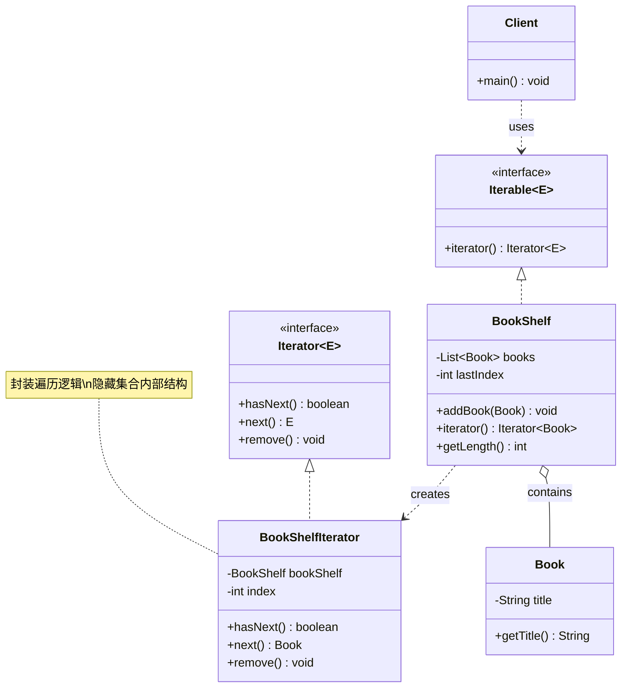

# 迭代器 Iterator

> 提供一种方法顺序访问聚合对象中的各个元素，而不暴露其底层表示。

## 意图

迭代器模式将遍历集合的责任从集合本身分离出来，放到独立的迭代器对象中。客户端通过统一的迭代器接口访问不同类型的集合，不需要关心集合的内部结构（数组、链表、树、哈希表等）。

通俗来说，就像你用遥控器换台——不管电视机内部用的是什么芯片、信号怎么传输的，你只需要按"下一个频道"就行了。迭代器就是那个遥控器，集合就是电视机。

Java 中的 `Iterator` 接口就是迭代器模式的标准实现——无论是 `ArrayList`、`HashSet` 还是 `HashMap`，都可以用 `for-each` 循环统一遍历。这个模式太成功了，以至于 Java 直接把它内置到了语言层面。

**核心角色**：

| 角色 | 职责 | 类比 |
|------|------|------|
| Iterator（迭代器接口） | 声明遍历方法（hasNext、next） | 遥控器按钮 |
| ConcreteIterator（具体迭代器） | 实现具体的遍历逻辑 | 具体品牌的遥控器 |
| Aggregate（聚合接口） | 声明创建迭代器的方法 | 电视机接口 |
| ConcreteAggregate（具体聚合） | 实现创建具体迭代器 | 具体品牌的电视机 |

:::tip 迭代器模式已经"融入"了 Java
迭代器模式被称为"最成功的模式之一"，因为它已经被 Java、C# 等语言直接内置了。在 Java 中你几乎不需要自己实现迭代器——直接用 `for-each`、`Iterator`、`Stream` 就行。但理解它的原理对于设计自定义集合类、理解框架源码非常重要。
:::

## 适用场景

- 需要遍历聚合对象中的元素，又不暴露其内部结构时
- 需要为不同的聚合结构提供统一的遍历接口时
- 需要支持多种遍历方式时（正序、倒序、过滤、分页等）
- 不希望客户端代码依赖聚合对象的具体实现时
- 需要对聚合对象进行多种不同的遍历方式时

## UML 类图



## 代码示例

### ❌ 没有使用该模式的问题

```java
// 糟糕的设计：客户端需要知道集合的内部结构才能遍历
public class BookShelf {
    private Book[] books = new Book[100];  // 内部用数组存储
    private int lastIndex = 0;

    public void addBook(Book book) {
        books[lastIndex] = book;
        lastIndex++;
    }

    // 直接暴露内部数据结构！
    public Book[] getBooks() { return books; }
    public int getLength() { return lastIndex; }
}

// 客户端代码和内部结构紧耦合
public class Client {
    public static void main(String[] args) {
        BookShelf shelf = new BookShelf();
        shelf.addBook(new Book("Java 编程思想"));
        shelf.addBook(new Book("Effective Java"));
        shelf.addBook(new Book("设计模式"));

        // 客户端需要知道是数组，才能这样遍历
        Book[] books = shelf.getBooks();
        for (int i = 0; i < shelf.getLength(); i++) {
            System.out.println(books[i].getTitle());
        }

        // 问题1：如果 BookShelf 改成用 LinkedList 实现，
        //         客户端的 for (int i = 0; ...) 代码全部要改
        // 问题2：如果想在遍历时做过滤（只看 Java 相关的书），
        //         客户端代码会变成一堆 if-else
        // 问题3：多个地方遍历同一个集合，遍历逻辑会重复
        // 问题4：无法同时进行多个独立的遍历（共享 index）
    }
}
```

**运行结果**：

```
Java 编程思想
Effective Java
设计模式
```

### ✅ 使用该模式后的改进

```java
// ============ 迭代器接口 ============
// 统一的遍历契约，不关心集合内部结构
public interface MyIterator<T> {
    boolean hasNext();  // 是否还有下一个元素
    T next();           // 获取下一个元素
}

// ============ 可迭代接口 ============
// 聚合对象实现此接口，表示可以被遍历
public interface MyIterable<T> {
    MyIterator<T> iterator();  // 创建一个迭代器
}

// ============ 书籍类 ============
public class Book {
    private final String title;

    public Book(String title) {
        this.title = title;
    }

    public String getTitle() {
        return title;
    }
}

// ============ 具体聚合：书架 ============
public class BookShelf implements MyIterable<Book> {
    private final List<Book> books = new ArrayList<>();  // 内部用 List 存储

    // 添加书籍
    public void addBook(Book book) {
        books.add(book);
        System.out.println("添加书籍: " + book.getTitle());
    }

    // 获取书籍数量
    public int getLength() {
        return books.size();
    }

    // 创建迭代器——客户端通过这个方法获取遍历能力
    @Override
    public MyIterator<Book> iterator() {
        return new BookShelfIterator(books);  // 创建并返回一个迭代器
    }

    // ============ 内部类实现的具体迭代器 ============
    // 用内部类可以访问外部类的私有字段
    private static class BookShelfIterator implements MyIterator<Book> {
        private final List<Book> books;  // 持有集合引用
        private int index = 0;           // 当前遍历位置

        public BookShelfIterator(List<Book> books) {
            this.books = books;
        }

        @Override
        public boolean hasNext() {
            return index < books.size();  // 是否还有下一个
        }

        @Override
        public Book next() {
            if (!hasNext()) {
                throw new NoSuchElementException("没有更多书籍了");
            }
            return books.get(index++);  // 返回当前元素，index 前进
        }
    }
}

// ============ 过滤迭代器：只遍历特定条件的书 ============
// 这是迭代器模式的强大之处——可以自定义遍历逻辑
public class FilteredBookIterator implements MyIterator<Book> {
    private final List<Book> books;
    private final Predicate<Book> filter;  // 过滤条件
    private int index = 0;
    private Book nextBook;  // 预取下一个符合条件的元素

    public FilteredBookIterator(List<Book> books, Predicate<Book> filter) {
        this.books = books;
        this.filter = filter;
        advance();  // 初始化时先找到第一个符合条件的元素
    }

    // 推进到下一个符合条件的元素
    private void advance() {
        nextBook = null;
        while (index < books.size()) {
            Book book = books.get(index++);
            if (filter.test(book)) {  // 测试是否满足条件
                nextBook = book;
                break;  // 找到了就停
            }
        }
    }

    @Override
    public boolean hasNext() {
        return nextBook != null;  // 预取的元素不为空说明还有
    }

    @Override
    public Book next() {
        if (!hasNext()) {
            throw new NoSuchElementException("没有符合条件的书籍");
        }
        Book result = nextBook;
        advance();  // 预取下一个
        return result;
    }
}

// ============ 客户端使用 ============
public class Main {
    public static void main(String[] args) {
        // 创建书架并添加书籍
        BookShelf shelf = new BookShelf();
        shelf.addBook(new Book("Java 编程思想"));
        shelf.addBook(new Book("Python 入门"));
        shelf.addBook(new Book("Effective Java"));
        shelf.addBook(new Book("算法导论"));
        shelf.addBook(new Book("Java 并发编程实战"));

        System.out.println("\n=== 遍历所有书籍 ===");
        MyIterator<Book> iterator = shelf.iterator();
        while (iterator.hasNext()) {
            Book book = iterator.next();
            System.out.println("  - " + book.getTitle());
        }

        // 使用过滤迭代器：只遍历 Java 相关的书籍
        System.out.println("\n=== 只看 Java 相关书籍 ===");
        List<Book> allBooks = Arrays.asList(
            new Book("Java 编程思想"),
            new Book("Python 入门"),
            new Book("Effective Java"),
            new Book("算法导论"),
            new Book("Java 并发编程实战")
        );
        MyIterator<Book> javaBooks = new FilteredBookIterator(
            allBooks,
            book -> book.getTitle().contains("Java")  // 过滤条件
        );
        while (javaBooks.hasNext()) {
            Book book = javaBooks.next();
            System.out.println("  - " + book.getTitle());
        }

        // 同时进行多个独立的遍历
        System.out.println("\n=== 两个迭代器同时遍历 ===");
        MyIterator<Book> it1 = shelf.iterator();
        MyIterator<Book> it2 = shelf.iterator();
        System.out.println("迭代器1: " + it1.next().getTitle());  // 第一本
        System.out.println("迭代器2: " + it2.next().getTitle());  // 也是第一本（独立的）
        System.out.println("迭代器1: " + it1.next().getTitle());  // 第二本
    }
}
```

**运行结果**：

```
添加书籍: Java 编程思想
添加书籍: Python 入门
添加书籍: Effective Java
添加书籍: 算法导论
添加书籍: Java 并发编程实战

=== 遍历所有书籍 ===
  - Java 编程思想
  - Python 入门
  - Effective Java
  - 算法导论
  - Java 并发编程实战

=== 只看 Java 相关书籍 ===
  - Java 编程思想
  - Effective Java
  - Java 并发编程实战

=== 两个迭代器同时遍历 ===
迭代器1: Java 编程思想
迭代器2: Java 编程思想
迭代器1: Python 入门
```

### 变体与扩展

**1. 逆序迭代器**

```java
// 从后往前遍历的迭代器
public class ReverseIterator<T> implements MyIterator<T> {
    private final List<T> list;
    private int index;  // 从最后一个元素开始

    public ReverseIterator(List<T> list) {
        this.list = list;
        this.index = list.size() - 1;  // 初始位置：最后一个
    }

    @Override
    public boolean hasNext() {
        return index >= 0;  // 从后往前，index >= 0 说明还有
    }

    @Override
    public T next() {
        if (!hasNext()) {
            throw new NoSuchElementException();
        }
        return list.get(index--);  // 返回当前元素，index 后退
    }
}
```

**2. 空迭代器（Null Object 模式）**

```java
// 空集合返回的迭代器，避免空指针检查
public class EmptyIterator<T> implements MyIterator<T> {
    // 单例模式——空迭代器不需要多个实例
    @SuppressWarnings("unchecked")
    public static final EmptyIterator<?> INSTANCE = new EmptyIterator<>();

    private EmptyIterator() {}

    @Override
    public boolean hasNext() {
        return false;  // 永远没有下一个
    }

    @Override
    public T next() {
        throw new NoSuchElementException();  // 永远抛异常
    }
}
```

:::warning 迭代器的 fail-fast 机制
Java 的 `ArrayList` 等集合的迭代器实现了 fail-fast 机制：如果在遍历过程中其他线程修改了集合（增删元素），迭代器会立即抛出 `ConcurrentModificationException`。这是通过一个 `modCount` 字段实现的——迭代器创建时记录 `expectedModCount`，每次 `next()` 时检查 `modCount` 是否被修改过。这是"快速失败"策略，不保证一定能检测到并发修改，只是尽最大努力。
:::

### 运行结果

上面代码的完整运行输出已在代码示例中展示。核心要点：

- 客户端通过迭代器接口遍历，不依赖集合内部结构
- 过滤迭代器可以在不修改集合的情况下自定义遍历逻辑
- 多个迭代器可以同时独立遍历同一个集合
- 逆序迭代器和空迭代器展示了迭代器的灵活性

## Spring/JDK 中的应用

### 1. JDK 的 Iterable 和 for-each 语法糖

Java 5 引入的 `for-each` 语法糖底层就是迭代器模式：

```java
// 这两种写法完全等价
// 写法1：for-each 语法糖（编译器自动转换为写法2）
for (String s : list) {
    System.out.println(s);
}

// 写法2：编译器实际生成的代码（使用迭代器）
Iterator<String> it = list.iterator();
while (it.hasNext()) {
    String s = it.next();
    System.out.println(s);
}

// 所以任何实现了 Iterable 接口的类都可以用 for-each 遍历
// 这就是迭代器模式"融入语言"的体现
```

### 2. Spring 的 CompositeIterator

Spring 内部有一个 `CompositeIterator`，用于组合多个迭代器——当你需要把多个集合"合并"成一个来遍历时特别有用：

```java
// Spring 源码中的 CompositeIterator（简化版）
public class CompositeIterator<T> implements Iterator<T> {
    private final List<Iterator<T>> iterators = new ArrayList<>();
    private int currentIteratorIndex = 0;  // 当前正在使用哪个迭代器

    // 添加一个迭代器
    public void add(Iterator<T> iterator) {
        this.iterators.add(iterator);
    }

    @Override
    public boolean hasNext() {
        // 遍历所有迭代器，只要有一个还有元素就返回 true
        while (currentIteratorIndex < iterators.size()) {
            if (iterators.get(currentIteratorIndex).hasNext()) {
                return true;
            }
            currentIteratorIndex++;  // 当前迭代器用完了，切换到下一个
        }
        return false;
    }

    @Override
    public T next() {
        if (!hasNext()) {
            throw new NoSuchElementException();
        }
        return iterators.get(currentIteratorIndex).next();  // 从当前迭代器取
    }
}

// 实际使用场景：Spring 的事件监听器注册
// ApplicationListenerRegistrar 内部就用了 CompositeIterator
// 来合并多个来源的监听器
```

### 3. Spring Data 的 Iterable 返回值

Spring Data JPA 的 Repository 方法返回 `Iterable<T>`，利用迭代器模式统一了各种数据源的遍历方式：

```java
// Spring Data JPA 的 Repository 接口
public interface UserRepository extends JpaRepository<User, Long> {
    // findAll() 返回 Iterable<User>
    // 不管底层是 MySQL、PostgreSQL 还是 MongoDB
    // 客户端都用同样的方式遍历
}

// 使用
@Service
public class UserService {
    @Autowired
    private UserRepository userRepository;

    public void processAllUsers() {
        // 返回 Iterable，可以用 for-each 遍历
        // 底层可能是分批从数据库加载（懒加载），对客户端透明
        Iterable<User> users = userRepository.findAll();

        for (User user : users) {
            System.out.println(user.getName());
        }
    }
}

// Spring Data 的分页迭代器
Page<User> firstPage = userRepository.findAll(PageRequest.of(0, 10));
// Page 也实现了 Iterable，可以用 for-each 遍历当前页的数据
for (User user : firstPage) {
    System.out.println(user.getName());
}
```

### 4. JDK 的 Collections.iterator() 和 Spliterator

Java 8 引入了 `Spliterator`，是迭代器的增强版，支持并行遍历：

```java
// Spliterator 支持并行拆分
List<String> list = Arrays.asList("a", "b", "c", "d", "e");

// 获取 Spliterator
Spliterator<String> spliterator = list.spliterator();

// 尝试拆分（用于并行处理）
Spliterator<String> spliterator1 = spliterator.trySplit();  // 前半部分
// 原来的 spliterator 变成后半部分

// Spliterator 是 Stream 的底层实现
// Stream 的并行流就是通过 Spliterator 的 trySplit() 实现的
list.parallelStream().forEach(System.out::println);
```

## 优缺点

| 优点 | 详细说明 |
|------|----------|
| **隐藏内部结构** | 客户端通过统一接口遍历，不关心集合是数组、链表还是哈希表 |
| **统一遍历接口** | 不同类型的集合可以用同一种方式遍历（for-each） |
| **支持多种遍历方式** | 可以为同一个集合创建不同的迭代器（正序、逆序、过滤等） |
| **多个独立遍历** | 每个迭代器维护自己的遍历状态，互不干扰 |
| **符合单一职责** | 集合负责存储，迭代器负责遍历，职责分离 |

| 缺点 | 详细说明 |
|------|----------|
| **增加类数量** | 每个聚合类需要一个对应的迭代器类（可以用内部类缓解） |
| **简单场景过度设计** | 对于简单的数组遍历，直接 for 循环更简单 |
| **语言已内置** | Java 已内置 Iterator 和 for-each，通常不需要自己实现 |
| **遍历时修改的限制** | 大多数迭代器不支持在遍历时修改集合（会抛 ConcurrentModificationException） |

## 面试追问

### Q1: Iterator 和 ListIterator 的区别？

**A:** `ListIterator` 是 `Iterator` 的增强版，专门用于 `List`：

| 方法 | Iterator | ListIterator |
|------|----------|-------------|
| hasNext() | ✅ | ✅ |
| next() | ✅ | ✅ |
| remove() | ✅ | ✅ |
| hasPrevious() | ❌ | ✅ 支持**反向遍历** |
| previous() | ❌ | ✅ 获取**上一个**元素 |
| nextIndex() | ❌ | ✅ 获取下一个元素的**索引** |
| previousIndex() | ❌ | ✅ 获取上一个元素的**索引** |
| set(E) | ❌ | ✅ **替换**当前元素 |
| add(E) | ❌ | ✅ **插入**元素 |

```java
List<String> list = new ArrayList<>(Arrays.asList("A", "B", "C"));
ListIterator<String> it = list.listIterator();

// 正向遍历
while (it.hasNext()) {
    System.out.println(it.nextIndex() + ": " + it.next());
}
// 输出: 0: A, 1: B, 2: C

// 反向遍历（需要先正向走到末尾）
while (it.hasPrevious()) {
    System.out.println(it.previousIndex() + ": " + it.previous());
}
// 输出: 2: C, 1: B, 0: A
```

### Q2: Java 8 的 Stream 和 Iterator 有什么区别？

**A:** 核心区别在于**编程范式不同**：

| 维度 | Iterator | Stream |
|------|----------|--------|
| 编程范式 | 命令式（手动控制遍历） | 声明式（描述做什么） |
| 可复用性 | 可以反复遍历 | 只能消费一次 |
| 并行处理 | 不支持 | 支持 parallel() |
| 惰性求值 | 不支持 | 支持（中间操作是惰性的） |
| 修改集合 | 支持 remove() | 不支持 |
| 操作丰富度 | hasNext/next/remove | map/filter/reduce/collect 等 |

```java
// Iterator：命令式，手动控制
Iterator<String> it = list.iterator();
while (it.hasNext()) {
    String s = it.next();
    if (s.length() > 3) {
        System.out.println(s.toUpperCase());
    }
}

// Stream：声明式，描述"做什么"
list.stream()
    .filter(s -> s.length() > 3)      // 过滤
    .map(String::toUpperCase)          // 转换
    .forEach(System.out::println);     // 终端操作
```

:::tip 选择建议
- 需要修改集合 → **Iterator**
- 需要反复遍历 → **Iterator** 或增强 for
- 需要声明式处理、函数式操作 → **Stream**
- 需要并行处理 → **parallel Stream**
- 复杂的数据处理管道 → **Stream**
:::

### Q3: forEachRemaining 和 remove 的使用注意点？

**A:** 几个关键注意点：

```java
List<String> list = new ArrayList<>(Arrays.asList("A", "B", "C"));
Iterator<String> it = list.iterator();

// 注意1: remove() 必须在 next() 之后调用
// it.remove();  // ❌ IllegalStateException：还没有 next
it.next();
it.remove();  // ✅ 正确：删除了 "A"

// 注意2: 每次 next() 只能调用一次 remove()
it.next();    // 现在指向 "B"
it.remove();  // ✅ 删除 "B"
// it.remove();  // ❌ IllegalStateException：已经 remove 过了

// 注意3: forEachRemaining 中不能调用 remove()
List<String> list2 = new ArrayList<>(Arrays.asList("A", "B", "C"));
Iterator<String> it2 = list2.iterator();
it2.forEachRemaining(s -> {
    System.out.println(s);
    // it2.remove();  // ❌ 可能抛 ConcurrentModificationException
});

// 注意4: fail-fast 不是保证，只是"尽最大努力"
// 在多线程环境下，ConcurrentModificationException 可能不会抛出
// 如果需要线程安全，使用 CopyOnWriteArrayList 或 Collections.synchronizedList
```

### Q4: 如何实现一个可以边遍历边修改的迭代器？

**A:** Java 的 `CopyOnWriteArrayList` 就是一个例子——遍历时不抛 `ConcurrentModificationException`，因为它在修改时创建副本：

```java
// CopyOnWriteArrayList 的迭代器基于创建时的快照
List<String> list = new CopyOnWriteArrayList<>();
list.add("A");
list.add("B");
list.add("C");

Iterator<String> it = list.iterator();
list.add("D");  // 修改集合（不会影响已创建的迭代器）

while (it.hasNext()) {
    System.out.println(it.next());  // 只输出 A, B, C（看不到 D）
}

// 自定义可修改迭代器：用 ListIterator
List<String> list2 = new ArrayList<>(Arrays.asList("A", "B", "C", "D"));
ListIterator<String> listIt = list2.listIterator();

while (listIt.hasNext()) {
    String s = listIt.next();
    if (s.equals("B")) {
        listIt.remove();  // 边遍历边删除——用 ListIterator 是安全的
    }
    if (s.equals("C")) {
        listIt.add("C2");  // 边遍历边插入——也是安全的
    }
}
// 结果: [A, C, C2, D]
```

## 相关模式

- **组合模式**：迭代器常用于遍历组合模式中的树形结构（如文件系统遍历）
- **工厂方法模式**：聚合类的 `iterator()` 方法就是工厂方法——创建并返回迭代器
- **备忘录模式**：迭代器可以在遍历时保存当前位置（备忘录），实现"暂停/恢复"遍历
- **访问者模式**：访问者模式和迭代器模式都可以遍历聚合对象，但目的不同——迭代器关注遍历，访问者关注操作
- **Null Object 模式**：空迭代器（EmptyIterator）是 Null Object 模式的应用
