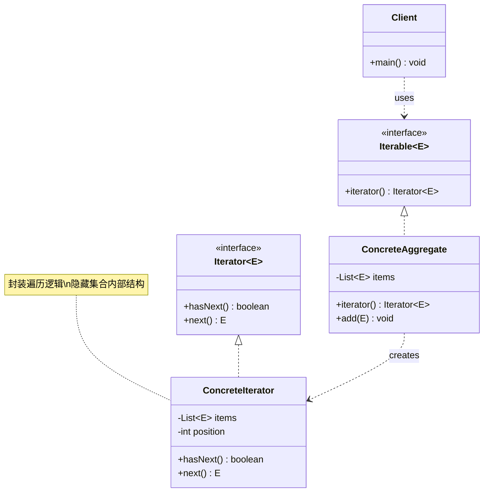

# 迭代器 Iterator

> 提供一种方法顺序访问聚合对象中的各个元素，而不暴露其底层表示。

## 意图

迭代器模式将遍历集合的责任从集合本身分离出来，放到独立的迭代器对象中。客户端通过统一的迭代器接口访问不同类型的集合，不需要关心集合的内部结构（数组、链表、树、哈希表等）。

Java 中的 `Iterator` 接口就是迭代器模式的标准实现——无论是 `ArrayList`、`HashSet` 还是 `HashMap`，都可以用 `for-each` 循环统一遍历。

## 适用场景

- 需要遍历聚合对象中的元素，又不暴露其内部结构时
- 需要为不同的聚合结构提供统一的遍历接口时
- 需要支持多种遍历方式时（正序、倒序、过滤等）
- 不希望客户端代码依赖聚合对象的具体实现时

## UML 类图



## 代码示例

### ❌ 没有使用该模式的问题

```java
// 客户端需要知道集合的内部结构才能遍历
public class BookList {
    private Book[] books = new Book[100];
    private int size = 0;

    // 暴露内部数据结构
    public Book[] getBooks() { return books; }
    public int getSize() { return size; }
}

// 客户端需要知道是数组才能这样遍历
BookList list = new BookList();
Book[] books = list.getBooks();
for (int i = 0; i < list.getSize(); i++) {
    System.out.println(books[i].getName());
}

// 如果 BookList 改成用 LinkedList 实现，客户端代码全部要改
```

### ✅ 使用该模式后的改进

```java
// 迭代器接口
public interface MyIterator<T> {
    boolean hasNext();
    T next();
}

// 可迭代接口
public interface MyIterable<T> {
    MyIterator<T> iterator();
}

// 具体聚合类
public class BookList implements MyIterable<Book> {
    private final List<Book> books = new ArrayList<>();

    public void add(Book book) {
        books.add(book);
    }

    @Override
    public MyIterator<Book> iterator() {
        return new BookIterator(books);
    }
}

// 具体迭代器
public class BookIterator implements MyIterator<Book> {
    private final List<Book> books;
    private int position = 0;

    public BookIterator(List<Book> books) {
        this.books = books;
    }

    @Override
    public boolean hasNext() {
        return position < books.size();
    }

    @Override
    public Book next() {
        if (!hasNext()) {
            throw new NoSuchElementException();
        }
        return books.get(position++);
    }
}

// 使用：不关心集合内部结构
public class Main {
    public static void main(String[] args) {
        BookList bookList = new BookList();
        bookList.add(new Book("Java 编程思想"));
        bookList.add(new Book("Effective Java"));
        bookList.add(new Book("设计模式"));

        MyIterator<Book> iterator = bookList.iterator();
        while (iterator.hasNext()) {
            Book book = iterator.next();
            System.out.println(book.getTitle());
        }
    }
}
```

### Spring 中的应用

Spring 的 `CompositeIterator` 和各种 `XXXRepository` 的返回值都用到了迭代器模式：

```java
// Spring 的 CompositeIterator 组合多个迭代器
public class CompositeIterator<T> implements Iterator<T> {
    private final List<Iterator<T>> iterators = new ArrayList<>();

    public void add(Iterator<T> iterator) {
        iterators.add(iterator);
    }

    @Override
    public boolean hasNext() {
        for (Iterator<T> iterator : iterators) {
            if (iterator.hasNext()) return true;
        }
        return false;
    }

    @Override
    public T next() {
        for (Iterator<T> iterator : iterators) {
            if (iterator.hasNext()) return iterator.next();
        }
        throw new NoSuchElementException();
    }
}

// Spring Data JPA 的 Iterable 返回
public interface UserRepository extends JpaRepository<User, Long> {
    // findAll() 返回 Iterable<User>，可以用 for-each 遍历
    // Spring 通过迭代器模式统一了各种数据源的遍历方式
}
```

## 优缺点

| 优点 | 缺点 |
|------|------|
| 访问聚合对象的内容而不暴露其内部表示 | 增加了类的数量 |
| 为遍历不同的聚合结构提供统一接口 | 对于简单的集合，使用迭代器可能显得多余 |
| 支持多种遍历方式（正序、倒序、过滤等） | Java 已内置 Iterator 接口，通常不需要自己实现 |
| 遍历时可以安全地修改聚合对象（使用 ListIterator） | 迭代器模式通常被称为"已死"的模式——语言已内置支持 |

## 面试追问

**Q1: Iterator 和 ListIterator 的区别？**

A: `ListIterator` 是 `Iterator` 的增强版，专门用于 List。它支持双向遍历（hasPrevious/previous）、获取元素索引（nextIndex/previousIndex）、在遍历时修改列表（add/set/remove）。`Iterator` 只能单向遍历和删除元素。

**Q2: forEachRemaining 和 remove 的使用注意点？**

A: `forEachRemaining(Consumer)` 是 Java 8 新增的批量操作方法。`remove()` 必须在 `next()` 之后调用，否则会抛出 `IllegalStateException`。每次 `next()` 只能调用一次 `remove()`。如果使用 `forEachRemaining`，不能在 Consumer 中调用 `remove()`（会抛出 `ConcurrentModificationException`）。

**Q3: Java 8 的 Stream 和迭代器有什么区别？**

A: 迭代器是命令式的，手动控制遍历过程，可以修改集合。Stream 是声明式的，描述"做什么"而不是"怎么做"，支持并行处理和惰性求值。Stream 只能消费一次（terminal operation 后就关闭了），迭代器可以反复遍历（如果集合支持）。

## 相关模式

- **组合模式**：迭代器常用于遍历组合模式中的树形结构
- **工厂方法模式**：聚合类的 iterator() 方法就是工厂方法
- **备忘录模式**：迭代器可以在遍历时保存当前位置（备忘录）
- **访问者模式**：访问者模式和迭代器模式都可以遍历聚合对象，但目的不同
