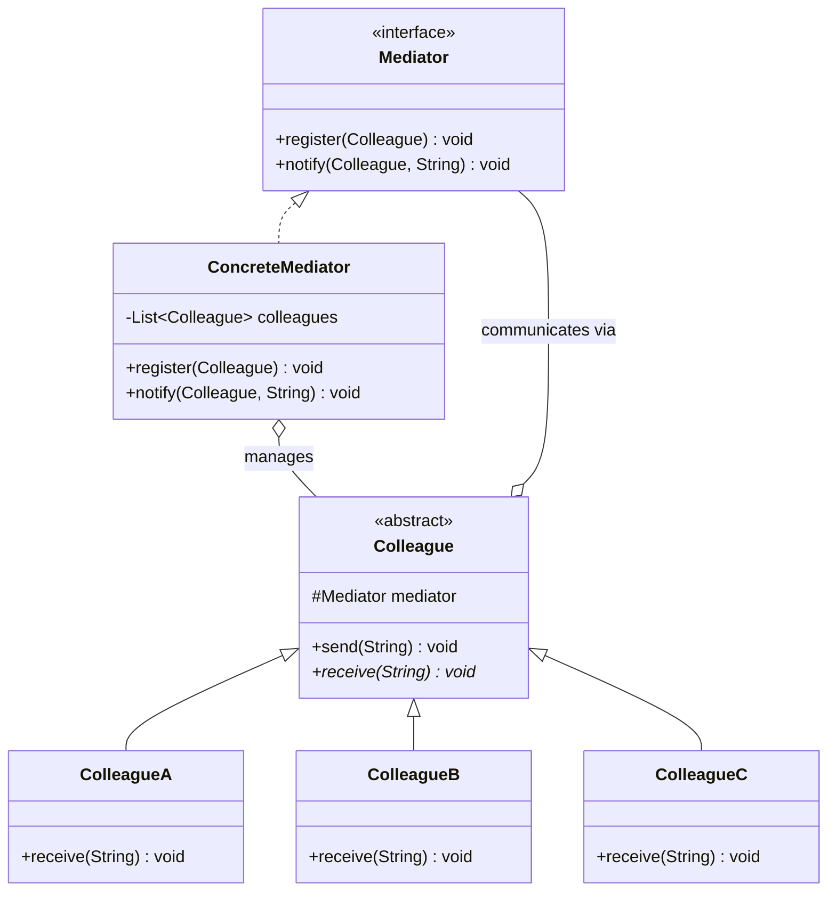

# 中介者 Mediator

> 用一个中介对象来封装一系列对象的交互，使各对象不需要显式地相互引用。

## 意图

中介者模式引入一个"中间人"来协调多个对象之间的通信。原本对象之间两两交互（网状结构），现在都通过中介者交互（星形结构）。这样对象之间不再直接引用，只依赖中介者，大大降低了耦合度。

就像机场调度塔——飞机之间不需要互相通信，都通过调度塔协调起降。调度塔了解所有飞机的状态，统一调度避免冲突。

## 适用场景

- 多个对象之间存在复杂的引用关系，形成"网状结构"时
- 一个对象的行为改变会影响很多其他对象时
- 需要集中控制多个对象的交互逻辑时
- 需要解耦多个同事对象之间的依赖时

## UML 类图



## 代码示例

### ❌ 没有使用该模式的问题

```java
// 组件之间直接引用，形成网状依赖
public class TextField {
    private Button submitButton;
    private CheckBox agreeCheckBox;

    public void onInput() {
        // 直接操作其他组件
        submitButton.setEnabled(!getText().isEmpty() && agreeCheckBox.isChecked());
    }
}

public class CheckBox {
    private TextField textField;
    private Button submitButton;

    public void onChange() {
        submitButton.setEnabled(!textField.getText().isEmpty() && isChecked());
    }
}

// 每增加一个组件，所有相关的组件都要修改
// 组件越多，依赖关系越复杂
```

### ✅ 使用该模式后的改进

```java
// 中介者接口
public interface ChatMediator {
    void sendMessage(String message, User user);
    void addUser(User user);
}

// 具体中介者
public class ChatRoom implements ChatMediator {
    private final List<User> users = new ArrayList<>();

    @Override
    public void addUser(User user) {
        users.add(user);
    }

    @Override
    public void sendMessage(String message, User sender) {
        for (User user : users) {
            if (user != sender) {
                user.receive(message);
            }
        }
    }
}

// 同事类
public abstract class User {
    protected ChatMediator mediator;
    protected String name;

    protected User(ChatMediator mediator, String name) {
        this.mediator = mediator;
        this.name = name;
    }

    public abstract void send(String message);
    public abstract void receive(String message);
}

// 具体同事
public class ChatUser extends User {
    public ChatUser(ChatMediator mediator, String name) {
        super(mediator, name);
    }

    @Override
    public void send(String message) {
        System.out.println(name + " 发送: " + message);
        mediator.sendMessage(message, this);
    }

    @Override
    public void receive(String message) {
        System.out.println(name + " 收到: " + message);
    }
}

// 使用
public class Main {
    public static void main(String[] args) {
        ChatMediator chatRoom = new ChatRoom();

        User alice = new ChatUser(chatRoom, "Alice");
        User bob = new ChatUser(chatRoom, "Bob");
        User charlie = new ChatUser(chatRoom, "Charlie");

        chatRoom.addUser(alice);
        chatRoom.addUser(bob);
        chatRoom.addUser(charlie);

        alice.send("大家好！");   // Bob 和 Charlie 收到
        bob.send("你好 Alice！"); // Alice 和 Charlie 收到
    }
}
```

### Spring 中的应用

Spring MVC 的 `DispatcherServlet` 就是中介者模式的应用：

```java
// DispatcherServlet 作为中介者，协调 Controller、ViewResolver、HandlerAdapter 等
// 组件之间不需要直接通信，都通过 DispatcherServlet 协调

// 请求处理流程：
// 1. DispatcherServlet 接收请求
// 2. 委托给 HandlerMapping 查找 Handler
// 3. 委托给 HandlerAdapter 执行 Handler
// 4. Handler 返回 ModelAndView
// 5. 委托给 ViewResolver 解析视图
// 6. 渲染视图返回响应

// 所有组件（Controller、ViewResolver、HandlerAdapter）
// 都不直接引用对方，全部通过 DispatcherServlet（中介者）协调
```

## 优缺点

| 优点 | 缺点 |
|------|------|
| 将多对多关系简化为一对多，降低耦合 | 中介者可能变成"上帝对象"，承担过多职责 |
| 各同事对象之间不需要直接引用 | 中介者的复杂性随同事数量增加而急剧上升 |
| 集中控制交互逻辑，方便维护 | 同事类过度依赖中介者，中介者成为单点故障 |
| 符合迪米特法则（最少知道原则） | 过度使用会导致系统难以理解和调试 |

## 面试追问

**Q1: 中介者模式和观察者模式的区别？**

A: 中介者模式中，同事对象通过中介者通信，中介者主动协调。观察者模式中，被观察者通知观察者，是广播式的。中介者知道所有同事并协调它们，观察者只知道被观察者。中介者关注"协调"，观察者关注"通知"。

**Q2: 中介者模式和外观模式的区别？**

A: 外观模式提供简化的统一接口，隐藏子系统的复杂性，是单向的（客户端→子系统）。中介者模式协调多个对象之间的通信，是多向的（同事↔同事通过中介者）。外观是"简化的入口"，中介者是"通信的中心"。

**Q3: 如何避免中介者变成上帝对象？**

A: 1) 将中介者的职责拆分为多个专职中介者（按功能分组）；2) 使用事件驱动的方式替代直接方法调用，中介者只负责事件分发；3) 结合观察者模式，中介者不处理具体逻辑，只转发消息。

## 相关模式

- **观察者模式**：观察者广播通知，中介者协调通信
- **外观模式**：外观简化接口，中介者协调通信
- **责任链模式**：责任链处理请求，中介者协调交互
- **状态模式**：状态模式管理对象状态，中介者管理对象间通信
