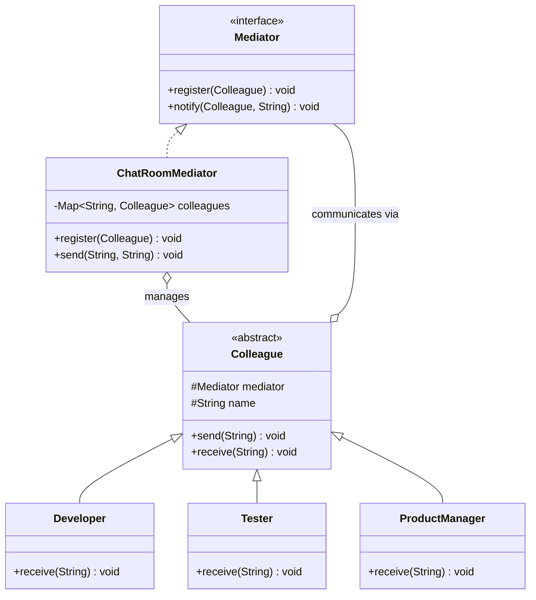

# 中介者 Mediator

> 用一个中介对象来封装一系列对象的交互，使各对象不需要显式地相互引用。

## 意图

中介者模式引入一个"中间人"来协调多个对象之间的通信。原本对象之间两两交互（网状结构），现在都通过中介者交互（星形结构）。这样对象之间不再直接引用，只依赖中介者，大大降低了耦合度。

通俗来说，就像机场调度塔——飞机之间不需要互相通信（"我要降落了你让一下"），都通过调度塔协调起降。调度塔了解所有飞机的状态，统一调度避免冲突。再比如微信群——群友之间不需要互相加好友，都通过微信群（中介者）聊天。

**核心角色**：

| 角色 | 职责 | 类比 |
|------|------|------|
| Mediator（中介者接口） | 定义同事对象之间通信的接口 | 调度塔的通信协议 |
| ConcreteMediator（具体中介者） | 实现协调逻辑，了解所有同事 | 具体的调度塔 |
| Colleague（同事类） | 每个同事只知道中介者，不知道其他同事 | 飞机 |
| Client（客户端） | 创建同事和中介者 | 地面控制中心 |

:::tip 中介者模式的核心思想
中介者模式本质上是把**多对多的网状依赖**简化为**多对一的星形依赖**。对象之间不再互相引用，只引用中介者一个对象。这在对象数量多、交互复杂时特别有价值——依赖关系从 O(n²) 降到 O(n)。
:::

## 适用场景

- 多个对象之间存在复杂的引用关系，形成"网状结构"时
- 一个对象的行为改变会影响很多其他对象时
- 需要集中控制多个对象的交互逻辑时
- 需要解耦多个同事对象之间的依赖时
- UI 组件之间需要协调（如表单校验联动）

## UML 类图



## 代码示例

### ❌ 没有使用该模式的问题

```java
// 糟糕的设计：UI 组件之间直接引用，形成网状依赖
public class TextField {
    private Button submitButton;      // 直接引用其他组件
    private CheckBox agreeCheckBox;   // 直接引用其他组件

    public TextField(Button submitButton, CheckBox agreeCheckBox) {
        this.submitButton = submitButton;
        this.agreeCheckBox = agreeCheckBox;
    }

    public void onInput() {
        // 直接操作其他组件——紧耦合！
        boolean canSubmit = !getText().isEmpty() && agreeCheckBox.isChecked();
        submitButton.setEnabled(canSubmit);
    }
}

public class CheckBox {
    private TextField textField;      // 反向引用
    private Button submitButton;      // 又一个引用

    public CheckBox(TextField textField, Button submitButton) {
        this.textField = textField;
        this.submitButton = submitButton;
    }

    public void onChange() {
        // 又是直接操作其他组件
        boolean canSubmit = !textField.getText().isEmpty() && isChecked();
        submitButton.setEnabled(canSubmit);
    }
}

public class Button {
    private TextField textField;
    private CheckBox agreeCheckBox;

    public void onClick() {
        // 按钮点击时又要操作其他组件
        textField.clear();
        agreeCheckBox.uncheck();
    }
}

// 问题：
// 1. 每个组件都引用了其他所有相关组件，依赖关系是 O(n²)
// 2. 新增一个组件（比如验证码输入框），所有相关组件都要改
// 3. 组件之间的逻辑散落在各处，难以维护
// 4. 无法复用——TextField 在另一个表单里需要不同的联动逻辑
```

### ✅ 使用该模式后的改进

```java
// ============ 中介者接口 ============
public interface ChatMediator {
    void send(String message, User sender);  // 发送消息给所有其他同事
    void register(User user);                 // 注册同事
}

// ============ 具体中介者：聊天室 ============
public class ChatRoom implements ChatMediator {
    // 用 Map 存储同事，key 是用户名
    private final Map<String, User> colleagues = new LinkedHashMap<>();

    @Override
    public void register(User user) {
        colleagues.put(user.getName(), user);  // 注册到聊天室
        System.out.println("[系统] " + user.getName() + " 加入了聊天室");
    }

    @Override
    public void send(String message, User sender) {
        // 中介者负责把消息广播给除发送者外的所有同事
        for (User user : colleagues.values()) {
            if (!user.getName().equals(sender.getName())) {
                user.receive(message, sender.getName());  // 接收消息
            }
        }
    }
}

// ============ 同事抽象类 ============
public abstract class User {
    protected ChatMediator mediator;  // 只依赖中介者，不依赖其他同事
    protected String name;

    protected User(ChatMediator mediator, String name) {
        this.mediator = mediator;
        this.name = name;
    }

    public String getName() {
        return name;
    }

    // 发送消息：通过中介者转发
    public void send(String message) {
        System.out.println(name + " 发送: " + message);
        mediator.send(message, this);  // 委托给中介者
    }

    // 接收消息：由中介者调用
    public abstract void receive(String message, String from);
}

// ============ 具体同事：开发者 ============
public class Developer extends User {
    public Developer(ChatMediator mediator, String name) {
        super(mediator, name);
    }

    @Override
    public void receive(String message, String from) {
        System.out.println("[开发者 " + name + "] 收到 " + from + " 的消息: " + message);
    }
}

// ============ 具体同事：测试工程师 ============
public class Tester extends User {
    public Tester(ChatMediator mediator, String name) {
        super(mediator, name);
    }

    @Override
    public void receive(String message, String from) {
        System.out.println("[测试 " + name + "] 收到 " + from + " 的消息: " + message);
    }
}

// ============ 具体同事：产品经理 ============
public class ProductManager extends User {
    public ProductManager(ChatMediator mediator, String name) {
        super(mediator, name);
    }

    @Override
    public void receive(String message, String from) {
        System.out.println("[PM " + name + "] 收到 " + from + " 的消息: " + message);
    }
}

// ============ 客户端使用 ============
public class Main {
    public static void main(String[] args) {
        // 创建中介者
        ChatMediator devRoom = new ChatRoom();

        // 创建同事（都只依赖中介者，不互相引用）
        User alice = new Developer(devRoom, "Alice");
        User bob = new Tester(devRoom, "Bob");
        User charlie = new ProductManager(devRoom, "Charlie");

        // 注册到聊天室
        devRoom.register(alice);
        devRoom.register(bob);
        devRoom.register(charlie);

        System.out.println("\n=== Alice 发消息 ===");
        alice.send("我修好了登录页的 Bug");

        System.out.println("\n=== Charlie 发消息 ===");
        charlie.send("需求变更：登录页要加个验证码");

        System.out.println("\n=== Bob 发消息 ===");
        bob.send("验证完 Alice 的修复，没问题");
    }
}
```

**运行结果**：

```
[系统] Alice 加入了聊天室
[系统] Bob 加入了聊天室
[系统] Charlie 加入了聊天室

=== Alice 发消息 ===
Alice 发送: 我修好了登录页的 Bug
[测试 Bob] 收到 Alice 的消息: 我修好了登录页的 Bug
[PM Charlie] 收到 Alice 的消息: 我修好了登录页的 Bug

=== Charlie 发消息 ===
Charlie 发送: 需求变更：登录页要加个验证码
[开发者 Alice] 收到 Charlie 的消息: 需求变更：登录页要加个验证码
[测试 Bob] 收到 Charlie 的消息: 需求变更：登录页要加个验证码

=== Bob 发消息 ===
Bob 发送: 验证完 Alice 的修复，没问题
[开发者 Alice] 收到 Bob 的消息: 验证完 Alice 的修复，没问题
[PM Charlie] 收到 Bob 的消息: 验证完 Alice 的修复，没问题
```

### 变体与扩展

**1. 带消息类型的智能中介者**

```java
// 中介者可以根据消息类型做不同的路由
public interface SmartMediator {
    void send(String messageType, String content, User sender);
    void register(String messageType, User user);
}

public class SmartChatRoom implements SmartMediator {
    // 按消息类型分组存储同事
    private final Map<String, List<User>> channels = new HashMap<>();

    @Override
    public void register(String messageType, User user) {
        channels.computeIfAbsent(messageType, k -> new ArrayList<>()).add(user);
    }

    @Override
    public void send(String messageType, String content, User sender) {
        List<User> users = channels.get(messageType);
        if (users != null) {
            for (User user : users) {
                if (!user.getName().equals(sender.getName())) {
                    user.receive(content, sender.getName());
                }
            }
        }
    }
}

// 使用：注册到不同的频道
SmartMediator mediator = new SmartChatRoom();
mediator.register("bug", alice);
mediator.register("bug", bob);      // bug 频道
mediator.register("requirement", charlie);  // 需求频道

alice.send("bug", "发现一个 NPE");  // 只有 bug 频道的人收到
```

**2. 事件驱动中介者（Event Bus）**

```java
// 用事件总线实现中介者，更灵活
public class EventBus {
    // 事件类型 → 监听器列表
    private final Map<Class<?>, List<Consumer<Object>>> listeners = new HashMap<>();

    // 订阅事件
    public <T> void subscribe(Class<T> eventType, Consumer<T> listener) {
        listeners.computeIfAbsent(eventType, k -> new ArrayList<>())
                .add(obj -> listener.accept(eventType.cast(obj)));
    }

    // 发布事件
    public void publish(Object event) {
        List<Consumer<Object>> eventListeners = listeners.get(event.getClass());
        if (eventListeners != null) {
            for (Consumer<Object> listener : eventListeners) {
                listener.accept(event);  // 通知所有监听者
            }
        }
    }
}

// 使用
EventBus bus = new EventBus();
bus.subscribe(BugEvent.class, e -> System.out.println("Bug: " + e.getDescription()));
bus.subscribe(FeatureEvent.class, e -> System.out.println("Feature: " + e.getName()));
bus.publish(new BugEvent("登录页 NPE"));  // 只有 BugEvent 的监听者收到
```

:::warning 中介者 vs 观察者 vs 事件总线
中介者：同事通过中介者**点对点**通信（知道发给谁）
观察者：被观察者**广播**通知所有观察者（不知道谁在听）
事件总线：发布者发布事件，订阅者按事件类型**过滤**接收（最灵活）
事件总线本质上是中介者 + 观察者 + 发布订阅模式的结合。
:::

### 运行结果

上面代码的完整运行输出已在代码示例中展示。核心要点：

- 同事对象之间零耦合，只依赖中介者
- 中介者负责消息路由和广播
- 新增同事只需要注册到中介者，不影响已有同事
- 消息发送和接收通过中介者协调，逻辑清晰

## Spring/JDK 中的应用

### 1. Spring MVC 的 DispatcherServlet

`DispatcherServlet` 是 Spring MVC 中最核心的中介者——它协调 Controller、ViewResolver、HandlerAdapter、HandlerMapping 等所有组件之间的交互：

```java
// DispatcherServlet 作为中介者，统一处理请求的分发
// 所有 MVC 组件之间不直接通信，都通过 DispatcherServlet 协调

// 请求处理流程（DispatcherServlet 的 doDispatch 方法简化版）：
protected void doDispatch(HttpServletRequest request, HttpServletResponse response) {
    // 1. 通过 HandlerMapping 查找对应的 Handler（Controller 方法）
    //    DispatcherServlet 不关心 HandlerMapping 怎么找，只调用它
    HandlerExecutionChain mappedHandler = getHandler(request);

    // 2. 通过 HandlerAdapter 执行 Handler
    //    DispatcherServlet 不关心 Handler 是什么类型，HandlerAdapter 负责适配
    HandlerAdapter ha = getHandlerAdapter(mappedHandler.getHandler());
    ModelAndView mv = ha.handle(request, response, mappedHandler.getHandler());

    // 3. 通过 ViewResolver 解析视图
    //    DispatcherServlet 不关心视图是什么技术（JSP/Thymeleaf/JSON）
    View view = resolveViewName(mv.getViewName(), mv.getModel(), locale, request);

    // 4. 渲染视图
    view.render(mv.getModel(), request, response);
}

// 各组件之间零耦合：
// - Controller 不引用 ViewResolver
// - ViewResolver 不引用 HandlerAdapter
// - HandlerMapping 不引用 View
// 所有协调逻辑集中在 DispatcherServlet（中介者）中
```

### 2. Spring 的 ApplicationEvent 和事件机制

Spring 的事件机制也是中介者模式的一种体现——`ApplicationContext` 作为中介者，协调事件发布者和监听者：

```java
// 定义事件（同事发送的消息）
public class UserRegisteredEvent extends ApplicationEvent {
    private final String username;

    public UserRegisteredEvent(Object source, String username) {
        super(source);
        this.username = username;
    }

    public String getUsername() { return username; }
}

// 事件监听者（同事）
@Component
public class EmailNotificationListener {
    @EventListener
    public void onUserRegistered(UserRegisteredEvent event) {
        System.out.println("发送欢迎邮件给: " + event.getUsername());
    }
}

@Component
public class WelcomeBonusListener {
    @EventListener
    public void onUserRegistered(UserRegisteredEvent event) {
        System.out.println("给 " + event.getUsername() + " 发放新人礼包");
    }
}

// 事件发布者（另一个同事）
@Service
public class UserService {
    @Autowired
    private ApplicationEventPublisher eventPublisher;  // 中介者

    public void register(String username) {
        // 业务逻辑...
        System.out.println("用户注册成功: " + username);

        // 通过中介者（ApplicationContext）发布事件
        // UserService 不需要知道谁会监听这个事件
        eventPublisher.publishEvent(new UserRegisteredEvent(this, username));
    }
}
```

### 3. Java 的 `java.util.Timer` 和任务调度

`Timer` 作为中介者协调多个 `TimerTask` 的执行：

```java
// Timer 充当中介者，TimerTask 是同事
Timer timer = new Timer();  // 中介者

// TimerTask 不需要互相通信，都通过 Timer 协调
timer.schedule(new TimerTask() {
    @Override
    public void run() {
        System.out.println("任务1执行");
    }
}, 0, 1000);  // 每秒执行

timer.schedule(new TimerTask() {
    @Override
    public void run() {
        System.out.println("任务2执行");
    }
}, 0, 2000);  // 每2秒执行
```

## 优缺点

| 优点 | 详细说明 |
|------|----------|
| **降低耦合度** | 同事对象之间从多对多的网状依赖变为多对一的星形依赖，依赖关系从 O(n²) 降到 O(n) |
| **集中管理交互逻辑** | 所有协调逻辑集中在中介者中，不散落在各同事对象里 |
| **简化同事类** | 同事类不需要引用其他同事，代码更简洁，更易复用 |
| **符合迪米特法则** | 每个对象只和中介者通信，不需要知道其他对象的存在 |
| **易于扩展** | 新增同事只需要注册到中介者，不影响已有同事 |

| 缺点 | 详细说明 |
|------|----------|
| **中介者变成"上帝对象"** | 所有协调逻辑都集中在中介者中，随着同事数量增加，中介者会变得极其复杂 |
| **单点故障风险** | 中介者是所有通信的中心，中介者出问题会影响所有同事 |
| **难以维护** | 中介者的逻辑越来越复杂后，理解和修改都变得困难 |
| **同事过度依赖中介者** | 同事类的所有交互都依赖中介者，中介者的接口可能变得臃肿 |
| **性能瓶颈** | 所有消息都经过中介者转发，高并发场景可能成为性能瓶颈 |

## 面试追问

### Q1: 中介者模式和观察者模式的区别？

**A:** 核心区别在于**通信方式**：

| 维度 | 中介者模式 | 观察者模式 |
|------|------------|------------|
| 通信方向 | 多对多，双向（同事↔中介者↔同事） | 一对多，单向（被观察者→观察者） |
| 角色关系 | 中介者知道所有同事，同事知道中介者 | 被观察者不知道观察者 |
| 协调方式 | 中介者主动协调 | 被观察者被动通知 |
| 关注点 | "协调通信" | "状态变化通知" |
| 典型场景 | 聊天室、表单联动 | 事件监听、数据绑定 |

简单来说：观察者是"我说你听"（广播），中介者是"我帮你传话"（路由）。

### Q2: 中介者模式和外观模式的区别？

**A:** 核心区别在于**通信方向**：

- **外观模式**：提供**简化的统一接口**，隐藏子系统的复杂性。通信是**单向的**（客户端→外观→子系统），客户端通过外观访问子系统，子系统之间仍然可以互相通信。
- **中介者模式**：**协调多个对象之间的通信**。通信是**多向的**（同事↔中介者↔同事），同事之间本来有复杂的交互，中介者把它们都接管过来。

类比：外观模式是"总台接待"（你只需要找总台，总台帮你安排），中介模式是"调解员"（多方有矛盾，调解员居中协调）。

### Q3: 如何避免中介者变成上帝对象？

**A:** 有几种有效的策略：

1. **拆分中介者**：按功能分组，使用多个专职中介者
2. **事件驱动**：中介者只负责事件分发，不处理具体逻辑
3. **中介者 + 观察者**：同事通过中介者发布/订阅事件，中介者只做路由

```java
// 策略1：拆分中介者
public class UIMediator {  // 只管 UI 联动
    void notifyChange(UIComponent source, String event) { ... }
}
public class DataMediator {  // 只管数据同步
    void syncData(DataComponent source, Object data) { ... }
}

// 策略2：事件驱动中介者
public class EventMediator {
    private final EventBus eventBus;  // 中介者只做事件路由

    public void publish(Object event) {
        eventBus.publish(event);  // 转发，不处理逻辑
    }
}
```

### Q4: 中介者模式在实际项目中最常见的应用场景是什么？

**A:** 最常见的三个场景：

1. **表单联动**：多个输入框、复选框、按钮之间需要联动（比如"用户名不为空 + 同意协议 → 提交按钮可用"）。用中介者统一管理联动逻辑，避免组件间互相引用。

2. **聊天室/消息系统**：多个用户之间的消息通过聊天室（中介者）转发。每个用户只需要知道聊天室的存在，不需要知道其他用户。

3. **MVC 架构**：Controller 作为 Model 和 View 之间的中介者。Model 不直接通知 View，View 不直接操作 Model，都通过 Controller 协调。

## 相关模式

- **观察者模式**：观察者广播通知（一对多），中介者协调通信（多对多）
- **外观模式**：外观简化接口（单向），中介者协调通信（多向）
- **责任链模式**：责任链处理请求（链式传递），中介者协调交互（集中调度）
- **状态模式**：状态模式管理对象状态，中介者管理对象间通信
- **事件驱动模式**：事件总线是中介者模式的最灵活实现
