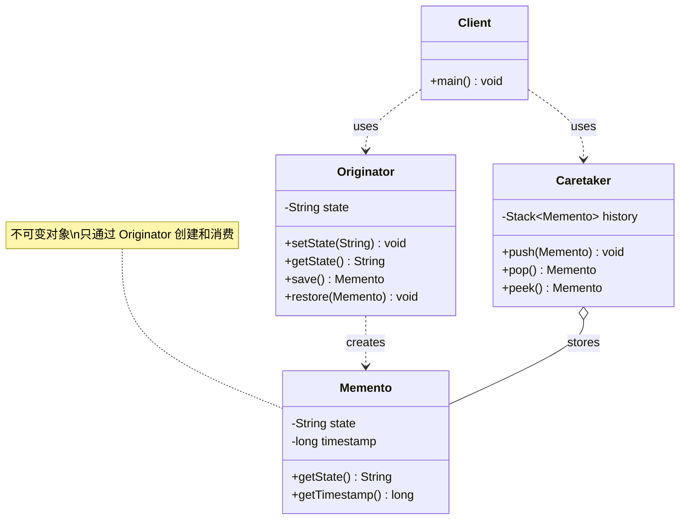

# 备忘录 Memento

> 在不破坏封装的前提下，捕获对象的内部状态，以便之后恢复。

## 意图

备忘录模式让你可以"保存"一个对象的状态快照，并在需要时"恢复"到之前的状态。就像游戏中的存档功能——你可以在关键节点保存进度，打不过 Boss 就从存档恢复，重新挑战。

核心是三个角色：

| 角色 | 职责 | 类比 |
|------|------|------|
| Originator（发起人） | 需要保存状态的对象，创建和恢复备忘录 | 游戏角色 |
| Memento（备忘录） | 存储发起人的内部状态快照 | 存档文件 |
| Caretaker（管理者） | 负责保存和提供备忘录，但不修改内容 | 存档系统 |

:::tip 备忘录模式的关键洞察
备忘录模式的核心是**"状态快照 + 不破坏封装"**。外部（管理者）不能直接读取或修改发起人的内部状态，只能通过发起人提供的方法来创建和恢复备忘录。这保证了发起人的封装性不被破坏。
:::

## 适用场景

- 需要保存和恢复对象状态的场景（撤销/重做）
- 需要提供回滚操作时（事务回滚、数据库备份恢复）
- 需要记录对象的历史状态时（操作日志、版本控制）
- 不希望直接暴露对象的内部状态给外部时
- 游戏存档/读档、编辑器撤销/重做

## UML 类图



## 代码示例

### ❌ 没有使用该模式的问题

```java
// 糟糕的设计：直接暴露内部状态，破坏封装性
public class TextEditor {
    private String content;

    public String getContent() { return content; }
    public void setContent(String content) { this.content = content; }
}

// 客户端需要自己管理历史状态——逻辑散落在各处
public class Client {
    public static void main(String[] args) {
        TextEditor editor = new TextEditor();
        editor.setContent("Hello");
        String backup1 = editor.getContent();  // 手动保存快照

        editor.setContent("Hello World");
        String backup2 = editor.getContent();  // 又手动保存

        editor.setContent("Hello World!");

        // 想撤销？
        editor.setContent(backup2);  // 手动恢复——谁记得该恢复哪个备份？

        // 问题1：状态管理逻辑散落在客户端，不好维护
        // 问题2：客户端直接访问内部状态，破坏封装
        // 问题3：保存什么状态、保存多少，全靠客户端自觉
        // 问题4：无法限制撤销次数、无法做快照压缩等优化
    }
}
```

**运行结果**：

```
Hello World
```

### ✅ 使用该模式后的改进

```java
// ============ 备忘录（不可变对象） ============
// 关键：备忘录应该是不可变的，防止被篡改
public class EditorMemento {
    private final String content;      // 快照的内容
    private final long timestamp;      // 快照时间戳
    private final int cursorPosition;  // 快照时光标位置

    public EditorMemento(String content, int cursorPosition) {
        this.content = content;             // 只能通过构造函数设置
        this.cursorPosition = cursorPosition;
        this.timestamp = System.currentTimeMillis();
    }

    // 只提供 getter，不提供 setter——保证不可变
    public String getContent() { return content; }
    public int getCursorPosition() { return cursorPosition; }
    public long getTimestamp() { return timestamp; }
}

// ============ 发起人：文本编辑器 ============
public class TextEditor {
    private String content;       // 编辑器内容
    private int cursorPosition;   // 光标位置

    public TextEditor() {
        this.content = "";
        this.cursorPosition = 0;
    }

    // 写入文本
    public void write(String text) {
        content += text;
        cursorPosition = content.length();
        System.out.println("写入: \"" + text + "\" → 内容: \"" + content + "\"");
    }

    // 删除最后一个字符（退格）
    public void backspace() {
        if (content.length() > 0) {
            content = content.substring(0, content.length() - 1);
            cursorPosition = content.length();
            System.out.println("退格 → 内容: \"" + content + "\"");
        }
    }

    // 获取当前内容
    public String getContent() {
        return content;
    }

    // 创建备忘录（保存快照）
    public EditorMemento save() {
        EditorMemento memento = new EditorMemento(content, cursorPosition);
        System.out.println("💾 保存快照: \"" + content + "\"");
        return memento;
    }

    // 从备忘录恢复（恢复快照）
    public void restore(EditorMemento memento) {
        this.content = memento.getContent();
        this.cursorPosition = memento.getCursorPosition();
        System.out.println("🔄 恢复快照: \"" + content + "\" (时间: " +
            new java.util.Date(memento.getTimestamp()) + ")");
    }
}

// ============ 管理者：编辑器历史 ============
public class EditorHistory {
    private final Stack<EditorMemento> undoStack = new Stack<>();  // 撤销栈
    private final int maxSize;  // 最大保存数量，防止内存溢出

    public EditorHistory(int maxSize) {
        this.maxSize = maxSize;
    }

    // 保存快照到撤销栈
    public void push(EditorMemento memento) {
        if (undoStack.size() >= maxSize) {
            // 超过最大数量，丢弃最旧的快照
            undoStack.remove(0);
            System.out.println("⚠️ 撤销栈已满，丢弃最旧的快照");
        }
        undoStack.push(memento);
    }

    // 弹出最近的快照（撤销）
    public EditorMemento undo() {
        if (undoStack.isEmpty()) {
            throw new RuntimeException("没有可以撤销的操作了");
        }
        return undoStack.pop();
    }

    // 查看最近的快照（不弹出）
    public EditorMemento peek() {
        if (undoStack.isEmpty()) {
            throw new RuntimeException("没有历史快照");
        }
        return undoStack.peek();
    }

    // 当前历史记录数量
    public int size() {
        return undoStack.size();
    }
}

// ============ 客户端使用 ============
public class Main {
    public static void main(String[] args) {
        TextEditor editor = new TextEditor();
        EditorHistory history = new EditorHistory(5);  // 最多保存5个快照

        System.out.println("=== 编辑操作 ===");
        editor.write("Hello");
        history.push(editor.save());  // 快照1: "Hello"

        editor.write(" World");
        history.push(editor.save());  // 快照2: "Hello World"

        editor.write("!");
        history.push(editor.save());  // 快照3: "Hello World!"

        System.out.println("\n=== 撤销操作 ===");
        editor.restore(history.undo());  // 恢复到快照2: "Hello World"

        System.out.println("\n=== 继续撤销 ===");
        editor.restore(history.undo());  // 恢复到快照1: "Hello"

        System.out.println("\n=== 继续编辑 ===");
        editor.write(" Java");
        history.push(editor.save());  // 快照4: "Hello Java"

        System.out.println("\n=== 查看历史 ===");
        System.out.println("当前历史记录数量: " + history.size());
    }
}
```

**运行结果**：

```
=== 编辑操作 ===
写入: "Hello" → 内容: "Hello"
💾 保存快照: "Hello"
写入: " World" → 内容: "Hello World"
💾 保存快照: "Hello World"
写入: "!" → 内容: "Hello World!"
💾 保存快照: "Hello World!"

=== 撤销操作 ===
🔄 恢复快照: "Hello World" (时间: Mon Apr 07 16:22:00 CST 2026)

=== 继续撤销 ===
🔄 恢复快照: "Hello" (时间: Mon Apr 07 16:22:00 CST 2026)

=== 继续编辑 ===
写入: " Java" → 内容: "Hello Java"
💾 保存快照: "Hello Java"

=== 查看历史 ===
当前历史记录数量: 3
```

### 变体与扩展

**1. 带重做的备忘录（Undo + Redo）**

```java
// 管理者同时维护撤销栈和重做栈
public class EditorHistoryWithRedo {
    private final Stack<EditorMemento> undoStack = new Stack<>();
    private final Stack<EditorMemento> redoStack = new Stack<>();

    // 执行新操作时：保存快照，清空重做栈
    public void save(EditorMemento memento) {
        undoStack.push(memento);
        redoStack.clear();  // 新操作让重做历史失效
    }

    // 撤销：从撤销栈弹出，压入重做栈
    public EditorMemento undo() {
        if (undoStack.isEmpty()) throw new RuntimeException("无法撤销");
        EditorMemento memento = undoStack.pop();
        redoStack.push(memento);
        return memento;
    }

    // 重做：从重做栈弹出，压回撤销栈
    public EditorMemento redo() {
        if (redoStack.isEmpty()) throw new RuntimeException("无法重做");
        EditorMemento memento = redoStack.pop();
        undoStack.push(memento);
        return memento;
    }
}
```

**2. 增量快照（节省内存）**

```java
// 不保存完整状态，只保存变化量
public class IncrementalMemento {
    private final String addedText;      // 新增的文本
    private final int deletedCount;      // 删除的字符数
    private final long timestamp;

    public IncrementalMemento(String addedText, int deletedCount) {
        this.addedText = addedText;
        this.deletedCount = deletedCount;
        this.timestamp = System.currentTimeMillis();
    }

    public String getAddedText() { return addedText; }
    public int getDeletedCount() { return deletedCount; }
}

// 发起人需要支持增量恢复
public class TextEditorWithIncremental {
    private String content;

    // 创建增量快照
    public IncrementalMemento saveDelta(String added, int deleted) {
        return new IncrementalMemento(added, deleted);
    }

    // 从增量快照恢复（反向操作）
    public void restoreDelta(IncrementalMemento memento) {
        // 撤销"添加"= 删除最后 n 个字符
        if (memento.getAddedText() != null && !memento.getAddedText().isEmpty()) {
            int len = memento.getAddedText().length();
            content = content.substring(0, content.length() - len);
        }
        // 撤销"删除"= 重新插入（但被删的内容丢了，需要额外保存）
        // 这就是增量快照的局限——需要额外信息来完全恢复
    }
}
```

:::warning 完整快照 vs 增量快照
- **完整快照**：每次保存整个状态，恢复简单但内存占用大
- **增量快照**：只保存变化量，内存占用小但恢复逻辑复杂，且可能丢失信息
实际项目（如 Git）通常采用混合策略：完整快照 + 增量快照交替（类似 Git 的 pack 文件机制）。
:::

### 运行结果

上面代码的完整运行输出已在代码示例中展示。核心要点：

- 备忘录是不可变的，只能通过发起人创建和消费
- 管理者只负责存储，不修改备忘录内容
- 撤销操作通过栈的 LIFO 特性实现
- 支持最大保存数量限制，防止内存溢出

## Spring/JDK 中的应用

### 1. Spring 的事务管理

Spring 的 `@Transactional` 事务回滚本质上是备忘录模式——事务开始前保存数据状态，失败时恢复：

```java
// Spring 事务回滚 = 备忘录模式
@Service
public class TransferService {

    @Transactional  // Spring 在方法开始前保存数据快照
    public void transferMoney(Long fromId, Long toId, double amount) {
        // 操作1：扣款
        accountRepository.debit(fromId, amount);
        // 如果这里抛异常 → Spring 自动回滚（恢复到事务开始前的状态）

        // 操作2：加款
        accountRepository.credit(toId, amount);
        // 如果这里抛异常 → 两个操作都回滚

        // Spring 内部通过 TransactionSynchronizationManager 管理事务状态
        // 底层数据库通过 undo log 记录操作前的数据（备忘录）
        // 回滚时根据 undo log 恢复数据（restore）
    }
}

// Spring 的事务同步管理器
TransactionSynchronizationManager.bindResource(
    "sessionFactory",
    new SessionHolder(session)  // 保存 Session 状态
);
// 事务完成后解绑（恢复或清理）
TransactionSynchronizationManager.unbindResource("sessionFactory");
```

### 2. Java 的序列化（Serialization）

Java 的序列化/反序列化机制天然支持备忘录模式——把对象状态保存到字节流，需要时再恢复：

```java
// 通过序列化创建备忘录
public class SerializableMemento implements Serializable {
    private String state;
    // ... 其他需要保存的字段

    // 序列化 = 保存快照到文件
    public void saveToFile(String filename) throws IOException {
        try (ObjectOutputStream oos = new ObjectOutputStream(
                new FileOutputStream(filename))) {
            oos.writeObject(this);  // 把整个对象写入文件
        }
    }

    // 反序列化 = 从文件恢复快照
    public static SerializableMemento loadFromFile(String filename)
            throws IOException, ClassNotFoundException {
        try (ObjectInputStream ois = new ObjectInputStream(
                new FileInputStream(filename))) {
            return (SerializableMemento) ois.readObject();  // 恢复对象
        }
    }
}

// 使用
SerializableMemento memento = new SerializableMemento();
memento.setState("some state");
memento.saveToFile("backup.ser");  // 保存快照

// 之后需要恢复时
SerializableMemento restored = SerializableMemento.loadFromFile("backup.ser");
// restored 的状态和保存时完全一样
```

### 3. StatefulRedisConnectionFactory 的状态保存

Spring Data Redis 中，连接池的状态保存也体现了备忘录思想：

```java
// Redis 连接工厂可以保存和恢复连接池状态
// LettuceConnectionFactory 支持动态配置
LettuceConnectionFactory factory = new LettuceConnectionFactory();
factory.start();

// 保存当前配置状态
String snapshot = factory.getConfiguration().toString();

// 修改配置
factory.setDatabase(1);
factory.afterPropertiesSet();

// 需要时可以恢复到之前的配置
```

## 优缺点

| 优点 | 详细说明 |
|------|----------|
| **不破坏封装性** | 备忘录是发起人内部状态的快照，外部不能直接访问发起人的内部状态 |
| **简化发起人** | 发起人不需要自己管理状态历史，委托给管理者 |
| **支持撤销/重做** | 通过栈结构自然支持撤销和重做操作 |
| **状态快照可持久化** | 备忘录可以序列化到磁盘，实现持久化的撤销功能 |
| **历史可追溯** | 可以保存多个快照，实现版本历史和回溯 |

| 缺点 | 详细说明 |
|------|----------|
| **内存消耗大** | 频繁保存完整状态快照会消耗大量内存，对象越大开销越大 |
| **管理者存储负担** | 管理者需要存储大量备忘录对象，需要做容量限制和清理策略 |
| **快照一致性** | 如果对象引用了其他对象，需要深拷贝来确保快照的独立性 |
| **序列化开销** | 持久化备忘录时，序列化/反序列化有性能开销 |
| **状态恢复可能不完整** | 如果对象状态涉及外部资源（数据库连接、文件句柄），单纯恢复内存状态可能不够 |

## 面试追问

### Q1: 备忘录模式和命令模式都可以实现撤销，有什么区别？应该选哪个？

**A:** 核心区别在于**撤销的实现方式不同**：

| 维度 | 命令模式 | 备忘录模式 |
|------|----------|------------|
| 撤销方式 | 记录操作，反向执行 | 保存状态，恢复快照 |
| 粒度 | 精确到单个操作 | 粗粒度（整个状态） |
| 内存占用 | 小（只记录操作和参数） | 大（保存完整状态） |
| 适用场景 | 操作简单、可逆 | 状态复杂、难以精确逆向 |
| 示例 | 文本编辑器撤销输入 | 游戏存档/读档 |

**选择建议**：
- 操作简单且可逆（增删改查）→ **命令模式**（内存友好）
- 状态复杂且难以精确逆向（图形编辑器、游戏状态）→ **备忘录模式**（实现简单）
- 两者也可以结合：命令模式记录操作 + 备忘录保存关键节点的完整状态

### Q2: 如何限制备忘录的存储数量，避免内存溢出？

**A:** 有四种常见策略：

```java
// 策略1：固定容量 + FIFO 淘汰
public class BoundedHistory {
    private final LinkedList<EditorMemento> history = new LinkedList<>();
    private final int maxSize;

    public BoundedHistory(int maxSize) {
        this.maxSize = maxSize;
    }

    public void push(EditorMemento memento) {
        if (history.size() >= maxSize) {
            history.removeFirst();  // 淘汰最旧的
        }
        history.addLast(memento);
    }
}

// 策略2：弱引用，让 GC 自动回收
public class WeakHistory {
    private final List<WeakReference<EditorMemento>> history = new ArrayList<>();

    public void push(EditorMemento memento) {
        history.add(new WeakReference<>(memento));
    }

    public EditorMemento undo() {
        // 遍历找到还没被 GC 回收的备忘录
        for (int i = history.size() - 1; i >= 0; i--) {
            EditorMemento m = history.get(i).get();
            if (m != null) {
                history.remove(i);
                return m;
            }
        }
        throw new RuntimeException("没有可撤销的快照");
    }
}

// 策略3：定期持久化到磁盘，减少内存占用
public void flushToDisk(List<EditorMemento> snapshots) {
    try (ObjectOutputStream oos = new ObjectOutputStream(
            new FileOutputStream("history.dat"))) {
        oos.writeObject(snapshots);
    } catch (IOException e) {
        throw new RuntimeException("持久化失败", e);
    }
}

// 策略4：增量快照，只保存变化量
// 类似 Git 的做法：完整快照 + 增量快照交替
```

:::tip 实际项目中的做法
IDE（如 IntelliJ IDEA）通常使用**混合策略**：最近的操作用命令模式（内存友好），定期做一次完整快照（备忘录模式），关闭时持久化到磁盘。这样既节省内存，又能在打开项目时恢复状态。
:::

### Q3: 备忘录模式如何保证安全性（防止外部修改备忘录）？

**A:** 四种防护措施：

1. **不可变对象**：所有字段 `final`，只提供 getter
2. **内部类**：备忘录作为发起人的内部类，外部无法直接访问
3. **宽窄接口**：发起人可以访问备忘录的完整状态（宽接口），管理者只能持有备忘录引用但不能读取内容（窄接口）
4. **深拷贝**：保存状态时做深拷贝，防止外部通过引用修改原始状态

```java
// 宽窄接口的实现
public class TextEditor {
    // 宽接口：发起人可见的完整备忘录
    private static class EditorMementoImpl implements EditorMemento {
        private final String content;
        // ... 完整的状态和访问方法
    }

    // 窄接口：外部（管理者）只能看到这个接口
    public interface EditorMemento {
        // 没有任何方法！管理者拿到的只是一个"令牌"
        // 只有发起人能把它转回 EditorMementoImpl 读取内容
    }

    // 创建备忘录（返回窄接口）
    public EditorMemento save() {
        return new EditorMementoImpl(this.content);
    }

    // 恢复备忘录（接收窄接口，内部转型）
    public void restore(EditorMemento memento) {
        EditorMementoImpl impl = (EditorMementoImpl) memento;
        this.content = impl.content;
    }
}
```

### Q4: 如果发起人的状态包含大量数据（比如一个 100MB 的文档），备忘录模式还适用吗？

**A:** 直接保存完整快照太耗内存了，需要优化策略：

1. **命令模式代替**：记录操作而非状态（"在第 500 行插入了 'Hello'" 比 "整个文档内容" 省得多）
2. **增量快照**：只保存变化的部分，类似 Git 的 delta 存储
3. **Copy-on-Write**：使用 COW 数据结构，只在修改时复制变化的部分
4. **外部存储**：把快照序列化到磁盘或数据库，内存中只保留引用
5. **压缩**：对快照数据做压缩（如 LZ4、Snappy），减少内存/磁盘占用

```java
// Copy-on-Write 示例
public class COWTextEditor {
    private char[] content = new char[0];  // 当前内容

    public EditorMemento save() {
        // COW：保存时复制当前内容的引用（不是深拷贝）
        // 因为 content 是 final 的 char[]，不会被修改
        return new EditorMemento(content);
    }

    public void write(String text) {
        // COW：修改时创建新的数组，不影响之前的快照
        char[] newContent = new char[content.length + text.length()];
        System.arraycopy(content, 0, newContent, 0, content.length);
        text.getChars(0, text.length(), newContent, content.length);
        content = newContent;  // 指向新数组
    }
}
```

## 相关模式

- **命令模式**：命令模式通过反向操作撤销，备忘录通过恢复状态撤销——两种互补的撤销策略
- **状态模式**：状态模式管理当前状态（一个状态），备忘录保存历史状态（多个快照）
- **原型模式**：备忘录可以用原型模式（深拷贝）来创建状态快照
- **迭代器模式**：迭代器可以在遍历时用备忘录保存当前位置
- **策略模式**：不同的快照策略（完整/增量/压缩）可以用策略模式来管理
