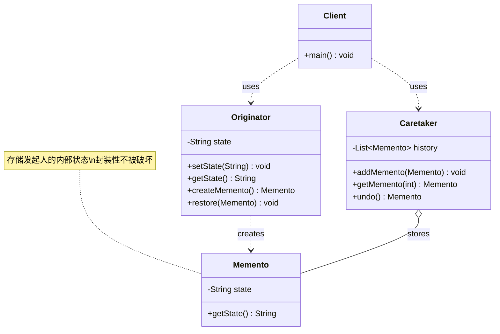

# 备忘录 Memento

> 在不破坏封装的前提下，捕获对象的内部状态，以便之后恢复。

## 意图

备忘录模式让你可以"保存"一个对象的状态快照，并在需要时"恢复"到之前的状态。就像游戏中的存档功能——你可以在关键节点保存进度，失败了就从存档恢复。

核心是三个角色：发起人（需要保存状态的对象）、备忘录（存储状态快照）、管理者（管理备忘录的存储和恢复）。

## 适用场景

- 需要保存和恢复对象状态的场景（撤销/重做）
- 需要提供回滚操作时（事务回滚）
- 需要记录对象的历史状态时
- 不希望直接暴露对象的内部状态给外部时

## UML 类图



## 代码示例

### ❌ 没有使用该模式的问题

```java
// 直接暴露内部状态，破坏封装性
public class TextEditor {
    private String content;

    public String getContent() { return content; }
    public void setContent(String content) { this.content = content; }
}

// 客户端需要自己管理历史状态
public class Client {
    public static void main(String[] args) {
        TextEditor editor = new TextEditor();
        editor.setContent("Hello");
        String backup1 = editor.getContent(); // 手动保存
        editor.setContent("Hello World");
        String backup2 = editor.getContent(); // 手动保存
        editor.setContent("Hello World!");
        editor.setContent(backup2); // 手动恢复
        // 状态管理逻辑散落在客户端
    }
}
```

### ✅ 使用该模式后的改进

```java
// 备忘录（不可变）
public class EditorMemento {
    private final String content;
    private final long timestamp;

    public EditorMemento(String content) {
        this.content = content;
        this.timestamp = System.currentTimeMillis();
    }

    public String getContent() { return content; }
    public long getTimestamp() { return timestamp; }
}

// 发起人
public class TextEditor {
    private String content;

    public void write(String text) {
        this.content = (content == null ? "" : content) + text;
    }

    public String getContent() { return content; }

    // 创建备忘录
    public EditorMemento save() {
        return new EditorMemento(content);
    }

    // 从备忘录恢复
    public void restore(EditorMemento memento) {
        this.content = memento.getContent();
    }
}

// 管理者（支持撤销栈）
public class EditorHistory {
    private final Stack<EditorMemento> history = new Stack<>();

    public void push(EditorMemento memento) {
        history.push(memento);
    }

    public EditorMemento pop() {
        if (history.isEmpty()) {
            throw new RuntimeException("没有可以撤销的操作");
        }
        return history.pop();
    }
}

// 使用
public class Main {
    public static void main(String[] args) {
        TextEditor editor = new TextEditor();
        EditorHistory history = new EditorHistory();

        editor.write("Hello");
        history.push(editor.save());

        editor.write(" World");
        history.push(editor.save());

        editor.write("!");
        System.out.println(editor.getContent()); // Hello World!

        // 撤销
        editor.restore(history.pop());
        System.out.println(editor.getContent()); // Hello World

        // 再次撤销
        editor.restore(history.pop());
        System.out.println(editor.getContent()); // Hello
    }
}
```

### Spring 中的应用

Spring 的事务管理机制就用到了备忘录的思想：

```java
// Spring 事务回滚本质上是备忘录模式
// TransactionSynchronizationManager 保存了事务状态快照

@Transactional
public void transferMoney(Long fromId, Long toId, double amount) {
    // Spring 在事务开始前保存了数据库状态
    accountRepository.debit(fromId, amount);
    accountRepository.credit(toId, amount);
    // 如果这里抛出异常，Spring 自动回滚（恢复到保存的状态）
}

// Spring State Machine 也提供了状态历史记录功能
// 可以保存和恢复状态机的状态
```

## 优缺点

| 优点 | 缺点 |
|------|------|
| 不破坏封装性，外部不能直接访问对象内部状态 | 如果频繁保存状态，会消耗大量内存 |
| 提供了状态恢复的机制 | 管理者需要存储大量备忘录对象 |
| 简化了发起人的状态保存逻辑 | 备忘录的存储和回收需要额外管理 |
| 支持撤销/重做功能 | Java 中的序列化/反序列化可能有性能开销 |

## 面试追问

**Q1: 备忘录模式和命令模式都可以实现撤销，有什么区别？**

A: 命令模式通过记录操作来实现撤销（undo = 反向操作），适合操作简单的场景。备忘录模式通过保存状态快照来实现撤销（undo = 恢复状态），适合状态复杂的场景。命令模式的撤销更精确（可以撤销单个操作），备忘录模式的撤销更粗粒度（恢复整个状态）。

**Q2: 如何限制备忘录的存储数量，避免内存溢出？**

A: 1) 设置最大保存数量，超过后丢弃最旧的备忘录；2) 使用弱引用（WeakReference）让 GC 自动回收不常用的备忘录；3) 定期持久化到磁盘，减少内存占用；4) 只保存状态的变化量（增量快照），而不是完整快照。

**Q3: 备忘录模式如何保证安全性（防止外部修改备忘录）？**

A: 1) 将备忘录设计为不可变对象（所有字段 final）；2) 将备忘录设为发起人的内部类，外部无法直接访问；3) 只提供 getter 不提供 setter；4) 使用深拷贝保存状态，防止外部通过引用修改原始状态。

## 相关模式

- **命令模式**：命令模式通过反向操作撤销，备忘录通过恢复状态撤销
- **状态模式**：状态模式管理当前状态，备忘录保存历史状态
- **原型模式**：备忘录可以用原型模式来创建状态快照
- **迭代器模式**：迭代器可以在遍历时用备忘录保存位置
