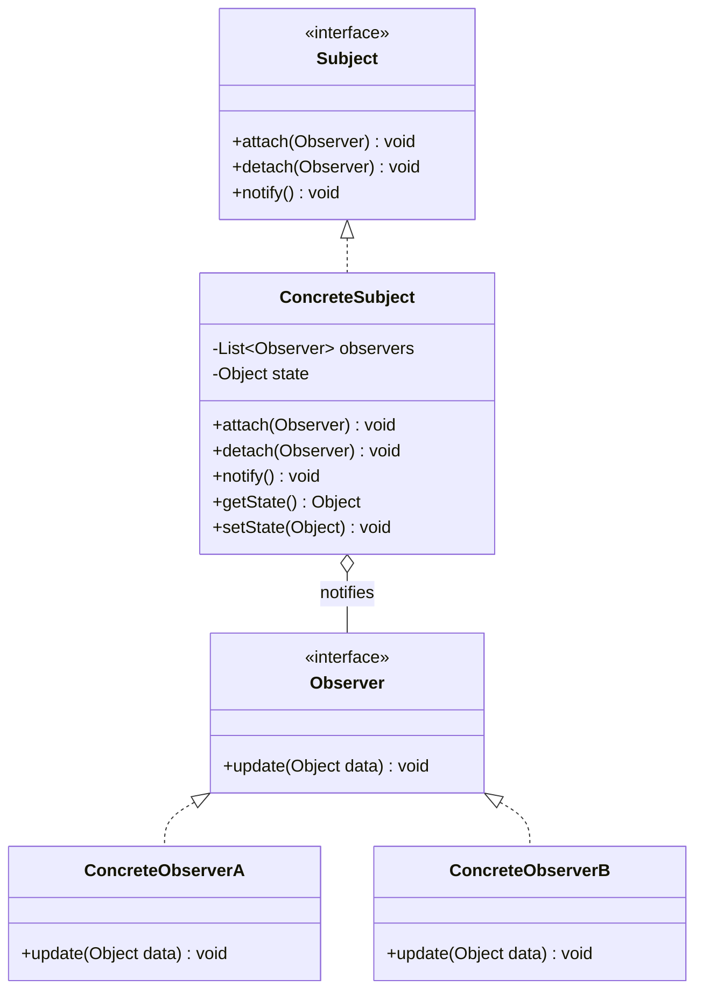

# 观察者 Observer

> 定义对象间的一对多依赖关系，当一个对象状态改变时，所有依赖它的对象都会收到通知。

## 意图

观察者模式建立了一种"发布-订阅"机制。被观察者（主题）维护一个观察者列表，当自身状态变化时，自动通知所有观察者。观察者不需要主动轮询主题的状态变化，实现了松耦合的通信。

就像微信公众号——你关注了一个公众号（订阅），它发布新文章时你会收到推送通知。你可以随时关注或取消关注。

## 适用场景

- 一个对象的变化需要通知其他对象，且不知道有多少个对象需要通知时
- 一个抽象模型有两个方面，其中一方面依赖另一方面时
- 需要实现事件驱动系统时
- MVC 架构中 Model 和 View 的同步

## UML 类图



## 代码示例

### ❌ 没有使用该模式的问题

```java
// 紧耦合，气象站每次更新都要手动通知所有显示器
public class WeatherData {
    private float temperature;
    private CurrentConditionDisplay display1;
    private StatisticsDisplay display2;
    private ForecastDisplay display3;

    public void measurementsChanged() {
        float temp = getTemperature();
        display1.update(temp);   // 手动通知
        display2.update(temp);   // 手动通知
        display3.update(temp);   // 手动通知
        // 新增显示器？要改这个方法
    }
}
```

### ✅ 使用该模式后的改进

```java
// 观察者接口
public interface Observer {
    void update(float temperature, float humidity, float pressure);
}

// 被观察者接口
public interface Subject {
    void attach(Observer observer);
    void detach(Observer observer);
    void notifyObservers();
}

// 具体被观察者
public class WeatherData implements Subject {
    private final List<Observer> observers = new ArrayList<>();
    private float temperature;
    private float humidity;
    private float pressure;

    @Override
    public void attach(Observer observer) {
        observers.add(observer);
    }

    @Override
    public void detach(Observer observer) {
        observers.remove(observer);
    }

    @Override
    public void notifyObservers() {
        for (Observer observer : observers) {
            observer.update(temperature, humidity, pressure);
        }
    }

    public void setMeasurements(float temperature, float humidity, float pressure) {
        this.temperature = temperature;
        this.humidity = humidity;
        this.pressure = pressure;
        notifyObservers();
    }
}

// 具体观察者
public class CurrentConditionDisplay implements Observer {
    @Override
    public void update(float temperature, float humidity, float pressure) {
        System.out.println("当前状况: 温度=" + temperature + "℃, 湿度=" + humidity + "%");
    }
}

public class StatisticsDisplay implements Observer {
    @Override
    public void update(float temperature, float humidity, float pressure) {
        System.out.println("统计信息: 温度=" + temperature + "℃, 气压=" + pressure + "hPa");
    }
}

// 使用
public class Main {
    public static void main(String[] args) {
        WeatherData weatherData = new WeatherData();
        weatherData.attach(new CurrentConditionDisplay());
        weatherData.attach(new StatisticsDisplay());

        weatherData.setMeasurements(25.5f, 65.0f, 1013.0f);
        weatherData.setMeasurements(26.0f, 60.0f, 1012.0f);
    }
}
```

### Spring 中的应用

Spring 的事件机制（ApplicationEvent）就是观察者模式：

```java
// 1. 定义事件
public class OrderCreatedEvent extends ApplicationEvent {
    private final Order order;
    public OrderCreatedEvent(Object source, Order order) {
        super(source);
        this.order = order;
    }
    public Order getOrder() { return order; }
}

// 2. 发布事件
@Service
public class OrderService {
    @Autowired
    private ApplicationEventPublisher eventPublisher;

    public void createOrder(Order order) {
        // 保存订单...
        eventPublisher.publishEvent(new OrderCreatedEvent(this, order));
    }
}

// 3. 监听事件（观察者）
@Component
public class EmailNotificationListener {
    @EventListener
    public void onOrderCreated(OrderCreatedEvent event) {
        System.out.println("发送邮件通知: 订单 " + event.getOrder().getId());
    }
}

@Component
public class InventoryListener {
    @EventListener
    public void onOrderCreated(OrderCreatedEvent event) {
        System.out.println("扣减库存: 订单 " + event.getOrder().getId());
    }
}
```

## 优缺点

| 优点 | 缺点 |
|------|------|
| 被观察者和观察者之间松耦合 | 通知顺序不可控 |
| 支持广播通信，一个通知多个 | 观察者过多时通知性能受影响 |
| 符合开闭原则，新增观察者无需修改被观察者 | 可能导致循环依赖（观察者互相通知） |
| 可以在运行时动态添加/删除观察者 | 如果某个观察者抛出异常，可能影响后续通知 |

## 面试追问

**Q1: 观察者模式和发布-订阅模式的区别？**

A: 观察者模式中，Subject 直接维护 Observer 列表并通知，两者有直接依赖。发布-订阅模式引入了事件总线/消息中间件，发布者和订阅者完全解耦，互不知道对方的存在。Spring 的 `@EventListener` 默认是观察者模式，集成 RabbitMQ/Kafka 后就变成了发布-订阅模式。

**Q2: 如何避免观察者通知时的异常传播？**

A: 1) 在 notify 方法中 try-catch 每个观察者的 update 调用，保证一个异常不影响其他观察者；2) 使用异步通知（Spring 的 `@Async` + `@EventListener`）；3) 将异常记录到日志中，由监控系统处理。

**Q3: Spring 中 `@EventListener` 的执行顺序怎么控制？**

A: 使用 `@Order` 注解或实现 `Ordered` 接口来控制执行顺序。数值越小优先级越高。也可以通过 `@Async` 将监听器改为异步执行。

## 相关模式

- **中介者模式**：观察者直接通信，中介者通过中间人协调
- **状态模式**：状态模式是特殊观察者，对象自身状态变化触发行为变化
- **责任链模式**：责任链处理请求，观察者通知变化
- **命令模式**：命令封装请求，观察者广播通知
