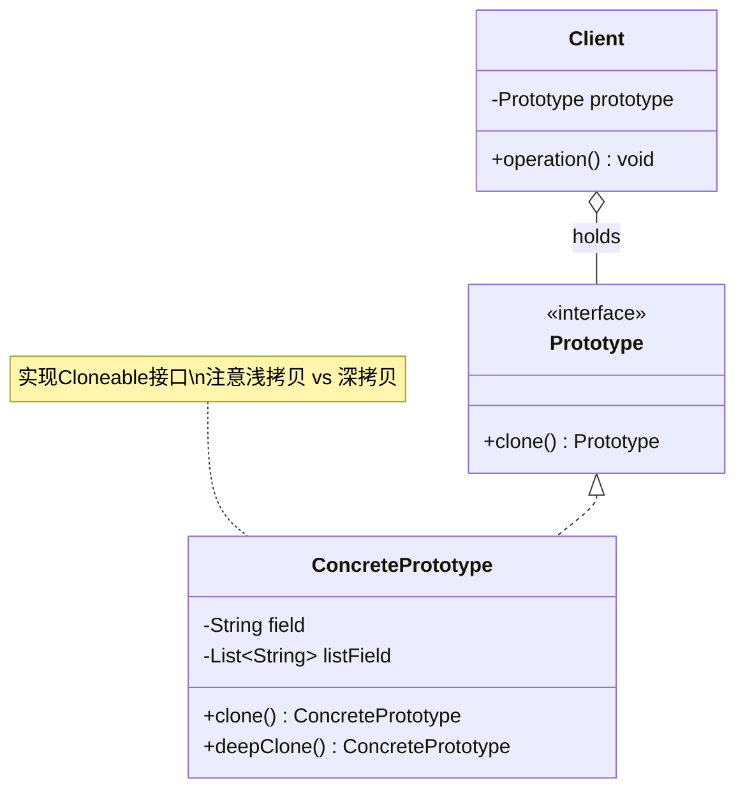

# 原型 Prototype

> 通过复制已有对象来创建新对象，而不是通过 new。

## 意图

原型模式通过克隆已有对象来创建新对象。当你需要创建一个与已有对象相同的副本时，直接克隆比手动创建再逐个设置属性要高效得多。特别适用于创建成本较高的对象——比如需要数据库查询、网络请求或复杂计算的初始化过程。

Java 中通过实现 `Cloneable` 接口并重写 `clone()` 方法来实现浅克隆，也可以通过序列化实现深克隆。

## 适用场景

- 创建新对象成本较大（需要大量计算、IO 操作等）时
- 需要创建大量相似对象时
- 系统需要独立于对象创建方式时
- 需要保护原有对象不被修改的场景（创建副本）

## UML 类图



## 代码示例

### ❌ 没有使用该模式的问题

```java
// 每次创建都要重新查询数据库，性能极差
public class EmailTemplate {
    private String subject;
    private String body;
    private List<String> attachments;

    public EmailTemplate(String templateId) {
        // 每次都从数据库查询模板
        Database.query("SELECT * FROM email_template WHERE id = " + templateId);
        this.subject = "欢迎加入";
        this.body = "尊敬的用户，欢迎加入我们的平台...";
        this.attachments = new ArrayList<>(Arrays.asList("guide.pdf", "faq.pdf"));
        System.out.println("从数据库加载模板，耗时操作...");
    }

    public void sendTo(String recipient) {
        System.out.println("发送邮件给: " + recipient);
    }
}

// 发 100 封邮件就要查 100 次数据库
for (String recipient : recipients) {
    EmailTemplate email = new EmailTemplate("welcome");
    email.sendTo(recipient);
}
```

### ✅ 使用该模式后的改进

```java
// 实现深克隆的原型
public class EmailTemplate implements Cloneable {
    private String subject;
    private String body;
    private List<String> attachments;

    public EmailTemplate(String templateId) {
        System.out.println("从数据库加载模板，耗时操作...");
        this.subject = "欢迎加入";
        this.body = "尊敬的用户，欢迎加入我们的平台...";
        this.attachments = new ArrayList<>(Arrays.asList("guide.pdf", "faq.pdf"));
    }

    // 浅克隆（注意：attachments 只是复制了引用）
    @Override
    public EmailTemplate clone() {
        try {
            EmailTemplate cloned = (EmailTemplate) super.clone();
            // 深克隆：手动复制引用类型字段
            cloned.attachments = new ArrayList<>(this.attachments);
            return cloned;
        } catch (CloneNotSupportedException e) {
            throw new RuntimeException("克隆失败", e);
        }
    }

    public void personalize(String recipient) {
        this.body = "尊敬的 " + recipient + "，欢迎加入我们的平台...";
    }

    public void sendTo(String recipient) {
        System.out.println("发送邮件给: " + recipient + ", 主题: " + this.subject);
    }
}

// 使用：只查一次数据库，后续全部克隆
public class Main {
    public static void main(String[] args) {
        // 只加载一次
        EmailTemplate template = new EmailTemplate("welcome");

        List<String> recipients = Arrays.asList("张三", "李四", "王五");
        for (String recipient : recipients) {
            EmailTemplate email = template.clone();
            email.personalize(recipient);
            email.sendTo(recipient);
        }
    }
}
```

### Spring 中的应用

Spring Bean 的原型作用域（Prototype Scope）就是原型模式的应用：

```java
// 每次注入都创建新实例
@Component
@Scope("prototype")
public class ShoppingCart {
    private List<String> items = new ArrayList<>();

    public void addItem(String item) {
        items.add(item);
    }

    public List<String> getItems() {
        return items;
    }
}

// 每次注入的 ShoppingCart 都是新的
@RestController
public class OrderController {
    @Autowired
    private ShoppingCart cart1; // 实例1

    @Autowired
    private ShoppingCart cart2; // 实例2（不同于cart1）

    @GetMapping("/order")
    public String createOrder() {
        cart1.addItem("商品A");
        cart2.addItem("商品B");
        // cart1 和 cart2 互不影响
        return "订单创建成功";
    }
}
```

## 优缺点

| 优点 | 缺点 |
|------|------|
| 避免重复的初始化操作，提升性能 | 深克隆实现复杂，需要处理嵌套引用 |
| 可以在运行时动态获取对象副本 | 需要为每个类实现克隆逻辑 |
| 可以保存对象的状态快照 | 克隆包含循环引用的对象时容易出问题 |
| 创建新对象时无需知道具体类 | 与单例模式结合使用时需注意一致性 |

## 面试追问

**Q1: 浅克隆和深克隆的区别？**

A: 浅克隆只复制基本类型和引用的地址，对象内部的引用类型仍然指向同一个对象。深克隆会递归复制所有引用类型的对象，完全独立的副本。Java 的 `Object.clone()` 是浅克隆，实现深克隆可以通过手动复制、序列化/反序列化（推荐 `Serializable`）、或者使用 Apache Commons Lang 的 `SerializationUtils.clone()`。

**Q2: 为什么不推荐使用 Java 的 Cloneable 接口？**

A: Cloneable 接口是一个标记接口，没有 clone() 方法声明，违反了接口设计原则。`Object.clone()` 是 protected 的，需要反射调用或子类重写。浅拷贝容易出错，容易忘记复制引用类型字段。更推荐的方式是：拷贝构造方法（Copy Constructor）或使用序列化实现深拷贝。

**Q3: Spring 中 Bean 的 prototype 作用域和 singleton 作用域的区别？**

A: Singleton 是默认作用域，整个 IoC 容器中只有一个实例，所有注入点共享同一个 Bean。Prototype 是每次请求/注入都创建一个新的实例。注意：singleton Bean 中注入 prototype Bean 时，prototype 只会在 singleton 初始化时创建一次。要每次都获取新实例，需要使用 `ObjectFactory` 或 `@Lookup` 方法注入。

## 相关模式

- **单例模式**：与原型模式相反，单例保证只有一个实例
- **建造者模式**：建造者模式逐步构建对象，原型模式直接复制
- **备忘录模式**：备忘录可以用原型模式来保存和恢复对象状态
