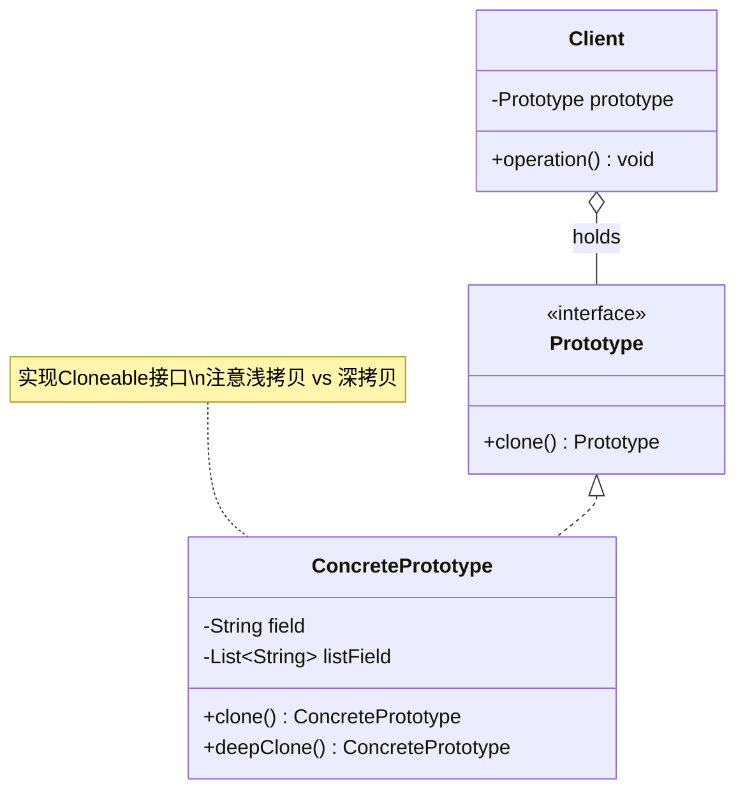

# 原型 Prototype

> 通过复制已有对象来创建新对象，而不是通过 new。

## 意图

原型模式通过克隆已有对象来创建新对象。当你需要创建一个与已有对象相同的副本时，直接克隆比手动创建再逐个设置属性要高效得多。特别适用于创建成本较高的对象——比如需要数据库查询、网络请求或复杂计算的初始化过程。

打个比方：你要打印 100 份同样的文件。你是每次打开电脑重新打一份（new），还是打印一份原件然后复印 99 份（clone）？显然复印更快更省事。原型模式就是"复印机"——先创建一个原型对象（原件），之后所有新对象都通过克隆原型得到。

Java 中通过实现 `Cloneable` 接口并重写 `clone()` 方法来实现浅克隆，也可以通过序列化实现深克隆。

:::tip 原型 vs 工厂
工厂模式是"按图纸造新产品"，原型模式是"按样品复印"。工厂创建的对象可以和原型不同（不同参数），原型创建的对象是原型的副本。
:::

## 适用场景

- 创建新对象成本较大（需要大量计算、IO 操作、数据库查询等）时
- 需要创建大量相似对象，且创建过程很耗时
- 系统需要独立于对象创建方式，运行时动态获取对象副本时
- 需要保护原有对象不被修改的场景（创建副本后再操作）
- 需要保存和恢复对象状态（如撤销操作）时

## UML 类图



## 代码示例

### ❌ 没有使用该模式的问题

```java
// ========== 痛点：每次 new 都要重新初始化，性能极差 ==========

// 邮件模板：每次创建都要查数据库
public class EmailTemplate {
    private String subject;
    private String body;
    private String footer;
    private List<String> attachments;
    private Map<String, String> variables;

    public EmailTemplate(String templateId) {
        // 痛点1：每次 new 都要查数据库，100 封邮件查 100 次
        System.out.println("[数据库] 查询邮件模板: " + templateId + " ...");
        this.subject = "欢迎加入我们的平台";
        this.body = "尊敬的用户，欢迎加入...请点击链接激活账号";
        this.footer = "此邮件由系统自动发送，请勿回复";
        this.attachments = new ArrayList<>(Arrays.asList("用户手册.pdf", "常见问题.pdf"));
        this.variables = new HashMap<>();
        this.variables.put("platform", "Java 全栈知识库");
        this.variables.put("year", "2024");
        System.out.println("[完成] 模板加载成功");
    }

    // 个性化方法
    public void personalize(String recipient) {
        this.body = "尊敬的 " + recipient + "，欢迎加入...";
    }

    public void sendTo(String recipient) {
        System.out.println("发送邮件给: " + recipient + ", 主题: " + this.subject);
    }
}

// 痛点2：发 100 封邮件就要查 100 次数据库，慢到爆炸
public class Main {
    public static void main(String[] args) {
        List<String> recipients = Arrays.asList("张三", "李四", "王五", "赵六");

        for (String recipient : recipients) {
            // 每次 new 都查一次数据库...太慢了
            EmailTemplate email = new EmailTemplate("welcome-template");
            email.personalize(recipient);
            email.sendTo(recipient);
        }
        // 输出 4 次 "[数据库] 查询邮件模板" + 4 次 "[完成] 模板加载成功"
        // 如果有 10000 个用户呢？
    }
}
```

### ✅ 使用该模式后的改进

```java
// ========== 实现深克隆的原型类 ==========

import java.io.*;

public class EmailTemplate implements Cloneable, Serializable {
    private static final long serialVersionUID = 1L;

    // 基本类型字段：浅克隆就能正确复制
    private String subject;
    private String body;
    private String footer;

    // 引用类型字段：浅克隆只复制引用，需要深克隆
    private List<String> attachments;
    private Map<String, String> variables;

    // 构造方法：包含昂贵的初始化操作
    public EmailTemplate(String templateId) {
        System.out.println("[数据库] 查询邮件模板: " + templateId + " ...");
        this.subject = "欢迎加入我们的平台";
        this.body = "尊敬的用户，欢迎加入...请点击链接激活账号";
        this.footer = "此邮件由系统自动发送，请勿回复";
        this.attachments = new ArrayList<>(Arrays.asList("用户手册.pdf", "常见问题.pdf"));
        this.variables = new HashMap<>();
        this.variables.put("platform", "Java 全栈知识库");
        this.variables.put("year", "2024");
        System.out.println("[完成] 模板加载成功（仅此一次）");
    }

    // ===== 方式1：手动深克隆（推荐，性能好，可控） =====
    @Override
    public EmailTemplate clone() {
        try {
            EmailTemplate cloned = (EmailTemplate) super.clone();
            // 手动深克隆引用类型字段
            // new ArrayList<>(this.attachments) 创建了新的列表，元素是 String 不可变所以没问题
            cloned.attachments = new ArrayList<>(this.attachments);
            // new HashMap<>(this.variables) 同理
            cloned.variables = new HashMap<>(this.variables);
            return cloned;
        } catch (CloneNotSupportedException e) {
            // Cloneable 是标记接口，不会抛异常，但编译器要求 catch
            throw new RuntimeException("克隆失败", e);
        }
    }

    // ===== 方式2：序列化深克隆（通用但慢，需要 Serializable） =====
    @SuppressWarnings("unchecked")
    public EmailTemplate deepClone() {
        try {
            // 将对象序列化为字节数组
            ByteArrayOutputStream bos = new ByteArrayOutputStream();
            ObjectOutputStream oos = new ObjectOutputStream(bos);
            oos.writeObject(this);
            oos.close();

            // 从字节数组反序列化为新对象
            ByteArrayInputStream bis = new ByteArrayInputStream(bos.toByteArray());
            ObjectInputStream ois = new ObjectInputStream(bis);
            return (EmailTemplate) ois.readObject();
        } catch (IOException | ClassNotFoundException e) {
            throw new RuntimeException("深克隆失败", e);
        }
    }

    // 个性化方法：修改克隆后的副本，不影响原型
    public void personalize(String recipient) {
        this.body = "尊敬的 " + recipient + "，欢迎加入我们的平台...";
    }

    public void sendTo(String recipient) {
        System.out.println("发送邮件给: " + recipient + ", 主题: " + this.subject);
    }

    // 用于验证深克隆是否正确
    public void addAttachment(String attachment) {
        this.attachments.add(attachment);
    }

    public List<String> getAttachments() {
        return this.attachments;
    }

    @Override
    public String toString() {
        return "EmailTemplate{subject='" + subject + "', attachments=" + attachments + "}";
    }
}

// ========== 使用示例 ==========

public class Main {
    public static void main(String[] args) {
        System.out.println("===== 只加载一次模板，后续全部克隆 =====\n");

        // 步骤1：加载原型（只查一次数据库）
        EmailTemplate prototype = new EmailTemplate("welcome-template");

        System.out.println();

        // 步骤2：为每个收件人克隆副本
        List<String> recipients = Arrays.asList("张三", "李四", "王五", "赵六");
        for (String recipient : recipients) {
            // 克隆：不需要查数据库，瞬间完成
            EmailTemplate email = prototype.clone();
            email.personalize(recipient);
            email.sendTo(recipient);
        }

        System.out.println("\n===== 验证深克隆：修改副本不影响原型 =====");
        EmailTemplate clone1 = prototype.clone();
        clone1.addAttachment("个人简历.pdf");
        System.out.println("原型附件: " + prototype.getAttachments());
        System.out.println("副本附件: " + clone1.getAttachments());
        // 如果是浅克隆，原型和副本的 attachments 会互相影响
        // 深克隆后，它们完全独立
    }
}
```

### 变体与扩展

#### 变体 1：原型管理器（缓存多个原型）

```java
// 当系统中有多种原型对象时，用管理器统一管理
public class PrototypeManager {
    // 缓存所有原型对象，key 是原型名称
    private final Map<String, EmailTemplate> prototypes = new HashMap<>();

    // 注册原型
    public void registerPrototype(String name, EmailTemplate prototype) {
        prototypes.put(name, prototype);
    }

    // 获取原型的克隆
    public EmailTemplate getClone(String name) {
        EmailTemplate prototype = prototypes.get(name);
        if (prototype == null) {
            throw new IllegalArgumentException("未找到原型: " + name);
        }
        return prototype.clone();
    }

    // 移除原型
    public void removePrototype(String name) {
        prototypes.remove(name);
    }
}

// 使用
PrototypeManager manager = new PrototypeManager();
// 应用启动时加载所有模板（只查一次数据库）
manager.registerPrototype("welcome", new EmailTemplate("welcome"));
manager.registerPrototype("reset-password", new EmailTemplate("reset-pwd"));

// 运行时按需克隆
EmailTemplate welcome = manager.getClone("welcome");
welcome.personalize("张三");
welcome.sendTo("zhangsan@example.com");
```

#### 变体 2：拷贝构造方法（比 Cloneable 更推荐）

```java
// 拷贝构造方法：比 Cloneable 接口更直观，不需要实现标记接口
public class EmailTemplate {
    private String subject;
    private String body;
    private List<String> attachments;

    // 普通构造方法
    public EmailTemplate(String templateId) {
        this.subject = "欢迎加入";
        this.body = "尊敬的用户...";
        this.attachments = new ArrayList<>(Arrays.asList("guide.pdf"));
    }

    // 拷贝构造方法：参数是同类型对象
    public EmailTemplate(EmailTemplate other) {
        this.subject = other.subject;             // String 不可变，直接赋值
        this.body = other.body;                   // String 不可变，直接赋值
        this.attachments = new ArrayList<>(other.attachments); // 深拷贝列表
    }

    // 使用：和 new 一样自然
    EmailTemplate original = new EmailTemplate("welcome");
    EmailTemplate copy = new EmailTemplate(original); // 拷贝构造
}
```

#### 变体 3：序列化克隆工具类（通用深克隆方案）

```java
// 通用深克隆工具：利用序列化，适用于任何 Serializable 对象
public class CloneUtils {
    @SuppressWarnings("unchecked")
    public static <T extends Serializable> T deepClone(T obj) {
        try {
            ByteArrayOutputStream bos = new ByteArrayOutputStream();
            ObjectOutputStream oos = new ObjectOutputStream(bos);
            oos.writeObject(obj);
            oos.close();

            ByteArrayInputStream bis = new ByteArrayInputStream(bos.toByteArray());
            ObjectInputStream ois = new ObjectInputStream(bis);
            return (T) ois.readObject();
        } catch (IOException | ClassNotFoundException e) {
            throw new RuntimeException("深克隆失败", e);
        }
    }
}

// 使用：一行代码搞定深克隆
EmailTemplate copy = CloneUtils.deepClone(original);
```

### 运行结果

```
===== 只加载一次模板，后续全部克隆 =====

[数据库] 查询邮件模板: welcome-template ...
[完成] 模板加载成功（仅此一次）

发送邮件给: 张三, 主题: 欢迎加入我们的平台
发送邮件给: 李四, 主题: 欢迎加入我们的平台
发送邮件给: 王五, 主题: 欢迎加入我们的平台
发送邮件给: 赵六, 主题: 欢迎加入我们的平台

===== 验证深克隆：修改副本不影响原型 =====
原型附件: [用户手册.pdf, 常见问题.pdf]
副本附件: [用户手册.pdf, 常见问题.pdf, 个人简历.pdf]
```

:::warning 浅克隆的坑
Java 的 `Object.clone()` 是浅克隆！引用类型字段（List、Map、自定义对象等）只复制了引用地址，克隆对象和原型对象的引用类型字段指向同一个内存地址。修改一个会影响另一个。务必手动深拷贝引用类型字段，或者用序列化实现深克隆。
:::

## Spring/JDK 中的应用

### Spring 中的应用

#### 1. Bean 的 prototype 作用域

```java
// Spring Bean 的 prototype 作用域就是原型模式的应用
// 每次从容器获取都是新创建的实例

@Component
@Scope("prototype") // 原型作用域：每次注入都创建新实例
public class ShoppingCart {
    private List<String> items = new ArrayList<>();
    private BigDecimal total = BigDecimal.ZERO;

    public void addItem(String item, BigDecimal price) {
        items.add(item);
        total = total.add(price);
    }

    public List<String> getItems() { return items; }

    @Override
    public String toString() {
        return "ShoppingCart{items=" + items + ", total=" + total + "}";
    }
}

@RestController
public class OrderController {
    // 每次 @Autowired 注入都是新实例
    // 但注意：Spring 只在 Controller 创建时注入一次
    // 如果每次请求需要新实例，要用 ObjectFactory 或 @Lookup
    @Autowired
    private ShoppingCart cart;

    @GetMapping("/order")
    public String createOrder() {
        cart.addItem("Java 编程思想", new BigDecimal("99.00"));
        return "订单创建: " + cart;
    }
}

// 更推荐的方式：使用 ObjectFactory 每次获取新实例
@Component
public class OrderService {
    @Autowired
    private ObjectFactory<ShoppingCart> cartFactory; // 工厂，不是实例

    public void processOrder() {
        ShoppingCart cart = cartFactory.getObject(); // 每次获取新实例
        cart.addItem("商品A", new BigDecimal("10.00"));
    }
}
```

#### 2. BeanDefinition（Bean 定义的复制）

```java
// Spring 内部用原型模式复制 BeanDefinition
// AbstractBeanDefinition 继承了 BeanMetadataAttributeAccessor
// 它的 cloneBeanDefinition() 方法就是原型模式

public abstract class AbstractBeanDefinition implements BeanDefinition, Cloneable {
    @Override
    public AbstractBeanDefinition cloneBeanDefinition() {
        try {
            return (AbstractBeanDefinition) super.clone();
        } catch (CloneNotSupportedException e) {
            throw new IllegalStateException("不应该发生", e);
        }
    }
    // ...
}

// Spring 在注册 Bean 定义时会克隆原始定义
// 这样每个 Bean 定义可以有独立的配置，互不影响
```

### JDK 中的应用

#### 1. Object.clone() 与 Cloneable 接口

```java
// JDK 原生支持原型模式
// Object.clone() 提供浅克隆能力
// Cloneable 是标记接口（没有方法），表示这个类可以被克隆

public class MyClass implements Cloneable {
    private int value;
    private String name;

    @Override
    public MyClass clone() {
        try {
            return (MyClass) super.clone(); // 调用 Object 的 native clone 方法
        } catch (CloneNotSupportedException e) {
            throw new RuntimeException(e);
        }
    }
}
```

#### 2. ArrayList.clone()（浅克隆示例）

```java
// ArrayList 的 clone() 是浅克隆的经典案例
List<String> original = new ArrayList<>(Arrays.asList("a", "b", "c"));
List<String> cloned = (List<String>) ((ArrayList<String>) original).clone();

// 克隆后的列表是独立的（修改列表结构不影响对方）
cloned.add("d");
System.out.println(original); // [a, b, c]  不受影响
System.out.println(cloned);   // [a, b, c, d]

// 但如果列表中存的是可变对象，浅克隆就有问题
List<int[]> original2 = new ArrayList<>();
original2.add(new int[]{1, 2, 3});
List<int[]> cloned2 = (List<int[]>) ((ArrayList<int[]>) original2).clone();

cloned2.get(0)[0] = 999; // 修改克隆对象的数组元素
System.out.println(original2.get(0)[0]); // 999！原型也被修改了！
// 因为数组是引用类型，浅克隆只复制了引用
```

## 优缺点

| 维度 | 优点 | 缺点 |
|------|------|------|
| **性能** | 避免重复的初始化操作（数据库、网络、计算），大幅提升性能 | — |
| **灵活性** | 可以在运行时动态获取对象副本，不依赖具体类 | — |
| **状态保护** | 创建副本后修改不影响原型，适合需要保护原始数据的场景 | — |
| **创建成本** | 跳过构造方法的初始化，创建速度比 new 快 | — |
| **深克隆** | — | 实现复杂，需要处理嵌套引用，容易遗漏字段 |
| **Cloneable** | — | Java 的 Cloneable 接口设计有问题：标记接口、clone() 是 protected、默认浅拷贝 |
| **循环引用** | — | 对象有循环引用时，序列化深克隆可能栈溢出 |
| **可读性** | — | 拷贝构造方法比 clone() 更直观，但不是标准模式 |

## 面试追问

**Q1: 浅克隆和深克隆的区别？如何选择？**

A:

| 对比项 | 浅克隆 | 深克隆 |
|--------|--------|--------|
| 基本类型 | 复制值 | 复制值 |
| 引用类型 | 复制引用（共享对象） | 递归复制（独立对象） |
| 性能 | 快 | 慢（需要递归复制） |
| 实现方式 | `Object.clone()` | 手动拷贝 / 序列化 |
| 适用场景 | 对象只有基本类型字段 | 对象包含引用类型字段 |

选择标准：
- 对象只有基本类型和不可变引用类型（String、Integer 等）→ 浅克隆就够了
- 对象包含可变引用类型（List、Map、自定义对象等）→ 必须深克隆
- 实现方式推荐：**拷贝构造方法** > **手动重写 clone()** > **序列化克隆**

**Q2: 为什么不推荐使用 Java 的 Cloneable 接口？**

A: `Cloneable` 接口有几个严重的设计缺陷：
1. **标记接口没有方法**：`Cloneable` 没有定义 `clone()` 方法，`clone()` 在 `Object` 类中，违反了面向对象设计原则
2. **clone() 是 protected**：如果不重写为 public，外部无法调用
3. **默认浅拷贝**：`Object.clone()` 只做浅拷贝，容易忘记处理引用类型字段
4. **与 final 冲突**：`clone()` 不能修改 final 字段的引用
5. **异常处理怪异**：必须 catch `CloneNotSupportedException`，但如果你实现了 `Cloneable` 就永远不会抛

更推荐的方式：
- **拷贝构造方法**：`new MyClass(other)` —— 直观、类型安全、不需要实现接口
- **静态工厂方法**：`MyClass.copyOf(other)` —— 可以返回子类型
- **序列化克隆**：通用但慢，适合对象结构复杂的场景

**Q3: Spring 中 Bean 的 prototype 作用域有什么坑？**

A: 最常见的坑是 **singleton Bean 注入 prototype Bean**：

```java
@Service // 默认 singleton
public class OrderService {
    @Autowired
    private ShoppingCart cart; // prototype Bean
    // 问题：cart 只在 OrderService 初始化时创建一次
    // 后续所有请求共享同一个 cart 实例！
}
```

解决方案：
1. **`ObjectFactory` / `ObjectProvider`**：每次调用 `getObject()` 获取新实例
2. **`@Lookup` 方法注入**：Spring 在运行时生成子类，每次调用都返回新实例
3. **`ApplicationContext.getBean()`**：直接从容器获取（不推荐，耦合了 Spring）

```java
@Service
public class OrderService {
    // 方案1：ObjectProvider
    @Autowired
    private ObjectProvider<ShoppingCart> cartProvider;

    public void processOrder() {
        ShoppingCart cart = cartProvider.getObject(); // 每次新实例
        cart.addItem("商品A", BigDecimal.TEN);
    }
}

@Service
public abstract class OrderService {
    // 方案2：@Lookup 方法注入
    @Lookup
    public abstract ShoppingCart getCart(); // Spring 生成子类实现此方法

    public void processOrder() {
        ShoppingCart cart = getCart(); // 每次新实例
    }
}
```

**Q4: 原型模式和建造者模式有什么区别？**

A:
- **原型模式**：从已有对象**复制**出新对象，新对象和原型**相似**。适合创建成本高或需要大量相似对象的场景
- **建造者模式**：从零**构建**出新对象，客户端逐步设置参数。适合创建过程复杂、参数众多的场景

打个比方：原型模式是"复印"，建造者模式是"搭积木"。原型创建的是"副本"，建造者创建的是"定制品"。

## 相关模式

- **单例模式**：与原型模式相反，单例保证只有一个实例，原型创建多个独立实例
- **建造者模式**：建造者模式逐步构建对象，原型模式直接复制对象
- **备忘录模式**：备忘录可以用原型模式来保存和恢复对象状态
- **工厂方法模式**：可以用原型模式来替代工厂方法创建对象
- **装饰器模式**：装饰器包装对象增强功能，原型复制对象保持功能不变
