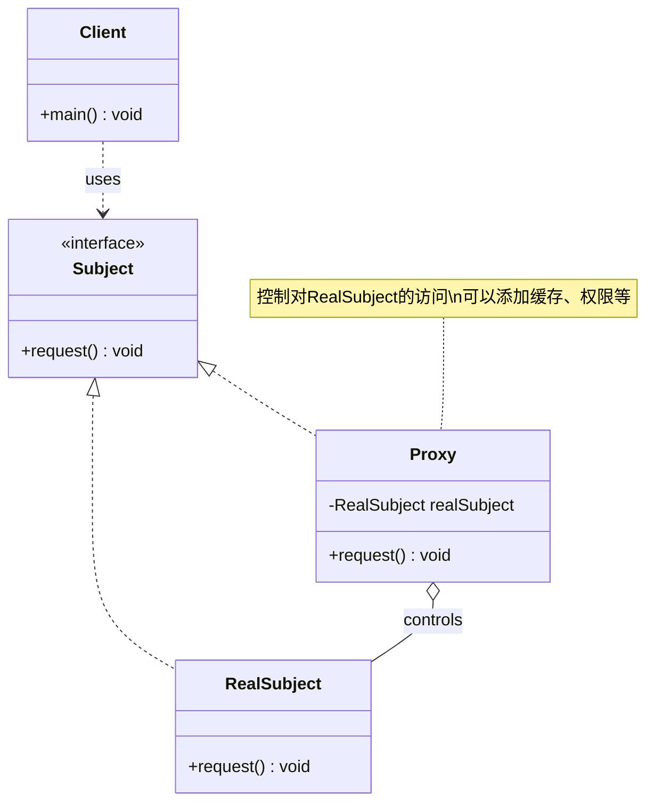

# 代理 Proxy

> 为其他对象提供一个代理以控制对这个对象的访问。

## 意图

代理模式在客户端和目标对象之间加了一层"中间人"。代理和目标对象实现相同的接口，客户端不知道自己在和代理还是真实对象打交道。代理可以控制访问、添加缓存、延迟加载、远程访问等。

通俗点说，就像明星的经纪人——粉丝不能直接联系明星，需要通过经纪人。经纪人（代理）可以筛选请求、安排时间、甚至拒绝某些请求。明星本人不需要知道这些细节，只需要在合适的时间出现就好。

再举个例子，你在公司访问外网要经过代理服务器，你只管上网，代理服务器负责过滤、缓存、日志记录。你感知不到代理的存在，但代理帮你做了很多额外的事情。

## 适用场景

- **远程代理**：为远程对象提供本地代理（RPC、Dubbo 的服务引用）
- **虚拟代理**：延迟创建开销大的对象（图片懒加载、Hibernate 的懒加载）
- **保护代理**：控制对原始对象的访问权限（权限校验、限流）
- **缓存代理**：为开销大的操作提供缓存（Redis 缓存、HTTP 缓存）
- **智能引用**：在访问对象时执行额外操作（日志、计数、引用计数）
- **防火墙代理**：保护目标不被恶意客户端访问
- **同步代理**：在多线程环境下为对象提供安全的访问控制

## UML 类图



## 代码示例

### ❌ 没有使用该模式的问题

直接把所有逻辑揉在一起，没有任何保护层。看看这个"裸奔"的用户服务：

```java
/**
 * 没有代理的用户服务——所有请求直接打到数据库
 * 问题：没有权限校验、没有缓存、没有日志、没有限流
 */
public class UserService {

    // 直接操作数据库，没有任何保护
    public User queryUser(Long userId) {
        System.out.println("【数据库】SELECT * FROM user WHERE id = " + userId);
        // 模拟数据库查询
        return new User(userId, "张三", "zhangsan@example.com");
    }

    public void updateUser(User user) {
        System.out.println("【数据库】UPDATE user SET ... WHERE id = " + user.getId());
    }

    public void deleteUser(Long userId) {
        System.out.println("【数据库】DELETE FROM user WHERE id = " + userId);
        // 任何人都能删用户！没有权限校验！
    }
}

public class Client {
    public static void main(String[] args) {
        UserService service = new UserService();

        // 第一次查询——走数据库
        service.queryUser(1L);
        // 第二次查询同样的数据——又走数据库！没有缓存！
        service.queryUser(1L);
        // 第三次查询——继续走数据库...
        service.queryUser(1L);

        // 没有权限校验，任何人都能删除用户
        service.deleteUser(1L);

        // 没有日志记录，出了问题无法排查
        // 没有限流，恶意请求会直接压垮数据库
    }
}
```

运行结果：

```
【数据库】SELECT * FROM user WHERE id = 1
【数据库】SELECT * FROM user WHERE id = 1
【数据库】SELECT * FROM user WHERE id = 1
【数据库】DELETE FROM user WHERE id = 1
```

:::warning 问题很明显
1. 相同查询重复打数据库，浪费资源
2. 删除操作没有权限校验，任何人都能删数据
3. 没有日志，出问题无从排查
4. 每加一个新需求（缓存、日志、限流）都要改 UserService 的代码，违反开闭原则
:::

### ✅ 使用该模式后的改进

用代理模式一层一层加上保护。先定义统一接口，然后创建不同的代理：

```java
/**
 * 用户服务接口——代理和真实对象都实现这个接口
 * 客户端只依赖接口，不知道背后是谁在干活
 */
public interface IUserService {
    User queryUser(Long userId);
    void updateUser(User user);
    void deleteUser(Long userId);
}

/**
 * 真实主题——只关心业务逻辑，数据库操作
 * 它不需要知道谁在调用它，也不需要关心缓存、日志这些事
 */
public class RealUserService implements IUserService {

    @Override
    public User queryUser(Long userId) {
        // 真实的数据库查询逻辑
        System.out.println("  → 【数据库】SELECT * FROM user WHERE id = " + userId);
        return new User(userId, "张三", "zhangsan@example.com");
    }

    @Override
    public void updateUser(User user) {
        System.out.println("  → 【数据库】UPDATE user SET ... WHERE id = " + user.getId());
    }

    @Override
    public void deleteUser(Long userId) {
        System.out.println("  → 【数据库】DELETE FROM user WHERE id = " + userId);
    }
}
```

缓存代理：

```java
/**
 * 缓存代理——在查询前先查缓存，命中就走缓存，没命中才走数据库
 * 用 Map 模拟缓存，实际项目中会用 Redis 或 Caffeine
 */
public class CachedUserServiceProxy implements IUserService {

    private final IUserService realService; // 被代理的真实对象
    private final Map<Long, User> cache = new HashMap<>(); // 本地缓存

    public CachedUserServiceProxy(IUserService realService) {
        this.realService = realService;
    }

    @Override
    public User queryUser(Long userId) {
        // 先查缓存——命中就直接返回，不打数据库
        if (cache.containsKey(userId)) {
            System.out.println("  → 【缓存命中】直接从缓存返回 userId=" + userId);
            return cache.get(userId);
        }
        // 缓存没命中，走真实服务查数据库
        User user = realService.queryUser(userId);
        cache.put(userId, user); // 查完写入缓存，下次就不用查了
        return user;
    }

    @Override
    public void updateUser(User user) {
        realService.updateUser(user); // 更新操作透传给真实服务
        cache.remove(user.getId()); // 更新后要删缓存，保证一致性
    }

    @Override
    public void deleteUser(Long userId) {
        realService.deleteUser(userId); // 删除操作透传
        cache.remove(userId); // 同样要删缓存
    }
}
```

权限代理：

```java
/**
 * 权限代理——在执行操作前检查权限
 * 只有管理员才能删除用户，普通用户只能查询和更新自己的信息
 */
public class AccessControlUserServiceProxy implements IUserService {

    private final IUserService realService; // 被代理的真实对象
    private final String currentUserRole;   // 当前登录用户的角色

    public AccessControlUserServiceProxy(IUserService realService, String currentUserRole) {
        this.realService = realService;
        this.currentUserRole = currentUserRole;
    }

    @Override
    public User queryUser(Long userId) {
        // 查询操作所有角色都可以执行
        return realService.queryUser(userId);
    }

    @Override
    public void updateUser(User user) {
        // 更新操作也需要管理员权限
        checkPermission("update");
        realService.updateUser(user);
    }

    @Override
    public void deleteUser(Long userId) {
        // 只有管理员才能删除用户！
        checkPermission("delete");
        realService.deleteUser(userId);
    }

    /**
     * 权限校验——不是管理员就抛异常
     */
    private void checkPermission(String operation) {
        if (!"ADMIN".equals(currentUserRole)) {
            throw new SecurityException(
                "权限不足！角色 [" + currentUserRole + "] 无法执行 [" + operation + "] 操作");
        }
    }
}
```

日志代理：

```java
/**
 * 日志代理——记录每次方法调用的入参和耗时
 * 不侵入业务代码，对调用方完全透明
 */
public class LoggingUserServiceProxy implements IUserService {

    private final IUserService realService;

    public LoggingUserServiceProxy(IUserService realService) {
        this.realService = realService;
    }

    @Override
    public User queryUser(Long userId) {
        long start = System.currentTimeMillis(); // 记录开始时间
        System.out.println("【日志】调用 queryUser, 参数: userId=" + userId);
        User result = realService.queryUser(userId); // 透传给真实服务
        long cost = System.currentTimeMillis() - start;
        System.out.println("【日志】queryUser 返回, 耗时: " + cost + "ms");
        return result;
    }

    @Override
    public void updateUser(User user) {
        long start = System.currentTimeMillis();
        System.out.println("【日志】调用 updateUser, 参数: " + user);
        realService.updateUser(user);
        long cost = System.currentTimeMillis() - start;
        System.out.println("【日志】updateUser 完成, 耗时: " + cost + "ms");
    }

    @Override
    public void deleteUser(Long userId) {
        long start = System.currentTimeMillis();
        System.out.println("【日志】调用 deleteUser, 参数: userId=" + userId);
        realService.deleteUser(userId);
        long cost = System.currentTimeMillis() - start;
        System.out.println("【日志】deleteUser 完成, 耗时: " + cost + "ms");
    }
}
```

客户端使用：

```java
public class Client {
    public static void main(String[] args) {
        // 1. 创建真实服务
        IUserService realService = new RealUserService();

        // 2. 用日志代理包装（最外层，先记录日志）
        IUserService service = new LoggingUserServiceProxy(
            // 3. 用权限代理包装（检查权限）
            new AccessControlUserServiceProxy(
                // 4. 用缓存代理包装（查缓存）
                new CachedUserServiceProxy(realService),
                "ADMIN" // 当前用户角色
            )
        );

        System.out.println("===== 第一次查询 =====");
        service.queryUser(1L); // 缓存未命中，走数据库

        System.out.println("\n===== 第二次查询（相同 ID） =====");
        service.queryUser(1L); // 缓存命中！

        System.out.println("\n===== 第三次查询（不同 ID） =====");
        service.queryUser(2L); // 缓存未命中，走数据库

        System.out.println("\n===== 删除用户 =====");
        service.deleteUser(1L);
    }
}
```

### 变体与扩展

#### 动态代理（JDK Proxy）

上面的静态代理要为每个接口手写代理类，太麻烦了。JDK 提供了动态代理，运行时自动生成代理类：

```java
/**
 * JDK 动态代理的 InvocationHandler
 * 一个 handler 可以代理任意接口，不用手写代理类
 */
public class UniversalInvocationHandler implements InvocationHandler {

    private final Object target; // 被代理的真实对象

    public UniversalInvocationHandler(Object target) {
        this.target = target;
    }

    @Override
    public Object invoke(Object proxy, Method method, Object[] args) throws Throwable {
        String methodName = method.getName();
        System.out.println("【动态代理】拦截方法: " + methodName);

        // 前置逻辑：日志记录
        long start = System.currentTimeMillis();

        // 执行真实方法
        Object result = method.invoke(target, args);

        // 后置逻辑：记录耗时
        long cost = System.currentTimeMillis() - start;
        System.out.println("【动态代理】" + methodName + " 执行完毕, 耗时: " + cost + "ms");

        return result;
    }
}

// 使用方式
public class DynamicProxyDemo {
    public static void main(String[] args) {
        // 真实对象
        IUserService realService = new RealUserService();

        // 创建动态代理实例——运行时自动生成代理类
        IUserService proxyService = (IUserService) Proxy.newProxyInstance(
            realService.getClass().getClassLoader(),     // 类加载器
            realService.getClass().getInterfaces(),       // 代理的接口列表
            new UniversalInvocationHandler(realService)   // 调用处理器
        );

        // 通过代理调用——会被 handler 拦截
        proxyService.queryUser(1L);
        proxyService.deleteUser(1L);
    }
}
```

:::tip JDK 动态代理的本质
`Proxy.newProxyInstance()` 会在运行时生成一个实现了指定接口的类（字节码由 sun.misc.ProxyGenerator 生成），这个类的所有方法调用都转发给 InvocationHandler 的 `invoke` 方法。生成的代理类名类似 `$Proxy0`。
:::

#### CGLIB 代理

JDK 动态代理要求目标类必须实现接口。CGLIB 通过生成子类来代理，不需要接口：

```java
/**
 * CGLIB 代理——通过继承目标类生成子类来实现代理
 * 不需要目标类实现接口，但不能代理 final 类和 final 方法
 */
public class CglibMethodInterceptor implements MethodInterceptor {

    @Override
    public Object intercept(Object obj, java.lang.reflect.Method method,
                            Object[] args, MethodProxy proxy) throws Throwable {
        System.out.println("【CGLIB 代理】before: " + method.getName());

        // 调用父类（真实对象）的方法
        Object result = proxy.invokeSuper(obj, args);

        System.out.println("【CGLIB 代理】after: " + method.getName());
        return result;
    }
}

// 使用方式
public class CglibProxyDemo {
    public static void main(String[] args) {
        Enhancer enhancer = new Enhancer();
        enhancer.setSuperclass(RealUserService.class);         // 设置父类
        enhancer.setCallback(new CglibMethodInterceptor());     // 设置回调

        // 生成代理对象——实际上是 RealUserService 的子类
        IUserService proxy = (IUserService) enhancer.create();
        proxy.queryUser(1L);
    }
}
```

:::warning CGLIB 的限制
CGLIB 通过继承实现代理，所以 **不能代理 final 类**（无法继承），也 **不能代理 final 方法**（无法重写）。这也是为什么 Spring 中被 `final` 修饰的类或方法，AOP 会失效。
:::

### 运行结果

静态代理客户端运行结果：

```
===== 第一次查询 =====
【日志】调用 queryUser, 参数: userId=1
  → 【缓存命中】直接从缓存返回 userId=1
【日志】queryUser 返回, 耗时: 0ms

===== 第二次查询（相同 ID） =====
【日志】调用 queryUser, 参数: userId=1
  → 【缓存命中】直接从缓存返回 userId=1
【日志】queryUser 返回, 耗时: 0ms

===== 第三次查询（不同 ID） =====
【日志】调用 queryUser, 参数: userId=2
  → 【数据库】SELECT * FROM user WHERE id = 2
【日志】queryUser 返回, 耗时: 1ms

===== 删除用户 =====
【日志】调用 deleteUser, 参数: userId=1
  → 【数据库】DELETE FROM user WHERE id = 1
【日志】deleteUser 完成, 耗时: 0ms
```

动态代理运行结果：

```
【动态代理】拦截方法: queryUser
  → 【数据库】SELECT * FROM user WHERE id = 1
【动态代理】queryUser 执行完毕, 耗时: 1ms
【动态代理】拦截方法: deleteUser
  → 【数据库】DELETE FROM user WHERE id = 1
【动态代理】deleteUser 执行完毕, 耗时: 0ms
```

## Spring/JDK 中的应用

### 1. Spring AOP —— 代理模式的最典型应用

Spring AOP 的底层就是动态代理。你加的 `@Transactional`、`@Cacheable`、`@Async` 这些注解，Spring 都是帮你生成代理对象来实现的：

```java
@Service
public class OrderService {

    // @Transactional 的底层：代理对象在方法调用前开启事务，正常返回提交，异常回滚
    @Transactional
    public void createOrder(Order order) {
        orderDao.insert(order);   // 插入订单
        inventoryDao.deduct(order.getProductId(), order.getQuantity()); // 扣库存
        // 如果扣库存抛异常，事务自动回滚——这是代理帮你做的
    }

    // @Cacheable 的底层：代理对象先查缓存，命中就返回，没命中才执行方法并写缓存
    @Cacheable(value = "orders", key = "#id")
    public Order getOrder(Long id) {
        return orderDao.selectById(id); // 只有缓存没命中才会走到这里
    }

    // @Async 的底层：代理对象把方法调用提交到线程池异步执行
    @Async
    public void sendNotification(Long orderId) {
        // 这个方法会在另一个线程执行，调用方不会阻塞
        emailService.send(orderId);
    }
}
```

Spring 选择代理策略的规则：
- 目标类实现了接口 → 默认用 **JDK 动态代理**
- 目标类没有实现接口 → 用 **CGLIB 代理**
- Spring Boot 2.x 之后默认统一用 **CGLIB**（`spring.aop.proxy-target-class=true`）

### 2. MyBatis 的 Mapper 代理

MyBatis 的 `@Mapper` 接口你从来没写过实现类，但能用，因为 MyBatis 用动态代理帮你生成了实现：

```java
@Mapper
public interface UserMapper {
    User selectById(Long id);

    @Insert("INSERT INTO user(name, email) VALUES(#{name}, #{email})")
    void insert(User user);
}

// MyBatis 在启动时为每个 Mapper 接口创建一个 JDK 动态代理对象
// 代理对象的 invoke 方法会：
// 1. 解析方法名和参数
// 2. 找到对应的 SQL 语句（从 XML 或注解中）
// 3. 执行 SQL 并将结果映射为 Java 对象
// 所以你调用 userMapper.selectById(1L)，实际上是代理在帮你执行 SQL
```

### 3. JDK 中的 Proxy 类

JDK 自带的 `java.lang.reflect.Proxy` 就是动态代理的实现：

```java
// JDK 动态代理三要素：
// 1. 接口——代理类要实现的接口
// 2. InvocationHandler——方法调用的处理器
// 3. Proxy.newProxyInstance——创建代理实例

// 示例：为 List 接口创建代理，记录所有操作
List<String> list = new ArrayList<>();
List<String> proxyList = (List<String>) Proxy.newProxyInstance(
    list.getClass().getClassLoader(),
    list.getClass().getInterfaces(),
    (proxy, method, args) -> {
        System.out.println("调用: " + method.getName()
            + ", 参数: " + Arrays.toString(args));
        return method.invoke(list, args); // 透传给真实的 ArrayList
    }
);

proxyList.add("hello");  // 输出：调用: add, 参数: [hello]
proxyList.add("world");  // 输出：调用: add, 参数: [world]
proxyList.size();        // 输出：调用: size, 参数: []
```

## 优缺点

| 优点 | 说明 | 缺点 | 说明 |
|------|------|------|------|
| 职责分离 | 代理负责非功能性需求，真实对象只关心业务 | 增加复杂度 | 多了一层调用，代码可读性下降 |
| 开闭原则 | 新增功能只需加新的代理类，不改原始代码 | 调试困难 | 代理链太长时，堆栈信息不好看 |
| 灵活组合 | 不同的代理可以自由组合（日志+缓存+权限） | 响应延迟 | 每一层代理都有性能开销 |
| 客户端无感 | 客户端只依赖接口，不需要知道代理的存在 | 自调用失效 | 同一个类内部方法调用不经过代理 |

:::tip 代理模式的本质
代理模式的核心思想是 **"控制访问"**——不是增强功能，而是决定"要不要让你访问"、"在什么条件下让你访问"、"访问前后要做什么额外的事"。如果只是为了增强功能，那更应该考虑装饰器模式。
:::

## 面试追问

### Q1: JDK 动态代理和 CGLIB 代理的区别？

**A:** 这道题几乎是 Java 面试必问题，从多个维度对比：

| 维度 | JDK 动态代理 | CGLIB 代理 |
|------|-------------|-----------|
| 实现方式 | 基于接口，实现 `InvocationHandler` | 基于继承，生成目标类的子类 |
| 要求 | 目标类必须实现接口 | 目标类不能是 final 类 |
| 性能 | JDK 8+ 性能已经很好 | 创建代理对象稍慢，但调用速度快 |
| 限制 | 不能代理类本身（只能代理接口） | 不能代理 final 方法 |
| Spring 默认 | Spring Boot 1.x 默认 | Spring Boot 2.x 默认 |

实际开发中，Spring Boot 2.x 之后默认用 CGLIB，因为 CGLIB 不需要接口更灵活。如果你的项目有大量没有实现接口的 Service，用 CGLIB 更方便。

### Q2: Spring AOP 代理为什么会失效？怎么解决？

**A:** 最常见的原因是 **"自调用"**——同一个 Bean 的方法 A 调用方法 B，B 上有 `@Transactional` 注解：

```java
@Service
public class OrderService {

    public void batchCreate(List<Order> orders) {
        for (Order order : orders) {
            createOrder(order); // 这里走的是 this，不是代理对象！
        }
    }

    @Transactional // 这个注解会失效！
    public void createOrder(Order order) {
        // ...
    }
}
```

为什么失效？因为 `batchCreate` 调用 `createOrder` 时用的是 `this.createOrder()`，`this` 是原始对象，不是 Spring 创建的代理对象，所以 AOP 增强不会生效。

**解决方案：**

1. **注入自身**（推荐，简单直接）：
```java
@Service
public class OrderService {
    @Autowired
    private OrderService self; // 注入自身的代理对象

    public void batchCreate(List<Order> orders) {
        for (Order order : orders) {
            self.createOrder(order); // 通过代理对象调用，AOP 生效
        }
    }
}
```

2. **使用 `AopContext`**（需要开启 `@EnableAspectJAutoProxy(exposeProxy = true)`）：
```java
((OrderService) AopContext.currentProxy()).createOrder(order);
```

3. **拆分到不同的 Bean**（最干净）：
```java
@Service
public class OrderBatchService {
    @Autowired
    private OrderService orderService; // 注入另一个 Bean

    public void batchCreate(List<Order> orders) {
        for (Order order : orders) {
            orderService.createOrder(order); // 跨 Bean 调用，走代理
        }
    }
}
```

### Q3: 代理模式和装饰器模式的区别？

**A:** 结构上几乎一样（都实现相同接口，都持有目标对象的引用），但 **意图完全不同**：

| 维度 | 代理模式 | 装饰器模式 |
|------|---------|-----------|
| 意图 | 控制访问（能不能做） | 增强功能（做得更好） |
| 关注点 | 访问控制、延迟加载、远程访问 | 动态添加新功能 |
| 对客户端 | 代理通常隐藏被代理对象的存在 | 装饰器强调功能的叠加 |
| 创建时机 | 代理通常在创建时就确定 | 装饰器可以运行时动态叠加 |

简单记：**代理是"把关的"，装饰器是"加戏的"**。你要控制谁能访问数据库用代理，你要给输出流加缓冲、压缩功能用装饰器。

### Q4: 动态代理在 RPC 框架中是怎么用的？

**A:** RPC（远程过程调用）框架的核心就是动态代理。以 Dubbo 为例：

```java
// 你在消费端写的代码
@Reference
private UserService userService;

// 实际上 Dubbo 帮你创建了一个代理对象
// 当你调用 userService.getUser(1L) 时：
// 1. 代理对象拦截调用
// 2. 将方法名、参数序列化为网络请求
// 3. 通过网络发送给服务提供方
// 4. 等待服务提供方返回结果
// 5. 将结果反序列化并返回给你
//
// 对调用方来说，就像调用本地方法一样，完全感知不到远程调用
// 这就是代理模式的威力——把复杂的远程通信细节隐藏在代理后面
```

整个过程你只看到接口调用，网络通信、序列化、负载均衡这些细节全被代理封装了。这也是为什么 RPC 框架能让你像调本地方法一样调远程服务。

## 相关模式

- **装饰器模式**：结构相似，装饰器增强功能，代理控制访问
- **适配器模式**：适配器转换接口，代理保持相同接口
- **外观模式**：外观简化多个子系统的接口，代理控制单个对象的访问
- **保护代理**：是代理模式的一种特化
- **智能引用**：是代理模式的一种特化
