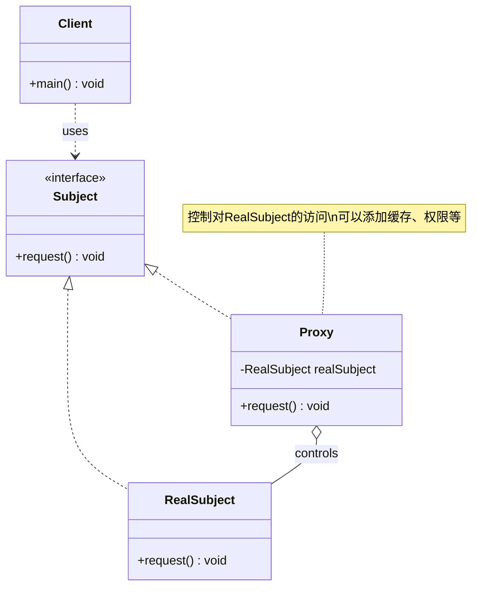

# 代理 Proxy

> 为其他对象提供一个代理以控制对这个对象的访问。

## 意图

代理模式在客户端和目标对象之间加了一层"中间人"。代理和目标对象实现相同的接口，客户端不知道自己在和代理还是真实对象打交道。代理可以控制访问、添加缓存、延迟加载、远程访问等。

就像明星的经纪人——粉丝不能直接联系明星，需要通过经纪人。经纪人（代理）可以筛选请求、安排时间、甚至拒绝某些请求。

## 适用场景

- 远程代理：为远程对象提供本地代理（RPC）
- 虚拟代理：延迟创建开销大的对象（图片懒加载）
- 保护代理：控制对原始对象的访问权限
- 缓存代理：为开销大的操作提供缓存
- 智能引用：在访问对象时执行额外操作（日志、计数）

## UML 类图



## 代码示例

### ❌ 没有使用该模式的问题

```java
// 直接访问，没有权限控制、缓存等保护
public class ImageService {
    public void downloadImage(String url) {
        System.out.println("从服务器下载图片: " + url);
        // 每次都下载，没有缓存，性能极差
        // 没有权限检查，任何人都能下载
    }
}

public class Client {
    public static void main(String[] args) {
        ImageService service = new ImageService();
        service.downloadImage("https://example.com/large-image.jpg");
        service.downloadImage("https://example.com/large-image.jpg"); // 又下载一次！
    }
}
```

### ✅ 使用该模式后的改进

```java
// 主题接口
public interface ImageService {
    void displayImage(String url);
}

// 真实主题
public class RealImageService implements ImageService {
    @Override
    public void displayImage(String url) {
        System.out.println("从服务器加载图片: " + url);
    }
}

// 代理：添加缓存功能
public class CachedImageServiceProxy implements ImageService {
    private final RealImageService realService = new RealImageService();
    private final Map<String, Boolean> cache = new HashMap<>();

    @Override
    public void displayImage(String url) {
        if (cache.containsKey(url)) {
            System.out.println("从缓存获取图片: " + url);
        } else {
            realService.displayImage(url);
            cache.put(url, true);
        }
    }
}

// 使用
public class Client {
    public static void main(String[] args) {
        ImageService service = new CachedImageServiceProxy();
        service.displayImage("https://example.com/photo.jpg"); // 从服务器加载
        service.displayImage("https://example.com/photo.jpg"); // 从缓存获取
    }
}
```

### Spring 中的应用

Spring AOP 的底层就是基于动态代理实现的：

```java
// Spring AOP 通过代理为 Bean 添加横切关注点
@Service
public class OrderService {

    @Transactional
    public void createOrder(Order order) {
        // 业务逻辑
    }

    @Cacheable("orders")
    public Order getOrder(Long id) {
        // 查询数据库
    }
}

// Spring 运行时创建的代理对象结构：
// 1. 如果目标类实现了接口 → 使用 JDK 动态代理
// 2. 如果目标类没有实现接口 → 使用 CGLIB 代理（生成子类）
//
// 代理对象在方法调用前后插入：
// - @Transactional → 开启事务、提交/回滚事务
// - @Cacheable → 查缓存、写缓存
// - @Async → 提交到线程池执行
// - 自定义切面 → 日志、监控、权限校验等
```

## 优缺点

| 优点 | 缺点 |
|------|------|
| 在不修改目标对象的前提下扩展功能 | 增加了系统复杂度，请求处理变慢 |
| 控制对目标对象的访问 | 某些代理实现（如动态代理）会增加调试难度 |
| 将客户端与目标对象解耦 | 代理和目标对象之间的切换可能引起问题 |
| 可以灵活组合多种增强功能 | 过度使用代理会让调用链路不清晰 |

## 面试追问

**Q1: JDK 动态代理和 CGLIB 代理的区别？**

A: JDK 动态代理基于接口，通过 `Proxy.newProxyInstance()` 创建代理对象，目标类必须实现接口。CGLIB 基于继承，通过生成目标类的子类来实现代理，不能代理 final 类和 final 方法。Spring 默认优先使用 JDK 代理，如果目标类没有实现接口则使用 CGLIB。Spring Boot 2.x 之后默认使用 CGLIB。

**Q2: Spring AOP 代理为什么会失效？**

A: 最常见的原因是"自调用"——在同一个类中，一个方法 A 调用方法 B，B 上有 @Transactional 注解。因为 A 调用 B 时走的是 `this`（原始对象），不是代理对象，所以 AOP 增强不会生效。解决方案：1) 注入自身（`@Autowired` 自身），2) 使用 `AopContext.currentProxy()`，3) 将 B 方法拆到另一个 Bean 中。

**Q3: 代理模式和装饰器模式的区别？**

A: 结构上完全相同，但意图不同。代理控制访问，关注"能不能做"和"怎么做"；装饰器增强功能，关注"做得更好"。代理通常隐藏被代理对象的存在，装饰器强调添加新功能。代理是结构型模式，装饰器也是结构型模式，但它们解决的问题不同。

## 相关模式

- **装饰器模式**：结构相似，装饰器增强功能，代理控制访问
- **适配器模式**：适配器转换接口，代理保持相同接口
- **外观模式**：外观简化多个子系统的接口，代理控制单个对象的访问
- **保护代理**：是代理模式的一种特化
