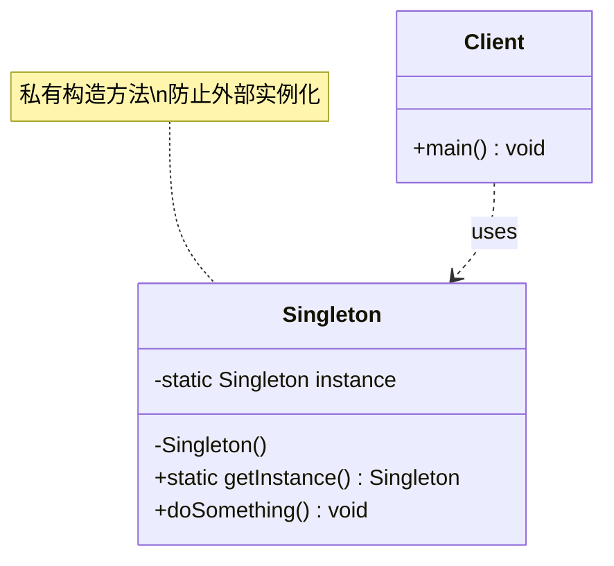

# 单例 Singleton

> 保证一个类只有一个实例，并提供全局访问点。

## 意图

单例模式确保一个类在程序运行期间只创建一个实例，所有调用者共享这同一个对象。它通过私有化构造方法来阻止外部直接实例化，并提供一个静态方法来获取唯一实例。

这种模式非常适合管理共享资源——数据库连接池、线程池、配置管理器等场景，避免重复创建对象带来的资源浪费。

## 适用场景

- 系统中只需要一个实例的类，如配置管理器、日志记录器
- 需要全局访问点的共享资源，如数据库连接池、线程池
- 需要频繁创建和销毁的对象，用单例可以提升性能

## UML 类图



## 代码示例

### ❌ 没有使用该模式的问题

```java
// 每次都 new，导致创建多个实例，浪费资源
public class DatabaseConfig {
    private String url;
    private String username;

    public DatabaseConfig() {
        this.url = "jdbc:mysql://localhost:3306/mydb";
        this.username = "root";
        System.out.println("创建新的数据库配置对象...");
    }

    public void connect() {
        System.out.println("连接数据库: " + url);
    }
}

// 多个地方都在创建
public class Main {
    public static void main(String[] args) {
        DatabaseConfig config1 = new DatabaseConfig(); // 第1个实例
        DatabaseConfig config2 = new DatabaseConfig(); // 第2个实例，浪费！
        DatabaseConfig config3 = new DatabaseConfig(); // 第3个实例，更浪费！
        // 三个对象其实做的是同一件事
    }
}
```

### ✅ 使用该模式后的改进

```java
// 双重检查锁（DCL）实现线程安全单例
public class DatabaseConfig {
    private static volatile DatabaseConfig instance;
    private String url;
    private String username;

    private DatabaseConfig() {
        this.url = "jdbc:mysql://localhost:3306/mydb";
        this.username = "root";
        System.out.println("创建数据库配置对象...");
    }

    public static DatabaseConfig getInstance() {
        if (instance == null) {
            synchronized (DatabaseConfig.class) {
                if (instance == null) {
                    instance = new DatabaseConfig();
                }
            }
        }
        return instance;
    }

    public void connect() {
        System.out.println("连接数据库: " + url + ", 用户: " + username);
    }
}

public class Main {
    public static void main(String[] args) {
        DatabaseConfig config1 = DatabaseConfig.getInstance();
        DatabaseConfig config2 = DatabaseConfig.getInstance();
        System.out.println(config1 == config2); // true，始终是同一个对象
        config1.connect();
    }
}
```

### Spring 中的应用

Spring Bean 默认作用域就是单例（Singleton），这是 Spring 最核心的设计之一：

```java
@Service
public class OrderService {
    // Spring 容器中只会存在一个 OrderService 实例
    private final OrderRepository orderRepository;

    public OrderService(OrderRepository orderRepository) {
        this.orderRepository = orderRepository;
    }

    public Order createOrder(Long productId, int quantity) {
        return orderRepository.save(new Order(productId, quantity));
    }
}

// Spring 内部通过 BeanFactory 管理单例
// AbstractBeanFactory 中的 getBean 方法：
// 1. 先从 singletonObjects 缓存中获取
// 2. 如果不存在，则创建并放入缓存
// 3. 后续请求直接从缓存返回
```

## 优缺点

| 优点 | 缺点 |
|------|------|
| 内存中只有一个实例，减少内存开销 | 违反单一职责原则，同时负责创建和业务逻辑 |
| 全局访问点，方便管理共享资源 | 难以扩展，单例类通常不能继承 |
| 避免重复创建，提升性能 | 多线程环境下需要额外的同步机制 |
| 可以延迟初始化 | 隐藏了依赖关系，不利于测试（需要 mock） |

## 面试追问

**Q1: 单例模式有哪些实现方式？你推荐哪种？**

A: 常见实现有：饿汉式（类加载即创建，线程安全但可能浪费内存）、懒汉式（延迟加载但需处理并发）、双重检查锁（DCL，推荐，兼顾延迟加载和线程安全）、静态内部类（推荐，利用类加载机制保证线程安全）、枚举（Effective Java 推荐，天然防反射和序列化破坏）。日常开发推荐静态内部类或枚举。

**Q2: 如何防止反射和序列化破坏单例？**

A: 反射可以通过在私有构造方法中判断 instance 是否已存在，存在则抛出异常。序列化可以通过实现 `readResolve()` 方法返回已有实例。枚举天然能防止这两种破坏方式。

**Q3: Spring 的 Bean 是单例的，那 Controller 中能用成员变量吗？**

A: 不能。Spring MVC 的 Controller 默认是单例，如果用成员变量存储请求相关数据，在多线程并发请求下会出现数据混乱。请求相关的数据应该用方法参数或 ThreadLocal 传递。

## 相关模式

- **抽象工厂模式**：抽象工厂中的具体工厂通常设计为单例
- **建造者模式**：建造者可以结合单例使用，确保全局只有一个建造者
- **原型模式**：与单例相反，原型模式通过复制来创建多个对象
