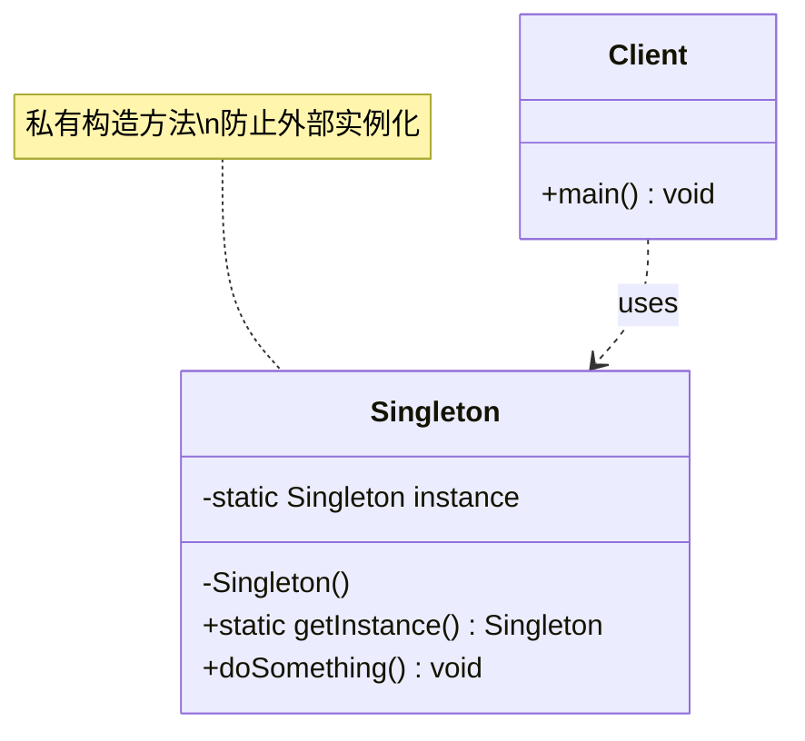

# 单例 Singleton

> 保证一个类只有一个实例，并提供全局访问点。

## 意图

单例模式确保一个类在程序运行期间只创建一个实例，所有调用者共享这同一个对象。它通过私有化构造方法来阻止外部直接实例化，并提供一个静态方法来获取唯一实例。

这种模式非常适合管理共享资源——数据库连接池、线程池、配置管理器等场景，避免重复创建对象带来的资源浪费。

## 适用场景

- 系统中只需要一个实例的类，如配置管理器、日志记录器
- 需要全局访问点的共享资源，如数据库连接池、线程池
- 需要频繁创建和销毁的对象，用单例可以提升性能

## UML 类图



## 实现方式全解析

单例模式看似简单，但要写出一个**线程安全、高性能、防破坏**的单例，需要考虑很多细节。下面从最简单的实现开始，逐步讲解 5 种实现方式，最后给出对比总结。

### ❌ 没有使用该模式的问题

先看不用单例模式时会出现什么问题：

```java
// 每次都 new，导致创建多个实例，浪费资源
public class DatabaseConfig {
    private String url;
    private String username;

    public DatabaseConfig() {
        this.url = "jdbc:mysql://localhost:3306/mydb";
        this.username = "root";
        System.out.println("创建新的数据库配置对象...");
    }

    public void connect() {
        System.out.println("连接数据库: " + url);
    }
}

public class Main {
    public static void main(String[] args) {
        DatabaseConfig config1 = new DatabaseConfig(); // 第1个实例
        DatabaseConfig config2 = new DatabaseConfig(); // 第2个实例，浪费！
        DatabaseConfig config3 = new DatabaseConfig(); // 第3个实例，更浪费！
        // 三个对象其实做的是同一件事
    }
}
```

**运行结果**：

```
创建新的数据库配置对象...
创建新的数据库配置对象...
创建新的数据库配置对象...
```

每次 `new` 都创建新对象，内存浪费、配置不一致。解决方案就是单例模式。

---

### 方式一：饿汉式（Eager Initialization）

**思路**：类加载时就创建实例，不管你用不用。

```java
/**
 * 饿汉式单例
 * 特点：类加载时就创建实例，天然线程安全
 * 缺点：不管用不用都会创建，可能浪费内存
 */
public class EagerSingleton {

    // 1. 私有静态变量，类加载时就初始化（JVM 保证线程安全）
    //    static final 保证了实例的唯一性和不可变性
    private static final EagerSingleton INSTANCE = new EagerSingleton();

    // 2. 私有构造方法，防止外部通过 new 创建实例
    private EagerSingleton() {
        System.out.println("饿汉式单例：实例已创建");
    }

    // 3. 公开静态方法，提供全局访问点
    public static EagerSingleton getInstance() {
        return INSTANCE; // 直接返回，无需同步，性能最好
    }

    public void doSomething() {
        System.out.println("执行业务逻辑...");
    }
}
```

**测试代码**：

```java
public class EagerSingletonTest {
    public static void main(String[] args) {
        // 两次获取实例，判断是否是同一个对象
        EagerSingleton instance1 = EagerSingleton.getInstance();
        EagerSingleton instance2 = EagerSingleton.getInstance();

        System.out.println("instance1 == instance2: " + (instance1 == instance2)); // true
        System.out.println("instance1.hashCode: " + instance1.hashCode());
        System.out.println("instance2.hashCode: " + instance2.hashCode());

        instance1.doSomething();
    }
}
```

**运行结果**：

```
饿汉式单例：实例已创建
instance1 == instance2: true
instance1.hashCode: 123456789
instance2.hashCode: 123456789
执行业务逻辑...
```

**优点**：实现简单，天然线程安全（由 `ClassLoader` 保证），调用速度快（无需同步）。

**缺点**：类加载就创建，不管用不用都占内存。如果初始化很耗时或占用大量资源，会造成启动缓慢。

**适用场景**：实例占用资源少、初始化快、几乎确定会被使用的场景。

---

### 方式二：懒汉式（Lazy Initialization）

**思路**：第一次调用时才创建实例，延迟加载。

#### 2.1 基础懒汉式（线程不安全 ⚠️）

```java
/**
 * 基础懒汉式单例 —— 线程不安全！
 * 多线程环境下可能创建多个实例
 */
public class LazySingletonUnsafe {

    private static LazySingletonUnsafe instance; // 不立即初始化

    private LazySingletonUnsafe() {
        System.out.println("懒汉式单例：实例已创建");
    }

    public static LazySingletonUnsafe getInstance() {
        if (instance == null) {           // 线程A和B同时判断为null
            instance = new LazySingletonUnsafe(); // 都会执行，创建两个！
        }
        return instance;
    }
}
```

:::danger 线程安全问题
当两个线程同时调用 `getInstance()`，都判断 `instance == null` 为 true，就会各自创建一个实例，单例被破坏。
:::

#### 2.2 synchronized 懒汉式（线程安全 ✅）

```java
/**
 * synchronized 懒汉式单例 —— 线程安全但性能差
 * 整个方法加锁，每次调用都要获取锁
 */
public class LazySingletonSync {

    private static LazySingletonSync instance;

    private LazySingletonSync() {
        System.out.println("synchronized懒汉式：实例已创建");
    }

    // synchronized 加在方法上，保证同一时刻只有一个线程进入
    public static synchronized LazySingletonSync getInstance() {
        if (instance == null) {
            instance = new LazySingletonSync();
        }
        return instance;
    }
}
```

**优点**：线程安全，延迟加载。

**缺点**：**性能差**。`synchronized` 加在整个方法上，每次调用 `getInstance()` 都要获取锁。但实际上只有第一次创建时需要同步，后续获取实例完全是读操作，根本不需要锁。在高并发场景下，这个锁会成为性能瓶颈。

---

### 方式三：双重检查锁 Double-Checked Locking（DCL）

**思路**：只在第一次创建时加锁，后续直接返回实例。用两层 `if` 判断 + `volatile` 关键字实现。

```java
/**
 * 双重检查锁单例（DCL）
 * 特点：兼顾延迟加载和线程安全，性能好
 * 注意：必须使用 volatile 关键字！
 */
public class DCLSingleton {

    // volatile 非常关键！禁止指令重排序
    // new DCLSingleton() 实际分3步：
    //   1. 分配内存空间
    //   2. 初始化对象
    //   3. 将引用指向内存地址
    // 没有 volatile，JVM 可能将 2 和 3 重排序为 1->3->2
    // 导致线程B拿到未初始化的实例，引发 NPE
    private static volatile DCLSingleton instance;

    private DCLSingleton() {
        System.out.println("DCL单例：实例已创建");
    }

    public static DCLSingleton getInstance() {
        // 第一重检查：如果实例已存在，直接返回（无需加锁，性能好）
        if (instance == null) {
            synchronized (DCLSingleton.class) {
                // 第二重检查：获取锁后再次检查
                // 防止多个线程同时通过第一重检查后，重复创建
                if (instance == null) {
                    instance = new DCLSingleton();
                }
            }
        }
        return instance;
    }
}
```

**测试代码**：

```java
import java.util.concurrent.CountDownLatch;

public class DCLSingletonTest {
    public static void main(String[] args) throws InterruptedException {
        int threadCount = 100;
        CountDownLatch latch = new CountDownLatch(threadCount);

        for (int i = 0; i < threadCount; i++) {
            new Thread(() -> {
                try {
                    DCLSingleton instance = DCLSingleton.getInstance();
                    System.out.println(Thread.currentThread().getName()
                        + " - hashCode: " + instance.hashCode());
                } finally {
                    latch.countDown();
                }
            }).start();
        }

        latch.await(); // 等待所有线程完成
        System.out.println("所有线程执行完毕，验证单例：");
        System.out.println("instance1 == instance2: "
            + (DCLSingleton.getInstance() == DCLSingleton.getInstance()));
    }
}
```

**运行结果**：

```
DCL单例：实例已创建
Thread-0 - hashCode: 1836019240
Thread-1 - hashCode: 1836019240
Thread-2 - hashCode: 1836019240
...（所有线程 hashCode 相同）
所有线程执行完毕，验证单例：
instance1 == instance2: true
```

:::tip 为什么需要 volatile？
`new DCLSingleton()` 不是原子操作，分为 3 步：
1. 分配内存空间
2. 初始化对象（执行构造方法）
3. 将 `instance` 引用指向内存地址

JVM 可能将步骤 2 和 3 重排序为 1→3→2。线程 A 执行到步骤 3 时，`instance` 已经非 null，但对象还没初始化完成。此时线程 B 通过第一重检查，拿到的是**未初始化的半成品对象**，使用时会出问题。`volatile` 通过内存屏障禁止这种重排序。
:::

**优点**：延迟加载 + 线程安全 + 高性能（只在第一次加锁）。

**缺点**：实现稍复杂，需要理解 `volatile` 和指令重排序。

---

### 方式四：静态内部类（Holder Pattern）

**思路**：利用 JVM 类加载机制保证线程安全，同时实现延迟加载。

```java
/**
 * 静态内部类单例 —— 最推荐的实现方式之一
 * 原理：外部类加载时不会立即加载内部类
 *       只有调用 getInstance() 时才会加载 Holder 类
 *       JVM 保证类加载时的线程安全
 */
public class HolderSingleton {

    private HolderSingleton() {
        System.out.println("静态内部类单例：实例已创建");
    }

    // 静态内部类，在外部类加载时不会被加载
    // 只有第一次调用 getInstance() 时才会触发类加载
    // JVM 保证类加载过程的线程安全性
    private static class Holder {
        // static final 保证实例唯一且不可变
        private static final HolderSingleton INSTANCE = new HolderSingleton();
    }

    public static HolderSingleton getInstance() {
        return Holder.INSTANCE; // 访问静态内部类的静态字段，触发类加载
    }
}
```

**运行结果**：

```java
public class HolderSingletonTest {
    public static void main(String[] args) {
        System.out.println("程序启动，HolderSingleton 尚未被加载");

        // 此时内部类 Holder 还没有被加载，实例还没创建
        // 这就是"延迟加载"

        System.out.println("准备获取实例...");
        HolderSingleton instance = HolderSingleton.getInstance();
        // 输出：静态内部类单例：实例已创建

        HolderSingleton instance2 = HolderSingleton.getInstance();
        // 不会再次创建，直接返回已有实例

        System.out.println("instance1 == instance2: " + (instance == instance2));
        // 输出：instance1 == instance2: true
    }
}
```

```
程序启动，HolderSingleton 尚未被加载
准备获取实例...
静态内部类单例：实例已创建
instance1 == instance2: true
```

**为什么线程安全？** JVM 在类加载阶段有一个 `clinit` 方法（class initialization），这个方法被 JVM 加了锁。多个线程同时触发类加载时，只有一个线程能执行 `clinit`，其他线程会等待。所以 `INSTANCE` 只会被创建一次。

**优点**：
- 延迟加载（外部类加载时不创建实例）
- 线程安全（JVM 类加载机制保证）
- 无锁，性能好（不需要 `synchronized`）
- 不需要 `volatile`（不存在指令重排序问题）

**缺点**：无法传递构造参数。

---

### 方式五：枚举单例（Enum Singleton）

**思路**：利用 Java 枚举类型的特性，天然实现单例。

```java
/**
 * 枚举单例 —— Effective Java 作者 Joshua Bloch 推荐
 * 特点：最简洁、最安全、天然防反射和序列化破坏
 */
public enum EnumSingleton {

    // 枚举实例，天生就是单例
    INSTANCE;

    // 可以添加业务方法
    private String config;

    // 枚举的构造方法默认就是 private 的
    EnumSingleton() {
        this.config = "default-config";
        System.out.println("枚举单例：实例已创建");
    }

    public void setConfig(String config) {
        this.config = config;
    }

    public String getConfig() {
        return config;
    }

    public void doSomething() {
        System.out.println("执行业务逻辑，当前配置: " + config);
    }
}
```

**测试代码**：

```java
public class EnumSingletonTest {
    public static void main(String[] args) {
        // 使用方式简洁
        EnumSingleton.INSTANCE.setConfig("jdbc:mysql://localhost:3306/mydb");
        EnumSingleton.INSTANCE.doSomething();

        // 任何地方获取的都是同一个实例
        System.out.println(EnumSingleton.INSTANCE == EnumSingleton.INSTANCE); // true
    }
}
```

**运行结果**：

```
枚举单例：实例已创建
执行业务逻辑，当前配置: jdbc:mysql://localhost:3306/mydb
true
```

**为什么能防反射破坏？** 反射调用 `Constructor.newInstance()` 时，如果类是枚举，会抛出 `IllegalArgumentException("Cannot reflectively create enum objects")`。

**为什么能防序列化破坏？** 枚举的序列化机制不是通过反射创建新对象，而是根据枚举名称在已有枚举实例中查找。

:::tip 枚举单例的限制
- 不支持延迟加载（类加载时就创建）
- 不能继承其他类（枚举隐式继承 `java.lang.Enum`）
- 使用方式和其他方式不同（`EnumSingleton.INSTANCE` 而不是 `getInstance()`）
:::

---

### 五种实现方式对比

| 特性 | 饿汉式 | synchronized 懒汉式 | DCL 双重检查锁 | 静态内部类 | 枚举 |
|------|--------|---------------------|----------------|-----------|------|
| **线程安全** | ✅ 安全 | ✅ 安全 | ✅ 安全 | ✅ 安全 | ✅ 安全 |
| **延迟加载** | ❌ 不支持 | ✅ 支持 | ✅ 支持 | ✅ 支持 | ❌ 不支持 |
| **性能** | ⭐⭐⭐⭐⭐ | ⭐⭐ | ⭐⭐⭐⭐ | ⭐⭐⭐⭐⭐ | ⭐⭐⭐⭐⭐ |
| **实现复杂度** | 简单 | 简单 | 较复杂 | 简单 | 最简单 |
| **防反射破坏** | ❌ | ❌ | ❌ | ❌ | ✅ 天然防御 |
| **防序列化破坏** | ❌ 需要额外处理 | ❌ 需要额外处理 | ❌ 需要额外处理 | ❌ 需要额外处理 | ✅ 天然防御 |
| **推荐指数** | ⭐⭐⭐ | ⭐⭐ | ⭐⭐⭐⭐ | ⭐⭐⭐⭐⭐ | ⭐⭐⭐⭐⭐ |

**选择建议**：

- **大多数场景**：静态内部类（延迟加载 + 线程安全 + 无锁高性能）
- **需要防序列化/反射**：枚举
- **面试常考**：DCL（考察对 `volatile` 和指令重排序的理解）
- **确定会使用且资源少**：饿汉式（最简单）

---

## 单例的破坏与防御

单例模式看似完美，但有几种方式可以"破坏"单例，创建出多个实例。

### 破坏方式一：反射

通过反射调用私有构造方法，可以绕过 `private` 限制：

```java
import java.lang.reflect.Constructor;

public class ReflectionAttack {
    public static void main(String[] args) throws Exception {
        // 正常获取单例
        DCLSingleton instance1 = DCLSingleton.getInstance();

        // 通过反射创建新实例
        Constructor<DCLSingleton> constructor =
            DCLSingleton.class.getDeclaredConstructor();
        constructor.setAccessible(true); // 暴力破解 private
        DCLSingleton instance2 = constructor.newInstance();

        System.out.println("instance1 == instance2: " + (instance1 == instance2));
        // 输出：false！单例被破坏！
    }
}
```

**防御方法**：在私有构造方法中检查是否已有实例：

```java
public class SafeDCLSingleton {
    private static volatile SafeDCLSingleton instance;

    private SafeDCLSingleton() {
        // 防御反射攻击：如果实例已存在，说明是非法调用
        if (instance != null) {
            throw new RuntimeException("单例模式禁止通过反射创建实例");
        }
        System.out.println("安全的DCL单例：实例已创建");
    }

    public static SafeDCLSingleton getInstance() {
        if (instance == null) {
            synchronized (SafeDCLSingleton.class) {
                if (instance == null) {
                    instance = new SafeDCLSingleton();
                }
            }
        }
        return instance;
    }
}
```

:::warning 防御反射的局限性
如果攻击者先通过反射创建实例，再正常调用 `getInstance()`，防御会失效。所以**枚举**是最可靠的防御方式。
:::

### 破坏方式二：序列化与反序列化

将单例对象序列化到文件，再反序列化回来，会得到一个新的对象：

```java
import java.io.*;

public class SerializationAttack {
    public static void main(String[] args) throws Exception {
        // 获取单例
        DCLSingleton instance1 = DCLSingleton.getInstance();

        // 序列化到文件
        ObjectOutputStream oos = new ObjectOutputStream(
            new FileOutputStream("singleton.ser"));
        oos.writeObject(instance1);
        oos.close();

        // 从文件反序列化
        ObjectInputStream ois = new ObjectInputStream(
            new FileInputStream("singleton.ser"));
        DCLSingleton instance2 = (DCLSingleton) ois.readObject();
        ois.close();

        System.out.println("instance1 == instance2: " + (instance1 == instance2));
        // 输出：false！反序列化创建了新对象！
    }
}
```

**防御方法**：实现 `readResolve()` 方法，反序列化时返回已有实例：

```java
public class SerializableSingleton implements Serializable {
    private static volatile SerializableSingleton instance;

    private SerializableSingleton() {}

    public static SerializableSingleton getInstance() {
        if (instance == null) {
            synchronized (SerializableSingleton.class) {
                if (instance == null) {
                    instance = new SerializableSingleton();
                }
            }
        }
        return instance;
    }

    // 防御反序列化攻击：JVM 反序列化时会调用此方法
    // 如果定义了 readResolve()，则返回此方法的值而非新建对象
    protected Object readResolve() {
        return getInstance(); // 返回已有的单例实例
    }
}
```

---

## Spring 中的应用

Spring Bean 默认作用域就是单例（Singleton），这是 Spring 最核心的设计之一：

```java
@Service
public class OrderService {
    // Spring 容器中只会存在一个 OrderService 实例
    private final OrderRepository orderRepository;

    public OrderService(OrderRepository orderRepository) {
        this.orderRepository = orderRepository;
    }

    public Order createOrder(Long productId, int quantity) {
        return orderRepository.save(new Order(productId, quantity));
    }
}
```

**Spring 内部如何实现单例？**

Spring 的 `AbstractBeanFactory` 中维护了一个 `singletonObjects`（一级缓存），`getBean()` 方法的逻辑：

1. 先从 `singletonObjects` 缓存中获取
2. 如果不存在，检查是否正在创建（`earlySingletonObjects` 二级缓存）
3. 如果也没有，检查 `singletonFactories`（三级缓存）
4. 都没有则创建 Bean，创建完成后放入 `singletonObjects`
5. 后续请求直接从缓存返回

:::danger Spring 单例 ≠ 线程安全
Spring 保证 Bean 是单例（只创建一个实例），但**不保证线程安全**。单例 Bean 中如果有可变的成员变量，在多线程并发请求下会出现数据混乱。请求相关的数据应该用方法参数或 `ThreadLocal` 传递。
:::

## JDK 中的单例

JDK 源码中也有不少单例模式的经典应用：

**`Runtime` 类**（饿汉式）：

```java
public class Runtime {
    private static final Runtime currentRuntime = new Runtime(); // 饿汉式

    private Runtime() {} // 私有构造

    public static Runtime getRuntime() {
        return currentRuntime;
    }

    public Process exec(String command) throws IOException {
        // 执行系统命令
    }
}

// 使用
Runtime runtime = Runtime.getRuntime();
int cpuCores = runtime.availableProcessors();
long maxMemory = runtime.maxMemory();
```

**`Desktop` 类**（饿汉式）：

```java
public class Desktop {
    private static Desktop desktop;

    private Desktop() {}

    public static synchronized Desktop getDesktop() {
        if (desktop == null) {
            desktop = new Desktop();
        }
        return desktop;
    }
}
```

## 优缺点

| 优点 | 缺点 |
|------|------|
| 内存中只有一个实例，减少内存开销 | 违反单一职责原则，同时负责创建和业务逻辑 |
| 全局访问点，方便管理共享资源 | 难以扩展，单例类通常不能继承 |
| 避免重复创建，提升性能 | 多线程环境下需要额外的同步机制 |
| 可以延迟初始化 | 隐藏了依赖关系，不利于测试（需要 mock） |

## 面试追问

**Q1: 单例模式有哪些实现方式？你推荐哪种？**

A: 常见实现有 5 种：

| 方式 | 线程安全 | 延迟加载 | 推荐场景 |
|------|---------|---------|---------|
| 饿汉式 | ✅ | ❌ | 资源占用少、必定使用 |
| synchronized 懒汉式 | ✅ | ✅ | 不推荐，性能差 |
| DCL 双重检查锁 | ✅ | ✅ | 需要延迟加载且并发高 |
| 静态内部类 | ✅ | ✅ | **最推荐**，兼顾各方面 |
| 枚举 | ✅ | ❌ | 需要防反射/序列化破坏 |

日常开发推荐**静态内部类**，需要防御破坏时用**枚举**。

**Q2: 为什么 DCL 需要 volatile？**

A: `new DCLSingleton()` 不是原子操作，分为 3 步：①分配内存 ②初始化对象 ③将引用指向内存。JVM 可能将 ②③ 重排序为 ①③②。线程 A 执行到 ③ 时 `instance` 已非 null 但对象未初始化，线程 B 通过第一重检查拿到半成品对象。`volatile` 通过内存屏障禁止指令重排序。

**Q3: 如何防止反射和序列化破坏单例？**

A: 反射可以在私有构造方法中判断 `instance` 是否已存在，存在则抛异常。序列化可以实现 `readResolve()` 方法返回已有实例。但反射防御有局限性（攻击者可以先反射创建再正常获取），所以**枚举是最可靠的防御方式**，天然防止两种破坏。

**Q4: Spring 的 Bean 是单例的，那 Controller 中能用成员变量吗？**

A: 不能。Spring MVC 的 Controller 默认是单例，如果用成员变量存储请求相关数据，在多线程并发请求下会出现数据混乱。请求相关的数据应该用方法参数或 ThreadLocal 传递。

## 相关模式

- **抽象工厂模式**：抽象工厂中的具体工厂通常设计为单例
- **建造者模式**：建造者可以结合单例使用，确保全局只有一个建造者
- **原型模式**：与单例相反，原型模式通过复制来创建多个对象
