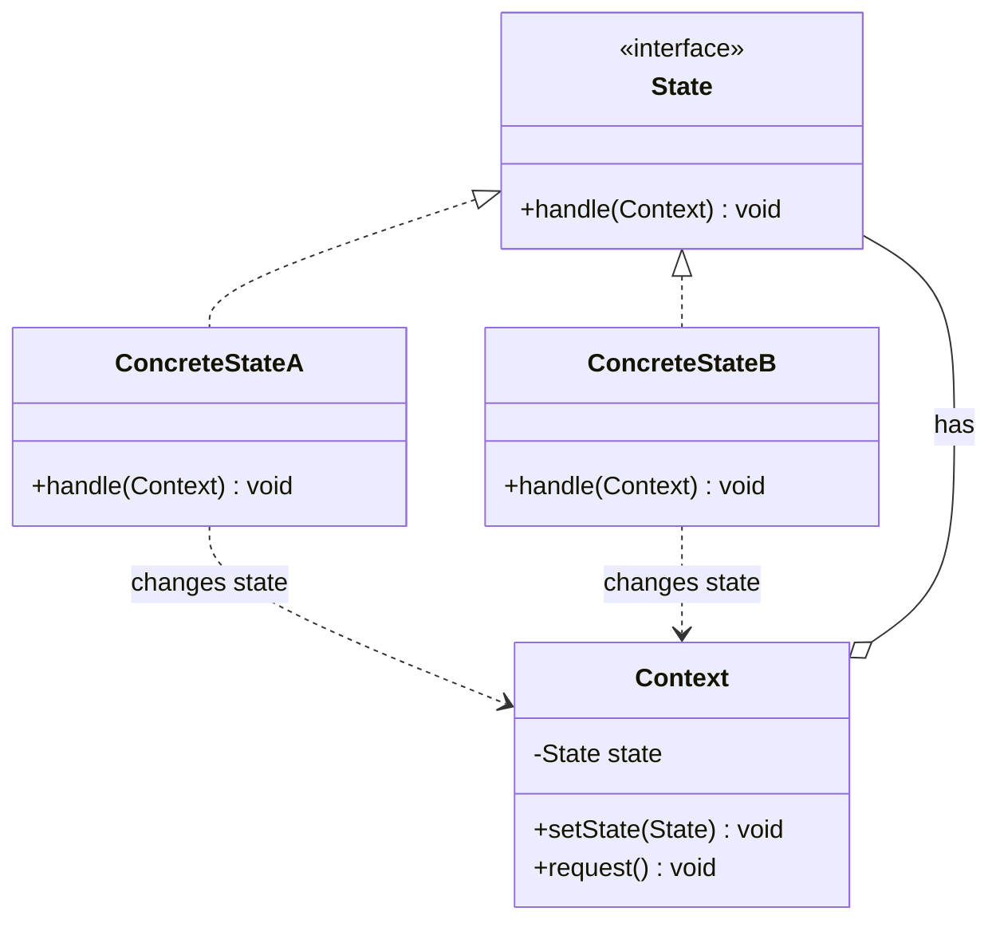

# 状态 State

> 允许对象在内部状态改变时改变它的行为，对象看起来好像修改了它的类。

## 意图

状态模式将对象的不同状态抽象成独立的类，每个状态类实现相同的接口但有不同的行为。当对象的状态改变时，它看起来像是"换了一个类"——因为行为完全不同了。

核心思想是"状态决定行为"。不用 if-else 判断当前状态再决定做什么，而是将状态和行为绑定在一起，状态变了行为自然就变了。

## 适用场景

- 对象的行为依赖于它的状态，且状态可以动态变化时
- 大量 if-else 或 switch 根据状态执行不同逻辑时
- 状态转换逻辑复杂，有大量条件分支时
- 需要在运行时动态改变对象行为时

## UML 类图



## 代码示例

### ❌ 没有使用该模式的问题

```java
// 状态判断散落在各处，难以维护
public class VendingMachine {
    private String state = "NO_MONEY";

    public void insertCoin() {
        if (state.equals("NO_MONEY")) {
            state = "HAS_MONEY";
            System.out.println("投入硬币，等待选择商品");
        } else if (state.equals("HAS_MONEY")) {
            System.out.println("已投过硬币了");
        } else if (state.equals("SOLD")) {
            System.out.println("请等待出货");
        }
        // 每个方法都有大量 if-else
    }

    public void dispense() {
        if (state.equals("HAS_MONEY")) {
            state = "SOLD";
            System.out.println("出货中...");
        } else if (state.equals("NO_MONEY")) {
            System.out.println("请先投币");
        }
    }
}
```

### ✅ 使用该模式后的改进

```java
// 状态接口
public interface VendingState {
    void insertCoin(VendingMachine machine);
    void selectProduct(VendingMachine machine);
    void dispense(VendingMachine machine);
}

// 具体状态：无硬币
public class NoMoneyState implements VendingState {
    @Override
    public void insertCoin(VendingMachine machine) {
        System.out.println("投入硬币");
        machine.setState(new HasMoneyState());
    }

    @Override
    public void selectProduct(VendingMachine machine) {
        System.out.println("请先投币");
    }

    @Override
    public void dispense(VendingMachine machine) {
        System.out.println("请先投币");
    }
}

// 具体状态：有钱
public class HasMoneyState implements VendingState {
    @Override
    public void insertCoin(VendingMachine machine) {
        System.out.println("已投过硬币了");
    }

    @Override
    public void selectProduct(VendingMachine machine) {
        System.out.println("选择商品，出货中...");
        machine.setState(new SoldState());
    }

    @Override
    public void dispense(VendingMachine machine) {
        System.out.println("请先选择商品");
    }
}

// 具体状态：已售出
public class SoldState implements VendingState {
    @Override
    public void insertCoin(VendingMachine machine) {
        System.out.println("请等待出货完成");
    }

    @Override
    public void selectProduct(VendingMachine machine) {
        System.out.println("正在出货中...");
    }

    @Override
    public void dispense(VendingMachine machine) {
        System.out.println("商品已售出");
        machine.setState(new NoMoneyState());
    }
}

// 上下文
public class VendingMachine {
    private VendingState state = new NoMoneyState();

    public void setState(VendingState state) { this.state = state; }

    public void insertCoin() { state.insertCoin(this); }
    public void selectProduct() { state.selectProduct(this); }
    public void dispense() { state.dispense(this); }
}

// 使用
public class Main {
    public static void main(String[] args) {
        VendingMachine machine = new VendingMachine();
        machine.insertCoin();      // 投入硬币
        machine.selectProduct();   // 选择商品
        machine.dispense();        // 商品已售出
        machine.insertCoin();      // 投入硬币（新一轮）
    }
}
```

### Spring 中的应用

Spring State Machine 是状态模式的完整实现框架：

```java
@Configuration
@EnableStateMachine
public class StateMachineConfig extends StateMachineConfigurerAdapter<OrderState, OrderEvent> {

    @Override
    public void configure(StateMachineStateConfigurer<OrderState, OrderEvent> states)
            throws Exception {
        states
            .withStates()
            .initial(OrderState.NEW)
            .states(EnumSet.allOf(OrderState.class))
            .end(OrderState.COMPLETED);
    }

    @Override
    public void configure(StateMachineTransitionConfigurer<OrderState, OrderEvent> transitions)
            throws Exception {
        transitions
            .withExternal()
            .source(OrderState.NEW).target(OrderState.PAID).event(OrderEvent.PAY)
            .and()
            .withExternal()
            .source(OrderState.PAID).target(OrderState.SHIPPED).event(OrderEvent.SHIP)
            .and()
            .withExternal()
            .source(OrderState.SHIPPED).target(OrderState.COMPLETED).event(OrderEvent.CONFIRM);
    }
}
```

## 优缺点

| 优点 | 缺点 |
|------|------|
| 将状态相关的行为局部化到对应的状态类中 | 状态类数量增加，系统复杂度上升 |
| 消除大量条件语句，代码更清晰 | 状态转换逻辑分散在各状态类中，不易全局把握 |
| 新增状态只需新增状态类，符合开闭原则 | 状态类之间可能存在循环依赖 |
| 状态转换显式化，便于维护 | 简单的状态（2-3个）用状态模式可能过度设计 |

## 面试追问

**Q1: 状态模式和策略模式的区别？**

A: 结构完全相同，但切换方式不同。策略模式由客户端主动设置和切换策略，策略之间是平替关系。状态模式由对象内部根据条件自动切换状态，状态之间有流转关系。策略模式关注"算法的选择"，状态模式关注"状态的流转"。

**Q2: 状态类之间如何共享数据？**

A: 1) 通过 Context 对象传递——状态类的 handle 方法接收 Context 参数，可以读写 Context 中的数据；2) 将共享数据放在 Context 中，状态类通过 Context 访问；3) 避免状态类之间直接通信，保持独立性。

**Q3: 如何避免状态类之间的循环依赖？**

A: 1) 使用 Context 作为中介，状态类只和 Context 交互，不直接引用其他状态类；2) 使用状态工厂或 Spring 容器管理状态类，避免 new 造成耦合；3) 在 Context 中定义状态转换表，状态类只负责设置目标状态。

## 相关模式

- **策略模式**：结构相同，策略手动切换，状态自动切换
- **观察者模式**：状态变化可以触发观察者通知
- **单例模式**：每个状态类通常实现为单例
- **工厂方法模式**：用工厂创建和管理状态对象
