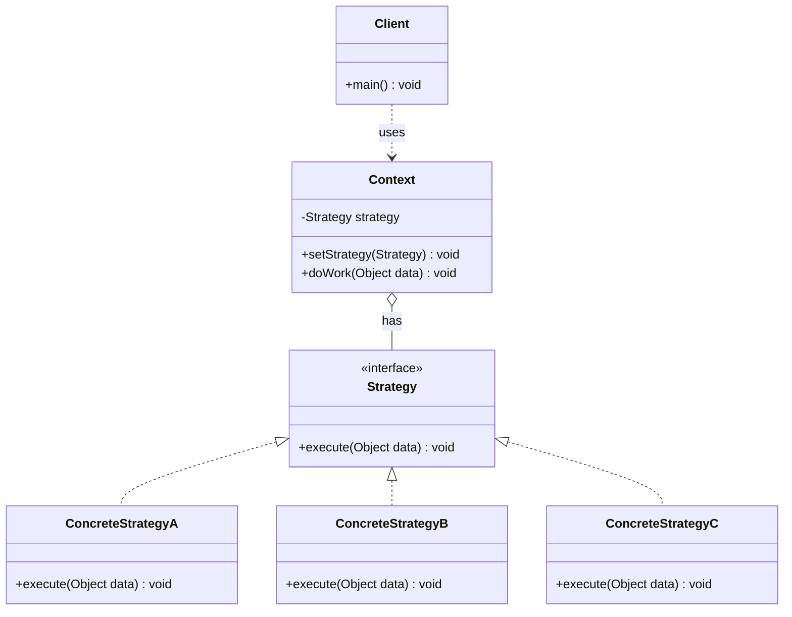

# 策略 Strategy

> 定义一系列算法，将每一个算法封装起来，并使它们可以互换。

## 意图

策略模式将不同的算法（策略）封装成独立的类，让它们实现相同的接口。上下文持有策略的引用，运行时可以动态切换不同的策略。这样就消除了大量的 if-else 分支，使算法可以独立于使用它的客户端变化。

就像出行策略——你可以选择开车、坐地铁、骑车、步行，它们都能到达目的地，只是方式不同。策略模式让你可以随时切换出行方式。

## 适用场景

- 一个系统有多种算法/规则，需要在运行时动态切换时
- 需要避免多重条件判断（if-else / switch）时
- 算法需要独立变化，不影响使用算法的客户端时
- 多个类只有行为差异时

## UML 类图



## 代码示例

### ❌ 没有使用该模式的问题

```java
// 大量 if-else，每增加一种支付方式都要修改这个方法
public class PaymentService {
    public void pay(String paymentType, double amount) {
        if (paymentType.equals("alipay")) {
            System.out.println("支付宝支付: " + amount + " 元");
            // 支付宝特有的逻辑...
        } else if (paymentType.equals("wechat")) {
            System.out.println("微信支付: " + amount + " 元");
            // 微信特有的逻辑...
        } else if (paymentType.equals("credit_card")) {
            System.out.println("信用卡支付: " + amount + " 元");
            // 信用卡特有的逻辑...
        } else if (paymentType.equals("bank_transfer")) {
            System.out.println("银行转账: " + amount + " 元");
        }
        // 新增支付方式？继续加 else if？
    }
}
```

### ✅ 使用该模式后的改进

```java
// 策略接口
public interface PaymentStrategy {
    void pay(double amount);
}

// 具体策略
public class AlipayStrategy implements PaymentStrategy {
    @Override
    public void pay(double amount) {
        System.out.println("支付宝支付: " + amount + " 元");
        // 支付宝特有逻辑
    }
}

public class WeChatPayStrategy implements PaymentStrategy {
    @Override
    public void pay(double amount) {
        System.out.println("微信支付: " + amount + " 元");
    }
}

public class CreditCardStrategy implements PaymentStrategy {
    @Override
    public void pay(double amount) {
        System.out.println("信用卡支付: " + amount + " 元");
    }
}

// 上下文
public class PaymentContext {
    private PaymentStrategy strategy;

    public PaymentContext(PaymentStrategy strategy) {
        this.strategy = strategy;
    }

    public void setStrategy(PaymentStrategy strategy) {
        this.strategy = strategy;
    }

    public void checkout(double amount) {
        strategy.pay(amount);
    }
}

// 使用
public class Main {
    public static void main(String[] args) {
        PaymentContext context = new PaymentContext(new AlipayStrategy());
        context.checkout(100.0);  // 支付宝支付

        context.setStrategy(new WeChatPayStrategy());
        context.checkout(200.0);  // 微信支付

        // 新增支付方式只需新增一个策略类，无需修改已有代码
    }
}
```

### Spring 中的应用

Spring 中的资源加载就是策略模式：

```java
// Spring 的 Resource 接口就是策略模式
public interface Resource {
    InputStream getInputStream() throws IOException;
}

// 不同来源的资源是不同策略
ClassPathResource classPath = new ClassPathResource("config.properties");
FileSystemResource file = new FileSystemResource("/etc/config.properties");
UrlResource url = new UrlResource("https://example.com/config.properties");

// Spring 的 TaskExecutor 也是策略模式
public interface TaskExecutor {
    void execute(Runnable task);
}

// 同步执行、异步执行、线程池执行等都是不同策略
```

## 优缺点

| 优点 | 缺点 |
|------|------|
| 消除大量 if-else，代码更清晰 | 客户端必须了解不同策略的区别才能选择合适的策略 |
| 策略可以自由切换，灵活性强 | 策略类数量增多，增加系统复杂度 |
| 符合开闭原则，新增策略不影响已有代码 | 策略之间没有通信机制，需要客户端协调 |
| 算法可以独立测试 | 客户端需要自行管理策略的选择逻辑 |

## 面试追问

**Q1: 策略模式和状态模式的区别？**

A: 结构完全相同，但意图和切换方式不同。策略模式由客户端主动选择和切换策略，策略之间是平等的替换关系。状态模式由对象内部根据状态自动切换，状态之间有流转关系。策略模式关注"做什么"，状态模式关注"在什么状态下做什么"。

**Q2: 策略模式和简单工厂的结合使用？**

A: 实际开发中经常结合使用。用工厂根据配置或参数创建合适的策略对象，然后注入到上下文中使用。比如 `PaymentStrategyFactory.getStrategy(type)` 根据支付类型返回对应的策略。这样客户端连策略类的创建都不需要关心。

**Q3: 如何用 Spring 来管理策略模式？**

A: 1) 定义策略接口和多个 `@Component` 实现；2) 用 `Map<String, PaymentStrategy>` 注入所有策略（Spring 会自动按 Bean 名注入）；3) 或自定义 `@Qualifier` 注解来选择策略。这样新增策略只需加一个 `@Component`，完全符合开闭原则。

## 相关模式

- **状态模式**：结构相同，状态自动切换，策略手动切换
- **工厂方法模式**：工厂创建策略对象
- **装饰器模式**：装饰器增强功能，策略替换算法
- **模板方法模式**：模板方法用继承，策略模式用组合
