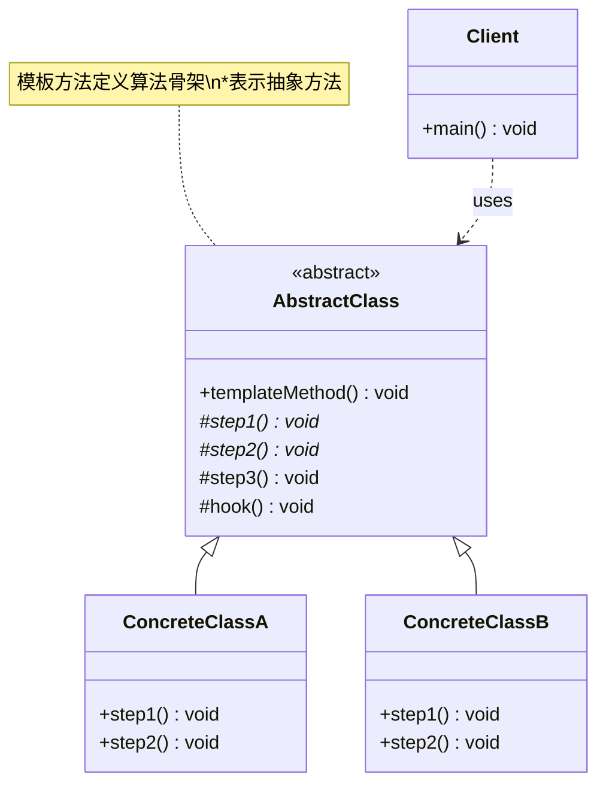

# 模板方法 Template Method

> 在父类中定义算法骨架，将某些步骤延迟到子类中实现。

## 意图

模板方法模式在父类中定义一个算法的骨架（即模板方法），其中某些步骤是抽象的，由子类实现。子类可以重写特定步骤，但不能改变算法的整体结构。

就像做菜的食谱——"洗菜 → 切菜 → 炒菜 → 装盘"的步骤是固定的，但每道菜具体洗什么菜、怎么炒是不同的。模板方法确保了流程的统一性，又保留了步骤的灵活性。

## 适用场景

- 多个类有相同的算法骨架，但某些步骤实现不同时
- 需要控制子类扩展，只允许修改特定步骤时
- 需要避免代码重复，将公共逻辑提取到父类时
- 框架设计中，定义扩展点给使用者时

## UML 类图



## 代码示例

### ❌ 没有使用该模式的问题

```java
// 每个数据解析器都重复相同的流程代码
public class JsonDataParser {
    public void parse(String data) {
        connect();
        readData(data);
        // 只有这一步不同
        Object result = parseJson(data);
        validate(result);
        close();
    }
}

public class XmlDataParser {
    public void parse(String data) {
        connect();
        readData(data);
        // 只有这一步不同
        Object result = parseXml(data);
        validate(result);
        close();
    }
}
// connect、readData、validate、close 逻辑完全重复
```

### ✅ 使用该模式后的改进

```java
// 抽象类定义模板
public abstract class DataParser {
    // 模板方法：定义算法骨架，final 防止子类覆盖
    public final void parse(String data) {
        connect();
        readData(data);
        Object result = doParse(data);  // 抽象步骤，子类实现
        validate(result);
        if (shouldLog()) {               // 钩子方法
            log(result);
        }
        close();
    }

    // 抽象方法：子类必须实现
    protected abstract Object doParse(String data);

    // 具体方法：子类可以直接使用
    private void connect() {
        System.out.println("连接数据源...");
    }

    private void readData(String data) {
        System.out.println("读取数据: " + data);
    }

    private void validate(Object result) {
        System.out.println("验证数据完整性...");
    }

    private void close() {
        System.out.println("关闭连接...");
    }

    // 钩子方法：子类可以选择性覆盖
    protected boolean shouldLog() {
        return false;
    }

    protected void log(Object result) {
        System.out.println("记录日志: " + result);
    }
}

// 具体实现
public class JsonDataParser extends DataParser {
    @Override
    protected Object doParse(String data) {
        System.out.println("解析 JSON 数据...");
        return "JSON_RESULT";
    }

    @Override
    protected boolean shouldLog() {
        return true; // 开启日志
    }
}

public class XmlDataParser extends DataParser {
    @Override
    protected Object doParse(String data) {
        System.out.println("解析 XML 数据...");
        return "XML_RESULT";
    }
}

// 使用
public class Main {
    public static void main(String[] args) {
        DataParser jsonParser = new JsonDataParser();
        jsonParser.parse("{\"name\":\"张三\"}");

        DataParser xmlParser = new XmlDataParser();
        xmlParser.parse("<name>张三</name>");
    }
}
```

### Spring 中的应用

Spring 框架中大量使用了模板方法模式：

```java
// JdbcTemplate 的 execute 方法就是模板方法
jdbcTemplate.query("SELECT * FROM users", new RowMapper<User>() {
    // 固定流程：获取连接 → 创建语句 → 执行查询 → 处理结果集 → 关闭资源
    // 用户只需要实现"如何映射结果"这一步
    @Override
    public User mapRow(ResultSet rs, int rowNum) throws SQLException {
        User user = new User();
        user.setName(rs.getString("name"));
        return user;
    }
});

// Spring 的 AbstractApplicationContext
// refresh() 方法就是模板方法：
// 1. refreshBeanFactory()
// 2. invokeBeanFactoryPostProcessors()
// 3. registerBeanPostProcessors()
// 4. initMessageSource()
// 5. initApplicationEventMulticaster()
// ... 等 10+ 个步骤
```

## 优缺点

| 优点 | 缺点 |
|------|------|
| 封装不变部分，扩展可变部分，符合开闭原则 | 子类必须实现抽象方法，增加代码量 |
| 提取公共代码到父类，减少重复 | 子类执行影响父类结果，调试困难 |
| 通过钩子方法提供扩展点，灵活控制 | 父类添加新的抽象步骤需要修改所有子类 |
| 控制子类扩展范围，保证算法结构不变 | 继承关系固定，不如组合灵活 |

## 面试追问

**Q1: 模板方法模式和策略模式的区别？**

A: 模板方法用继承，策略模式用组合。模板方法在父类定义算法骨架，子类重写特定步骤；策略模式将整个算法封装成策略对象，运行时替换。模板方法的步骤之间有固定的执行顺序和依赖关系，策略模式的算法之间是平替关系。

**Q2: 模板方法模式和建造者模式的区别？**

A: 模板方法定义一个固定的流程，步骤的执行顺序由模板决定。建造者让客户端自由决定步骤的组合和顺序。模板方法侧重"流程控制"，建造者侧重"对象组装"。

**Q3: Spring Boot 的自动配置用到了模板方法吗？**

A: 是的。`SpringApplication.run()` 方法的执行流程就是一个模板方法：初始化环境 → 创建上下文 → 准备上下文 → 刷新上下文 → 后置处理。其中的 `refreshContext()` 内部又是一个模板方法。这些步骤可以通过 `ApplicationContextInitializer`、`ApplicationListener` 等扩展点来定制。

## 相关模式

- **策略模式**：模板方法用继承控制流程，策略模式用组合替换算法
- **工厂方法模式**：模板方法中可以调用工厂方法来创建对象
- **观察者模式**：模板方法中可以在特定步骤触发通知
- **钩子方法**：是模板方法模式的重要组成部分
