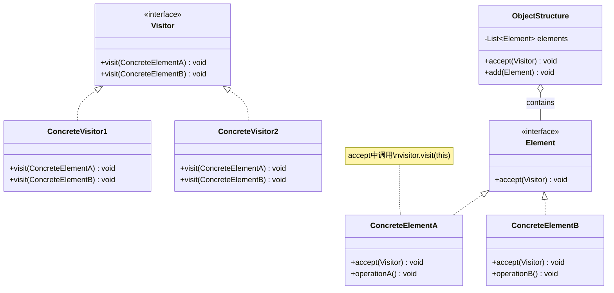

# 访问者 Visitor

> 在不修改已有类结构的前提下，定义作用于这些对象的新操作。

## 意图

访问者模式将操作从对象结构中分离出来。当你有一个稳定的对象结构，但需要频繁添加新的操作时，可以在不修改对象类的前提下，通过添加新的访问者来实现新操作。

核心是"双分派"——访问者调用元素的方法，元素再回调访问者的方法，最终根据访问者和元素两个维度来确定执行哪个操作。

## 适用场景

- 对象结构稳定，但需要频繁添加新操作时
- 需要对一个复杂对象结构执行多种不同的、不相关的操作时
- 对象结构中的类很少变化，但需要经常定义新操作时
- 编译器的语法树遍历（AST）

## UML 类图



## 代码示例

### ❌ 没有使用该模式的问题

```java
// 每新增一种操作都要修改所有元素类
public interface Shape {
    double area();  // 操作1
    double perimeter();  // 操作2
    // 新增操作？所有实现类都要修改
    // void drawToPDF();
    // void drawToSVG();
    // void exportToJSON();
}

public class Circle implements Shape {
    public double area() { return Math.PI * radius * radius; }
    public double perimeter() { return 2 * Math.PI * radius; }
    // 每个新操作都要在这里实现
}
```

### ✅ 使用该模式后的改进

```java
// 访问者接口（定义所有可访问的操作）
public interface ShapeVisitor {
    void visit(Circle circle);
    void visit(Rectangle rectangle);
    void visit(Triangle triangle);
}

// 元素接口
public interface Shape {
    void accept(ShapeVisitor visitor);
}

// 具体元素
public class Circle implements Shape {
    private final double radius;

    public Circle(double radius) { this.radius = radius; }

    public double getRadius() { return radius; }

    @Override
    public void accept(ShapeVisitor visitor) {
        visitor.visit(this); // 双分派
    }
}

public class Rectangle implements Shape {
    private final double width;
    private final double height;

    public Rectangle(double width, double height) {
        this.width = width;
        this.height = height;
    }

    public double getWidth() { return width; }
    public double getHeight() { return height; }

    @Override
    public void accept(ShapeVisitor visitor) {
        visitor.visit(this);
    }
}

// 具体访问者：计算面积
public class AreaCalculator implements ShapeVisitor {
    @Override
    public void visit(Circle circle) {
        double area = Math.PI * circle.getRadius() * circle.getRadius();
        System.out.println("圆的面积: " + area);
    }

    @Override
    public void visit(Rectangle rectangle) {
        double area = rectangle.getWidth() * rectangle.getHeight();
        System.out.println("矩形的面积: " + area);
    }
}

// 具体访问者：导出 JSON
public class JsonExporter implements ShapeVisitor {
    @Override
    public void visit(Circle circle) {
        System.out.println("{\"type\":\"circle\",\"radius\":" + circle.getRadius() + "}");
    }

    @Override
    public void visit(Rectangle rectangle) {
        System.out.println("{\"type\":\"rectangle\",\"width\":" + rectangle.getWidth()
            + ",\"height\":" + rectangle.getHeight() + "}");
    }
}

// 使用
public class Main {
    public static void main(String[] args) {
        List<Shape> shapes = Arrays.asList(
            new Circle(5), new Rectangle(3, 4)
        );

        // 新增操作只需新增一个访问者，无需修改 Shape 类
        ShapeVisitor areaCalc = new AreaCalculator();
        ShapeVisitor jsonExporter = new JsonExporter();

        for (Shape shape : shapes) {
            shape.accept(areaCalc);
        }
        for (Shape shape : shapes) {
            shape.accept(jsonExporter);
        }
    }
}
```

### Spring 中的应用

Spring 的 `BeanDefinitionVisitor` 就是访问者模式的应用：

```java
// Spring 解析 BeanDefinition 时使用访问者模式
public class BeanDefinitionVisitor {
    public void visitBeanDefinition(BeanDefinition beanDefinition) {
        // 遍历并解析 BeanDefinition 中的属性值
        visitPropertyValues(beanDefinition.getPropertyValues());
        visitConstructorArgs(beanDefinition.getConstructorArgumentValues());
    }
}

// ASM 字节码操作框架中也大量使用访问者模式
// ClassVisitor → MethodVisitor → FieldVisitor
// 在不修改类结构的前提下分析/修改字节码
ClassVisitor visitor = new ClassVisitor(Opcodes.ASM9) {
    @Override
    public MethodVisitor visitMethod(int access, String name, String desc,
                                      String signature, String[] exceptions) {
        // 可以在不修改原始类的情况下分析每个方法
        return super.visitMethod(access, name, desc, signature, exceptions);
    }
};
```

## 优缺点

| 优点 | 缺点 |
|------|------|
| 新增操作很容易，只需新增访问者类 | 新增元素类型很困难，需要修改所有访问者 |
| 相关操作集中到访问者中，便于管理 | 违反了依赖倒置原则，访问者依赖具体类 |
| 访问者可以累积状态（跨元素的状态） | 双分派机制增加了理解难度 |
| 灵活，可以组合不同的访问者 | 元素类需要暴露内部细节给访问者 |

## 面试追问

**Q1: 什么是双分派（Double Dispatch）？**

A: 单分派是根据运行时对象的类型选择方法（Java 的方法重写）。双分派是根据两个对象的运行时类型选择方法。访问者模式通过 `element.accept(visitor)` 先分派到元素的方法，再通过 `visitor.visit(this)` 分派到访问者的方法，实现了双分派效果。Java 本身不支持双分派，访问者模式是一种模拟实现。

**Q2: 访问者模式和迭代器模式有什么关系？**

A: 迭代器关注"遍历"聚合对象中的元素，访问者关注"操作"每个元素。实际中经常结合使用——用迭代器遍历结构，用访问者对每个元素执行操作。访问者模式中的 ObjectStructure 通常使用迭代器来遍历元素。

**Q3: 访问者模式为什么违反开闭原则？**

A: 访问者模式对"新增操作"符合开闭原则（新增访问者），但对"新增元素类型"违反开闭原则（需要修改所有访问者接口和实现）。所以访问者模式的前提是"元素结构稳定，操作频繁变化"——如果元素类型也经常变化，就不适合用访问者模式。

## 相关模式

- **组合模式**：访问者通常遍历组合模式中的树形结构
- **迭代器模式**：迭代器遍历元素，访问者操作元素
- **命令模式**：命令封装操作，访问者定义操作
- **解释器模式**：解释器通常用访问者来遍历和操作语法树
