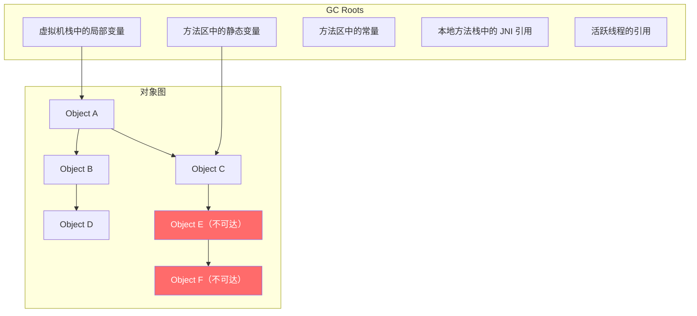
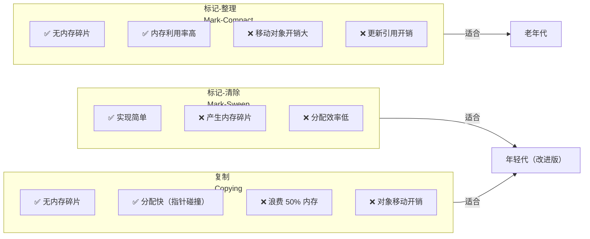
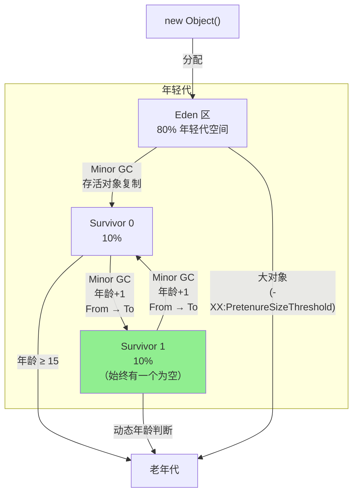
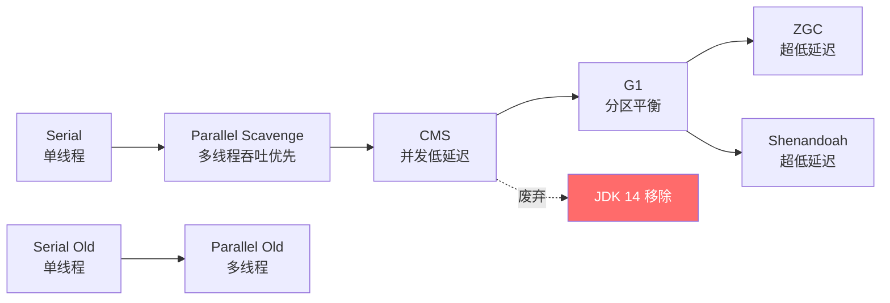
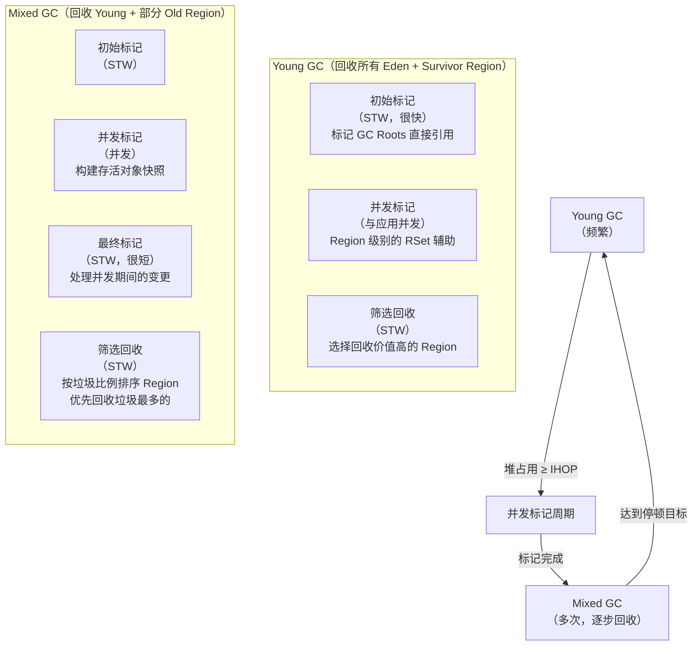
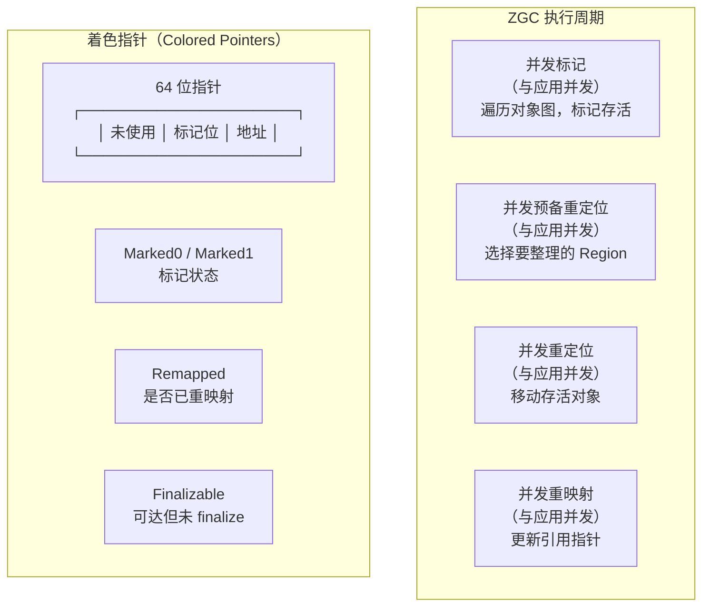
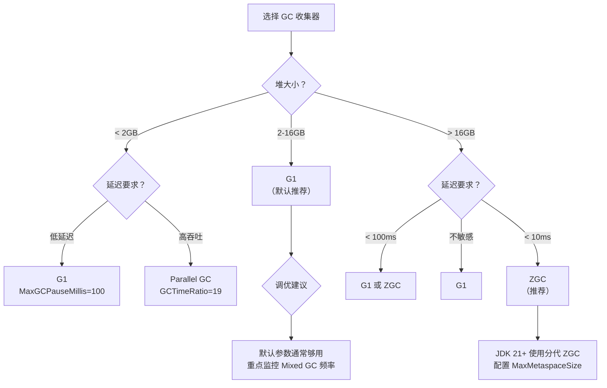

# 垃圾回收（GC）

> GC 不是"垃圾"回收，是"不可达对象"回收。Java 程序员不用手动 free 内存，但如果你不理解 GC 的工作原理，就无法定位线上频繁 Full GC、OOM、停顿超时等问题。这篇文章从"怎么判断对象该回收"到"怎么选 GC 收集器"，建立完整的知识体系。

## 对象存活判定

### 可达性分析——GC 的判定标准



```
从 GC Roots 出发，沿着引用链遍历：
- 能到达的对象 → 存活
- 不可达的对象 → 可回收

GC Roots 包括：
- 虚拟机栈（栈帧中的局部变量表）中的引用
- 方法区中类静态属性引用的对象
- 方法区中常量引用的对象
- 本地方法栈中 JNI（Native 方法）引用的对象
- JVM 内部引用（基本类型对应的 Class 对象、常驻异常、类加载器等）
- 所有被同步锁（synchronized）持有的对象
```

::: tip 为什么 Java 不用引用计数？
引用计数法有一个致命问题：**循环引用**。A 引用 B，B 引用 A，两者的计数器都不为 0，但实际上它们已经不可达了。Python 用引用计数 + 弱引用来解决，Java 直接用可达性分析，天然没有循环引用问题。
:::

### 四种引用强度

```java
import java.lang.ref.*;

// 强引用：绝对不会被回收（只要引用还在）
Object strong = new Object();

// 软引用（SoftReference）：内存不足时才回收
// 适合做缓存，配合 ReferenceQueue 使用
ReferenceQueue<Object> softQueue = new ReferenceQueue<>();
SoftReference<byte[]> cache = new SoftReference<>(new byte[1024 * 1024], softQueue);

// 弱引用（WeakReference）：下次 GC 时就回收
// 适合做 ThreadLocal 的 key、WeakHashMap
WeakReference<Object> weak = new WeakReference<>(new Object());

// 虚引用（PhantomReference）：不影响对象生命周期
// 唯一用途：对象被 GC 回收时收到通知（通过 ReferenceQueue）
// 用于管理堆外内存（DirectByteBuffer 的 Cleaner 机制）
ReferenceQueue<Object> phantomQueue = new ReferenceQueue<>();
PhantomReference<Object> phantom = new PhantomReference<>(new Object(), phantomQueue);

// 引用强度排序：强 > 软 > 弱 > 虚
```

```java
// 实际案例：ThreadLocal 为什么用 WeakReference？
// ThreadLocalMap 的 key 是 ThreadLocal 的弱引用
// value 是强引用
// 如果 ThreadLocal 外部没有强引用，key 会在下次 GC 时被回收
// 但 value 还在 → 需要 ThreadLocal.remove() 手动清理

static class ThreadLocalMap {
    // key 是 WeakReference<ThreadLocal<?>>
    // value 是 Object（强引用）
    static class Entry extends WeakReference<ThreadLocal<?>> {
        Object value;
        Entry(ThreadLocal<?> k, Object v) {
            super(k);  // key 是弱引用
            value = v;  // value 是强引用 ← 可能泄漏！
        }
    }
}
```

## GC 算法原理

### 三种基础算法对比



```
标记-清除（Mark-Sweep）：
  1. 标记阶段：从 GC Roots 遍历，标记所有可达对象
  2. 清除阶段：清除所有未标记的对象
  ✅ 简单
  ❌ 产生内存碎片 → 大对象可能分配失败
  ❌ 分配效率低（需要用空闲列表分配）

复制（Copying）：
  1. 将内存分为两块（From 和 To）
  2. 标记所有可达对象
  3. 将存活对象复制到 To 区
  4. 清空 From 区
  5. From 和 To 交换角色
  ✅ 无碎片，分配快（指针碰撞）
  ❌ 浪费一半内存（实际 HotSpot 用 Eden + 2 Survivor 优化为只浪费 10%）
  ❌ 对象移动开销（需要更新引用）

标记-整理（Mark-Compact）：
  1. 标记所有可达对象
  2. 将存活对象向一端移动
  3. 清除边界以外的内存
  ✅ 无碎片，不浪费内存
  ❌ 移动对象开销大（要更新所有引用指针）
  → 老年代用的就是标记-整理
```

### GC 算法执行流程


### 性能对比表

| 指标 | 标记-清除 | 复制 | 标记-整理 |
|------|---------|------|---------|
| 空间开销 | 无额外开销 | 50% 空间浪费 | 无额外开销 |
| 碎片问题 | 严重碎片 | 无碎片 | 无碎片 |
| 分配效率 | 低（空闲列表） | 高（指针碰撞） | 高（指针碰撞） |
| 移动开销 | 无 | 有 | 有 |
| 适用区域 | CMS 老年代 | 新生代 | Serial Old / Parallel Old |
| 吞吐量 | 高 | 中 | 中 |

## 分代收集理论

### 分代假设

```
分代收集的理论基础——弱分代假说（Weak Generational Hypothesis）：
  1. 绝大多数对象都是"朝生夕死"的（90%+ 的对象在 Minor GC 后就死了）
  2. 熬过越多次 GC 的对象，越可能继续存活

因此，JVM 将堆分为年轻代和老年代：
  - 年轻代：存放新创建的对象，用复制算法，GC 频率高但每次很快
  - 老年代：存放长期存活的对象，用标记-整理，GC 频率低但每次较慢

跨代引用假说（Intergenerational Reference Hypothesis）：
  - 跨代引用（老年代引用新生代）相对于同代引用极少
  - 不需要扫描整个老年代来找跨代引用
  - 解决方案：记忆集（Remembered Set），记录老年代指向新生代的引用
```

### 新生代内存布局与对象流转



```
对象晋升老年代的条件：
1. 年龄达到阈值（-XX:MaxTenuringThreshold，默认 15）
2. 动态年龄判断：Survivor 中相同年龄对象大小总和超过 Survivor 空间一半
3. 大对象直接进入老年代（-XX:PretenureSizeThreshold，默认不启用）
4. Minor GC 后 Survivor 放不下的对象直接进入老年代
5. 空间分配担保：Minor GC 前检查老年代剩余空间是否足够
```

::: tip Survivor 区为什么需要两个？
每次 Minor GC 时，存活对象从 Eden 和当前使用的 Survivor（From）复制到另一个 Survivor（To），然后清空 From 区。两个 Survivor 的作用是保证 To 区始终是干净的（没有碎片），下一次 GC 时角色互换。如果只有一个 Survivor，复制后源区域和目标区域都需要处理碎片。

HotSpot 实际使用 `Eden : S0 : S1 = 8 : 1 : 1`，年轻代可用空间 = Eden + 1 个 Survivor = 90%。
:::

## GC 收集器详解

### 收集器演进路线



### 收集器对比表

| 收集器 | 分代 | 算法 | 线程 | 停顿 | 吞吐量 | 适用场景 |
|--------|------|------|------|------|--------|---------|
| Serial | 新生代 | 复制 | 单线程 | 高 | 低 | 客户端/小堆 |
| Serial Old | 老年代 | 标记-整理 | 单线程 | 很高 | 很低 | 客户端 |
| Parallel Scavenge | 新生代 | 复制 | 多线程 | 中 | 高 | 后台批处理 |
| Parallel Old | 老年代 | 标记-整理 | 多线程 | 高 | 高 | 后台批处理 |
| CMS | 老年代 | 标记-清除 | 并发 | 低 | 中 | Web（已废弃） |
| G1 | 全堆 | 复制+标记-整理 | 并发 | 可控 | 中 | 通用（默认） |
| ZGC | 全堆 | 着色指针+读屏障 | 并发 | <1ms | 中 | 大堆/低延迟 |
| Shenandoah | 全堆 | Brooks 指针 | 并发 | <1ms | 中 | 大堆/低延迟 |

### G1 垃圾收集器完全攻略

#### Region 化内存布局

```
G1 把堆划分为大小相等的 Region（默认约 2048 个，每个 1MB-32MB）：
┌─────┬─────┬─────┬─────┬─────┬─────┬─────┬─────┐
│  E  │  E  │  S  │  O  │  O  │  H  │  E  │  O  │
├─────┼─────┼─────┼─────┼─────┼─────┼─────┼─────┤
│  E  │  O  │  E  │  E  │  S  │  O  │  E  │  O  │
└─────┴─────┴─────┴─────┴─────┴─────┴─────┴─────┘
E = Eden, S = Survivor, O = Old, H = Humongous（大对象 > Region 50%）

特点：
- 不再有物理上的年轻代和老年代划分
- Region 可以动态扮演 Eden、Survivor、Old 角色
- 大对象（> Region 的 50%）占连续多个 Region（Humongous）
```

#### G1 回收过程



#### G1 调优参数详解

```bash
# ========== 核心参数 ==========
-XX:+UseG1GC                        # 启用 G1
-XX:MaxGCPauseMillis=200             # 目标最大停顿时间（默认 200ms）
-XX:G1HeapRegionSize=8m              # Region 大小（1-32MB，2的幂次方）
                                     # 堆 ≤ 8G → 2MB，堆 > 8G → 4MB，堆 > 32G → 8MB

# ========== 年轻代控制 ==========
-XX:G1NewSizePercent=5               # 年轻代最小占比（默认 5%）
-XX:G1MaxNewSizePercent=60           # 年轻代最大占比（默认 60%）

# ========== 并发标记控制 ==========
-XX:InitiatingHeapOccupancyPercent=45  # 堆占用达到 45% 时触发并发标记
-XX:G1MixedGCCountTarget=8             # Mixed GC 后期望剩余老年代占比（默认 8）
-XX:G1MixedGCLiveThresholdPercent=85   # Region 存活率低于 85% 才被选入 Mixed GC
-XX:G1HeapWastePercent=5               # 回收后允许浪费的 Region 比例

# ========== 高级调优 ==========
-XX:G1ReservePercent=10                # 保留 10% 堆用于突发分配
-XX:G1SATBBufferEnqueueThreshold=1000  # SATB 缓冲区队列长度
-XX:+G1UseAdaptiveIHOP                 # 自动调整 IHOP（JDK 9+ 默认开启）
```

::: warning G1 调优常见误区
1. **MaxGCPauseMillis 设太小**（如 50ms）：G1 会缩小每次回收的 Region 数，导致 Mixed GC 频率上升，反而更差
2. **Region 大小不合适**：大对象多时应增大 Region 大小，减少 Humongous 分配
3. **IHOP 值不合适**：太小导致频繁并发标记，太大导致老年代被填满才回收
4. **不要手动设置年轻代大小**：让 G1 自动调整，除非有明确的数据支撑
:::

### ZGC 深度分析

#### ZGC 核心原理



```
ZGC 的核心创新：
1. 着色指针（Colored Pointers）：
   - 在 64 位指针的高位存储 GC 信息（标记状态、重映射状态等）
   - 不需要额外的对象头空间
   - 支持并发移动对象时，应用线程通过读屏障自动修正指针

2. 读屏障（Load Barrier）：
   - 每次读取引用时，检查指针的颜色位
   - 如果对象已移动，自动修正指针到新位置
   - 与写屏障（CMS/G1 使用）不同，读屏障的开销更可控

3. 并发处理：
   - 几乎所有工作都与应用线程并发执行
   - STW 时间极短（通常 < 1ms），与堆大小无关
   - JDK 16+：支持并发线程栈扫描，STW 进一步缩短
```

#### ZGC 分代架构（JDK 21+）

```
JDK 21+ 分代 ZGC：
┌─────────────────────────────────┐
│          ZGC 堆                 │
│  ┌──────────────────────────┐   │
│  │     年轻代（Young Gen）   │   │
│  │  Eden + 2 Survivor       │   │
│  │  频繁回收，速度极快       │   │
│  └──────────────────────────┘   │
│  ┌──────────────────────────┐   │
│  │     老年代（Old Gen）     │   │
│  │  长期存活对象             │   │
│  │  回收频率低               │   │
│  └──────────────────────────┘   │
└─────────────────────────────────┘

分代 ZGC 的优势：
- 年轻代 GC 频率更高，但只扫描年轻代，开销更小
- 老年代 GC 频率低，减少全堆扫描
- 整体吞吐量提升 10-20%，停顿时间进一步缩短
```

#### ZGC 调优参数

```bash
# ========== 基础参数 ==========
-XX:+UseZGC                          # 启用 ZGC
-XX:+ZGenerational                    # 启用分代 ZGC（JDK 21+）

# ========== 内存控制 ==========
-XX:SoftMaxHeapSize=4g                # 软限制堆大小（容器环境有用）
-XX:ZAllocationSpikeTolerance=2.0     # 分配突增容忍度（默认 2.0）

# ========== 并发控制 ==========
-XX:ConcGCThreads=2                   # 并发 GC 线程数（默认 ≈ CPU/8）
-XX:ParallelGCThreads=8               # STW 阶段线程数

# ========== 高级参数 ==========
-XX:ZFragmentationLimit=5             # 碎片率限制（触发并发整理）
-XX:ZCollectionInterval=0             # GC 间隔（0 = 自适应）
```

::: tip ZGC 适用场景
- 堆大小 > 16GB
- 对延迟极其敏感（< 10ms 停顿要求）
- 大对象多的应用（如数据分析、流处理）
- JDK 21+ 推荐使用分代 ZGC 作为默认 GC
:::

### Shenandoah 对比分析

```
Shenandoah（Red Hat 开源）：
核心创新：Brooks 指针
- 每个对象有一个额外的引用指针（forwarding pointer）
- 移动对象时，先更新 Brooks 指针，再逐步更新引用
- 应用线程通过 Brooks 指针间接访问对象

ZGC vs Shenandoah 对比：
┌────────────┬─────────────────┬─────────────────┐
│  特性       │     ZGC         │   Shenandoah    │
├────────────┼─────────────────┼─────────────────┤
│ 厂商       │ Oracle          │ Red Hat         │
│ 指针方案    │ 着色指针         │ Brooks 指针     │
│ 屏障类型    │ 读屏障          │ 读/写屏障       │
│ 分代支持    │ JDK 21+ 支持    │ 无分代          │
│ 压缩指针    │ 支持            │ 不支持          │
│ 默认 JDK   │ 无（需手动启用）  │ 无（需手动启用） │
│ 生产就绪    │ JDK 15+         │ JDK 12+         │
│ 最大堆     │ 16TB            │ 理论无限制       │
│ 停顿时间    │ < 1ms           │ < 1ms           │
└────────────┴─────────────────┴─────────────────┘

选择建议：
- Oracle JDK → 优先 ZGC
- OpenJDK → 两者都可用，ZGC 生态更好
- 需要 CompressedOops → ZGC
- 不想升级到 JDK 21 → 非分代 ZGC 或 Shenandoah
```

## GC 日志完整解析

### JDK 9+ 统一日志格式

```bash
# JDK 9+ 统一日志参数
-Xlog:gc*:file=gc.log:time,uptime,level,tags:filecount=5,filesize=20m

# 常用日志配置
-Xlog:gc                                          # 基础 GC 日志
-Xlog:gc*=info                                    # 所有 GC 相关日志
-Xlog:gc+heap=debug                               # 堆相关信息
-Xlog:gc+phases=debug                             # GC 各阶段耗时
-Xlog:gc+age=trace                                # 对象年龄分布
-Xlog:gc+humongous=debug                          # 大对象信息
-Xlog:safepoint=debug                             # 安全点信息
```

### G1 GC 日志解析

```
[2024-01-15T10:23:45.678+0800] GC pause (G1 Evacuation Pause) (young)
  [Eden: 256.0M(256.0M)->0.0B(224.0M)
   Survivors: 0.0B->32.0M
   Heap: 512.0M(4096.0M)->280.0M(4096.0M)]
  [Times: user=0.08 sys=0.01, real=0.02 secs]
  [Eden regions: 64->0
   Survivor regions: 0->4
   Old regions: 96->96
   Humongous regions: 2->2]
  [Other: 0.3 ms]

解析：
- GC pause (G1 Evacuation Pause) (young)：年轻代回收
- Eden: 256.0M→0.0B：Eden 区被清空
- Survivors: 0.0B→32.0M：存活对象进入 Survivor
- Heap: 512.0M→280.0M：堆使用从 512MB 降到 280MB
- real=0.02 secs：实际停顿时间 20ms
- user=0.08：用户态 CPU 时间（多线程累加）
```

### G1 Mixed GC 日志

```
[2024-01-15T10:25:12.345+0800] GC pause (G1 Mixed GC)
  [Eden: 224.0M(224.0M)->0.0B(192.0M)
   Survivors: 32.0M->32.0M
   Old: 1024.0M->896.0M
   Heap: 1280.0M(4096.0M)->960.0M(4096.0M)]
  [Mixed: candidate regions: 128, selected: 32
   Old regions: 128->112
   Humongous regions: 4->4]
  [Times: user=0.35 sys=0.02, real=0.12 secs]

解析：
- Mixed GC：混合回收（年轻代 + 部分老年代）
- Old: 1024.0M→896.0M：回收了 128MB 老年代
- candidate regions: 128：候选回收的 Old Region 数量
- selected: 32：本次实际回收的 Region 数量
- real=0.12 secs：停顿时间 120ms
```

### ZGC 日志解析

```
[2024-01-15T10:30:00.000+0800] Garbage Collection (ZGC)
  [Phase: Pause Mark Start, Time: 0.015 ms]
  [Phase: Concurrent Mark, Time: 12.345 ms]
  [Phase: Pause Mark End, Time: 0.008 ms]
  [Phase: Concurrent Relocate, Time: 8.765 ms]
  [Statistics:
    Soft: 0.00 B, 0 objects
    Medium: 0.00 B, 0 objects
    Live: 2.50 GB, 12345678 objects
    Allocated: 4.00 GB
    Garbage: 1.50 GB (37.5%)]
  [Metrics:
    Load Barrier Slow: 1234
    Load Barrier Fast: 5678901]

解析：
- Pause Mark Start：初始标记停顿 0.015ms
- Concurrent Mark：并发标记耗时 12.345ms（与应用并发，不影响用户）
- Pause Mark End：最终标记停顿 0.008ms
- 总 STW 时间：0.023ms（亚毫秒级！）
- Garbage: 37.5%：垃圾占比
```

::: tip GC 日志分析工具
- **GCViewer**：开源 GC 日志分析，生成图表
- **GCEasy.io**：在线分析工具，上传日志即可
- **JDK Mission Control（jmc）**：JDK 自带，分析 JFR 记录
- **Elastic APM**：生产环境 GC 监控
- **Prometheus + Grafana**：GC 指标可视化监控
:::

## GC 调优实战

### 案例 1：频繁 Full GC 排查

```
现象：
- 应用响应时间从 50ms 飙升到 2s
- GC 日志显示每分钟 2-3 次 Full GC
- 每次 Full GC 停顿 3-5 秒

排查步骤：
1. 检查 GC 日志
   → Full GC 原因：System.gc()（显式调用）
   → 解决：-XX:+DisableExplicitGC

2. 如果不是 System.gc()
   → 检查 Metaspace：jstat -gcmetacapacity
   → 发现 Metaspace 持续增长 → 动态代理泄漏
   → 解决：限制 MaxMetaspaceSize，修复代理类缓存

3. 如果是堆不足
   → jmap -histo:live <pid> | head -20
   → 发现某个业务对象数量异常
   → MAT 分析 heapdump → 定位代码 → 修复内存泄漏
```

### 案例 2：Young GC 耗时过长

```
现象：
- Young GC 停顿时间从 20ms 增长到 200ms
- 应用偶尔出现超时

排查步骤：
1. 检查存活对象大小
   → jstat -gc <pid> 发现 Survivor 区几乎被填满
   → 存活对象超过 Survivor 容量 → 直接晋升老年代

2. 分析原因
   → 大量短生命周期但稍大的对象（如 JSON 字符串）
   → Survivor 区放不下 → 过早晋升 → 老年代快速增长

3. 解决方案
   a. 增大年轻代：-Xmn2g（或调整 NewRatio）
   b. 增大 Survivor：-XX:SurvivorRatio=6（Eden:S0:S1 = 6:1:1）
   c. 减小晋升年龄阈值：-XX:MaxTenuringThreshold=8
   d. 代码优化：减少大对象的创建（如使用流式处理代替全量加载）
```

### 案例 3：大对象导致 Full GC

```java
// 问题代码：一次性加载大文件到内存
public List<String> readFile(String path) throws IOException {
    // 100MB 文件一次性加载 → 大对象直接进老年代
    return Files.readAllLines(Paths.get(path));
}

// 优化方案：流式处理
public void processFile(String path) throws IOException {
    try (Stream<String> lines = Files.lines(Paths.get(path))) {
        lines.forEach(this::processLine);  // 逐行处理
    }
}

// 如果必须全量加载，考虑分片
// -XX:G1HeapRegionSize=16m  # 增大 Region 减少大对象
// -XX:G1LargeObjectHeapThreshold=4m  # 调整大对象阈值
```

### GC 调优公式与经验值

```
========== 堆大小估算 ==========
堆大小 = 活跃数据大小 × (1 + 浮动系数)
浮动系数通常取 1.5-2.0

示例：
- 活跃数据（存活对象 + 常驻数据）= 2GB
- 堆大小 = 2GB × 2 = 4GB（推荐）
- 年轻代 = 堆大小 × 1/3 ≈ 1.3GB
- Survivor = 年轻代 × 1/10 ≈ 130MB

========== 年轻代大小估算 ==========
目标：Minor GC 间隔 1-5 秒
年轻代 = 每秒分配速率 × 目标 GC 间隔

示例：
- 每秒分配 200MB（通过 GC 日志统计）
- 目标间隔 3 秒
- 年轻代 ≥ 200MB × 3 = 600MB

========== GC 停顿预算 ==========
总停顿时间 < 请求超时时间 × 10%
示例：
- 请求超时 2 秒
- GC 停顿预算 < 200ms
- G1: MaxGCPauseMillis=200（合理）
```

## 内存泄漏检测与修复

### 常见内存泄漏模式

```java
// 1. 静态集合持有对象引用
public class Leak1 {
    private static final List<Object> CACHE = new ArrayList<>();
    // 缓存没有淘汰机制，只增不减
    // 修复：使用 LRU 策略的缓存（Caffeine / Guava Cache）
}

// 2. 未关闭的资源
public class Leak2 {
    public void process() {
        Connection conn = dataSource.getConnection();
        Statement stmt = conn.createStatement();
        // 忘记关闭 conn → 连接泄漏
        // 修复：try-with-resources
        try (Connection c = dataSource.getConnection();
             Statement s = c.createStatement()) {
            // 使用资源
        }
    }
}

// 3. 监听器和回调未注销
public class Leak3 {
    private final List<EventListener> listeners = new ArrayList<>();

    public void addListener(EventListener l) {
        listeners.add(l);  // 注册
    }
    // 缺少 removeListener！对象无法被 GC
    // 修复：提供注销方法，或使用 WeakReference
}

// 4. ThreadLocal 未清理
// 修复：每次使用后 finally { threadLocal.remove(); }

// 5. 内部类持有外部类引用
public class Leak4 {
    // 非静态内部类隐式持有外部类引用
    class InnerTask implements Runnable {
        @Override
        public void run() {
            // 持有 Leak4.this → 外部类无法被回收
        }
    }
    // 修复：改为 static class
}
```

### 内存泄漏检测工具

```bash
# 方法 1：jmap 定期采样
while true; do
    jmap -histo:live <pid> | head -20
    sleep 60
done
# 观察：某个类的对象数量持续增长 → 可能泄漏

# 方法 2：堆转储对比
jmap -dump:live,format=b,file=heap1.hprof <pid>
# ... 运行一段时间 ...
jmap -dump:live,format=b,file=heap2.hprof <pid>
# 用 MAT 的 "Compare" 功能对比两个 dump

# 方法 3：Arthas 在线诊断
dashboard           # 观察内存趋势
heapdump /tmp/dump  # 导出堆转储

# 方法 4：MAT 分析
# 打开 heapdump → Leak Suspects Report
# → 自动分析最可能的泄漏点
# → Dominator Tree 查看占用内存最大的对象
# → Path to GC Roots 查看对象被谁引用
```

## 生产环境 GC 策略选择

### 决策树



### 不同场景最佳配置

```bash
# ========== 场景 1：Web 服务（4C8G，Spring Boot）==========
java \
  -Xms4g -Xmx4g \
  -XX:+UseG1GC \
  -XX:MaxGCPauseMillis=200 \
  -XX:MetaspaceSize=256m \
  -XX:MaxMetaspaceSize=512m \
  -XX:+HeapDumpOnOutOfMemoryError \
  -XX:HeapDumpPath=/var/log/app/heap.hprof \
  -Xlog:gc*:file=/var/log/app/gc.log:time,uptime,level,tags:filecount=5,filesize=20m \
  -XX:+AlwaysPreTouch \
  -jar app.jar

# ========== 场景 2：大堆 + 低延迟（16C64G，交易系统）==========
java \
  -Xms32g -Xmx32g \
  -XX:+UseZGC \
  -XX:+ZGenerational \
  -XX:SoftMaxHeapSize=28g \
  -XX:MetaspaceSize=512m \
  -XX:MaxMetaspaceSize=1g \
  -XX:ConcGCThreads=4 \
  -XX:+HeapDumpOnOutOfMemoryError \
  -Xlog:gc*:file=/var/log/app/gc.log:time,uptime,level,tags:filecount=10,filesize=50m \
  -jar app.jar

# ========== 场景 3：批处理（8C16G，数据 ETL）==========
java \
  -Xms12g -Xmx12g \
  -XX:+UseParallelGC \
  -XX:ParallelGCThreads=8 \
  -XX:+UseParallelOldGC \
  -XX:MaxGCPauseMillis=1000 \
  -XX:GCTimeRatio=9 \
  -XX:+HeapDumpOnOutOfMemoryError \
  -Xlog:gc*:file=/var/log/app/gc.log:time,uptime,level,tags:filecount=5,filesize=50m \
  -jar app.jar

# ========== 场景 4：容器环境（2C4G，K8s Pod）==========
java \
  -XX:MaxRAMPercentage=75.0 \
  -XX:+UseG1GC \
  -XX:MaxGCPauseMillis=200 \
  -XX:+UseContainerSupport \
  -XX:+PrintGCDetails \
  -jar app.jar
```

::: warning 容器环境注意事项
K8s/Docker 中运行 Java 时：
1. 使用 `-XX:MaxRAMPercentage=75.0` 而不是固定 `-Xmx`，让 JVM 感知容器内存限制
2. 确保 JDK 8u191+ 或 JDK 11+，才能正确识别容器内存限制
3. 注意 `heap + metaspace + thread stacks + direct memory + native` ≤ 容器内存限制
4. 使用 `容器感知` 的 GC 参数：`-XX:+UseContainerSupport`（JDK 10+ 默认开启）
:::

## 监控与告警体系

### GC 关键指标

```bash
# ========== Prometheus + Grafana 监控 ==========
# JVM 暴露的 MBean 指标（通过 jmx_exporter）

# GC 指标
jvm_gc_pause_seconds_count          # GC 次数
jvm_gc_pause_seconds_sum            # GC 总耗时
jvm_gc_pause_seconds_max            # GC 最大停顿时间
jvm_gc_live_data_size_bytes         # 存活数据大小
jvm_gc_memory_allocated_bytes_total # 已分配内存总量

# 堆内存指标
jvm_memory_bytes_used               # 已使用内存
jvm_memory_bytes_max                # 最大内存
jvm_memory_bytes_committed          # 已提交内存

# 元空间指标
jvm_memory_bytes_used{area="metaspace"}
```

### 告警规则

```yaml
# Prometheus 告警规则示例
groups:
  - name: jvm_alerts
    rules:
      # Full GC 告警
      - alert: FrequentFullGC
        expr: rate(jvm_gc_pause_seconds_count{action="end of major GC"}[5m]) > 0.1
        for: 5m
        labels:
          severity: critical
        annotations:
          summary: "频繁 Full GC（> 1次/5分钟）"

      # GC 停顿时间过长
      - alert: LongGCPause
        expr: histogram_quantile(0.99, rate(jvm_gc_pause_seconds_bucket[5m])) > 0.5
        for: 5m
        labels:
          severity: warning
        annotations:
          summary: "99% GC 停顿时间超过 500ms"

      # 堆使用率过高
      - alert: HighHeapUsage
        expr: jvm_memory_bytes_used{area="heap"} / jvm_memory_bytes_max{area="heap"} > 0.85
        for: 10m
        labels:
          severity: warning
        annotations:
          summary: "堆使用率超过 85%"

      # 元空间增长过快
      - alert: MetaspaceGrowth
        expr: deriv(jvm_memory_bytes_used{area="nonheap"}) > 1048576
        for: 10m
        labels:
          severity: warning
        annotations:
          summary: "非堆内存增长超过 1MB/s"

      # 内存接近 OOM
      - alert: NearOOM
        expr: jvm_memory_bytes_used{area="heap"} / jvm_memory_bytes_max{area="heap"} > 0.95
        for: 2m
        labels:
          severity: critical
        annotations:
          summary: "堆使用率超过 95%，即将 OOM"
```

### 健康度检查脚本

```bash
#!/bin/bash
# gc_health_check.sh - 快速检查 JVM 健康状态

PID=$1
if [ -z "$PID" ]; then
    echo "Usage: $0 <pid>"
    exit 1
fi

echo "=== JVM Health Check for PID: $PID ==="
echo ""

# 1. 堆使用情况
echo "--- 堆内存 ---"
jmap -heap $PID 2>/dev/null | grep -E "Eden|Survivor|Old|used|capacity"

# 2. GC 统计
echo ""
echo "--- GC 统计 ---"
jstat -gcutil $PID 1 1 2>/dev/null

# 3. 线程数
echo ""
echo "--- 线程数 ---"
THREAD_COUNT=$(jstack $PID 2>/dev/null | grep -c "^\"" )
echo "Total threads: $THREAD_COUNT"

# 4. 最近 10 次 GC 停顿（需要 GC 日志）
echo ""
echo "--- 健康评估 ---"
YGC=$(jstat -gcutil $PID 2>/dev/null | tail -1 | awk '{print $13}')
FGC=$(jstat -gcutil $PID 2>/dev/null | tail -1 | awk '{print $15}')
echo "Young GC count: $YGC"
echo "Full GC count: $FGC"

if [ "$FGC" -gt 10 ]; then
    echo "⚠️  警告：Full GC 次数过多（$FGC），请检查内存泄漏"
fi
```

## 最佳实践与避坑指南

### GC 调优黄金法则

::: tip 十条调优铁律
1. **先 profiling，再调优** — 不要凭猜测改参数
2. **80% 的性能问题来自代码** — 优化代码 > 调 JVM 参数
3. **一次只改一个参数** — 改完观察确认再改下一个
4. **-Xms = -Xmx** — 避免运行时堆扩容/缩容的开销
5. **监控先于告警** — 建立完整的监控体系
6. **压测验证** — 调优结果必须在压测环境中验证
7. **记录调优过程** — 记录改了什么、为什么改、效果如何
8. **关注 99 分位** — 平均值会掩盖问题，看 P99 停顿时间
9. **预留安全水位** — 堆使用率不要超过 70%
10. **定期 Review** — 随着业务变化，GC 策略需要持续优化
:::

### 常见坑与解决方案

| 问题 | 原因 | 解决方案 |
|------|------|---------|
| System.gc() 导致 Full GC | 代码或第三方库显式调用 | `-XX:+DisableExplicitGC` |
| CMS 并发模式失败 | 老年代增长过快，CMS 来不及回收 | 换 G1 或增大老年代 |
| G1 to-space exhausted | 没有足够的空闲 Region 进行复制 | 增大堆大小或调小 MaxGCPauseMillis |
| 元空间 OOM | 动态代理/CGLib 泄漏 | 限制 MaxMetaspaceSize，修复泄漏 |
| 直接内存 OOM | DirectByteBuffer 未释放 | 设置 MaxDirectMemorySize |
| GC 日志过大 | 未配置滚动策略 | filecount=5,filesize=20m |
| 容器 OOM killed | JVM 不感知容器内存限制 | 使用 MaxRAMPercentage |

## 面试高频题

**Q1：Minor GC 和 Full GC 的区别？**

Minor GC 回收年轻代（Eden + Survivor），频率高、速度快（通常 < 100ms）。Full GC 回收整个堆（包括老年代），频率低但慢（可能数秒），会触发 STW，所有用户线程暂停。线上要尽量避免频繁 Full GC。Full GC 的常见原因：老年代空间不足、元空间不足、System.gc()、空间分配担保失败。

**Q2：什么情况下对象会直接进入老年代？**

1. 大对象（`-XX:PretenureSizeThreshold`，超过此大小直接进老年代）；2. 长期存活对象（年龄达 `MaxTenuringThreshold`，默认 15）；3. 动态年龄判断（Survivor 中同年龄对象总大小超过 Survivor 空间一半）；4. Minor GC 后 Survivor 放不下的对象；5. 空间分配担保失败。

**Q3：G1 和 CMS 的区别？**

CMS 用标记-清除，有内存碎片，无法预测停顿时间，仅回收老年代。G1 用分区+复制算法，无碎片，可预测停顿时间，全堆收集。G1 是 CMS 的替代品，JDK 14 正式移除 CMS。

**Q4：ZGC 为什么能做到亚毫秒级停顿？**

ZGC 使用着色指针（Colored Pointers）和读屏障（Load Barrier），实现了并发标记、并发移动对象。应用线程在读取引用时通过读屏障自动修正指针，不需要 STW 来更新引用。STW 时间仅用于初始标记和最终标记等极短操作。

**Q5：如何选择 GC 收集器？**

- 小堆（< 2GB）：G1 或 Serial
- 中等堆（2-16GB）：G1（默认推荐）
- 大堆 + 低延迟（> 16GB）：ZGC
- 批处理高吞吐：Parallel GC
- 不要纠结 CMS，已经废弃

## 延伸阅读

- 上一篇：[JVM 原理](jvm.md) — 运行时数据区、类加载、JIT
- 下一篇：[性能调优](tuning.md) — JVM 参数、诊断工具、常见问题
- [并发编程](../java-basic/concurrency.md) — 线程安全、锁机制、AQS
