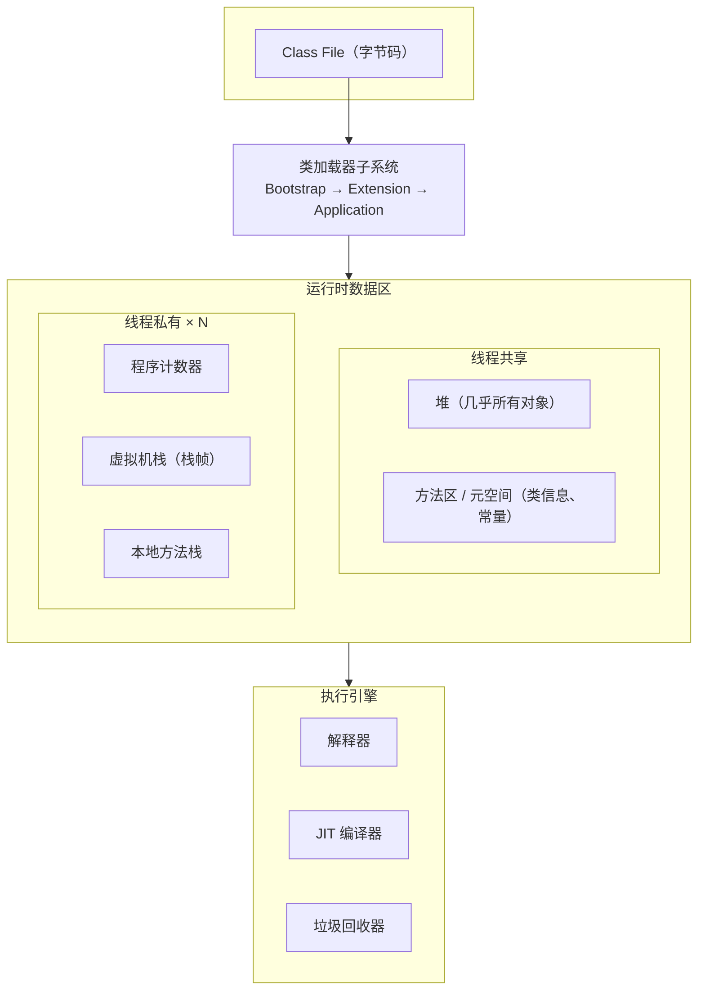
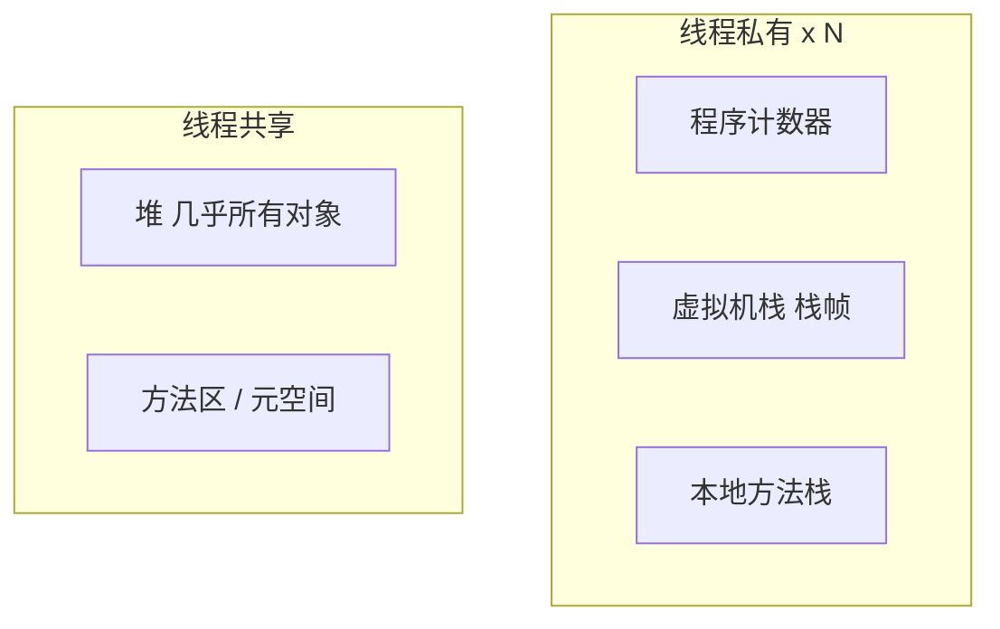
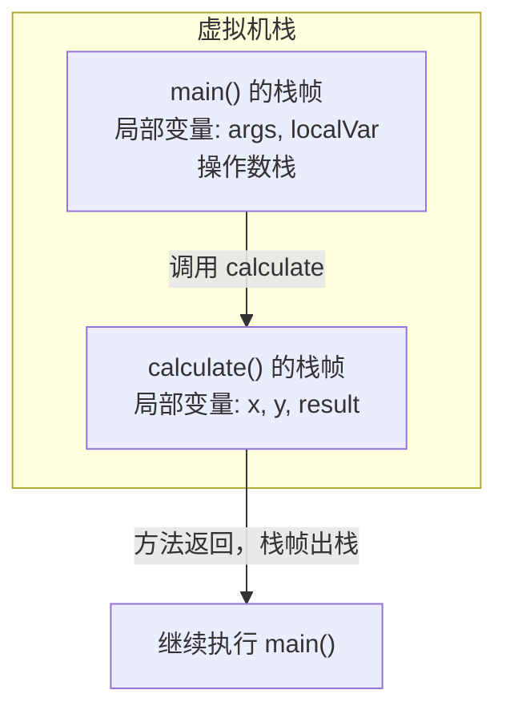
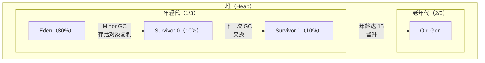
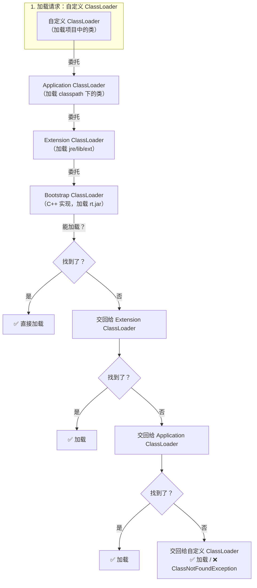

# JVM 原理

> 很多人觉得 JVM 是"面试八股文"，和实际开发关系不大。但当你遇到线上 OOM、CPU 100%、GC 停顿导致超时、Metaspace 溢出等问题时，JVM 知识就是救命稻草。这篇文章帮你建立一套系统的 JVM 知识框架。

## JVM 架构——一张图看懂



## 运行时数据区——每个区域存什么？



### 线程私有 vs 线程共享

```
线程私有（每个线程一份）：
  - 程序计数器：当前执行的字节码行号
  - 虚拟机栈：方法调用的栈帧（局部变量表、操作数栈、动态链接、返回地址）
  - 本地方法栈：Native 方法的栈（如 Object.hashCode() 底层是 native）

线程共享（所有线程共用）：
  - 堆：几乎所有对象都在这里分配
  - 方法区：类信息、常量、静态变量（JDK 8+ 叫元空间 Metaspace）
```

### 虚拟机栈——方法调用的账本



::: danger StackOverflowError 的典型场景
递归没有终止条件、方法调用链太深（如 A → B → C → ... → A 循环调用）。默认栈大小是 1MB（`-Xss1m`），每个栈帧大约 1KB，所以大约能嵌套 1000 层。如果需要更深的递归，可以增大 `-Xss`，但更好的做法是检查是否有 bug。
:::

### 堆——对象的家园




### 方法区 vs 元空间

```
JDK 7 及之前：永久代（PermGen）
  - 在 JVM 堆内存中
  - 大小固定，容易 OOM
  - 字符串常量池在永久代

JDK 8+：元空间（Metaspace）
  - 使用本地内存（Native Memory）
  - 大小理论上只受物理内存限制
  - 字符串常量池移到堆中
  - 更不容易 OOM，但仍需监控：-XX:MaxMetaspaceSize=256m
```

## 类加载机制

### 双亲委派模型



::: tip 为什么要有双亲委派？
1. **安全性**：防止自定义 `java.lang.String` 替换核心类
2. **避免重复加载**：父加载器已经加载过的类，子加载器不需要再加载
3. **层次清晰**：每个加载器有明确的职责范围
:::

### 打破双亲委派的场景

```java
// 1. SPI 机制（Service Provider Interface）
// 如 JDBC、JNDI：核心接口在 rt.jar（Bootstrap 加载）
// 具体实现在 classpath（Application 加载）
// Bootstrap 加载不到 classpath 的类 → 用 Thread.getContextClassLoader()

// 2. Tomcat
// 一个 Tomcat 部署多个 Web 应用，可能依赖同一个库的不同版本
// 每个应用有自己的 WebAppClassLoader，优先加载自己的类
// → 打破了双亲委派

// 3. OSGi
// 模块化框架，每个 Bundle 有自己的 ClassLoader
// 形成网状的委派关系，不再是树状
```

## JIT 编译——让 Java 跑得更快

### 为什么需要 JIT？

```
解释执行：每次运行都逐条解释字节码 → 慢
JIT 编译：把热点代码编译成机器码 → 快（接近 C/C++）

Java 的策略：混合模式
  - 先解释执行
  - 发现热点代码（调用次数超过阈值，默认 10000 次）
  - JIT 编译为机器码
  - 后续直接执行机器码

// 查看 JIT 编译情况：
// -XX:+PrintCompilation  （JDK 8）
// -Xlog:compilation=debug （JDK 9+）
```

### 逃逸分析——JIT 的魔法

```java
// 逃逸分析：判断对象的使用范围是否"逃出"了当前方法

// 不逃逸：对象只在方法内部使用
public int calculate() {
    Point p = new Point(1, 2);  // 不逃出方法
    return p.x + p.y;
}
// JIT 可能优化：不需要在堆上分配，直接在栈上分配（标量替换）

// 逃逸：对象被返回或存到外部
public Point createPoint() {
    return new Point(1, 2);  // 逃逸了，必须在堆上分配
}

// 逃逸分析的三个优化方向：
// 1. 栈上分配：对象在栈上创建，方法结束自动销毁，减少 GC 压力
// 2. 标量替换：不创建对象，而是把对象的字段拆开作为局部变量使用
// 3. 锁消除：如果对象不逃出线程，synchronized 可以去掉
```

## 常见 OOM 场景与排查

| OOM 类型 | 原因 | 排查方式 |
|----------|------|----------|
| `Java heap space` | 堆内存不足 | `jmap -histo` 看大对象，MAT 分析堆转储 |
| `Metaspace` | 加载的类太多（动态代理、Groovy） | 检查是否有无限创建类的情况 |
| `Direct buffer memory` | 堆外内存不足（NIO、Netty） | `-XX:MaxDirectMemorySize` 调大 |
| `unable to create new native thread` | 线程太多（线程池配置不当） | `jstack` 看线程数，检查线程池配置 |
| `GC overhead limit exceeded` | GC 花了 98% 时间但只回收了不到 2% | 通常是堆太小或内存泄漏 |

```bash
# OOM 时自动生成堆转储
-XX:+HeapDumpOnOutOfMemoryError
-XX:HeapDumpPath=/tmp/heap.hprof

# 然后用 MAT (Memory Analyzer Tool) 或 VisualVM 分析
```

## 面试高频题

**Q1：JVM 内存模型（JMM）和 JVM 运行时数据区有什么区别？**

JMM（Java Memory Model）是 Java 内存模型，定义了线程之间的可见性、有序性规则（volatile、synchronized、final 的语义），是并发编程的规范。运行时数据区是 JVM 运行时的内存布局（堆、栈、方法区等），是 JVM 的实现。两者名字很像但完全不同的概念。

**Q2：方法区、永久代、元空间的关系？**

方法区是 JVM 规范中的一个概念。永久代是 JDK 7 中方法区的实现。元空间是 JDK 8+ 中方法区的实现，从 JVM 堆移到了本地内存。字符串常量池从永久代移到了堆中。

**Q3：一个 Java 对象在内存中占多少字节？**

对象头（12 字节：Mark Word 8B + 类型指针 4B）+ 实例数据 + 对齐填充（保证是 8 的倍数）。例如一个空 Object 对象 = 12B 头 + 0B 数据 + 4B 填充 = 16B。一个 `int` 字段 = 4B，一个对象引用 = 4B（开启压缩指针）或 8B。

## 延伸阅读

- 下一篇：[垃圾回收](gc.md) — GC 算法、收集器选择、调优实战
- [性能调优](tuning.md) — JVM 参数、Arthas 诊断、常见问题排查
- [并发编程](../java-basic/concurrency.md) — 线程安全、锁机制、AQS
