# JVM 原理

> 很多人觉得 JVM 是"面试八股文"，和实际开发关系不大。但当你遇到线上 OOM、CPU 100%、GC 停顿导致超时、Metaspace 溢出等问题时，JVM 知识就是救命稻草。这篇文章帮你建立一套系统的 JVM 知识框架。

## JVM 架构总览

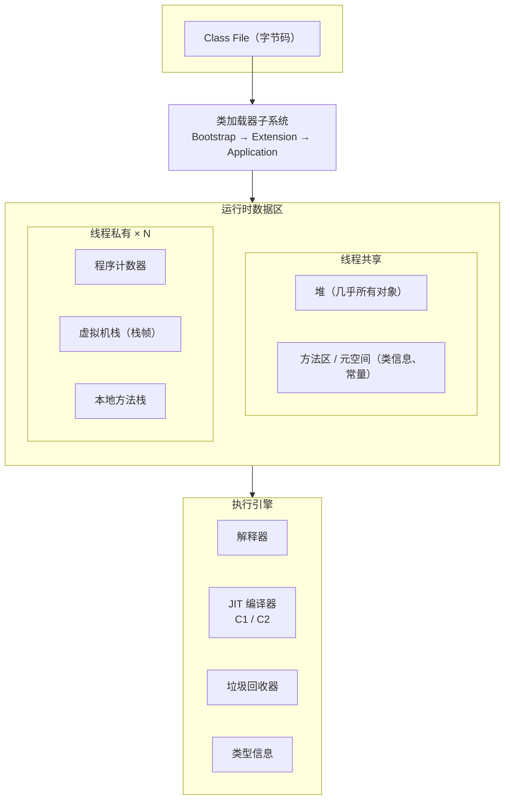

::: tip JVM 的三个核心组件
1. **类加载器子系统**：把 .class 文件加载到内存
2. **运行时数据区**：JVM 运行时的内存布局
3. **执行引擎**：执行字节码（解释器 + JIT 编译器 + GC）
:::

## 运行时数据区详解

### 整体内存布局

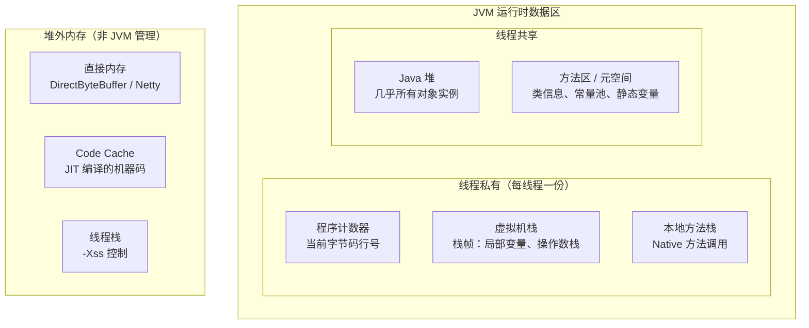

### 程序计数器（Program Counter Register）

```
作用：记录当前线程执行的字节码行号
大小：很小，可以忽略不计
线程安全：线程私有，天然线程安全

特点：
- 唯一一个不会发生 OOM 的区域
- 字节码解释器通过改变计数器值来选取下一条指令
- 多线程切换时，计数器记录当前执行位置，恢复时继续执行
- 执行 Native 方法时，计数器值为 undefined
```

### 虚拟机栈（VM Stack）

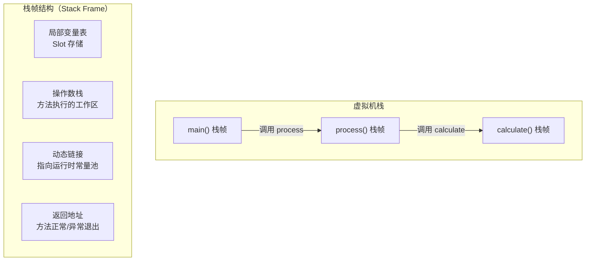

```java
// 栈帧的局部变量表演示
public int add(int a, int b) {
    // 局部变量表：
    // slot 0 = this（非 static 方法）
    // slot 1 = a
    // slot 2 = b
    int sum = a + b;  // slot 3 = sum
    return sum;
}

// 查看字节码：javap -v MyClass.class
// 局部变量表 Slot 数量在编译期确定
// long 和 double 占 2 个 Slot，其他占 1 个
```

::: danger StackOverflowError 的典型场景
递归没有终止条件、方法调用链太深（如 A → B → C → ... → A 循环调用）。默认栈大小 `-Xss1m`，每个栈帧约 1KB，约能嵌套 1000 层。如需更深递归可增大 `-Xss`，但更好的做法是检查是否有 bug。

```bash
# 模拟 StackOverflow
java -Xss256k StackOverflowDemo  # 更容易触发
```
:::

### 堆内存（Heap）


:::warning OOM 排查黄金法则
1. **-XX:+HeapDumpOnOutOfMemoryError**：OOM 时自动生成堆转储文件
2. **-XX:HeapDumpPath=/path/to/dump.hprof**：指定转储文件路径
3. 用 MAT（Memory Analyzer Tool）或 VisualVM 分析 hprof 文件
4. 常见 OOM 原因：内存泄漏（未关闭资源）、大对象分配、内存不足配置过小
:::
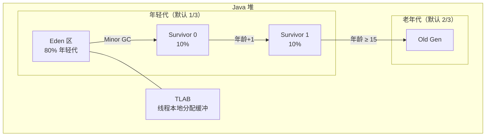

```bash
# 堆内存参数
-Xms4g              # 初始堆大小
-Xmx4g              # 最大堆大小（建议和 Xms 相同，避免运行时扩容）
-Xmn1g              # 年轻代大小（或用 -XX:NewRatio=3 表示老年代/年轻代=3:1）
-XX:SurvivorRatio=8 # Eden:S0:S1 = 8:1:1
-XX:+UseTLAB        # 启用 TLAB（默认开启）
```

:::warning Metaspace OOM 排查
Metaspace 溢出通常原因：
1. 动态生成大量类（CGLIB、JSP 编译、Groovy 脚本）
2. 类加载器泄漏（Tomcat 热部署时旧 ClassLoader 未回收）
3. 参数 `-XX:MaxMetaspaceSize=256m` 设置过小
4. 排查工具：`jstat -gc` 查看 Metaspace 使用量，`jmap -clstats` 查看类加载统计
:::

::: tip TLAB（Thread Local Allocation Buffer）
每个线程在 Eden 区有一块私有分配缓冲区。新对象优先在 TLAB 中分配（指针碰撞），避免多线程竞争 Eden 区。TLAB 分配失败才到 Eden 区分配。可以通过 `-XX:TLABSize` 手动设置 TLAB 大小。
:::

### 方法区 vs 元空间 vs 永久代

| 特性 | 永久代（JDK ≤ 7） | 元空间（JDK 8+） |
|------|-------------------|------------------|
| 存储位置 | JVM 堆内存 | 本地内存（Native Memory） |
| 大小限制 | 固定大小，容易 OOM | 理论上只受物理内存限制 |
| 字符串常量池 | 在永久代中 | 移到堆中 |
| GC 行为 | Full GC 时回收 | 独立回收 |
| 默认大小 | 固定 | 无上限（可设 MaxMetaspaceSize） |
| OOM 报错 | `java.lang.OutOfMemoryError: PermGen space` | `java.lang.OutOfMemoryError: Metaspace` |

```bash
# 元空间参数
-XX:MetaspaceSize=256m        # 元空间初始大小（达到此值触发 GC）
-XX:MaxMetaspaceSize=512m     # 元空间最大大小
-XX:MinMetaspaceFreeRatio=40  # GC 后最小空闲比例
-XX:MaxMetaspaceFreeRatio=70  # GC 后最大空闲比例
```

```java
// 元空间存储内容示例
public class MetaspaceDemo {
    // 1. 类信息：类的结构、方法、字段等
    // 2. 运行时常量池：字面量、符号引用
    // 3. 静态变量：static 字段的引用
    private static final String NAME = "MetaspaceDemo";
    private static Object staticRef = new Object();

    // 动态代理会频繁生成类 → 元空间压力
    public static void main(String[] args) {
        // 每次生成代理类都会占用元空间
        for (int i = 0; i < 100000; i++) {
            Proxy.newProxyInstance(
                MetaspaceDemo.class.getClassLoader(),
                new Class[]{Runnable.class},
                (proxy, method, args1) -> null
            );
        }
    }
}
```

### 直接内存（Direct Memory）

```java
// 直接内存不受 JVM 堆管理，使用 Native Memory
// NIO 的 ByteBuffer 和 Netty 的 PooledByteBufAllocator 都用直接内存
ByteBuffer directBuffer = ByteBuffer.allocateDirect(1024 * 1024);
// 底层通过 Unsafe.allocateMemory() 分配

// 直接内存 OOM：
// java.lang.OutOfMemoryError: Direct buffer memory
// 解决：-XX:MaxDirectMemorySize=256m（默认等于 -Xmx）
```

::: warning 直接内存泄漏排查
直接内存不受 GC 管理，需要手动释放或通过 Cleaner 机制。Netty 使用引用计数来管理直接内存的释放。如果 `DirectByteBuffer` 没有被 GC 回收，其关联的直接内存也不会释放。
:::

## 对象创建与内存分配

### 对象创建流程

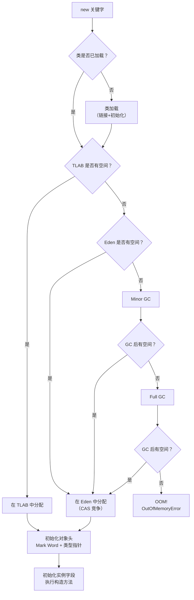

### 对象内存布局（64 位 JVM）

```
┌─────────────────────────────────┐
│         对象头（Header）          │
│  Mark Word（8 字节）              │
│  - 哈希码、GC 年龄、锁状态等      │
├─────────────────────────────────┤
│  类型指针（4 字节，压缩指针）      │
│  - 指向类元数据                   │
├─────────────────────────────────┤
│  数组长度（4 字节，仅数组对象）    │
├─────────────────────────────────┤
│         实例数据（Instance Data） │
│  - 对象的有效字段                 │
│  - 父类继承的字段                 │
├─────────────────────────────────┤
│         对齐填充（Padding）       │
│  - 保证大小是 8 的倍数           │
└─────────────────────────────────┘

// 示例：空 Object 对象
// 对象头：12B（Mark Word 8B + 类型指针 4B）
// 对齐填充：4B
// 总大小：16B

// 示例：new int[0] 空数组
// 对象头：12B + 数组长度 4B = 16B
// 对齐填充：0B
// 总大小：16B
```

### 对象访问方式

```java
// 句柄访问
Object obj = new Object();
// 栈中的 reference → 句柄池 → 实际对象
// 优点：对象移动时只需修改句柄指针
// 缺点：多一次指针寻址

// 直接指针（HotSpot 使用）
// 栈中的 reference → 直接指向堆中的对象
// 优点：速度快，少一次指针寻址
// 缺点：对象移动时需要更新所有引用
```

## 类加载机制深度分析

### 类的生命周期

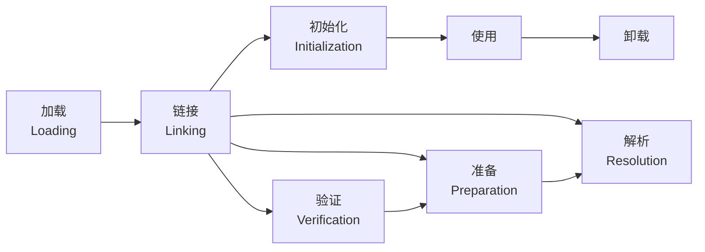

```java
// 类初始化时机（被动引用不会触发初始化）
class Parent {
    static { System.out.println("Parent init"); }
    static int value = 123;
}

class Child extends Parent {
    static { System.out.println("Child init"); }
}

// 1. 通过子类引用父类的静态字段 → 只初始化父类
System.out.println(Child.value); // 只打印 "Parent init"

// 2. 通过数组定义引用类 → 不触发初始化
Parent[] arr = new Parent[10]; // 不会打印任何内容

// 3. 常量传播优化 → 不触发初始化
System.out.println(Parent.value); // 编译期常量优化，不触发初始化
```

### 双亲委派模型

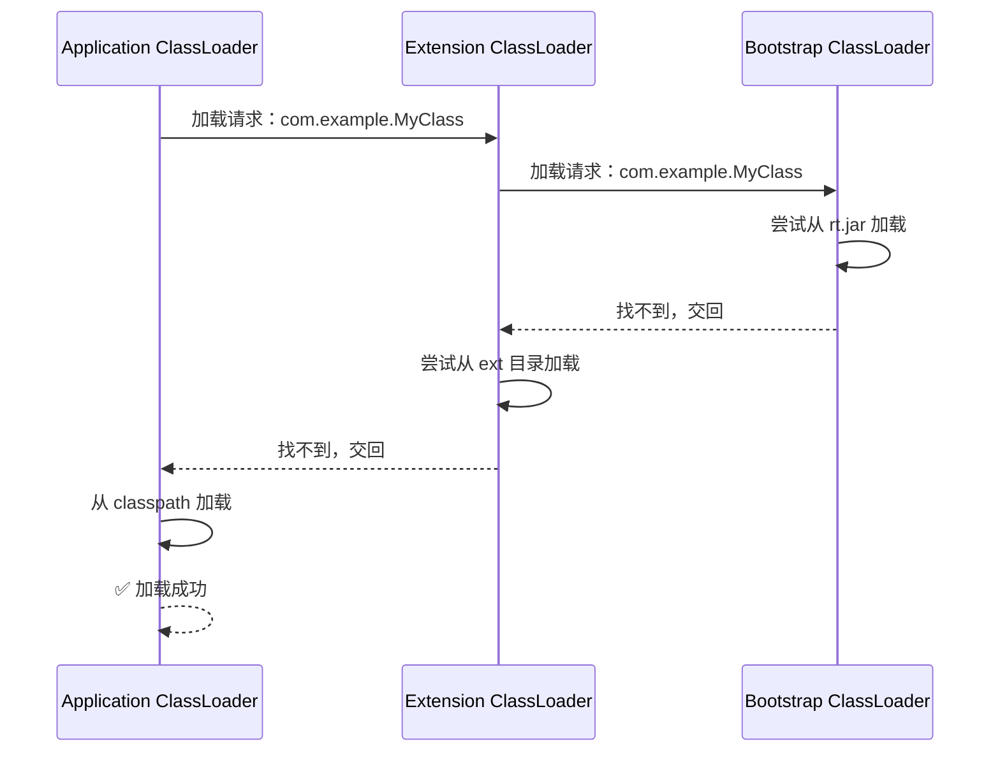

| 类加载器 | 加载路径 | 加载内容 |
|---------|---------|---------|
| Bootstrap | `rt.jar`, `resources.jar` | `java.lang.*`, `java.util.*` 等核心类 |
| Extension | `$JAVA_HOME/lib/ext` | 扩展类（JDK 9+ 改为 Platform ClassLoader） |
| Application | `-classpath` 或 `-cp` | 应用程序类 |
| Custom | 自定义路径 | 按需加载 |

::: tip 为什么要有双亲委派？
1. **安全性**：防止自定义 `java.lang.String` 替换核心类
2. **避免重复加载**：父加载器已加载的类，子加载器不需要再加载
3. **层次清晰**：每个加载器有明确的职责范围
4. **沙箱安全**：保证核心 API 不被篡改
:::

### 打破双亲委派的场景

```java
// 1. SPI 机制（Service Provider Interface）
// 如 JDBC、JNDI：核心接口在 rt.jar（Bootstrap 加载）
// 具体实现在 classpath（Application 加载）
// 解决方案：线程上下文类加载器（Thread.getContextClassLoader()）

// 2. Tomcat WebAppClassLoader
// 每个应用有独立的 ClassLoader，优先加载自己 WEB-INF/classes 下的类
// 支持同一 Tomcat 部署不同版本的 Spring
public class WebAppClassLoader extends URLClassLoader {
    @Override
    protected Class<?> loadClass(String name, boolean resolve)
            throws ClassNotFoundException {
        synchronized (getClassLoadingLock(name)) {
            Class<?> c = findLoadedClass(name);
            if (c == null) {
                // 先自己找（打破双亲委派的关键）
                if (!name.startsWith("java.")) {
                    c = findClass(name);
                }
                if (c == null) {
                    c = super.loadClass(name, resolve);
                }
            }
            return c;
        }
    }
}

// 3. OSGi 网状委派
// 每个 Bundle 有自己的 ClassLoader，可以导入/导出包
// 形成网状关系而非树状

// 4. 热部署
// 丢弃旧的 ClassLoader，创建新的 ClassLoader 加载更新后的类
// JRebel、Spring DevTools 都用了类似机制
```

### 类卸载条件

```java
// 一个类被卸载需要同时满足三个条件：
// 1. 该类所有的实例都已被回收（堆中不存在该类的任何实例）
// 2. 加载该类的 ClassLoader 已经被回收
// 3. 该类对应的 java.lang.Class 对象没有在任何地方被引用

// 热部署原理：
ClassLoader oldLoader = getClass().getClassLoader();
// 丢弃 oldLoader 的引用 → 触发类卸载 → 重新加载
// Spring DevTools 使用 RestartClassLoader 实现
```

## 字节码指令集详解

### 常用字节码指令

```java
public class BytecodeDemo {
    public int calculate(int a, int b) {
        int sum = a + b;
        if (sum > 100) {
            return sum * 2;
        }
        return sum;
    }
}
// javap -c BytecodeDemo.class 输出：
// public int calculate(int, int);
//   Code:
//      0: iload_1        // 从局部变量表 slot 1 加载 int a 到操作数栈
//      1: iload_2        // 从局部变量表 slot 2 加载 int b 到操作数栈
//      2: iadd           // 弹出两个 int，相加，结果入栈
//      3: istore_3       // 弹出结果，存到局部变量表 slot 3（sum）
//      4: iload_3        // 加载 sum
//      5: bipush        100 // 将常量 100 入栈
//      7: if_icmple     15 // sum <= 100 则跳转到偏移量 15
//     10: iload_3        // 加载 sum
//     11: iconst_2      // 将常量 2 入栈
//     12: imul          // 弹出两个 int，相乘，结果入栈
//     13: ireturn       // 返回栈顶 int
//     15: iload_3        // 加载 sum
//     16: ireturn       // 返回栈顶 int
```

### 指令分类速查表

| 分类 | 指令 | 说明 |
|------|------|------|
| 加载/存储 | `iload`, `aload`, `istore`, `astore` | 加载/存储局部变量到操作数栈 |
| 算术 | `iadd`, `isub`, `imul`, `idiv` | int 运算 |
| 类型转换 | `i2l`, `i2b`, `i2c`, `l2i` | 类型窄化/宽化转换 |
| 对象操作 | `new`, `getfield`, `putfield`, `getstatic` | 创建对象、访问字段 |
| 方法调用 | `invokevirtual`, `invokespecial`, `invokestatic`, `invokeinterface` | 方法调用 |
| 数组操作 | `newarray`, `anewarray`, `iaload`, `iastore` | 数组创建和元素访问 |
| 跳转 | `goto`, `if_icmpge`, `ifeq`, `ifne` | 条件/无条件跳转 |
| 返回 | `return`, `ireturn`, `areturn` | 方法返回 |

### invoke 指令对比

```java
class InvokeDemo {
    // invokevirtual：调用实例方法（虚方法分派）
    public void virtualMethod() { /* 编译期不确定具体实现 */ }

    // invokespecial：调用构造方法、私有方法、父类方法（静态分派）
    private void privateMethod() { /* 编译期确定 */ }

    // invokestatic：调用静态方法
    public static void staticMethod() { /* 编译期确定 */ }

    // invokeinterface：调用接口方法
    // invokedynamic：Lambda、动态语言支持（JDK 7+）
}
```

::: tip 字节码查看工具
- `javap -c`：查看反汇编代码
- `javap -v`：查看详细字节码（含常量池）
- `javap -verbose`：最详细信息
- IDEA 插件 `jclasslib Bytecode Viewer`：图形化查看字节码
- `ASM` / `Byte Buddy`：运行时操作字节码
:::

## JIT 编译器原理

### 分层编译策略

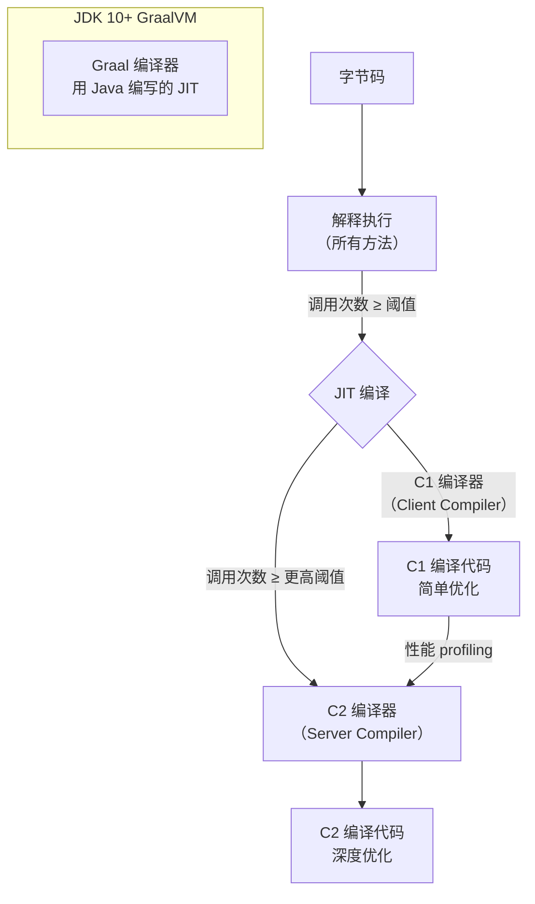

```bash
# JIT 编译相关参数
-XX:+PrintCompilation           # JDK 8：打印编译信息
-Xlog:compilation=debug         # JDK 9+：打印编译信息
-XX:CompileThreshold=10000      # 方法调用次数阈值
-XX:OnStackReplacePercentage=140 # OSR（On-Stack Replacement）阈值
-XX:+TieredCompilation          # 启用分层编译（JDK 8+ 默认开启）
-XX:CICompilerCount=4           # JIT 编译线程数
```

### JIT 优化技术

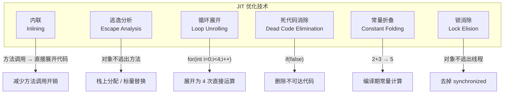

```java
// 1. 内联优化（最重要的优化）
// 方法调用有开销（压栈、跳转），内联把被调方法的代码直接嵌入调用处
public int addAndMultiply(int a, int b) {
    return add(a, b) * 2;
    // JIT 内联后：return (a + b) * 2;
}
public int add(int a, int b) { return a + b; }

// 2. 逃逸分析
public int sum() {
    // 不逃逸：对象只在方法内部使用
    int[] arr = new int[10];
    arr[0] = 1;
    arr[1] = 2;
    return arr[0] + arr[1];
    // JIT 优化：标量替换，不创建数组对象
    // 优化后：int _arr_0 = 1; int _arr_1 = 2; return _arr_0 + _arr_1;
}

// 3. 锁消除
public void appendString(String s1, String s2) {
    // StringBuffer 是线程安全的（有 synchronized）
    // 但 sb 是局部变量，不可能被其他线程访问
    // JIT 检测到逃逸分析：不逃出方法 → 锁消除
    StringBuffer sb = new StringBuffer();
    sb.append(s1).append(s2);
    // JIT 优化后等价于 StringBuilder 的无锁操作
}

// 4. 空值检查消除
public String getName(User user) {
    // 如果 JIT 分析发现 user 不可能为 null
    // 则消除 null 检查
    return user.name; // 去掉隐含的 null check
}
```

::: warning JIT 编译的代价
JIT 编译本身需要消耗 CPU 和内存。编译后的代码存在 Code Cache 中，如果 Code Cache 满了，JVM 会退回到解释执行。监控 Code Cache 使用率很重要。

```bash
# Code Cache 参数
-XX:ReservedCodeCacheSize=256m    # Code Cache 大小
-XX:InitialCodeCacheSize=8m       # 初始大小
-XX:+PrintCodeCache               # 打印 Code Cache 信息
```
:::

### Java 17/21/25 的 JIT 改进

```bash
# Java 17
# - 默认启用 ZGC（但不是默认 GC）
# - 改进 C2 编译器的性能

# Java 21
# - 分代 ZGC 成为正式特性
# - Virtual Threads（虚拟线程）减少线程栈内存消耗

# Java 25（最新 LTS 预期）
# - Valhalla 项目：值类型（Value Types）减少对象头开销
# - Loom 项目：虚拟线程进一步完善
# - Graal Native Image 成为标准特性
```

## JVM 启动参数配置大全

### 内存相关参数

```bash
# ========== 堆内存 ==========
-Xms4g                # 初始堆大小（建议 = -Xmx）
-Xmx4g                # 最大堆大小
-Xmn1g                # 年轻代大小（可选）
-XX:NewRatio=2        # 老年代:年轻代 = 2:1
-XX:SurvivorRatio=8   # Eden:S0:S1 = 8:1:1
-XX:NewSize=512m      # 年轻代最小值
-XX:MaxNewSize=512m   # 年轻代最大值

# ========== 元空间 ==========
-XX:MetaspaceSize=256m
-XX:MaxMetaspaceSize=512m

# ========== 栈 ==========
-Xss1m                # 每个线程的栈大小

# ========== 直接内存 ==========
-XX:MaxDirectMemorySize=512m

# ========== Code Cache ==========
-XX:ReservedCodeCacheSize=256m
```

### GC 相关参数

```bash
# ========== GC 收集器选择 ==========
-XX:+UseG1GC           # 使用 G1（JDK 9+ 默认）
-XX:+UseZGC            # 使用 ZGC（JDK 15+）
-XX:+UseShenandoahGC   # 使用 Shenandoah（JDK 12+）

# ========== G1 参数 ==========
-XX:MaxGCPauseMillis=200          # 最大 GC 停顿目标
-XX:G1HeapRegionSize=8m           # Region 大小（1MB-32MB，2的幂）
-XX:G1NewSizePercent=5            # 年轻代最小占比
-XX:G1MaxNewSizePercent=60        # 年轻代最大占比
-XX:InitiatingHeapOccupancyPercent=45  # 触发并发标记的堆占用率
-XX:G1MixedGCCountTarget=8        # Mixed GC 后期望剩余老年代占比
-XX:G1HeapWastePercent=5          # 允许浪费的 Region 比例

# ========== ZGC 参数 ==========
-XX:ZCollectionInterval=0         # ZGC 间隔（0=不定期）
-XX:ZAllocationSpikeTolerance=2.0 # 分配突增容忍度
```

### 诊断与调优参数

```bash
# ========== GC 日志 ==========
-Xlog:gc*:file=gc.log:time,uptime,level,tags:filecount=5,filesize=20m

# ========== OOM 自动 dump ==========
-XX:+HeapDumpOnOutOfMemoryError
-XX:HeapDumpPath=/var/log/app/heap.hprof

# ========== 异常退出 dump ==========
-XX:+HeapDumpBeforeFullGC          # Full GC 前 dump
-XX:+HeapDumpAfterFullGC           # Full GC 后 dump

# ========== 错误处理 ==========
-XX:OnError="gcore %p;kill -9 %p"  # OOM 时执行命令（%p=PID）

# ========== 其他有用参数 ==========
-XX:+AlwaysPreTouch                 # 启动时预分配所有内存（避免运行时缺页）
-XX:+DisableExplicitGC              # 禁止 System.gc()
-XX:+UseStringDeduplication         # 字符串去重（G1 专属）
-XX:+OptimizeStringConcat           # 优化字符串拼接
-XX:+EliminateAllocations           # 标量替换（逃逸分析）
-XX:+PrintGCDetails                 # JDK 8：打印 GC 详情
-XX:+PrintGCDateStamps              # JDK 8：打印 GC 时间戳
-XX:+PrintGCApplicationStoppedTime  # JDK 8：打印应用停止时间
```

::: tip 生产环境推荐配置模板
```bash
# 4C8G 服务器，Spring Boot 应用
java \
  -Xms4g -Xmx4g \
  -XX:+UseG1GC \
  -XX:MaxGCPauseMillis=200 \
  -XX:MetaspaceSize=256m \
  -XX:MaxMetaspaceSize=512m \
  -XX:+HeapDumpOnOutOfMemoryError \
  -XX:HeapDumpPath=/var/log/app/heap.hprof \
  -Xlog:gc*:file=/var/log/app/gc.log:time,uptime,level,tags:filecount=5,filesize=20m \
  -XX:+AlwaysPreTouch \
  -jar app.jar
```
:::

## OOM 排查实战

### OOM 排查流程

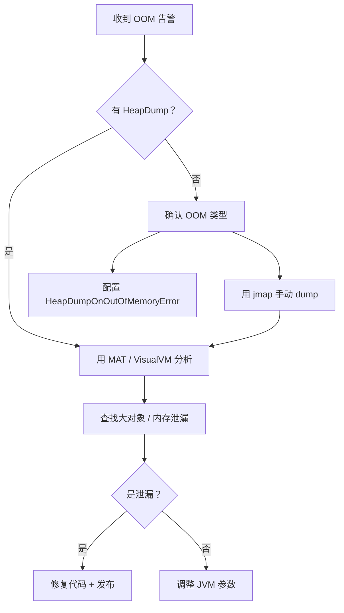

### 案例 1：HashMap 导致内存泄漏

```java
// 问题代码：缓存没有淘汰机制
public class CacheManager {
    // 使用 WeakHashMap 不能解决问题！
    // 因为 key 是 String 常量（强引用），不会被回收
    private static final Map<String, Object> cache = new HashMap<>();

    public void put(String key, Object value) {
        cache.put(key, value);  // 只进不出 → 内存泄漏
    }
}

// 排查步骤：
// 1. jmap -histo:live <pid> | head -20  → 看到 HashMap$Node 大量存在
// 2. MAT 分析 heapdump → 找到 GC Root → 定位到 CacheManager
// 3. 修复方案：
//    - 使用 Caffeine / Guava Cache（有大小限制和过期策略）
//    - 或使用 WeakHashMap（确保 key 没有强引用）
```

### 案例 2：ThreadLocal 内存泄漏

```java
// ThreadLocal 内存泄漏的根因
public class ThreadLocalLeak {
    // ThreadLocalMap 的 key 是 ThreadLocal 的弱引用
    // value 是强引用
    // 如果 ThreadLocal 被回收，key 变为 null，但 value 还在
    // 除非线程复用（线程池）触发 ThreadLocalMap 的清理

    private static ThreadLocal<byte[]> local = new ThreadLocal<>();

    public void process() {
        local.set(new byte[1024 * 1024]); // 1MB
        try {
            // 业务逻辑...
        } finally {
            local.remove();  // ← 必须手动 remove！
        }
    }
}
```

::: danger ThreadLocal 铁律
**每次使用 ThreadLocal 后，必须在 finally 块中调用 `remove()`**。在 Tomcat 等使用线程池的环境中，线程会被复用，如果不 remove，上一次的 value 会一直留在 ThreadLocalMap 中。
:::

### 案例 3：动态代理元空间溢出

```java
// 问题：每次请求都创建新的代理类
public class ProxyLeakDemo {
    public void handleRequest() {
        // 每次都创建新的代理类 → 元空间持续增长
        Enhancer enhancer = new Enhancer();
        enhancer.setSuperclass(Target.class);
        enhancer.setCallback((MethodInterceptor) (obj, method, args1, proxy) ->
            proxy.invokeSuper(obj, args1)
        );
        enhancer.create();  // 每次生成新的 Class → Metaspace 膨胀
    }
}

// 排查：
// -XX:MaxMetaspaceSize=256m → 触发 OOM: Metaspace
// jstat -gcmetacapacity <pid> → 观察元空间使用趋势
// 解决：缓存代理类，不要每次都创建新的
```

## JVM 性能调优工具

### 命令行工具速查

```bash
# ========== jps：查看 Java 进程 ==========
jps -lv          # 列出所有 Java 进程及其启动参数

# ========== jstat：GC 统计信息 ==========
jstat -gc <pid> 1000     # 每秒打印一次 GC 信息
jstat -gcutil <pid>      # 百分比形式显示
jstat -gccause <pid>     # 显示 GC 原因
jstat -gcmetacapacity <pid>  # 元空间容量信息

# jstat -gc 输出字段解读：
# S0C/S1C：Survivor 0/1 容量
# S0U/S1U：Survivor 0/1 已使用
# EC/OC：Eden/Old 容量
# EU/OU：Eden/Old 已使用
# MC/MU：元空间容量/已使用
# YGC/YGCT：Young GC 次数/时间
# FGC/FGCT：Full GC 次数/时间

# ========== jmap：堆分析 ==========
jmap -heap <pid>              # 堆内存概要
jmap -histo <pid> | head -20  # 对象统计（按大小排序）
jmap -histo:live <pid>        # 只统计存活对象（会触发 Full GC）
jmap -dump:live,format=b,file=heap.hprof <pid>  # 导出堆转储

# ========== jstack：线程分析 ==========
jstack <pid>                   # 打印所有线程的堆栈
jstack -l <pid>                # 包含锁信息
jstack -F <pid>                # 强制打印（进程无响应时）
kill -3 <pid>                  # 发送 QUIT 信号，输出到 stdout

# ========== jinfo：查看/修改 JVM 参数 ==========
jinfo -flags <pid>             # 查看所有 JVM 参数
jinfo -flag MaxHeapSize <pid>  # 查看特定参数值
jinfo -flag +PrintGC <pid>     # 运行时开启 GC 日志
```

### 图形化工具

| 工具 | 用途 | 特点 |
|------|------|------|
| **jvisualvm** | 综合监控 | JDK 自带，支持插件扩展 |
| **jconsole** | 基础监控 | JDK 自带，轻量 |
| **MAT** | 堆转储分析 | Eclipse 出品，分析内存泄漏 |
| **Arthas** | 在线诊断 | 阿里开源，功能强大 |
| **JFR** | 飞行记录器 | JDK 内置，低开销性能分析 |
| **Async Profiler** | 性能分析 | 低开销，火焰图生成 |
| **JProfiler** | 商业工具 | 功能最全面，收费 |

### Arthas 常用命令

```bash
# 安装 Arthas
curl -O https://arthas.aliyun.com/arthas-boot.jar
java -jar arthas-boot.jar

# 常用命令
dashboard           # 实时面板（线程、内存、GC）
thread -n 5         # CPU 最高的 5 个线程
thread -b           # 查找死锁
heapdump /tmp/dump  # 导出堆转储
memory              # 内存使用概览
vmtool              # 查看 JVM 内部对象
sc -d *Service      # 查看已加载的类
trace com.example.Service method  # 方法调用追踪
watch com.example.Service method '{params, returnObj, throwExp}' -x 2  # 方法入参/返回值监控
profiler start      # 开始性能分析
profiler stop       # 停止并生成火焰图
```

### Java Flight Recorder（JFR）

```bash
# JFR 是 JDK 自带的低开销监控工具（JDK 11+ 免费）
# 开启 JFR
java -XX:StartFlightRecording=duration=60s,filename=recording.jfr,settings=profile -jar app.jar

# JFR 配置模板
# default：低开销，适合生产环境
# profile：包含更多信息
# profiling：最详细，开销较大

# 分析 JFR 记录
jfr view recording.jfr           # 命令行查看摘要
# 或用 JDK Mission Control（jmc）图形化分析
```

## 虚拟机调优参数最佳实践

### 参数影响关系图

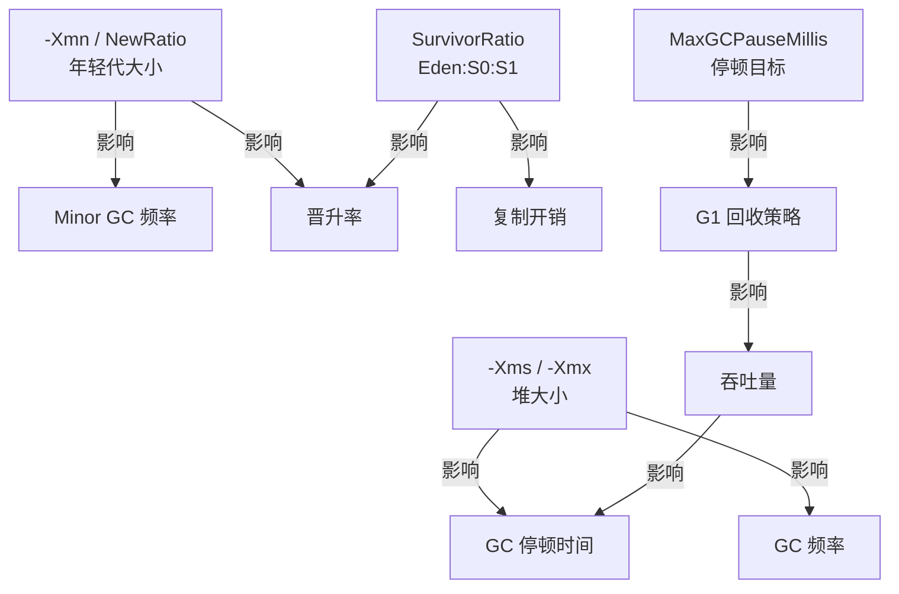

### 不同场景推荐配置

| 场景 | 堆大小 | GC | 关键参数 | 目标 |
|------|--------|-----|---------|------|
| 微服务 | 1-2G | G1 | `-XX:MaxGCPauseMillis=100` | 低延迟 |
| 批处理 | 4-8G | G1/Parallel | `-XX:GCTimeRatio=19` | 高吞吐 |
| Web 服务 | 4-16G | G1 | `-XX:MaxGCPauseMillis=200` | 平衡 |
| 大数据 | 16G+ | ZGC | `-XX:ZCollectionInterval=0` | 超低延迟 |
| 低内存 | < 1G | Serial | `-XX:+UseSerialGC` | 最小开销 |

::: warning 调优的黄金法则
1. **先测量，再优化**：不要凭感觉调参，用 GC 日志和 profiling 数据说话
2. **一次只改一个参数**：改完后观察效果，确认有效再改下一个
3. **80/20 原则**：大多数性能问题来自代码层面，JVM 调优是最后的手段
4. **压测验证**：调优后必须在压测环境中验证
:::

## 面试高频题

**Q1：JVM 内存模型（JMM）和 JVM 运行时数据区有什么区别？**

JMM（Java Memory Model）定义了线程之间的可见性、有序性规则（volatile、synchronized、final 的语义），是并发编程的规范。运行时数据区是 JVM 运行时的内存布局（堆、栈、方法区等），是 JVM 的实现。两者名字很像但完全不同的概念。

**Q2：方法区、永久代、元空间的关系？**

方法区是 JVM 规范中的概念。永久代是 JDK 7 中方法区的实现。元空间是 JDK 8+ 中方法区的实现，从 JVM 堆移到了本地内存。字符串常量池从永久代移到了堆中。

**Q3：一个 Java 对象在内存中占多少字节？**

对象头（12 字节：Mark Word 8B + 类型指针 4B）+ 实例数据 + 对齐填充（保证是 8 的倍数）。空 Object = 16B。`int` 字段 = 4B，对象引用 = 4B（压缩指针）或 8B。

**Q4：JIT 编译和 AOT 编译的区别？**

JIT（Just-In-Time）在运行时将热点代码编译为机器码，利用运行时 profiling 信息做深度优化。AOT（Ahead-Of-Time）在编译期将 Java 代码编译为本地机器码（如 GraalVM Native Image），启动快但缺少运行时优化。Java 21+ 支持 AOT 编译缓存。

**Q5：如何排查线上 CPU 100%？**

```bash
# 1. 找到 Java 进程
top -c  # 找到 CPU 最高的 Java 进程 PID

# 2. 找到 CPU 最高的线程
top -Hp <PID>  # 找到线程 TID

# 3. 转换线程号为十六进制
printf "%x\n" <TID>

# 4. 查看线程堆栈
jstack <PID> | grep <hex_tid> -A 30

# 5. 常见原因：死循环、频繁 Full GC、正则回溯
```

## 延伸阅读

- 下一篇：[垃圾回收](gc.md) — GC 算法、收集器选择、调优实战
- [性能调优](tuning.md) — JVM 参数、Arthas 诊断、常见问题排查
- [并发编程](../java-basic/concurrency.md) — 线程安全、锁机制、AQS
