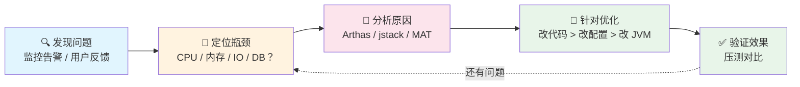
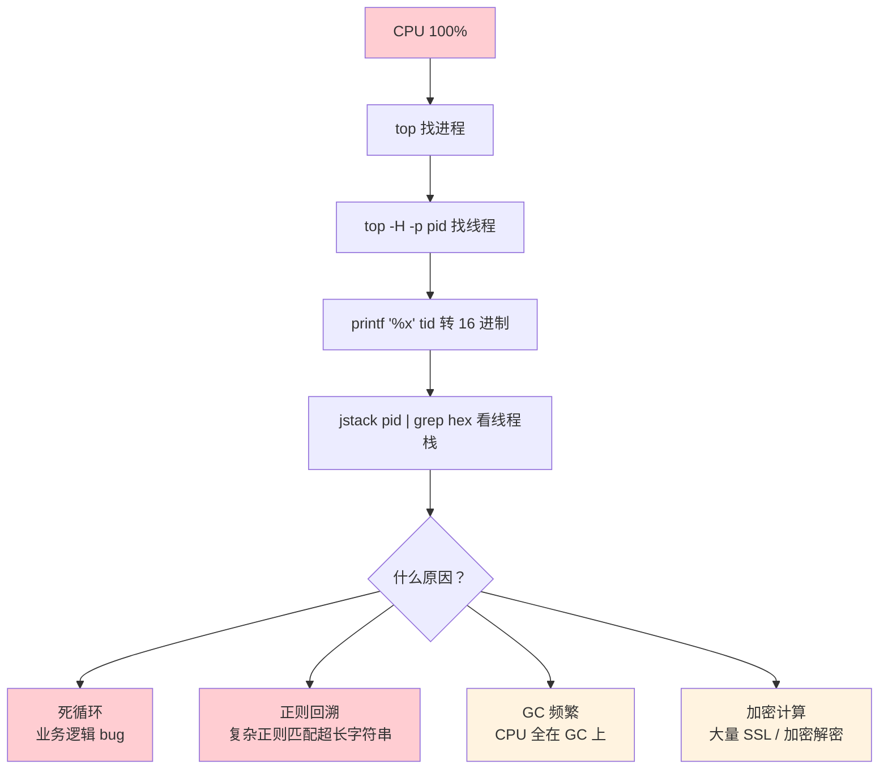
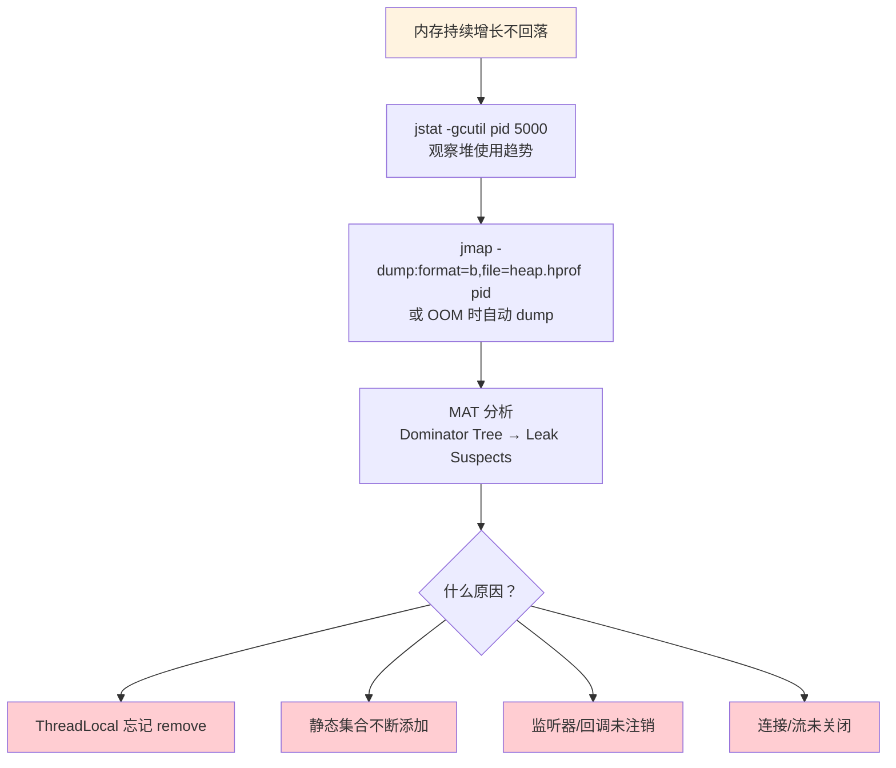
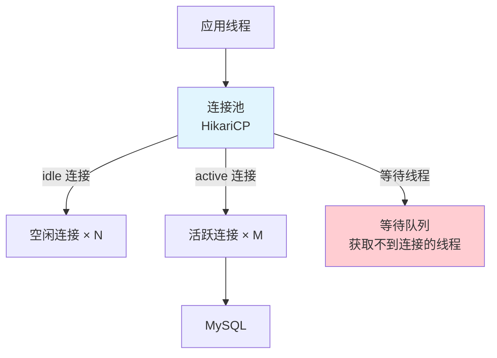
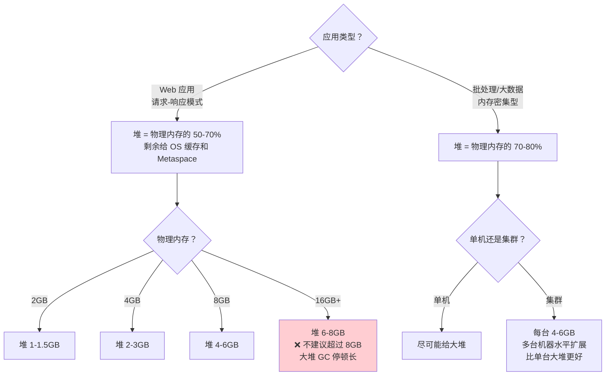
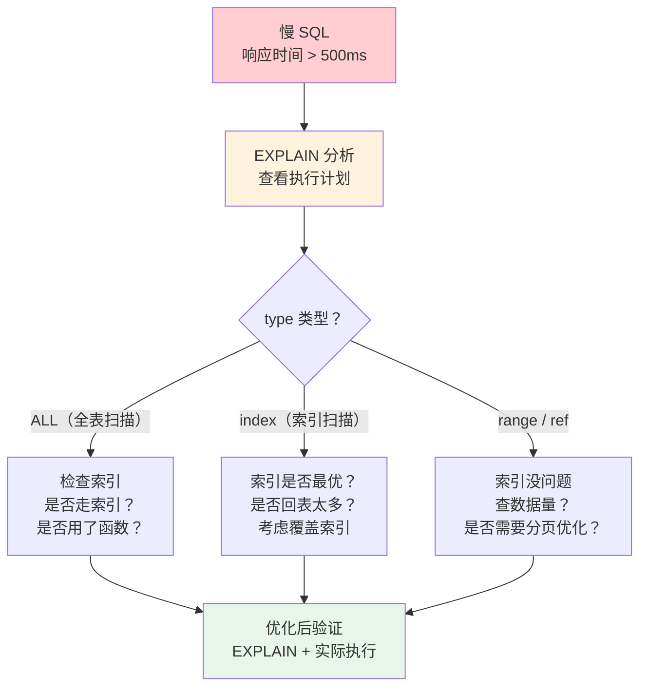

# Java 性能调优

> 性能调优不是"把 JVM 参数调到极致"，而是"找到瓶颈，针对性解决"。80% 的性能问题来自代码层面（N+1 查询、大对象、锁竞争），而不是 JVM 参数。这篇文章从"怎么发现问题"到"怎么解决问题"，建立系统的调优方法论。

## 调优方法论——先诊断再开药

::: tip 调优的黄金法则
**不要凭感觉优化**——先监控，再定位，再优化。改代码 > 改配置 > 改 JVM 参数。
:::



### 性能瓶颈在哪里？

::: warning 不要上来就调 JVM
很多新手一听说"性能调优"就想到 JVM 参数。实际上性能瓶颈的分布大概是：

| 瓶颈来源 | 占比 | 典型表现 |
|---------|------|---------|
| **业务代码** | **60-70%** | N+1 查询、大集合、锁竞争、序列化 |
| **数据库** | **15-20%** | 慢 SQL、缺少索引、锁等待 |
| **架构设计** | **5-10%** | 同步调用链过长、缓存缺失 |
| **JVM 参数** | **5-10%** | 堆大小不当、GC 策略选择错误 |

先确保代码层面没有明显的低效问题，再考虑 JVM 调优。
:::

---

## 四大常见性能问题排查

### 🔴 CPU 飙高



```bash
# 四步排查法
top                          # Step 1: 找到 CPU 最高的 Java 进程
top -H -p <pid>              # Step 2: 找到 CPU 最高的线程
printf "%x\n" <thread-id>    # Step 3: 线程 ID 转 16 进制
jstack <pid> | grep <hex> -A 30  # Step 4: 查看线程栈
```

#### 正则回溯——容易被忽略的 CPU 杀手

正则表达式中的**回溯**（Backtracking）可以让 CPU 飙到 100%，因为它会尝试所有可能的匹配路径。

```java
// ❌ 危险正则：匹配超长字符串时可能触发灾难性回溯
// 复杂度 O(2^n)，100 个字符的字符串可能尝试 2^100 次匹配
Pattern.compile("(a+)+b");  // 匹配 "aaaaaaaaaaaaaaaaaac" 会无限回溯

// ✅ 安全写法：使用占有量词（possessive quantifier）或原子组
Pattern.compile("(?:a++)b");  // 占有量词，匹配失败直接不回溯
```

::: tip 正则性能检查
- 避免嵌套量词：`(a+)+`、`(a*)*`、`(a|b)*a*` 都是高危写法
- 使用工具 [https://regex101.com](https://regex101.com) 测试正则性能
- Java 中可以用 `Pattern.compile(regex, Pattern.COMMENTS)` 加注释让正则更可读
:::

### 🟡 内存泄漏



::: tip OOM 自动 Dump
推荐加上 JVM 参数 `-XX:+HeapDumpOnOutOfMemoryError -XX:HeapDumpPath=/tmp/`，OOM 时自动生成堆转储文件，事后用 MAT 分析。
:::

#### 常见内存泄漏场景详解

**场景 1：ThreadLocal 泄漏**

```java
// ❌ 使用 ThreadLocal 后忘记 remove
public class UserContext {
    private static final ThreadLocal<User> CURRENT_USER = new ThreadLocal<>();

    public static void set(User user) {
        CURRENT_USER.set(user);  // 设置值
    }

    // 缺少 remove()！
    // 如果使用线程池（如 Tomcat），线程会复用
    // 上一个请求的 User 对象会一直留在 ThreadLocal 里
    // 随着时间推移，越来越多 User 对象无法被回收
}
```

ThreadLocal 的 key 是弱引用（会被 GC 回收），但 value 是强引用。key 被回收后，value 还在 ThreadLocalMap 里，形成内存泄漏。**每次用完必须 `remove()`**。

**场景 2：静态集合持续增长**

```java
// ❌ 静态 Map 不断 put，从不清理
public class CacheManager {
    private static final Map<String, Object> CACHE = new HashMap<>();

    public static void put(String key, Object value) {
        CACHE.put(key, value);  // 只进不出！
    }
}

// ✅ 使用 Guava Cache 或 Caffeine，自动过期 + 限制大小
Cache<String, Object> cache = Caffeine.newBuilder()
    .maximumSize(10000)
    .expireAfterWrite(30, TimeUnit.MINUTES)
    .build();
```

**场景 3：资源未关闭**

```java
// ❌ 连接、流、Statement 未关闭
Connection conn = dataSource.getConnection();
PreparedStatement ps = conn.prepareStatement(sql);
ResultSet rs = ps.executeQuery();
// 忘记 close！连接泄漏 → 连接池耗尽

// ✅ try-with-resources 自动关闭
try (Connection conn = dataSource.getConnection();
     PreparedStatement ps = conn.prepareStatement(sql);
     ResultSet rs = ps.executeQuery()) {
    // 自动关闭 rs → ps → conn
}
```

### 🟠 频繁 GC

| 观察指标 | 正常范围 | 异常信号 |
|---------|---------|---------|
| Minor GC 频率 | 每秒几次 | 每秒几十次 |
| Minor GC 耗时 | < 50ms | > 100ms |
| Full GC 频率 | 几小时一次 | 每小时好几次 |
| 老年代占用 | 稳定在 50-70% | 持续接近 90%+ |

**常见原因与解决方案：**

| 原因 | 表现 | 解决方案 |
|------|------|---------|
| 堆太小 | 频繁 Full GC | 增大 `-Xmx` |
| 大对象太多 | Young GC 后老年代增长快 | 检查大数组/大字符串，避免创建不必要的大对象 |
| 内存泄漏 | Full GC 后老年代仍接近 100% | 用 MAT 分析堆转储 |
| 元空间不足 | `Metaspace OOM` | 增大 `-XX:MaxMetaspaceSize`（默认无上限） |
| 显式调用 `System.gc()` | 不必要的 Full GC | **删除 `System.gc()` 调用** |

::: details GC 日志怎么看
```
# G1 GC 日志示例
[2024-01-15T10:30:01.234+0800] GC pause (G1 Evacuation Pause) (young)
  [Eden: 256.0M(256.0M)->0.0B(230.0M)
   Survivors: 0.0B->26.0M
   Heap: 256.0M(512.0M)->24.5M(512.0M)]
  [Times: user=0.08 sys=0.01, real=0.02 secs]
  [Eden regions: 128->0
   Survivor regions: 0->1
   Old regions: 1->1]
```

关键信息：
- `Eden: 256.0M->0.0B`：Eden 区被完全回收 ✅
- `real=0.02 secs`：实际停顿 20ms ✅
- 如果看到 `mixed` 或 `Full`，说明触发了混合 GC 或 Full GC，需要关注
:::

### 🔵 死锁

```bash
# 查看死锁
jstack <pid> | grep -A 20 "deadlock"
# 或用 Arthas（推荐）
thread -b
```

::: details 预防死锁的四条铁律
1. **锁的获取顺序一致**——所有线程按固定顺序获取锁
2. **设置锁超时**——`tryLock(timeout)` 避免无限等待
3. **减小锁粒度**——只锁必要的代码块
4. **优先用并发容器**——`ConcurrentHashMap` 代替 `Hashtable`
:::

---

## 代码层面的 Top 10 性能杀手

::: danger 第 1 名：N+1 查询（最常见的性能杀手！）
查 100 个订单，每个订单查一次用户信息 = **101 次 SQL**。用批量查询 = 2 次 SQL。

```java
// ❌ N+1 查询
List<Order> orders = orderMapper.findAll();
for (Order order : orders) {
    User user = userMapper.findById(order.getUserId());  // N 次 SQL！
}

// ✅ 批量查询
List<Long> userIds = orders.stream().map(Order::getUserId).toList();
Map<Long, User> userMap = userMapper.findByIds(userIds);  // 1 次 SQL
```
:::

| 排名 | 问题 | ❌ 错误做法 | ✅ 正确做法 | 性能差距 |
|------|------|-----------|-----------|---------|
| 2 | 大集合加载 | `findAll()` 加载 100 万条 | 分页查询 | 100 倍+ |
| 3 | String 循环拼接 | `for` 循环中用 `+` | `StringBuilder` + 预分配容量 | 10-100 倍 |
| 4 | ArrayList 无初始容量 | 默认 10，多次扩容 | `new ArrayList<>(expectedSize)` | 扩容时有拷贝开销 |
| 5 | HashMap 无初始容量 | 频繁 rehash | `new HashMap<>(n * 4/3 + 1)` | 减少 rehash 次数 |
| 6 | 同步范围太大 | 整个方法 `synchronized` | 只锁必要的代码块 | 锁持有时间越短越好 |
| 7 | 连接/流未关闭 | 忘记 `close()` | `try-with-resources` | 连接泄漏导致连接池耗尽 |
| 8 | 过度序列化 | 频繁 JSON 序列化大对象 | 只序列化需要的字段 | 减少 CPU + 内存 |
| 9 | 高频反射 | 热路径上用反射 | 缓存 `Method` / `MethodHandle` | 反射比直接调用慢 10-100 倍 |
| 10 | 日志级别不当 | `log.debug("a" + obj)` 字符串白拼接 | `log.debug("a {}", obj)` | 避免无谓的字符串拼接 |

### 连接池调优

数据库连接池是另一个常见的性能瓶颈点。



**HikariCP 推荐配置：**

| 参数 | 推荐值 | 说明 |
|------|--------|------|
| `maximumPoolSize` | CPU 核数 × 2 + 磁盘数 | 太大反而降低性能（上下文切换） |
| `minimumIdle` | 与 maximumPoolSize 相同 | 避免频繁创建/销毁连接 |
| `connectionTimeout` | 3000ms | 获取连接超时，不要太长 |
| `idleTimeout` | 600000ms（10分钟） | 空闲连接回收时间 |
| `maxLifetime` | 1800000ms（30分钟） | 连接最大存活时间（防 MySQL 8h 断开） |

::: warning 连接池不是越大越好
连接池过大反而会降低性能！原因：每个连接在 MySQL 端都有一个线程，MySQL 线程上下文切换开销大。实测表明，连接数从 10 增加到 20 性能提升明显，但从 20 增加到 50 性能反而下降。
:::

---

## JVM 调优实战

### 堆大小怎么定？



::: tip 为什么不推荐超过 8GB？
- G1 收集器在 8GB 以下表现优秀，超过 8GB 停顿可能超过 500ms
- 大堆的 Full GC 停顿时间与堆大小正相关
- 如果需要更多内存，**更好的方案是增加机器数量**而不是增大单机堆
- 例外：ZGC/Shenandoah 可以支持大堆（16GB+），但需要 JDK 15+
:::

### GC 收集器选择

| 收集器 | 适用堆大小 | 停顿目标 | 适用场景 |
|--------|-----------|---------|---------|
| **G1** ⭐ | < 8GB | 100-500ms | **大多数应用（推荐默认）** |
| ZGC | 8GB+ | < 10ms | 超大堆、低延迟要求 |
| Shenandoah | 8GB+ | < 10ms | 超大堆、低延迟要求（OpenJDK） |
| Parallel | < 4GB | 不关心停顿 | 批处理任务（吞吐量优先） |

### 生产环境推荐配置

```bash
# G1 收集器，4-8GB 堆（适合大多数应用）
java -server \
  -Xms4g -Xmx4g \                    # 初始堆 = 最大堆，避免动态扩容
  -XX:+UseG1GC \                     # 使用 G1 收集器
  -XX:MaxGCPauseMillis=200 \          # 目标最大 GC 停顿 200ms
  -XX:+HeapDumpOnOutOfMemoryError \   # OOM 时自动 dump
  -XX:HeapDumpPath=/tmp/heap.hprof \
  -Xlog:gc*:file=/var/log/app/gc.log:time,uptime,level,tags:filecount=5,filesize=20m \
  -Djava.security.egd=file:/dev/./urandom \  # 加速随机数生成
  -jar app.jar
```

::: warning JVM 参数调优四条原则
1. **`-Xms = -Xmx`**：避免运行时动态扩容引发 Full GC
2. **堆不是越大越好**：大堆 = GC 扫描范围大 = 停顿长
3. **监控优先**：先加 GC 日志观察，再针对性调参
4. **一次只调一个**：否则不知道哪个参数生效了
:::

---

## 线上问题排查工具箱

### Arthas——阿里开源的 Java 诊断利器

Arthas 是线上排查 Java 问题的瑞士军刀，**不需要重启应用**，通过 Agent attach 到目标进程。

```bash
# 启动 Arthas
java -jar arthas-boot.jar

# 常用命令速查
```

| 命令 | 功能 | 使用场景 |
|------|------|---------|
| `dashboard` | 实时看线程、内存、GC | 快速了解系统状态 |
| `thread` | 查看线程状态 | 排查死锁（`thread -b`）、CPU 高的线程 |
| `jvm` | 查看 JVM 信息 | 查看堆大小、GC 策略、编译器 |
| `memory` | 查看内存使用 | 看各区域占用 |
| `heapdump` | 导出堆转储 | 离线分析内存问题 |
| `sc` | 查看已加载的类 | 确认类是否被加载 |
| `watch` | 观察方法调用 | 查看方法入参、返回值、耗时 |
| `trace` | 方法调用链耗时 | 定位哪个子方法慢 |
| `stack` | 查看方法调用栈 | 谁调用了这个方法 |
| `ognl` | 执行表达式 | 动态查看/修改运行时变量 |

#### Arthas 实战案例

::: details 案例：排查接口响应慢

**现象**：用户反馈某个接口偶尔很慢（3-5 秒）

```bash
# Step 1: 用 trace 追踪方法调用耗时
trace com.example.order.service.OrderService createOrder '#cost > 1000'

# 输出：
# +---[1000ms] com.example.order.service.OrderService:checkStock()
# +---[200ms] com.example.order.service.OrderService:deductInventory()
# +---[3000ms] com.example.order.service.OrderService:sendNotification()  # 瓶颈！
```

**定位**：`sendNotification()` 耗时 3 秒，里面调用了第三方短信接口，没有超时设置。

```bash
# Step 2: 用 watch 查看具体参数
watch com.example.order.service.OrderService sendNotification '{params, returnObj, #cost}' '#cost > 1000'
```

**修复**：给第三方调用加上超时 + 改为异步发送。
:::

::: details 案例：线上热修复

不需要重启，直接修改方法返回值进行紧急修复：

```bash
# 查看方法的返回值
watch com.example.service.UserService getUserById '{returnObj}' 'params[0]==1'

# 紧急修复：用 ognl 修改 Spring Bean 的配置
ognl '@com.example.config.CacheConfig@setEnabled(false)'
```

::: warning 热修复只是应急手段
线上修改运行时状态只是**临时止血**，真正的问题必须在代码中修复并发布新版本。热修复不能替代正常的发版流程。
:::

### 其他常用工具

| 工具 | 用途 | 特点 |
|------|------|------|
| **jstat** | 查看 GC 统计 | JDK 自带，轻量 |
| **jmap** | 堆转储、对象统计 | JDK 自带 |
| **jstack** | 线程栈 Dump | JDK 自带 |
| **jinfo** | 查看/修改 JVM 参数 | JDK 自带 |
| **MAT** | 分析堆转储文件 | Eclipse 出品，可视化 |
| **VisualVM** | 综合监控 | JDK 自带（部分版本） |
| **JFR（Java Flight Recorder）** | 低开销的性能记录 | JDK 自带，生产可用 |
| **async-profiler** | 采样型 Profiler | 极低开销，适合线上 |

---

## 数据库调优

### 慢 SQL 排查流程



### EXPLAIN 关键字段解读

| 字段 | 含义 | 好的值 | 差的值 |
|------|------|--------|--------|
| **type** | 访问类型 | `const` > `eq_ref` > `ref` > `range` > `index` | `ALL`（全表扫描） |
| **key** | 实际使用的索引 | 有值 | `NULL`（没用索引） |
| **rows** | 预估扫描行数 | 尽量少 | 接近表总行数 |
| **Extra** | 额外信息 | `Using index`（覆盖索引） | `Using filesort`、`Using temporary` |

### 索引失效的常见原因

| 原因 | 示例 | 解决方案 |
|------|------|---------|
| 对索引列使用函数 | `WHERE DATE(create_time) = '2024-01-01'` | 改为 `WHERE create_time >= '2024-01-01' AND create_time < '2024-01-02'` |
| 隐式类型转换 | `phone` 是 VARCHAR，`WHERE phone = 13800138000`（数字） | 加引号 `WHERE phone = '13800138000'` |
| 左模糊查询 | `WHERE name LIKE '%张'` | 全文索引或 ES |
| 不满足最左前缀 | 联合索引 `(a, b, c)`，查询条件只有 `c` | 调整查询条件或索引顺序 |
| OR 连接 | `WHERE a = 1 OR b = 2`（a 和 b 分别有索引） | 改为 `UNION ALL` 或使用 `UNION` |
| 不等于 | `WHERE status != 0` | 考虑改为 `IN` 或其他方式 |

---

## 压测——验证优化效果

### 压测工具选择

| 工具 | 特点 | 适用场景 |
|------|------|---------|
| **JMeter** | GUI + CLI，功能全面 | HTTP 接口压测、复杂场景 |
| **wrk / wrk2** | 轻量、高并发 | HTTP 接口快速压测 |
| **Gatling** | Scala DSL，报告美观 | CI/CD 集成 |
| **ab（Apache Bench）** | 超简单 | 快速验证 |

### 压测的正确姿势


::: warning 压测常见误区
1. **不预热**：冷启动和热运行的性能差距巨大，必须先跑几轮预热
2. **只测单接口**：实际生产是混合流量，要模拟真实比例
3. **忽略 GC**：短时间压测可能看不出 GC 问题，至少压测 10 分钟以上
4. **用开发环境压**：开发环境和生产环境性能可能差 5-10 倍
5. **不看 P99**：只看平均响应时间没有意义
:::

---

## 面试高频题

**Q1：CPU 100% 怎么排查？**

`top` 找进程 → `top -H -p pid` 找线程 → `printf "%x" tid` 转 16 进制 → `jstack pid | grep hex` 看线程栈。常见原因：死循环、正则回溯、GC 频繁。可以用 Arthas 的 `thread -n 3` 直接找到 CPU 最高的 3 个线程。

**Q2：如何判断内存泄漏还是堆太小？**

看老年代使用趋势：Full GC 后仍然接近 100% 且持续上升 → **内存泄漏**（用 MAT 分析）。Full GC 后降到很低但很快又满 → **堆太小或对象创建太快**（增大堆或优化代码减少对象创建）。

**Q3：线上性能问题排查的一般思路？**

先确认问题现象（慢？挂了？OOM？）→ 查监控指标（CPU / 内存 / GC / DB 连接池）→ 定位到具体代码或 SQL → 本地复现 → 修复 → 压测验证 → 灰度发布。

**Q4：JVM 调优做过哪些？**

不要泛泛而谈参数。讲一个**具体案例**：
- 背景：某接口偶发 3-5 秒延迟
- 排查：Arthas trace 发现 `sendNotification()` 耗时 3 秒（第三方调用无超时）
- 定位：第三方短信接口偶发慢，线程池等待
- 优化：① 加超时 500ms ② 改为 MQ 异步发送 ③ 线程池参数调整
- 结果：P99 从 3 秒降到 200ms

**Q5：如何进行全链路压测？**

全链路压测不是"用 JMeter 跑一下"这么简单，需要：
1. **构建压测数据**：在影子库中准备与生产等量的数据
2. **流量染色**：压测流量带特殊标记（如 `X-Test: true`），避免污染生产数据
3. **逐步加压**：从 10% → 30% → 50% → 100% → 150% → 200% 流量
4. **全链路监控**：每个环节的 QPS、RT、错误率都要监控
5. **瓶颈定位**：在哪个环节 RT 上升最快，哪个服务先扛不住
6. **容量评估**：找到系统的极限 QPS，为扩容提供依据

## 延伸阅读

- [垃圾回收](gc.md) — GC 算法、收集器选择
- [JVM 原理](jvm.md) — 运行时数据区、类加载、JIT
- [高并发架构](../architecture/high-concurrency.md) — 缓存、限流、降级
- [MySQL](../database/mysql.md) — 索引优化、执行计划
