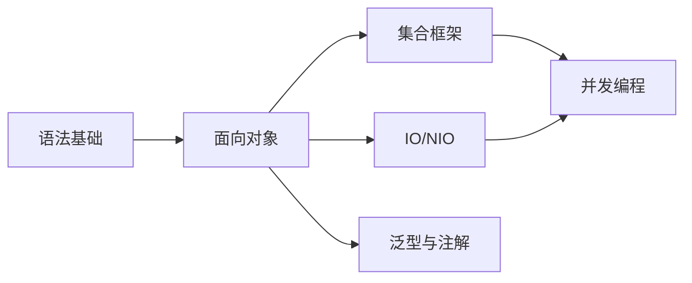

# Java基础

Java基础是学习Java技术的根基，本模块涵盖Java语言的核心概念和基础知识。

## 模块概览

| 章节 | 描述 | 难度 |
|------|------|------|
| [语法基础](./syntax.md) | 数据类型、变量、运算符、流程控制 | 入门 |
| [面向对象](./oop.md) | 封装、继承、多态、接口、抽象类 | 入门 |
| [集合框架](./collection.md) | List、Set、Map、Queue及其实现类 | 中级 |
| [IO/NIO](./io.md) | 字节流、字符流、NIO、Files | 中级 |
| [并发编程](./concurrency.md) | 线程、锁、JUC并发包 | 高级 |
| [泛型与注解](./generics.md) | 泛型类型、注解定义与使用 | 中级 |

## 学习路径

## 核心知识点

### 1. 基础语法

- 基本数据类型（8种）
- 引用类型
- 运算符与表达式
- 流程控制语句
- 数组操作

### 2. 面向对象

- 类与对象
- 封装、继承、多态
- 抽象类与接口
- 内部类
- 枚举类型

### 3. 集合框架

- Collection接口
- List（ArrayList、LinkedList）
- Set（HashSet、TreeSet）
- Map（HashMap、TreeMap）
- Queue与Deque

### 4. IO操作

- 字节流（InputStream/OutputStream）
- 字符流（Reader/Writer）
- 文件操作（File类）
- NIO（Channel、Buffer、Selector）
- NIO.2（Files、Path）

### 5. 并发编程

- 线程创建与生命周期
- 线程同步（synchronized、Lock）
- 线程通信（wait/notify）
- JUC并发包
- 线程池

### 6. 泛型与注解

- 泛型类、接口、方法
- 类型通配符
- 类型擦除
- 内置注解
- 自定义注解
- 注解处理器

## 推荐资源

- [Oracle Java官方文档](https://docs.oracle.com/javase/)
- [Java编程思想](https://book.douban.com/subject/2130190/)
- [Effective Java](https://book.douban.com/subject/30412517/)
