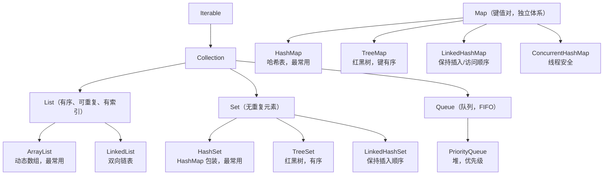
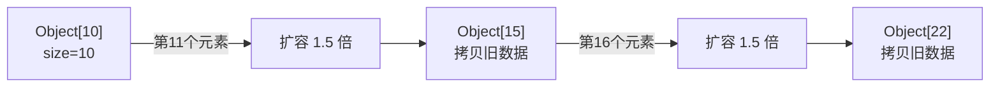
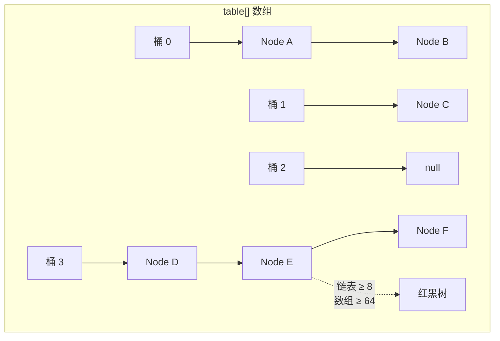
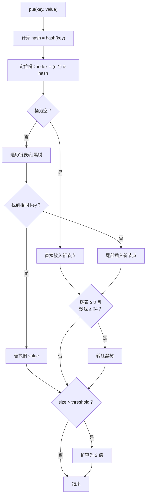

# Java 集合框架

> Java 集合框架可能是你日常开发中使用最多的 API，没有之一。但多数开发者只停留在 `add()`、`get()`、`put()` 的层面——ArrayList 扩容了几次？HashMap 什么时候变红黑树？为什么 `Arrays.asList()` 不能 add？这篇文章从基础用法讲起，把底层原理讲透。

## 基础入门：集合是什么？

### 为什么需要集合？

数组有固定长度，集合可以**动态增长**：

```java
// 数组：固定长度，不方便
String[] arr = new String[10];
arr[0] = "A";
// 想加第 11 个元素？只能创建新数组并拷贝

// 集合：动态增长
List<String> list = new ArrayList<>();
list.add("A");   // 随便加
list.add("B");
list.add("C");
// 想加多少加多少
```

### 集合框架全貌



### 最常用的三种集合

```java
// 1. List：有序、可重复、有索引
List<String> list = new ArrayList<>();
list.add("A");
list.add("B");
list.add("A");     // 允许重复
list.get(0);       // "A"，通过索引访问
list.set(1, "C");  // 修改索引 1 的元素为 "C"

// 2. Set：无重复元素
Set<String> set = new HashSet<>();
set.add("A");
set.add("B");
set.add("A");      // 重复，不会加入
System.out.println(set);  // [A, B]（无序）

// 3. Map：键值对
Map<String, Integer> map = new HashMap<>();
map.put("张三", 25);
map.put("李四", 30);
map.get("张三");    // 25
map.containsKey("张三");  // true
```

### 遍历方式

```java
List<String> list = Arrays.asList("A", "B", "C");

// 方式1：for-each（最常用）
for (String s : list) { System.out.println(s); }

// 方式2：迭代器（需要删除元素时用）
Iterator<String> it = list.iterator();
while (it.hasNext()) {
    String s = it.next();
    if ("B".equals(s)) it.remove();  // 安全删除
}

// 方式3：Stream（Java 8+，适合复杂操作）
list.stream()
    .filter(s -> s.startsWith("A"))
    .map(String::toUpperCase)
    .forEach(System.out::println);

// 方式4：forEach + Lambda
list.forEach(s -> System.out.println(s));
```

---

## ArrayList——不只是"动态数组"

### 扩容机制

ArrayList 的核心就是一个 `Object[]` 数组，当空间不够时就**创建一个更大的数组，把旧数据拷贝过去**。



```java
// JDK 8+ 源码关键部分
public class ArrayList<E> {
    private static final int DEFAULT_CAPACITY = 10;  // 默认初始容量
    private Object[] elementData;
    private int size;

    public boolean add(E e) {
        ensureCapacityInternal(size + 1);  // 确保容量足够
        elementData[size++] = e;
        return true;
    }

    private void grow(int minCapacity) {
        int oldCapacity = elementData.length;
        int newCapacity = oldCapacity + (oldCapacity >> 1);  // 1.5 倍扩容
        if (newCapacity < minCapacity) newCapacity = minCapacity;
        elementData = Arrays.copyOf(elementData, newCapacity);  // 数组拷贝！
    }
}
```

**这意味着什么？**

```java
// 如果你提前知道要放 10000 个元素
List<String> list = new ArrayList<>();            // 默认容量 10
// 经过约 17 次扩容，每次都要数组拷贝，O(n) 操作！

List<String> list = new ArrayList<>(10000);       // ✅ 一次到位，零扩容
```

::: danger 性能杀手
在大循环里不断往 ArrayList 添加元素且没有预分配容量，扩容过程中的多次数组拷贝会严重影响性能。**当你知道大概容量时，一定要指定初始容量。**
:::

### ArrayList vs LinkedList：经典误区

"ArrayList 查询快、LinkedList 增删快"——这句话只对了一半。

```java
// LinkedList 的"增删快"只限于头部和尾部操作
// 中间插入/删除需要先遍历找到位置，O(n)

LinkedList<String> list = new LinkedList<>();
list.add("A");       // 尾部添加 O(1)
list.addFirst("B");  // 头部添加 O(1)
list.removeFirst();  // 头部删除 O(1)

// 但中间插入：
list.add(5000, "X"); // 要先遍历到索引 5000，O(n)！
```

::: tip 实际开发建议
现代 JVM 上，ArrayList 在绝大多数场景下性能优于 LinkedList。除非你真的需要频繁在头部操作（用 `ArrayDeque` 更好），否则**无脑选 ArrayList**。
:::

### `Arrays.asList()` 的坑

```java
int[] arr = {1, 2, 3};
List<int[]> list = Arrays.asList(arr);
// list.size() == 1，不是 3！因为泛型不支持基本类型

// 另一个坑：返回的是固定大小的视图
List<String> list = Arrays.asList("A", "B", "C");
list.set(0, "X");  // ✅ 可以修改元素
list.add("D");     // ❌ UnsupportedOperationException！

// 解决
List<String> mutable = new ArrayList<>(Arrays.asList("A", "B", "C"));
List<Integer> list = Arrays.stream(arr).boxed().toList();  // 基本类型数组
```

## HashMap——面试最高频知识点

### 基础用法

```java
Map<String, Integer> map = new HashMap<>();
map.put("张三", 25);
map.put("李四", 30);
map.put("张三", 26);      // key 重复，覆盖旧值

map.get("张三");           // 26
map.get("王五");           // null（key 不存在）
map.getOrDefault("王五", 0);  // 0（key 不存在时返回默认值）

map.containsKey("张三");   // true
map.containsValue(25);     // false（已被覆盖）

// 遍历
for (Map.Entry<String, Integer> entry : map.entrySet()) {
    System.out.println(entry.getKey() + ": " + entry.getValue());
}
map.forEach((k, v) -> System.out.println(k + ": " + v));
```

### 底层结构



JDK 8 的 HashMap 底层是**数组 + 链表 + 红黑树**。

::: tip JDK 7 vs JDK 8
JDK 7：数组 + 链表，头插法（并发扩容时可能循环链表）。JDK 8：数组 + 链表 + 红黑树，尾插法（解决了循环链表），链表 ≥ 8 且数组 ≥ 64 时转红黑树。
:::

### hash 计算与扰动函数

```java
static final int hash(Object key) {
    int h;
    return (key == null) ? 0 : (h = key.hashCode()) ^ (h >>> 16);
}
```

为什么要 `^ (h >>> 16)`？直接用 hashCode 取模，低位相同的 key 会集中在几个桶里。高位右移 16 位异或，让高位也参与低位运算，**减少哈希冲突**。

### put 流程详解



### resize（扩容）

扩容为 2 倍。每个元素的桶位置要么不变，要么移到 `原位置 + oldCapacity`。判断依据是 `hash & oldCapacity` 是否为 0——只需要看 hash 的一位就能决定新位置。

::: warning 为什么负载因子是 0.75？
0.75 是时间和空间的平衡点。太低空间浪费，太高哈希冲突严重。根据泊松分布，0.75 时链表长度达到 8 的概率极低（约 0.00000006），所以转红黑树的阈值设为 8。
:::

### HashMap 为什么线程不安全？

```java
// JDK 7：头插法 + 并发扩容 → 循环链表 → get() 时 CPU 100%
// JDK 8：尾插法解决了循环链表，但仍有数据丢失
// 两个线程同时 put 到同一个空桶，都判断为空，后写入的覆盖先写入的
```

### ConcurrentHashMap——多线程首选

```java
// JDK 8：CAS + synchronized（不再是 JDK 7 的分段锁）
// 只锁桶头节点，不是整个数组
// 扩容时多线程可以协同
ConcurrentHashMap<String, Integer> map = new ConcurrentHashMap<>();
```

::: tip 为什么 ConcurrentHashMap 不允许 null？
HashMap 的 `get(key)` 返回 null 有两种含义：key 不存在，或 value 就是 null。多线程环境下 `containsKey` 和 `get` 之间可能有其他线程修改 Map，无法区分，所以直接禁止 null。
:::

### LinkedHashMap——LRU 缓存的秘密

```java
// LRU 缓存实现：accessOrder=true，访问后移到链表尾部
public class LRUCache<K, V> extends LinkedHashMap<K, V> {
    private final int maxSize;
    public LRUCache(int maxSize) {
        super(maxSize, 0.75f, true);  // accessOrder=true
        this.maxSize = maxSize;
    }
    @Override
    protected boolean removeEldestEntry(Map.Entry<K, V> eldest) {
        return size() > maxSize;  // 超出容量移除最久未访问的
    }
}
```

## fail-fast 与 fail-safe

```java
// ❌ 迭代时直接修改集合 → ConcurrentModificationException
List<String> list = new ArrayList<>(Arrays.asList("A", "B", "C"));
for (String s : list) {
    if ("B".equals(s)) list.remove("B");  // 抛异常！
}

// ✅ 解决方案1：迭代器的 remove
Iterator<String> it = list.iterator();
while (it.hasNext()) {
    if ("B".equals(it.next())) it.remove();
}

// ✅ 解决方案2：removeIf（Java 8+）
list.removeIf("B"::equals);

// ✅ 解决方案3：用 fail-safe 集合（CopyOnWriteArrayList）
```

## 集合使用最佳实践

```java
// 1. 返回空集合而不是 null
public List<User> findUsers() {
    return noUsers ? Collections.emptyList() : users;  // 不返回 null
}

// 2. 不可变集合（Java 9+）
List<String> list = List.of("A", "B", "C");  // 修改会抛 UnsupportedOperationException

// 3. 指定初始容量
List<String> list = new ArrayList<>(1000);
Map<String, User> map = new HashMap<>(128);  // 避免扩容

// 4. 不要用 for 循环下标遍历 LinkedList（每次 get(i) 都是 O(n)）
```

## 面试高频题

**Q1：HashMap 的 put 流程？**

计算 hash（扰动函数）→ 定位桶（`n-1 & hash`）→ 桶为空直接放入 → 桶不为空遍历链表/红黑树 → key 存在则更新 value → key 不存在则尾部插入 → 检查链表长度（≥8 且数组 ≥64 转红黑树）→ 检查是否超过阈值扩容。

**Q2：HashMap 扩容时元素怎么重新分配？**

扩容为 2 倍。每个元素的桶位置要么不变，要么移到 `原位置 + oldCapacity`。判断依据是 `hash & oldCapacity` 是否为 0。这样只需要看 hash 的一位就能决定新位置，效率很高。

**Q3：HashMap 为什么用红黑树而不是 AVL 树？**

红黑树的插入/删除旋转次数更少（最多 3 次），AVL 树在频繁插入删除时旋转代价高。HashMap 更关心的是整体性能而非严格平衡，红黑树是更好的折中。

**Q4：ConcurrentHashMap JDK 7 和 JDK 8 的区别？**

JDK 7：分段锁（Segment），默认 16 个 Segment，最多 16 个线程并发。JDK 8：CAS + synchronized，锁粒度从 Segment 级别降到桶级别（Node），并发度等于桶的数量。扩容时支持多线程协同。

## 延伸阅读

- 上一篇：[面向对象](oop.md) — 封装、继承、多态的深入理解
- 下一篇：[并发编程](concurrency.md) — 线程安全、锁机制、AQS
- [Java 高级特性](../java-advanced/jvm.md) — JVM 原理、内存模型
