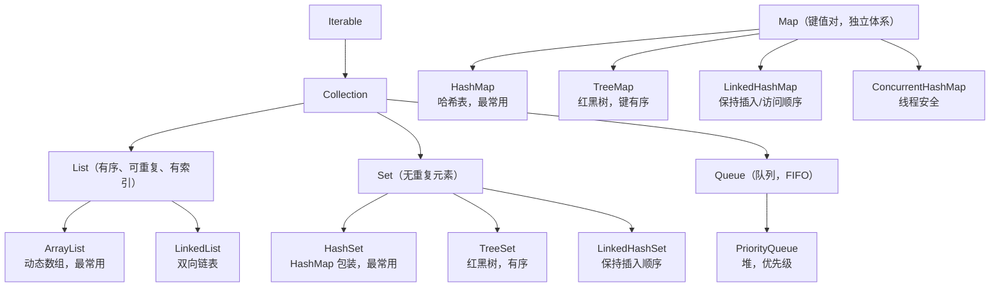
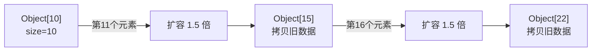
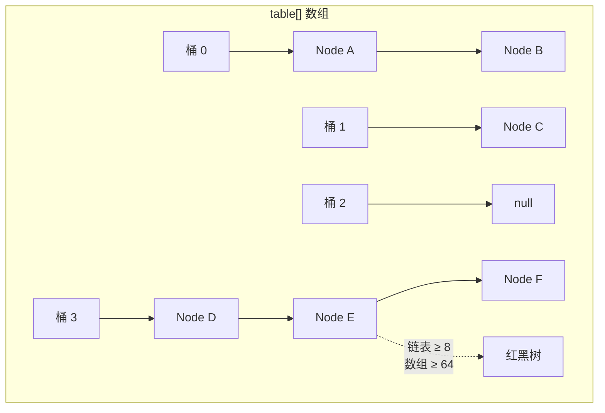
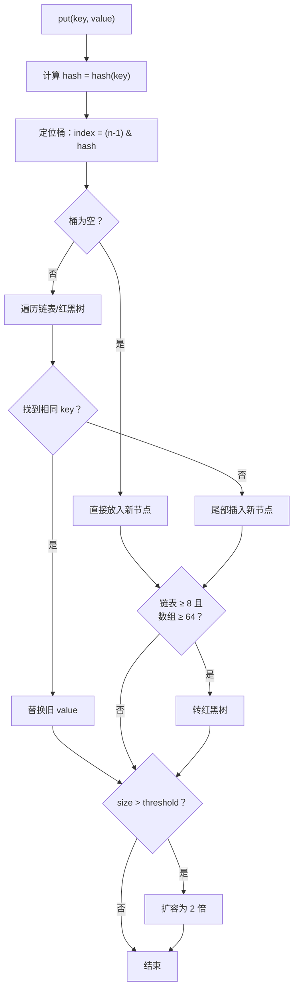
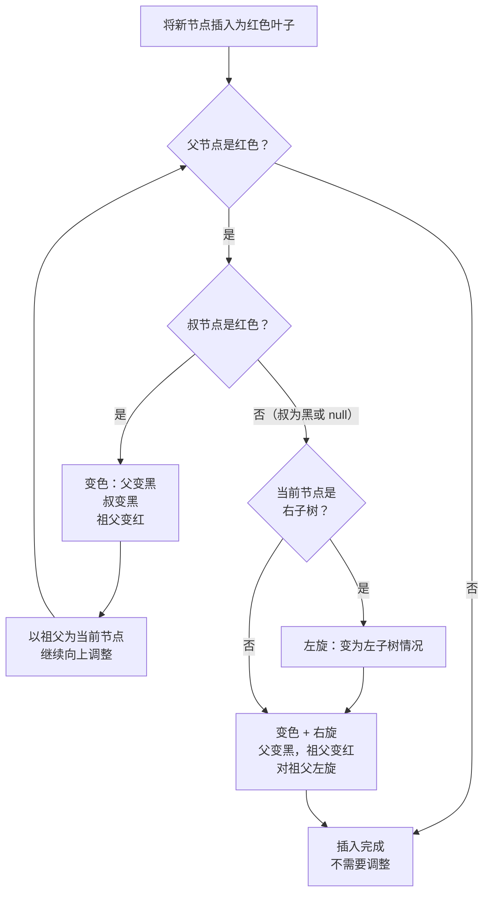
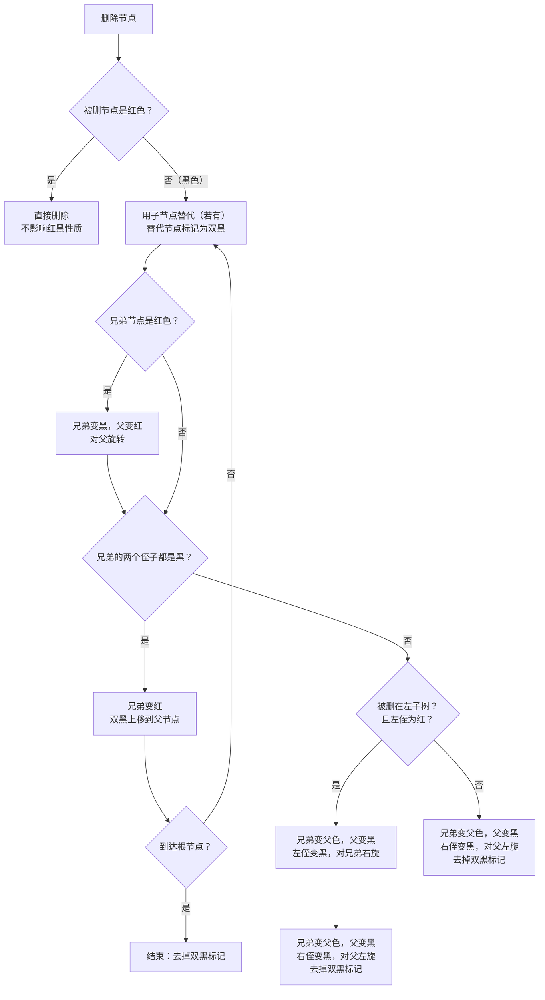
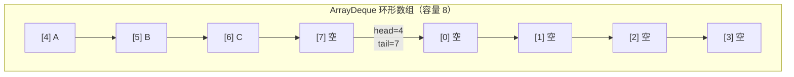
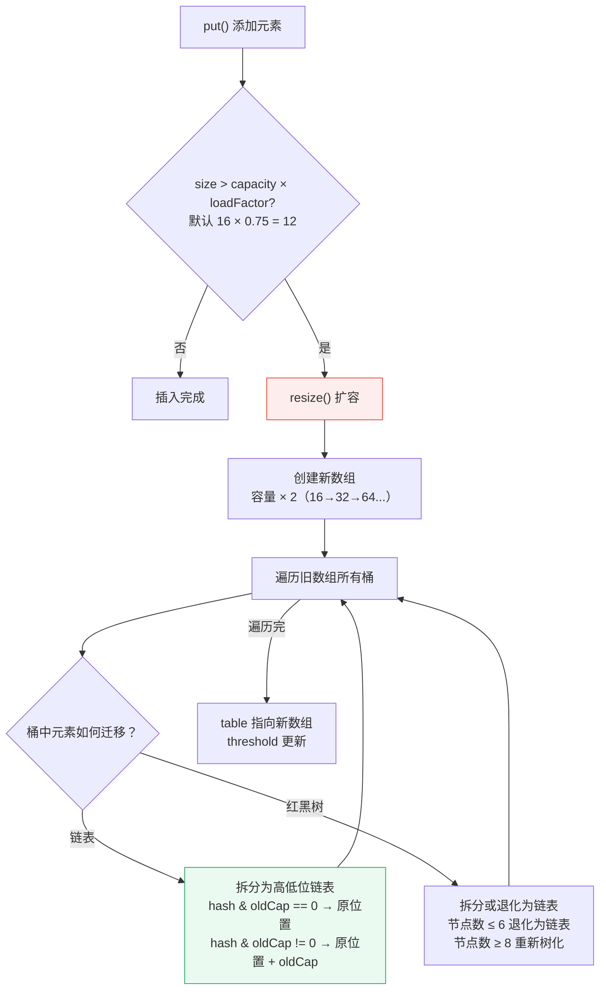
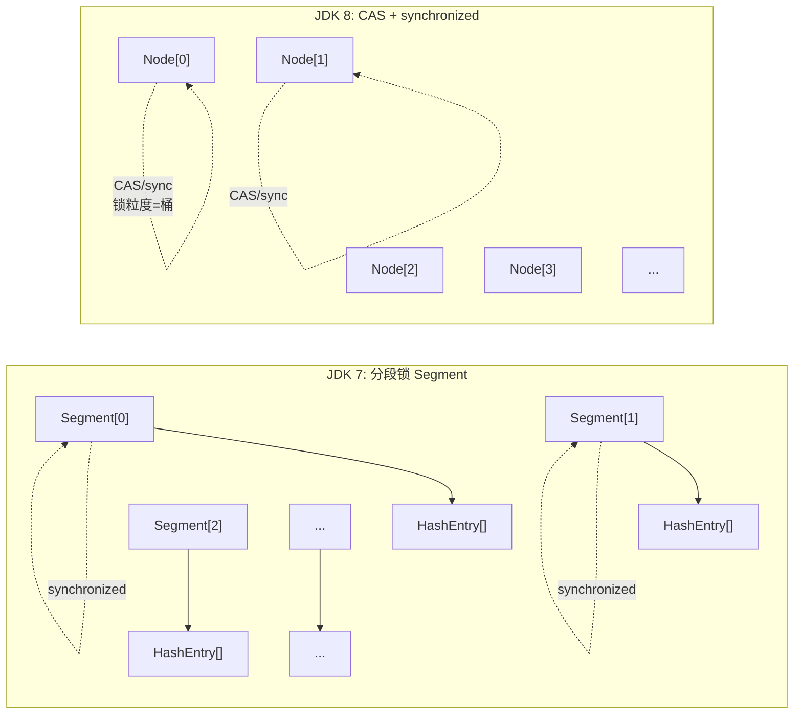

# Java 集合框架

> Java 集合框架可能是你日常开发中使用最多的 API，没有之一。但多数开发者只停留在 `add()`、`get()`、`put()` 的层面——ArrayList 扩容了几次？HashMap 什么时候变红黑树？为什么 `Arrays.asList()` 不能 add？这篇文章从基础用法讲起，把底层原理讲透。

## 基础入门：集合是什么？

### 为什么需要集合？

数组有固定长度，集合可以**动态增长**：

```java
// 数组：固定长度，不方便
String[] arr = new String[10];
arr[0] = "A";
// 想加第 11 个元素？只能创建新数组并拷贝

// 集合：动态增长
List<String> list = new ArrayList<>();
list.add("A");   // 随便加
list.add("B");
list.add("C");
// 想加多少加多少
```

### 集合框架全貌



### 最常用的三种集合

```java
// 1. List：有序、可重复、有索引
List<String> list = new ArrayList<>();
list.add("A");
list.add("B");
list.add("A");     // 允许重复
list.get(0);       // "A"，通过索引访问
list.set(1, "C");  // 修改索引 1 的元素为 "C"

// 2. Set：无重复元素
Set<String> set = new HashSet<>();
set.add("A");
set.add("B");
set.add("A");      // 重复，不会加入
System.out.println(set);  // [A, B]（无序）

// 3. Map：键值对
Map<String, Integer> map = new HashMap<>();
map.put("张三", 25);
map.put("李四", 30);
map.get("张三");    // 25
map.containsKey("张三");  // true
```

### 遍历方式

```java
List<String> list = Arrays.asList("A", "B", "C");

// 方式1：for-each（最常用）
for (String s : list) { System.out.println(s); }

// 方式2：迭代器（需要删除元素时用）
Iterator<String> it = list.iterator();
while (it.hasNext()) {
    String s = it.next();
    if ("B".equals(s)) it.remove();  // 安全删除
}

// 方式3：Stream（Java 8+，适合复杂操作）
list.stream()
    .filter(s -> s.startsWith("A"))
    .map(String::toUpperCase)
    .forEach(System.out::println);

// 方式4：forEach + Lambda
list.forEach(s -> System.out.println(s));
```

---

## ArrayList——不只是"动态数组"

::: details ArrayList vs Vector
- **Vector** 是线程安全的（所有方法加 synchronized），但性能差，已被淘汰
- **ArrayList** 是非线程安全的，需要外部同步时用 `Collections.synchronizedList()` 或 `CopyOnWriteArrayList`
- JDK 1.2 引入 Collections 框架后，Vector 仅为了向后兼容而保留
:::

### 扩容机制

ArrayList 的核心就是一个 `Object[]` 数组，当空间不够时就**创建一个更大的数组，把旧数据拷贝过去**。



```java
// JDK 8+ 源码关键部分
public class ArrayList<E> {
    private static final int DEFAULT_CAPACITY = 10;  // 默认初始容量
    private Object[] elementData;
    private int size;

    public boolean add(E e) {
        ensureCapacityInternal(size + 1);  // 确保容量足够
        elementData[size++] = e;
        return true;
    }

    private void grow(int minCapacity) {
        int oldCapacity = elementData.length;
        int newCapacity = oldCapacity + (oldCapacity >> 1);  // 1.5 倍扩容
        if (newCapacity < minCapacity) newCapacity = minCapacity;
        elementData = Arrays.copyOf(elementData, newCapacity);  // 数组拷贝！
    }
}
```

**这意味着什么？**

```java
// 如果你提前知道要放 10000 个元素
List<String> list = new ArrayList<>();            // 默认容量 10
// 经过约 17 次扩容，每次都要数组拷贝，O(n) 操作！

List<String> list = new ArrayList<>(10000);       // ✅ 一次到位，零扩容
```

::: danger 性能杀手
在大循环里不断往 ArrayList 添加元素且没有预分配容量，扩容过程中的多次数组拷贝会严重影响性能。**当你知道大概容量时，一定要指定初始容量。**
:::

### ArrayList vs LinkedList：经典误区

"ArrayList 查询快、LinkedList 增删快"——这句话只对了一半。

```java
// LinkedList 的"增删快"只限于头部和尾部操作
// 中间插入/删除需要先遍历找到位置，O(n)

LinkedList<String> list = new LinkedList<>();
list.add("A");       // 尾部添加 O(1)
list.addFirst("B");  // 头部添加 O(1)
list.removeFirst();  // 头部删除 O(1)

// 但中间插入：
list.add(5000, "X"); // 要先遍历到索引 5000，O(n)！
```

::: tip 实际开发建议
现代 JVM 上，ArrayList 在绝大多数场景下性能优于 LinkedList。除非你真的需要频繁在头部操作（用 `ArrayDeque` 更好），否则**无脑选 ArrayList**。
:::

### `Arrays.asList()` 的坑

```java
int[] arr = {1, 2, 3};
List<int[]> list = Arrays.asList(arr);
// list.size() == 1，不是 3！因为泛型不支持基本类型

// 另一个坑：返回的是固定大小的视图
List<String> list = Arrays.asList("A", "B", "C");
list.set(0, "X");  // ✅ 可以修改元素
list.add("D");     // ❌ UnsupportedOperationException！

// 解决
List<String> mutable = new ArrayList<>(Arrays.asList("A", "B", "C"));
List<Integer> list = Arrays.stream(arr).boxed().toList();  // 基本类型数组
```

## HashMap——面试最高频知识点

### 基础用法

```java
Map<String, Integer> map = new HashMap<>();
map.put("张三", 25);
map.put("李四", 30);
map.put("张三", 26);      // key 重复，覆盖旧值

map.get("张三");           // 26
map.get("王五");           // null（key 不存在）
map.getOrDefault("王五", 0);  // 0（key 不存在时返回默认值）

map.containsKey("张三");   // true
map.containsValue(25);     // false（已被覆盖）

// 遍历
for (Map.Entry<String, Integer> entry : map.entrySet()) {
    System.out.println(entry.getKey() + ": " + entry.getValue());
}
map.forEach((k, v) -> System.out.println(k + ": " + v));
```

### 底层结构



JDK 8 的 HashMap 底层是**数组 + 链表 + 红黑树**。

::: tip JDK 7 vs JDK 8
JDK 7：数组 + 链表，头插法（并发扩容时可能循环链表）。JDK 8：数组 + 链表 + 红黑树，尾插法（解决了循环链表），链表 ≥ 8 且数组 ≥ 64 时转红黑树。
:::

### hash 计算与扰动函数

```java
static final int hash(Object key) {
    int h;
    return (key == null) ? 0 : (h = key.hashCode()) ^ (h >>> 16);
}
```

为什么要 `^ (h >>> 16)`？直接用 hashCode 取模，低位相同的 key 会集中在几个桶里。高位右移 16 位异或，让高位也参与低位运算，**减少哈希冲突**。

### put 流程详解



### resize（扩容）

扩容为 2 倍。每个元素的桶位置要么不变，要么移到 `原位置 + oldCapacity`。判断依据是 `hash & oldCapacity` 是否为 0——只需要看 hash 的一位就能决定新位置。

::: warning 为什么负载因子是 0.75？
0.75 是时间和空间的平衡点。太低空间浪费，太高哈希冲突严重。根据泊松分布，0.75 时链表长度达到 8 的概率极低（约 0.00000006），所以转红黑树的阈值设为 8。
:::

### HashMap 红黑树深入

当链表长度 ≥ 8 且数组长度 ≥ 64 时，HashMap 会将链表转为红黑树。红黑树是一种自平衡二叉搜索树，保证最坏情况下查找时间从 O(n) 降到 O(log n)。

#### 红黑树的五大性质

1. 每个节点是红色或黑色
2. 根节点是黑色
3. 叶子节点（NIL）是黑色
4. 红色节点的两个子节点必须是黑色（不能有连续红节点）
5. 从任一节点到其每个叶子的所有路径都包含相同数目的黑色节点

#### 红黑树插入流程



#### 红黑树删除流程

删除比插入复杂得多。核心思想是：删除后如果破坏了红黑性质，通过"变色 + 旋转"来修复。



::: tip HashMap 的红黑树 vs TreeMap 的红黑树
HashMap 的红黑树节点同时维护了链表的 `next` 指针（双向链表），在树节点数量 ≤ 6 时会退化为链表。TreeMap 的红黑树是纯粹的红黑树，不做退化。HashMap 的红黑树实现比 TreeMap 更复杂，因为要兼顾链表和树两种结构。
:::

### HashMap 为什么线程不安全？

```java
// JDK 7：头插法 + 并发扩容 → 循环链表 → get() 时 CPU 100%
// JDK 8：尾插法解决了循环链表，但仍有数据丢失
// 两个线程同时 put 到同一个空桶，都判断为空，后写入的覆盖先写入的
```

### ConcurrentHashMap——多线程首选

```java
// JDK 8：CAS + synchronized（不再是 JDK 7 的分段锁）
// 只锁桶头节点，不是整个数组
// 扩容时多线程可以协同
ConcurrentHashMap<String, Integer> map = new ConcurrentHashMap<>();
```

::: tip 为什么 ConcurrentHashMap 不允许 null？
HashMap 的 `get(key)` 返回 null 有两种含义：key 不存在，或 value 就是 null。多线程环境下 `containsKey` 和 `get` 之间可能有其他线程修改 Map，无法区分，所以直接禁止 null。
:::

### LinkedHashMap——LRU 缓存的秘密

```java
// LRU 缓存实现：accessOrder=true，访问后移到链表尾部
public class LRUCache<K, V> extends LinkedHashMap<K, V> {
    private final int maxSize;
    public LRUCache(int maxSize) {
        super(maxSize, 0.75f, true);  // accessOrder=true
        this.maxSize = maxSize;
    }
    @Override
    protected boolean removeEldestEntry(Map.Entry<K, V> eldest) {
        return size() > maxSize;  // 超出容量移除最久未访问的
    }
}
```

### TreeMap——红黑树排序

TreeMap 的所有 key 按照自然顺序或自定义 Comparator 排序，底层是一棵纯红黑树。

```java
// 自然排序（key 实现 Comparable）
TreeMap<String, Integer> treeMap = new TreeMap<>();
treeMap.put("Charlie", 3);
treeMap.put("Alice", 1);
treeMap.put("Bob", 2);
System.out.println(treeMap);  // {Alice=1, Bob=2, Charlie=3}（按字典序）

// 自定义排序（传入 Comparator）
TreeMap<String, Integer> descMap = new TreeMap<>(Comparator.reverseOrder());
descMap.put("Charlie", 3);
descMap.put("Alice", 1);
descMap.put("Bob", 2);
System.out.println(descMap);  // {Charlie=3, Bob=2, Alice=1}（降序）

// 复杂排序：按字符串长度
TreeMap<String, Integer> lenMap = new TreeMap<>(Comparator.comparingInt(String::length));
lenMap.put("abc", 1);
lenMap.put("de", 2);
lenMap.put("fghi", 3);
System.out.println(lenMap);  // {de=2, abc=1, fghi=3}（按长度排序）

// 常用操作
treeMap.firstKey();       // 最小的 key
treeMap.lastKey();        // 最大的 key
treeMap.headMap("Bob");   // 小于 "Bob" 的子 Map
treeMap.tailMap("Bob");   // 大于等于 "Bob" 的子 Map
treeMap.subMap("A", "C"); // A ≤ key < C 的子 Map
```

#### Comparable vs Comparator

```java
// 方式1：实现 Comparable 接口（自然排序）
public class User implements Comparable<User> {
    private String name;
    private int age;

    @Override
    public int compareTo(User other) {
        // 先按年龄排序，年龄相同按名字排序
        int cmp = Integer.compare(this.age, other.age);
        return cmp != 0 ? cmp : this.name.compareTo(other.name);
    }
}

// 方式2：使用 Comparator（自定义排序，不影响类本身）
Comparator<User> byName = Comparator.comparing(User::getName);
Comparator<User> byAgeDesc = Comparator.comparingInt(User::getAge).reversed();
// 组合排序：先按年龄降序，年龄相同按名字升序
Comparator<User> combined = Comparator.comparingInt(User::getAge)
                                      .reversed()
                                      .thenComparing(User::getName);
```

::: tip 什么时候用 TreeMap？
需要 key 有序（范围查询、排序遍历），且性能要求不是极端高时。TreeMap 的 put/get 是 O(log n)，HashMap 是 O(1)。如果只需要有序遍历而不需要范围查询，用 `HashMap` + `stream().sorted()` 可能更简单。
:::

### HashSet——完全依赖 HashMap

HashSet 的实现极其简单——内部就是包装了一个 HashMap，key 存元素，value 是一个固定的 PRESENT 对象：

```java
// JDK 源码（简化）
public class HashSet<E> implements Set<E> {
    private transient HashMap<E, Object> map;
    private static final Object PRESENT = new Object();  // 哑值

    public HashSet() {
        map = new HashMap<>();
    }

    public boolean add(E e) {
        return map.put(e, PRESENT) == null;  // key 存在则返回 false
    }

    public boolean remove(Object o) {
        return map.remove(o) == PRESENT;
    }

    public boolean contains(Object o) {
        return map.containsKey(o);
    }

    public int size() {
        return map.size();
    }
}
```

所以 HashSet 的所有特性（去重原理、扩容、红黑树转换）都和 HashMap 完全一致。理解了 HashMap 就理解了 HashSet。

LinkedHashSet 继承 HashSet，内部用 LinkedHashMap 保持插入顺序：

```java
public class LinkedHashSet<E> extends HashSet<E> {
    public LinkedHashSet() {
        super(new LinkedHashMap<>());  // 注意：调用的是带 map 参数的构造器
    }
}
```

## Queue 与 Deque——队列和双端队列

::: tip 队列选型指南
- **普通队列（FIFO）** → `ArrayDeque`（环形数组，性能最优）
- **优先队列** → `PriorityQueue`（堆结构，按优先级出队）
- **线程安全队列** → `ConcurrentLinkedQueue`（无锁 CAS）、`LinkedBlockingQueue`（有界阻塞）
- **延迟队列** → `DelayQueue`（元素到期才能取出，适合定时任务）
- **双端队列** → `ArrayDeque`（推荐）或 `LinkedList`（支持 null）
:::

### Queue 接口

```java
Queue<String> queue = new LinkedList<>();
queue.offer("A");  // 添加到尾部（推荐，失败返回 false）
queue.offer("B");
queue.offer("C");

queue.poll();    // 移除并返回头部（空返回 null）
queue.peek();    // 查看头部不移除（空返回 null）
// queue.remove(); // 移除头部（空抛异常）
// queue.element(); // 查看头部（空抛异常）
```

### PriorityQueue——堆结构

PriorityQueue 是一个**最小堆**（默认），每次 `poll()` 返回最小的元素。

```java
// 默认最小堆
PriorityQueue<Integer> minHeap = new PriorityQueue<>();
minHeap.offer(5);
minHeap.offer(1);
minHeap.offer(3);
minHeap.poll();  // 1（最小的）
minHeap.poll();  // 3

// 最大堆：传入反向 Comparator
PriorityQueue<Integer> maxHeap = new PriorityQueue<>(Comparator.reverseOrder());
maxHeap.offer(5);
maxHeap.offer(1);
maxHeap.offer(3);
maxHeap.poll();  // 5（最大的）

// 自定义优先级：按字符串长度
PriorityQueue<String> pq = new PriorityQueue<>(Comparator.comparingInt(String::length));
pq.offer("hello");
pq.offer("hi");
pq.offer("good morning");
pq.poll();  // "hi"（最短）
```

PriorityQueue 底层是一个**完全二叉树**，用数组存储。插入和删除都是 O(log n)：

```
堆的数组表示（最小堆）：
       1
      / \
     3   5
    /
   4

数组：[1, 3, 5, 4]
索引关系（0-based）：
- 父节点：parent = (i - 1) / 2
- 左子节点：left = 2 * i + 1
- 右子节点：right = 2 * i + 2
```

### ArrayDeque——环形数组

ArrayDeque 是 Java 中最高效的 Deque 实现，底层用**环形数组**，没有链表节点的内存开销。

```java
Deque<String> deque = new ArrayDeque<>();
deque.addFirst("B");  // 头部添加
deque.addLast("C");   // 尾部添加
deque.addFirst("A");  // 头部添加

deque.pollFirst();  // A
deque.pollLast();   // C

// 用作栈（比 Stack 更高效）
deque.push("X");    // 等同于 addFirst
deque.pop();        // 等同于 removeFirst
```



::: tip ArrayDeque vs LinkedList
ArrayDeque 用环形数组实现，没有节点分配/回收开销，CPU 缓存友好，性能全面优于 LinkedList。**作为栈或双端队列时，优先选 ArrayDeque**。LinkedList 的唯一优势是实现了 List 接口（可以按索引访问），但这个"优势"很少真正需要。
:::

## Map 实现对比

| 特性 | HashMap | LinkedHashMap | TreeMap | ConcurrentHashMap | Hashtable |
|------|---------|---------------|---------|-------------------|-----------|
| 底层结构 | 数组+链表+红黑树 | 数组+链表+红黑树+双向链表 | 红黑树 | 数组+链表+红黑树 | 数组+链表 |
| put 时间复杂度 | O(1) | O(1) | O(log n) | O(1) | O(1) |
| get 时间复杂度 | O(1) | O(1) | O(log n) | O(1) | O(1) |
| key 有序 | ❌ | ✅ 插入顺序 | ✅ 排序顺序 | ❌ | ❌ |
| 空间开销 | 较低 | 中等（维护链表） | 较高（树节点） | 较低 | 较低 |
| 线程安全 | ❌ | ❌ | ❌ | ✅ | ✅ |
| null key/value | ✅ | ✅ | ❌ key 不能为 null | ❌ | ❌ |
| 适用场景 | 通用，最高性能 | 需要保持插入/访问顺序 | 需要 key 有序 | 多线程 | 遗留代码，不推荐 |

## Collections 工具类

`java.util.Collections` 提供了大量集合操作的工具方法：

```java
// 排序
List<Integer> nums = new ArrayList<>(Arrays.asList(3, 1, 4, 1, 5));
Collections.sort(nums);                              // 自然排序
Collections.sort(nums, Comparator.reverseOrder());   // 自定义排序

// 二分查找（必须先排序！）
int index = Collections.binarySearch(nums, 4);  // 返回索引，找不到返回负数

// 不可变集合（返回的集合不能修改，修改抛 UnsupportedOperationException）
List<String> immutable = Collections.unmodifiableList(new ArrayList<>(list));
Set<String> immutableSet = Collections.unmodifiableSet(new HashSet<>(set));
Map<String, Integer> immutableMap = Collections.unmodifiableMap(new HashMap<>(map));

// 线程安全包装（返回的集合是线程安全的视图）
List<String> syncList = Collections.synchronizedList(new ArrayList<>());
Map<String, Integer> syncMap = Collections.synchronizedMap(new HashMap<>());
// ⚠️ 迭代时仍需手动同步：
// synchronized (syncList) { for (String s : syncList) { ... } }

// 填充
Collections.fill(nums, 0);           // 所有元素设为 0
Collections.addAll(list, "X", "Y");  // 批量添加
Collections.frequency(list, "A");    // 出现次数
Collections.max(nums);               // 最大值
Collections.min(nums);               // 最小值
Collections.reverse(nums);           // 反转
Collections.shuffle(nums);           // 随机打乱
```

::: warning 不可变集合 vs 线程安全集合
`unmodifiableList` 返回的集合**不能修改**（写入时抛异常），适合传递给不信任的代码。`synchronizedList` 返回的集合**可以修改**，但所有操作都是线程安全的（用 synchronized）。如果你只需要读，用 unmodifiable；如果需要多线程读写，直接用 `ConcurrentHashMap` / `CopyOnWriteArrayList`。
:::

## Java 9+ 集合工厂方法

Java 9 引入了 `List.of()`、`Set.of()`、`Map.of()` 等工厂方法，创建不可变集合更简洁：

```java
// Java 9+ 不可变集合
List<String> list = List.of("A", "B", "C");
Set<String> set = Set.of("A", "B", "C");
Map<String, Integer> map = Map.of(
    "Alice", 25,
    "Bob", 30
);

// 不可变性保证：
// list.add("D");  // UnsupportedOperationException
// list.set(0, "X");  // UnsupportedOperationException
// list.remove(0);  // UnsupportedOperationException

// ⚠️ 注意：不允许 null 元素
// List.of("A", null);  // NullPointerException！

// Map 超过 10 个 key-value 对时，用 Map.ofEntries()
Map<String, Integer> bigMap = Map.ofEntries(
    Map.entry("A", 1),
    Map.entry("B", 2),
    Map.entry("C", 3)
    // ... 任意数量
);
```

::: tip 工厂方法 vs Collections.unmodifiableList
`List.of()` 创建的是**结构化不可变**的集合：底层实现是专门的不可变类，比包装可变集合更节省内存、更快。`new ArrayList<>().stream().toList()`（Java 16+）也是不可变的。
:::

## Stream 高级用法

### 并行流

```java
// 串行流（默认）
long count = list.stream().filter(x -> x > 0).count();

// 并行流：利用 ForkJoinPool 多线程处理
long parallelCount = list.parallelStream().filter(x -> x > 0).count();

// 也可以将串行流转为并行流
long count2 = list.stream().parallel().filter(x -> x > 0).count();
```

::: warning 并行流的坑
1. **线程安全**：lambda 中不要修改共享状态，否则数据竞争
2. **顺序依赖**：`forEach` 不保证顺序，用 `forEachOrdered` 保证
3. **性能不总是提升**：数据量小、操作简单时，并行开销 > 收益
4. **底层用 ForkJoinPool.commonPool()**，默认线程数 = CPU 核数，不要在并行流中做阻塞操作
:::

### Collect 收集器

```java
// 收集为 List
List<String> names = users.stream()
    .map(User::getName)
    .collect(Collectors.toList());  // Java 16+: .toList()

// 收集为 Set
Set<String> uniqueNames = users.stream()
    .map(User::getName)
    .collect(Collectors.toSet());

// 收集为 Map
Map<String, Integer> nameToAge = users.stream()
    .collect(Collectors.toMap(
        User::getName,       // key
        User::getAge,        // value
        (oldVal, newVal) -> newVal  // key 冲突时保留新值
    ));

// 分组
Map<String, List<User>> byCity = users.stream()
    .collect(Collectors.groupingBy(User::getCity));

// 分组 + 计数
Map<String, Long> countByCity = users.stream()
    .collect(Collectors.groupingBy(User::getCity, Collectors.counting()));

// 分区（二分组）
Map<Boolean, List<User>> partitioned = users.stream()
    .collect(Collectors.partitioningBy(u -> u.getAge() >= 18));

// 拼接字符串
String allNames = users.stream()
    .map(User::getName)
    .collect(Collectors.joining(", "));  // "Alice, Bob, Charlie"

// 统计信息
IntSummaryStatistics stats = users.stream()
    .collect(Collectors.summarizingInt(User::getAge));
stats.getAverage();  // 平均年龄
stats.getMax();      // 最大年龄
stats.getMin();      // 最小年龄
stats.getSum();      // 总和
stats.getCount();    // 数量
```

### 自定义 Collector

```java
// 自定义 Collector：将字符串流收集为单个拼接字符串（带前缀和后缀）
import java.util.stream.*;
import java.util.function.*;
import java.util.*;

public class CustomCollector {

    public static Collector<String, StringBuilder, String> joiner(String prefix, String suffix, String delimiter) {
        return Collector.of(
            // supplier：创建容器
            StringBuilder::new,
            // accumulator：如何添加元素
            (sb, s) -> {
                if (sb.length() > prefix.length()) sb.append(delimiter);
                sb.append(s);
            },
            // combiner：并行流时合并两个容器
            StringBuilder::append,
            // finisher：最终转换
            sb -> new StringBuilder(prefix).append(sb).append(suffix).toString()
        );
    }

    public static void main(String[] args) {
        String result = Stream.of("A", "B", "C")
            .collect(joiner("[", "]", ", "));
        System.out.println(result);  // [A, B, C]
    }
}
```

## fail-fast 与 fail-safe

```java
// ❌ 迭代时直接修改集合 → ConcurrentModificationException
List<String> list = new ArrayList<>(Arrays.asList("A", "B", "C"));
for (String s : list) {
    if ("B".equals(s)) list.remove("B");  // 抛异常！
}

// ✅ 解决方案1：迭代器的 remove
Iterator<String> it = list.iterator();
while (it.hasNext()) {
    if ("B".equals(it.next())) it.remove();
}

// ✅ 解决方案2：removeIf（Java 8+）
list.removeIf("B"::equals);

// ✅ 解决方案3：用 fail-safe 集合（CopyOnWriteArrayList）
```

## 集合使用最佳实践

```java
// 1. 返回空集合而不是 null
public List<User> findUsers() {
    return noUsers ? Collections.emptyList() : users;  // 不返回 null
}

// 2. 不可变集合（Java 9+）
List<String> list = List.of("A", "B", "C");  // 修改会抛 UnsupportedOperationException

// 3. 指定初始容量
List<String> list = new ArrayList<>(1000);
Map<String, User> map = new HashMap<>(128);  // 避免扩容

// 4. 不要用 for 循环下标遍历 LinkedList（每次 get(i) 都是 O(n)）
```

## 面试高频题

**Q1：HashMap 的 put 流程？**

计算 hash（扰动函数）→ 定位桶（`n-1 & hash`）→ 桶为空直接放入 → 桶不为空遍历链表/红黑树 → key 存在则更新 value → key 不存在则尾部插入 → 检查链表长度（≥8 且数组 ≥64 转红黑树）→ 检查是否超过阈值扩容。

**Q2：HashMap 扩容时元素怎么重新分配？**

扩容为 2 倍。每个元素的桶位置要么不变，要么移到 `原位置 + oldCapacity`。判断依据是 `hash & oldCapacity` 是否为 0。这样只需要看 hash 的一位就能决定新位置，效率很高。

**Q3：HashMap 为什么用红黑树而不是 AVL 树？**

红黑树的插入/删除旋转次数更少（最多 3 次），AVL 树在频繁插入删除时旋转代价高。HashMap 更关心的是整体性能而非严格平衡，红黑树是更好的折中。

**Q4：ConcurrentHashMap JDK 7 和 JDK 8 的区别？**

JDK 7：分段锁（Segment），默认 16 个 Segment，最多 16 个线程并发。JDK 8：CAS + synchronized，锁粒度从 Segment 级别降到桶级别（Node），并发度等于桶的数量。扩容时支持多线程协同。

**Q5：HashSet 的底层实现？**

HashSet 内部完全依赖 HashMap。add(e) 实际上是 map.put(e, PRESENT)，contains(e) 实际上是 map.containsKey(e)。所有特性（去重、扩容、红黑树转换）都来自 HashMap。LinkedHashSet 用 LinkedHashMap 保持插入顺序。

**Q6：PriorityQueue 的底层原理？**

PriorityQueue 底层是一个最小堆（完全二叉树），用数组存储。插入时 siftUp 上浮到合适位置，删除时用最后一个元素替换堆顶然后 siftDown 下沉。插入和删除都是 O(log n)，查看堆顶是 O(1)。


### HashMap 扩容机制深度解析

#### JDK 8 扩容流程



:::tip JDK 8 扩容优化
JDK 7 扩容时采用头插法（并发下可能死循环），JDK 8 改为尾插法解决并发问题。同时利用 `hash & oldCap` 一位判断，将一次 resize 从 O(n×桶长) 优化到 O(n)，每个元素只需判断一个 bit 就能确定新位置。
:::

### ConcurrentHashMap——并发安全的 HashMap

#### JDK 7 vs JDK 8 架构对比



| 特性 | JDK 7 | JDK 8 |
|------|-------|-------|
| 锁粒度 | Segment（默认 16 个） | 桶级别（Node） |
| 最大并发 | 16 | 等于桶数量 |
| 数据结构 | 数组 + 链表 | 数组 + 链表 + 红黑树 |
| 同步方式 | ReentrantLock | CAS + synchronized |
| 扩容 | 每个 Segment 独立扩容 | 多线程协同扩容（transfer） |

```java
// JDK 8 putVal 核心逻辑（简化）
if ((tab = table) == null || (n = (length = tab.length)) == 0)
    tab = initTable();  // CAS 初始化

if ((f = tabAt(tab, i = (n - 1) & hash)) == null)
    casTabAt(tab, i, null, new Node<K,V>(hash, key, value));  // CAS 写入空桶
else if (fh >= 0) {
    synchronized (f) {  // 锁住头节点（桶级别锁）
        // 链表操作...
    }
} else if (f instanceof TreeBin) {
    // 红黑树操作（使用 TreeBin 自带的读写锁）
}
addCount(1L, binCount);  // CAS 更新 size，触发扩容检查
```

### Collections 工具类常用方法

```java
// 线程安全包装（装饰器模式）
List<String> syncList = Collections.synchronizedList(new ArrayList<>());
Set<String> syncSet = Collections.synchronizedSet(new HashSet<>());
Map<String, String> syncMap = Collections.synchronizedMap(new HashMap<>());

// 不可变集合（防御性拷贝）
List<String> immutable = Collections.unmodifiableList(existingList);

// 排序与查找
Collections.sort(list);
Collections.binarySearch(list, target);  // 前提：list 已排序
Collections.reverse(list);
Collections.shuffle(list);

// 批量操作
Collections.fill(list, "default");
Collections.frequency(list, "target");
Collections.disjoint(list1, list2);  // 无交集返回 true
```

:::warning Collections.synchronizedXxx 的坑
1. **复合操作不安全**：`if (!list.isEmpty()) list.add(e)` 仍需手动同步
2. **迭代器需要手动同步**：`synchronized (list) { for (String s : list) {...} }`
3. **推荐替代**：`CopyOnWriteArrayList`（读多写少）、`ConcurrentHashMap`（高并发 Map）
:::


## 延伸阅读

- 上一篇：[面向对象](oop.md) — 封装、继承、多态的深入理解
- 下一篇：[并发编程](concurrency.md) — 线程安全、锁机制、AQS
- [Java 高级特性](../java-advanced/jvm.md) — JVM 原理、内存模型
