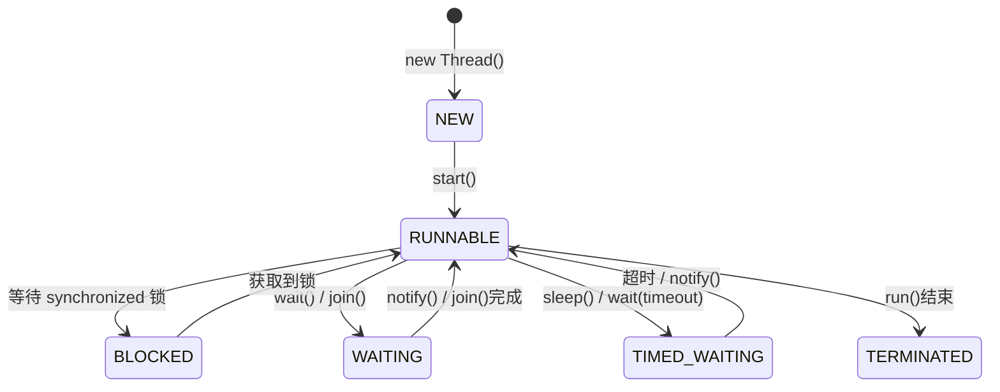
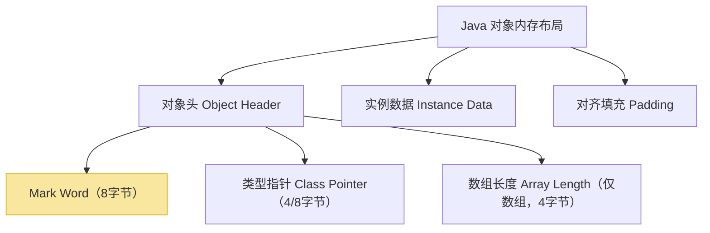
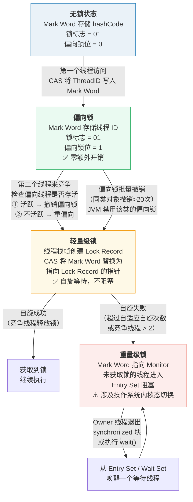
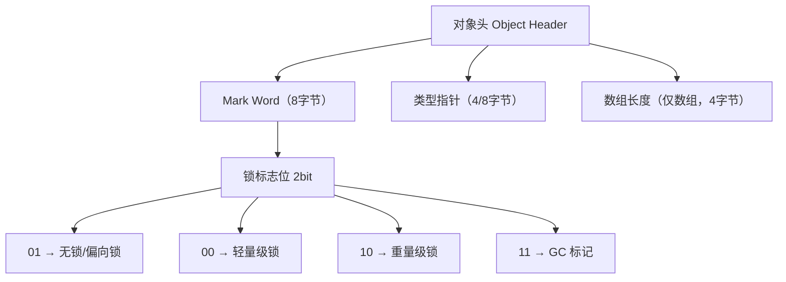
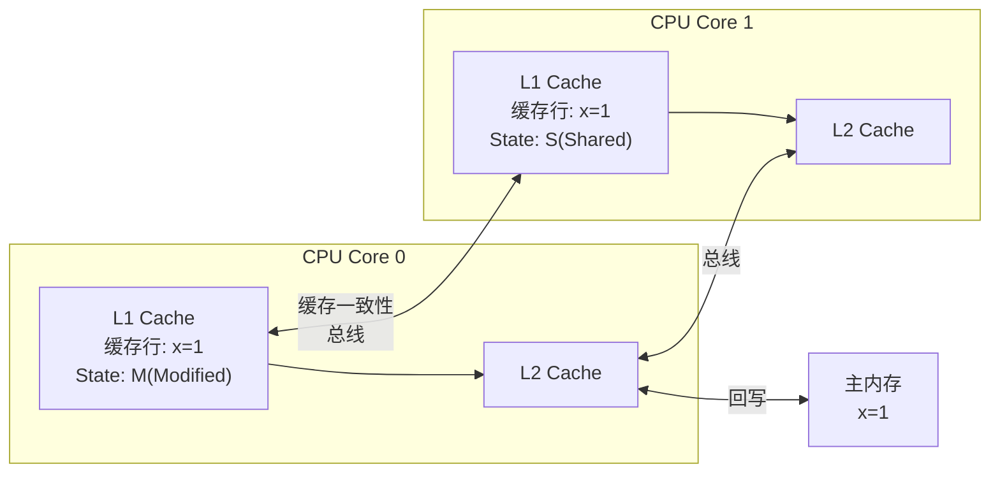
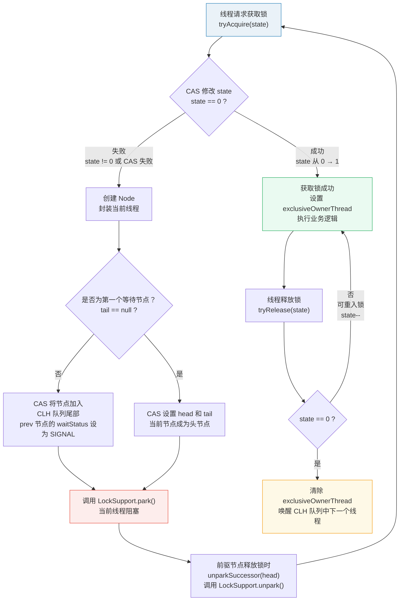
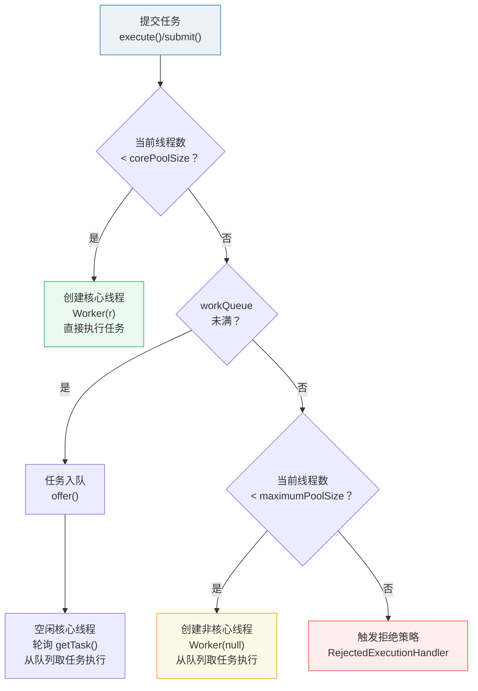
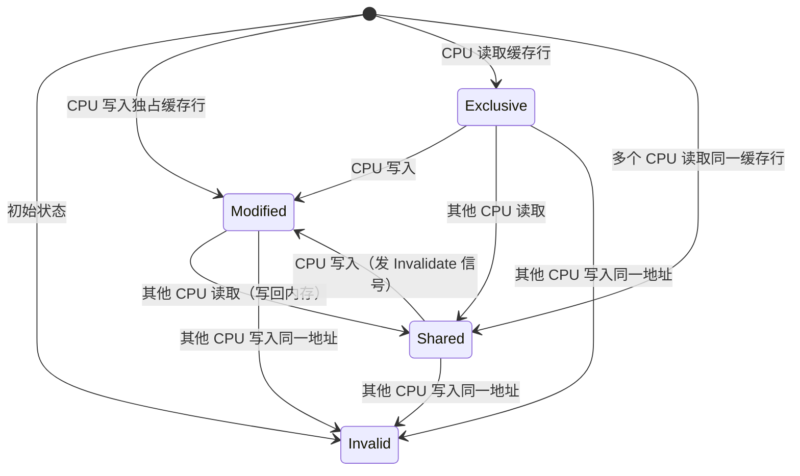
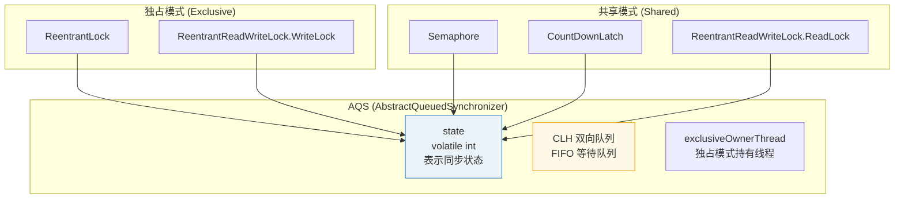
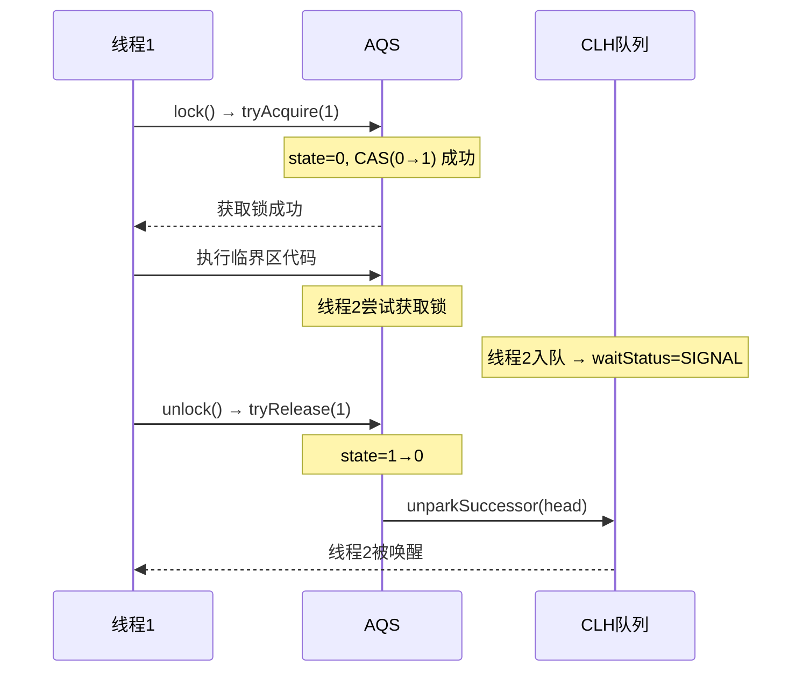

# Java 并发编程

> 为什么并发这么难？因为你写的代码在不加控制的情况下，结果是不可预期的。线程A看到了线程B还没写完的数据、两个线程同时修改同一个变量导致数据丢失、死锁让整个系统卡死——这些都不是小概率事件，而是高并发场景下的日常。这篇文章帮你建立一套系统的并发知识框架。

## 线程基础

### 创建线程的三种方式

```java
// 方式1：继承 Thread（不推荐——Java 单继承，不好复用）
class MyThread extends Thread {
    @Override
    public void run() { /* ... */ }
}

// 方式2：实现 Runnable（推荐——与业务逻辑解耦）
class MyTask implements Runnable {
    @Override
    public void run() { /* ... */ }
}
new Thread(new MyTask()).start();

// 方式3：实现 Callable + Future（需要返回值时）
class MyCallable implements Callable<String> {
    @Override
    public String call() throws Exception {
        Thread.sleep(1000);
        return "result";
    }
}
FutureTask<String> future = new FutureTask<>(new MyCallable());
new Thread(future).start();
String result = future.get();  // 阻塞等待结果

// 实际开发中：线程交给线程池管理，不要手动 new Thread()
```

::: tip 为什么不要手动 new Thread()？
1. 每次创建/销毁线程开销大（线程栈默认 1MB）
2. 无法限制最大线程数，高并发时可能创建几万个线程导致 OOM
3. 无法复用线程，任务量小但频繁创建时浪费资源
:::

### 线程生命周期



每个状态什么场景下会进入：

| 状态 | 触发条件 | 典型场景 |
|------|----------|----------|
| NEW | 创建但未 start() | `new Thread()` |
| RUNNABLE | start() 后 | 正在执行或等待 CPU 时间片 |
| BLOCKED | 等待 synchronized 锁 | 两个线程争抢同一个锁 |
| WAITING | 无限期等待 | `obj.wait()`、`thread.join()` |
| TIMED_WAITING | 有时限等待 | `Thread.sleep(1000)`、`obj.wait(1000)` |
| TERMINATED | run() 执行完或异常退出 | 正常结束或抛出未捕获异常 |

::: details 状态转换的常见面试陷阱
1. **BLOCKED vs WAITING**：BLOCKED 是主动等锁（入口等待），WAITING 是主动放弃 CPU（调用 wait/join）
2. **RUNNABLE 包含两种情况**：真正在运行 + 在操作系统中就绪等待 CPU 调度
3. **yield() 不会改变状态**：调用 `Thread.yield()` 后线程仍是 RUNNABLE，只是让出时间片
4. **sleep() 不释放锁**：`Thread.sleep()` 期间持有的锁不会释放，其他线程仍然无法进入 synchronized 块
:::

## synchronized——从语法到原理

### 基本用法

```java
// 锁对象：synchronized 锁的是对象，不是代码
public class Counter {
    private int count = 0;
    private final Object lock = new Object();

    // 方式1：同步实例方法——锁 this
    public synchronized void increment() { count++; }

    // 方式2：同步代码块——锁指定对象（推荐，粒度更细）
    public void increment2() {
        synchronized (lock) { count++; }
    }

    // 方式3：同步静态方法——锁 Class 对象
    public static synchronized void staticMethod() { /* ... */ }
    // 等价于 synchronized (Counter.class) { ... }
}
```

### 对象头与 Monitor 原理

synchronized 锁的本质是对**对象头中 Mark Word** 的操作。每个 Java 对象都有一个对象头，Mark Word 是其中最关键的部分：



**Mark Word 的结构**（以 64 位 JVM 为例）：

| 锁状态 | 25bit | 31bit | 1bit | 4bit | 1bit（偏向锁） | 2bit（锁标志） |
|--------|-------|-------|------|------|---------------|---------------|
| 无锁 | unused | hashCode | unused | 分代年龄 | 0 | 01 |
| 偏向锁 | thread ID（54bit） | epoch | unused | 分代年龄 | 1 | 01 |
| 轻量级锁 | 指向栈中锁记录的指针（62bit） | | | | | 00 |
| 重量级锁 | 指向 Monitor 对象的指针（62bit） | | | | | 10 |
| GC 标记 | 空 | | | | | 11 |

**Monitor（管程/监视器）**是 synchronized 底层的实现机制。每个对象都与一个 Monitor 关联（重量级锁时），Monitor 包含：

```
Monitor
├── Owner：当前持有锁的线程
├── Entry Set（入口等待集）：等待获取锁的线程队列
├── Wait Set（等待集）：调用 wait() 释放锁后等待被唤醒的线程
└── count：重入计数器
```

当线程执行 `synchronized` 代码块时：
1. 尝试获取对象的 Monitor（CAS 修改 Mark Word 指向 Monitor）
2. 成功则将 Owner 设为当前线程，count + 1
3. 失败则进入 Entry Set 阻塞等待
4. 执行 `wait()` 时释放 Monitor，进入 Wait Set
5. 执行 `notify()` 时从 Wait Set 中唤醒一个线程移入 Entry Set

### 锁升级过程（完整版）

synchronized 的性能优化是 JDK 6 之后的重点，核心是**锁膨胀/锁升级**——根据竞争情况自动升级锁级别。注意：**锁只能升级，不能降级**（除 GC 外）。



**各锁级别对比**：

| 锁级别 | 实现方式 | 适用场景 | 开销 |
|--------|----------|----------|------|
| 偏向锁 | Mark Word 存储线程 ID | 几乎没有竞争（单线程重入） | 几乎为零 |
| 轻量级锁 | CAS + 自旋 | 少量线程短暂竞争 | 中等（自旋消耗 CPU） |
| 重量级锁 | OS mutex | 高竞争、长时间持有锁 | 高（线程上下文切换） |

**自适应自旋**：JDK 6 引入，JVM 会根据上次自旋是否成功来动态调整自旋次数。如果在同一个锁上次自旋成功了，JVM 认为这次也可能成功，允许更多次自旋；如果很少成功，就跳过自旋直接膨胀为重量级锁。

::: warning JDK 15+ 偏向锁被废弃
偏向锁的维护成本高于收益（维护撤销日志、批量重偏向等逻辑复杂），在现代应用（如 Web 服务、微服务）中，锁的竞争几乎无法避免，偏向锁反而增加了复杂度。JDK 15 默认禁用（`-XX:-UseBiasedLocking`），JDK 18 正式移除。
:::

### synchronized 锁的是什么？

锁的是**对象头中的 Mark Word**：



## volatile——可见性与有序性

### 三大问题

并发编程有三大核心问题：**可见性**、**原子性**、**有序性**。

| 问题 | 含义 | synchronized | volatile |
|------|------|:---:|:---:|
| 可见性 | 一个线程的修改对其他线程可见 | ✅ | ✅ |
| 原子性 | 操作不可被中断 | ✅ | ❌ |
| 有序性 | 指令不被重排序 | ✅ | ✅ |

### volatile 的两个作用

```java
// 作用1：保证可见性
// 写 volatile 变量时，JMM 会强制将线程本地内存刷新到主内存
// 读 volatile 变量时，JMM 会强制从主内存读取
public class VolatileDemo {
    private volatile boolean running = true;

    public void stop() { running = false; }  // 对其他线程立即可见

    public void doWork() {
        while (running) {  // 不会因为缓存而"看不到"更新
            // 工作...
        }
    }
}

// 作用2：禁止指令重排序
// 底层通过内存屏障（Memory Barrier）实现
public class Singleton {
    private static volatile Singleton instance;  // volatile 防止指令重排！

    public static Singleton getInstance() {
        if (instance == null) {                    // 第一次检查（无锁）
            synchronized (Singleton.class) {
                if (instance == null) {            // 第二次检查（有锁）
                    instance = new Singleton();     // 这一步不是原子的！
                }
            }
        }
        return instance;
    }
}
```

### volatile 底层原理：内存屏障与 MESI 协议

volatile 的可见性和有序性由两个机制协同保证：**JMM 内存屏障**（软件层面）和 **MESI 缓存一致性协议**（硬件层面）。

#### 内存屏障（Memory Barrier）

内存屏障是 CPU 提供的指令，用于禁止特定类型的指令重排序并强制内存刷新。JVM 在 volatile 操作前后插入四种内存屏障：

| 屏障类型 | 指令 | 作用 |
|----------|------|------|
| LoadLoad | Load1 → **LoadLoad** → Load2 | Load1 必须在 Load2 之前完成读取 |
| StoreStore | Store1 → **StoreStore** → Store2 | Store1 必须在 Store2 之前刷新到内存 |
| LoadStore | Load1 → **LoadStore** → Store2 | Load1 必须在 Store2 之前完成读取 |
| StoreLoad | Store1 → **StoreLoad** → Load2 | Store1 刷新到内存后才能 Load2（**最昂贵，全能屏障**） |

**volatile 写操作**：在写之前插入 **StoreStore** 屏障，在写之后插入 **StoreLoad** 屏障。
**volatile 读操作**：在读之后插入 **LoadLoad** 和 **LoadStore** 屏障。

```java
// 伪代码展示 volatile 写的屏障插入
volatileVar = newVal;  // volatile 写
// 编译器/CPU 实际执行：
StoreStore屏障   // 确保之前的普通写已刷新
volatile 写操作  // 写 volatile 变量
StoreLoad屏障    // 确保之后的读能看到这次写的结果
```

#### MESI 缓存一致性协议

现代 CPU 使用多级缓存（L1/L2/L3），每个核心有自己的 L1/L2 缓存。MESI 协议维护缓存行的一致性：



**MESI 四种状态**：

| 状态 | 含义 | 读操作 | 写操作 |
|------|------|--------|--------|
| **M (Modified)** | 该缓存行被修改，与主内存不一致 | 直接读 | 直接写 |
| **E (Exclusive)** | 该缓存行只在本缓存中，与主内存一致 | 直接读 | 转为 M，直接写 |
| **S (Shared)** | 多个缓存中都有该行，与主内存一致 | 直接读 | 发送 Invalidate 信号，等确认后写 |
| **I (Invalid)** | 缓存行无效 | 从主内存/其他缓存读取 | 必须先从其他缓存获取最新值 |

当 CPU 0 执行 `volatile 写` 时：StoreLoad 屏障确保写入刷新到主内存（M → I），同时触发 MESI 协议将其他 CPU 中该缓存行标记为 Invalid。当 CPU 1 执行 `volatile 读` 时，发现缓存行是 Invalid，必须从主内存重新加载——这就是可见性的保证。

#### happens-before 规则

happens-before 是 JMM（Java Memory Model）的核心概念，它定义了操作之间的**可见性保证**。如果操作 A happens-before 操作 B，则 A 的结果对 B 可见。

**八大规则**（记住最常用的几个）：

| 规则 | 说明 | 示例 |
|------|------|------|
| **程序顺序规则** | 同一线程中，前面的操作 happens-before 后面的操作 | `a=1` hb `b=a+1`（同一线程内） |
| **volatile 变量规则** | volatile 写 happens-before 后续对该变量的读 | 线程A写 volatile → 线程B读 volatile |
| **监视器锁规则** | unlock happens-before 后续对同一锁的 lock | 线程A释放锁 → 线程B获取同一锁 |
| **线程启动规则** | Thread.start() happens-before 该线程内的所有操作 | 主线程 start → 子线程内的操作 |
| **线程终止规则** | 线程所有操作 happens-before Thread.join() 返回 | 子线程内的操作 → join() 后的代码 |
| **传递性** | A hb B，B hb C → A hb C | 组合以上规则推导可见性 |

```java
// happens-before 实战理解
class VolatileExample {
    int a = 0;
    volatile boolean flag = false;

    public void writer() {
        a = 1;           // ① 普通写
        flag = true;     // ② volatile 写，② hb ③
    }

    public void reader() {
        if (flag) {      // ③ volatile 读，③ hb ②（volatile 规则）
            int i = a;   // ④ 由传递性：① hb ② hb ③，所以 a=1 对 ④ 可见
            assert i == 1; // ✅ 一定成立
        }
    }
}
```

::: tip happens-before 不是时间上的"先发生"
happens-before 是可见性保证，不等于时间上的先后顺序。编译器和 CPU 可以重排序，但必须保证 happens-before 关系中的可见性。比如 `a=1` 可能被重排序到 `flag=true` 之后执行，但只要 `flag=true` 对其他线程可见时 `a=1` 也可见就满足 happens-before。
:::

### 为什么 DCL 单例的 volatile 是必须的？

`instance = new Singleton()` 不是原子操作，编译器可能重排序为：

```
1. 分配内存空间
2. 将引用指向内存（此时对象还没初始化完！）  ← 重排到这里
3. 初始化对象

如果线程A执行到步骤2，线程B此时判断 instance != null
直接返回了一个未初始化完的对象——灾难
volatile 的内存屏障禁止了这种重排序
```

::: danger volatile 不保证原子性
`volatile int count; count++` 不是线程安全的！`count++` 实际是读-改-写三个操作，volatile 只保证读和写各自的可见性，不保证整体的原子性。需要原子性用 `AtomicInteger` 或 `synchronized`。
:::

## AQS——JUC 并发包的灵魂

AbstractQueuedSynchronizer（AQS）是 JUC 并发包的基础框架，`ReentrantLock`、`Semaphore`、`CountDownLatch`、`ReentrantReadWriteLock` 全部基于它实现。

### 核心设计

```
AQS
├── state（int）          ← 用 CAS 修改，表示同步状态
│   ├── ReentrantLock: state 表示锁的重入次数
│   ├── Semaphore: state 表示可用许可数
│   └── CountDownLatch: state 表示剩余倒计数
│
└── CLH 双向队列          ← 存储等待获取同步状态的线程
    head ◄──── node ◄──── node ◄──── tail
    每个节点保存：线程引用 + 等待状态（SIGNAL/CANCEL/CONDITION等）
```

### AQS 工作原理详解

AQS 的核心思想是：**如果被请求的共享资源空闲，则当前线程获取资源；如果被占用，则将当前线程加入等待队列阻塞，等资源释放后唤醒**。



::: details CLH 队列 vs MCS 队列
- **CLH 队列**：每个节点自旋检查前驱节点的状态（`waitStatus`），前驱释放时唤醒后继。AQS 采用的是变体 CLH，配合 `LockSupport.park()` 阻塞而非自旋。
- **MCS 队列**：每个节点自旋检查自身节点的状态，缓存友好（不会导致其他 CPU 缓存行的无效化）。
- AQS 选择 CLH 变体的原因：Java 层面无法直接实现 MCS 的本地自旋，CLH 配合 `LockSupport` 的 park/unpark 更适合 JVM 场景。
:::

**CLH（Craig, Landin, and Hagersten）队列**是 AQS 内部维护的双向 FIFO 等待队列。每个节点（Node）包含：

```java
static final class Node {
    volatile int waitStatus;    // 等待状态
    volatile Node prev;         // 前驱节点
    volatile Node next;         // 后继节点
    volatile Thread thread;     // 等待的线程
    Node nextWaiter;            // Condition 队列的后继节点
    
    // waitStatus 取值：
    // SIGNAL(-1):    后继节点需要被唤醒
    // CANCELLED(1):  节点被取消（超时或中断）
    // CONDITION(-2): 节点在 Condition 等待队列中
    // PROPAGATE(-3): 共享模式下释放时应传播唤醒
    // 0:             初始状态
}
```

### ReentrantLock 深入：AQS 的独占模式实现

ReentrantLock 内部维护了一个 Sync（继承 AQS），分为 FairSync（公平锁）和 NonfairSync（非公平锁）。

```java
// ReentrantLock 加锁流程（非公平锁）
public void lock() {
    sync.lock();  // 调用 NonfairSync.lock()
}

// NonfairSync.lock()
final void lock() {
    // 1. 直接 CAS 抢锁（不管队列里有没有排队的）
    if (compareAndSetState(0, 1))
        setExclusiveOwnerThread(Thread.currentThread());
    else
        acquire(1);  // 抢不到就走 AQS 标准流程
}

// AQS.acquire()
public final void acquire(int arg) {
    if (!tryAcquire(arg) &&                    // 尝试获取（子类实现）
        acquireQueued(addWaiter(Node.EXCLUSIVE), arg))  // 加入队列并阻塞
        selfInterrupt();
}

// NonfairSync.tryAcquire()
protected final boolean tryAcquire(int acquires) {
    return nonfairTryAcquire(acquires);
}

// 公平锁的区别：tryAcquire 中会先检查队列中是否有排队的线程
// 有 → 不抢，排队去；没有 → 才 CAS
protected final boolean tryAcquire(int acquires) {
    if (hasQueuedPredecessors())  // ← 公平锁独有：检查等待队列
        return false;
    // ... CAS 抢锁
}
```

**Condition 实现原理**：

```java
ReentrantLock lock = new ReentrantLock();
Condition notEmpty = lock.newCondition();
Condition notFull = lock.newCondition();

// Condition 内部维护了一个等待队列（单向链表）
// await()：当前线程加入 Condition 等待队列，释放锁，线程阻塞
// signal()：将 Condition 等待队列的第一个节点移入 AQS CLH 同步队列
//          等待被 CLH 队列的前驱节点唤醒

// 典型应用：生产者-消费者模式
lock.lock();
try {
    while (queue.isEmpty()) {
        notEmpty.await();    // 队列空，消费者等待
    }
    Object item = queue.poll();
    notFull.signal();        // 通知生产者
} finally {
    lock.unlock();
}
```

### synchronized vs ReentrantLock 完整对比

| 维度 | synchronized | ReentrantLock |
|------|:---:|:---:|
| 锁获取方式 | JVM 自动 | 手动 lock()/unlock() |
| 锁释放 | 自动（退出同步块/异常） | 必须 finally 中 unlock() |
| 可中断 | ❌ 不可中断 | ✅ lockInterruptibly() |
| 超时获取 | ❌ 不支持 | ✅ tryLock(timeout) |
| 公平锁 | ❌ 只支持非公平 | ✅ 支持公平/非公平 |
| 条件变量 | 只有一个 wait/notify | ✅ 多个 Condition |
| 锁状态检查 | ❌ | ✅ isLocked()/isHeldByCurrentThread() |
| 性能 | JDK 6 后大幅优化，低竞争时接近 | 低竞争时略优（轻量级） |
| 适用场景 | 简单同步，大部分场景 | 需要高级特性时 |

::: tip 选择建议
优先使用 synchronized——简单、自动释放锁、JVM 持续优化。只有需要可中断锁、超时获取、公平锁、多个 Condition 等高级特性时才用 ReentrantLock。
:::

### ReentrantLock 的公平与非公平

```java
// 公平锁：严格按照等待队列顺序获取锁
// 非公平锁：新来的线程直接 CAS 抢锁，抢不到再排队（默认）

// 非公平锁为什么性能更好？
// 大多数情况下，锁的持有时间很短，新来的线程直接 CAS 成功的概率很高
// 避免了线程切换的开销

ReentrantLock fairLock = new ReentrantLock(true);   // 公平锁
ReentrantLock unfairLock = new ReentrantLock();      // 非公平锁（默认）
```

## 并发工具类——AQS 的典型实现

::: tip 如何选择并发工具类？
- **等待任务完成** → CountDownLatch（一次性）或 CyclicBarrier（可循环）
- **限流/资源池** → Semaphore
- **多阶段协作 + 动态参与者** → Phaser
- **线程间数据交换** → Exchanger（JUC 中较少使用）
:::

### CountDownLatch：一次性倒计数器

```java
// 场景：主线程等待多个子任务全部完成
CountDownLatch latch = new CountDownLatch(3);
for (int i = 0; i < 3; i++) {
    new Thread(() -> {
        doWork();
        latch.countDown();  // state--（内部是 releaseShared）
    }).start();
}
latch.await();  // 等待 state 变为 0（内部是 acquireShared）
System.out.println("所有任务完成");

// 原理：state 初始化为 count
// countDown(): CAS 将 state-1，state==0 时唤醒所有等待线程
// await(): 如果 state!=0，当前线程进入 CLH 队列的共享模式等待
// 注意：CountDownLatch 是一次性的，state 到 0 后不能重置
```

### CyclicBarrier：循环屏障

```java
// 场景：多线程分阶段协作，每个阶段所有线程到齐后再一起继续
CyclicBarrier barrier = new CyclicBarrier(3, () -> {
    System.out.println("所有线程到齐，继续");  // 屏障动作（可选）
});

for (int i = 0; i < 3; i++) {
    new Thread(() -> {
        doPhase1();
        barrier.await();  // 等待其他线程到齐
        doPhase2();       // 所有线程同时开始第二阶段
        barrier.await();  // 可以重复使用！
        doPhase3();
    }).start();
}

// 原理：基于 ReentrantLock + Condition（不是直接基于 AQS）
// 内部维护 count（ parties - 已到达线程数）和 generation（代）
// await() 时 count--，count==0 时执行屏障动作，重置 generation，唤醒所有线程
// 与 CountDownLatch 的区别：
//   - CyclicBarrier 可以循环使用，CountDownLatch 不能
//   - CyclicBarrier 强调线程间相互等待，CountDownLatch 强调一个/多个线程等其他线程
```

### Semaphore：信号量（限流）

```java
// 场景：限制并发访问数（数据库连接池、接口限流）
Semaphore semaphore = new Semaphore(3);  // 最多 3 个并发

for (int i = 0; i < 10; i++) {
    new Thread(() -> {
        semaphore.acquire();    // state--，state<=0 时线程等待
        try {
            doWork();           // 最多 3 个线程同时执行
        } finally {
            semaphore.release(); // state++
        }
    }).start();
}

// 原理：state 初始化为 permits
// acquire(): CAS 将 state-1，state<0 时线程进入 CLH 队列
// release(): CAS 将 state+1，唤醒队列中等待的线程
// 支持公平/非公平模式
```

### Phaser：分阶段执行器

```java
// 场景：比 CyclicBarrier 更灵活——支持动态注册/注销参与者，支持多阶段
Phaser phaser = new Phaser(3);  // 3 个参与者

// 阶段 0
phaser.arriveAndAwaitAdvance();  // 所有参与者到齐，进入阶段 1
// 阶段 1
phaser.arriveAndAwaitAdvance();  // 所有参与者到齐，进入阶段 2

// 动态注册
phaser.register();  // 新增一个参与者，parties 变为 4

// 动态注销
phaser.arriveAndDeregister();  // 当前参与者完成并退出，parties 变为 3

// 适用场景：多轮游戏、分步骤计算、需要中途加入/退出的协作任务
```

### 工具类对比

| 工具 | 可重用 | 参与者动态变化 | 底层实现 | 典型场景 |
|------|:---:|:---:|------|----------|
| CountDownLatch | ❌ | ❌ | AQS 共享模式 | 等待 N 个任务完成 |
| CyclicBarrier | ✅ | ❌ | ReentrantLock + Condition | 多线程分阶段协作 |
| Semaphore | ✅ | ❌ | AQS 共享模式 | 限流、资源池 |
| Phaser | ✅ | ✅ | AQS 共享模式 | 多阶段、动态参与者 |

## 线程池——必须理解的核心组件

::: warning 线程池参数设置的常见错误
1. **corePoolSize = 0**：所有线程都是非核心线程，空闲会被回收，导致冷启动延迟
2. **无界队列 + maximumPoolSize 无意义**：任务永远不会触发扩容线程
3. **keepAliveTime 太短**：频繁创建/销毁线程的开销大
4. **不设置线程名**：出问题时无法从线程名定位来源
5. **不设置拒绝策略**：默认 AbortPolicy 会抛异常，可能导致任务丢失
:::

### 核心参数

```java
ThreadPoolExecutor executor = new ThreadPoolExecutor(
    5,                     // corePoolSize：核心线程数（常驻）
    10,                    // maximumPoolSize：最大线程数（弹性扩容上限）
    60L, TimeUnit.SECONDS, // keepAliveTime：非核心线程的空闲存活时间
    new LinkedBlockingQueue<>(100),  // workQueue：任务等待队列
    new ThreadFactory() {           // threadFactory：线程创建工厂
        private int count = 0;
        @Override
        public Thread newThread(Runnable r) {
            Thread t = new Thread(r, "worker-" + count++);
            t.setDaemon(false);     // 非守护线程，确保任务不会被提前终止
            return t;
        }
    },
    new ThreadPoolExecutor.CallerRunsPolicy()  // handler：拒绝策略
);
```

### 任务提交流程



::: details 四种拒绝策略对比
- **AbortPolicy（默认）**：抛出 `RejectedExecutionException`，调用方需要捕获处理
- **CallerRunsPolicy**：由提交任务的线程（通常是主线程）自己执行任务，变相降速
- **DiscardPolicy**：静默丢弃任务，不抛异常（危险，任务会丢失）
- **DiscardOldestPolicy**：丢弃队列中最老的任务，重新尝试提交当前任务
:::

### ThreadPoolExecutor 源码级分析

#### 核心线程预热

```java
// 默认情况下核心线程不会预创建，而是在有任务提交时才创建
// 如果需要预热（比如系统启动时就需要核心线程就绪）：

executor.prestartAllCoreThreads();  // 预创建所有核心线程
executor.prestartCoreThread();      // 预创建一个核心线程

// prestartAll
### volatile——轻量级同步与内存语义

#### volatile 的两大作用

```java
// 1. 可见性保证：一个线程修改，其他线程立即可见
private volatile boolean running = true;

// 线程 A
while (running) {
    // 能及时感知线程 B 的修改
}

// 线程 B
running = false;  // 线程 A 立即退出循环

// 2. 禁止指令重排序
private volatile Singleton instance;

public Singleton getInstance() {
    if (instance == null) {              // 第一次检查
        synchronized (Singleton.class) {
            if (instance == null) {      // 第二次检查（DCL）
                instance = new Singleton(); // volatile 禁止此处重排序
            }
        }
    }
    return instance;
}
```

#### MESI 缓存一致性协议

现代 CPU 使用多级缓存，每个核心有自己的 L1/L2 缓存，共享 L3 缓存。MESI 协议通过四种状态管理缓存行的一致性：



| 状态 | 含义 | 数据位置 |
|------|------|----------|
| **M (Modified)** | 已修改，与内存不一致 | 仅在本缓存，脏数据 |
| **E (Exclusive)** | 已修改，与内存一致 | 仅在本缓存 |
| **S (Shared)** | 未修改，多核共享 | 本缓存 + 内存 |
| **I (Invalid)** | 失效，不可使用 | — |

:::tip volatile 的底层实现
`volatile` 写操作会生成一条 Lock 前缀指令（如 `lock addl $0x0, (%rsp)`），它会：
1. 将当前缓存行数据写回主内存
2. 使其他 CPU 中持有该缓存行的副本失效（Invalidate）

这就是为什么 volatile 能保证可见性——本质上是触发 MESI 协议的缓存一致性消息。
:::

### CAS——无锁并发的基石

#### CAS 底层实现（Unsafe）

```java
// CAS (Compare-And-Swap) 三要素：内存地址 V、期望值 A、新值 B
// 如果 V 处的值等于 A，则更新为 B，返回 true；否则返回 false

// Java 中通过 Unsafe 类调用 CPU 的 CAS 指令（x86 的 cmpxchg）
public final native boolean compareAndSwapInt(Object o, long offset, int expected, int x);
public final native boolean compareAndSwapLong(Object o, long offset, long expected, long x);
public final native boolean compareAndSwapObject(Object o, long offset, Object expected, Object x);
```

#### CAS 的三大问题

| 问题 | 描述 | 解决方案 |
|------|------|----------|
| **ABA 问题** | 值从 A→B→A，CAS 误认为没变 | `AtomicStampedReference` 加版本号 |
| **自旋开销** | 长时间 CAS 失败会一直自旋消耗 CPU | 限制自旋次数、使用 `LongAdder` |
| **只能保证单个变量** | 无法同时 CAS 多个变量 | `AtomicReference` 封装为对象 |

```java
// ABA 问题演示与解决
AtomicInteger ai = new AtomicInteger(100);

// 线程1：CAS(100 → 200)
// 线程2：CAS(100 → 101) → CAS(101 → 100)  // ABA!

// 解决：使用版本号
AtomicStampedReference<Integer> ref = new AtomicStampedReference<>(100, 0);

int stamp = ref.getStamp();  // 获取当前版本号
ref.compareAndSet(100, 200, stamp, stamp + 1);  // 同时比较值和版本号
// 线程2修改后版本号变了，线程1的 CAS 会失败
```

### AQS——JUC 并发工具的灵魂

#### AQS 核心架构



#### CLH 队列结构

```java
// AQS 内部的 CLH 队列节点
static final class Node {
    static final Node SHARED = new Node();    // 共享模式标记
    static final Node EXCLUSIVE = null;        // 独占模式标记
    static final int CANCELLED  =  1;         // 线程已取消
    static final int SIGNAL    = -1;          // 后继线程需要唤醒
    static final int PROPAGATE = -3;          // 共享模式传播
    
    volatile int waitStatus;       // 等待状态
    volatile Node prev;            // 前驱节点
    volatile Node next;            // 后继节点
    volatile Thread thread;        // 持有线程
    Node nextWaiter;               // 条件队列中的后继
}
```

#### ReentrantLock 的 AQS 工作流程



:::warning 公平锁 vs 非公平锁
ReentrantLock 默认**非公平锁**：
- **非公平锁**：新线程直接尝试 CAS 抢锁，失败再入队。性能更好，但可能饥饿
- **公平锁**：新线程必须检查队列，排在前面的先获取。不会饥饿，但吞吐量低

`new ReentrantLock(true)` 创建公平锁，`new ReentrantLock()` 创建非公平锁（默认）。
:::

### CountDownLatch 与 Semaphore 底层

```java
// CountDownLatch：基于 AQS 共享模式
// state 初始化为 count，每次 countDown() → state-1
// state=0 时唤醒所有等待线程
CountDownLatch latch = new CountDownLatch(3);
latch.countDown();  // tryReleaseShared: CAS(state, 3, 2)
latch.countDown();  // CAS(state, 2, 1)
latch.countDown();  // CAS(state, 1, 0) → doReleaseShared 唤醒等待线程
latch.await();      // tryAcquireShared(1): state!=0 时入队 park

// Semaphore：基于 AQS 共享模式
// state 初始化为 permits，表示可用许可证数
// acquire() → state-1 (CAS)
// release() → state+1 (CAS)
Semaphore sem = new Semaphore(5);
sem.acquire();   // CAS(state, 5, 4) 成功获取
sem.acquire();   // CAS(state, 4, 3) 
sem.release();   // CAS(state, 3, 4) 释放许可证
```
