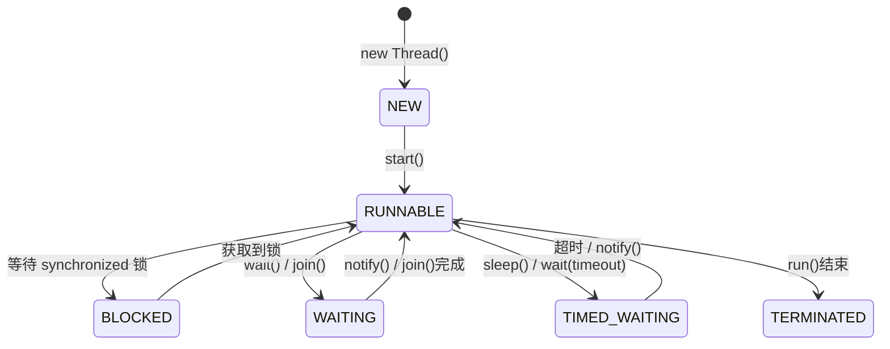
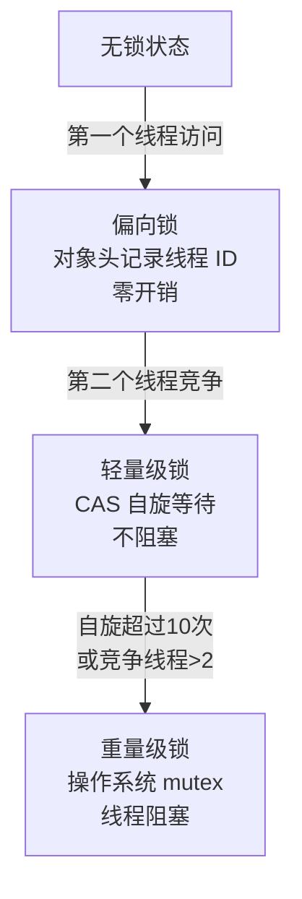
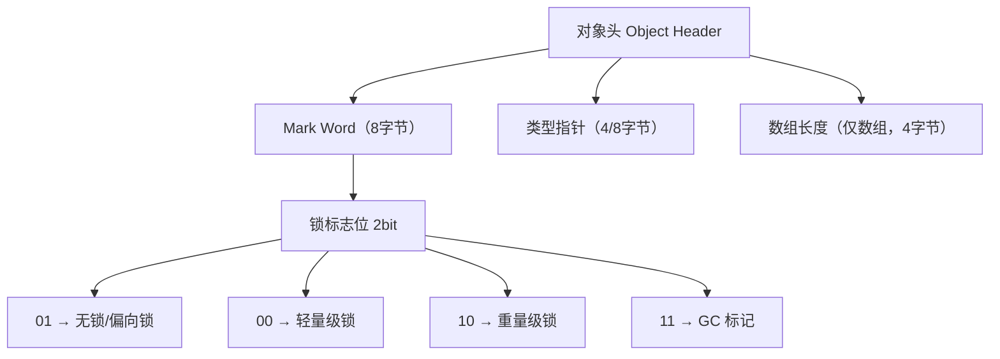
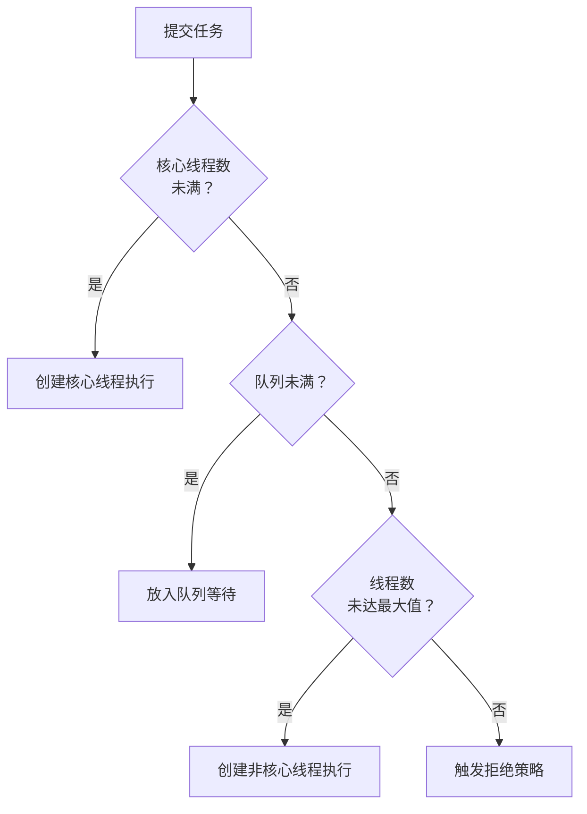

# Java 并发编程

> 为什么并发这么难？因为你写的代码在不加控制的情况下，结果是不可预期的。线程A看到了线程B还没写完的数据、两个线程同时修改同一个变量导致数据丢失、死锁让整个系统卡死——这些都不是小概率事件，而是高并发场景下的日常。这篇文章帮你建立一套系统的并发知识框架。

## 线程基础

### 创建线程的三种方式

```java
// 方式1：继承 Thread（不推荐——Java 单继承，不好复用）
class MyThread extends Thread {
    @Override
    public void run() { /* ... */ }
}

// 方式2：实现 Runnable（推荐——与业务逻辑解耦）
class MyTask implements Runnable {
    @Override
    public void run() { /* ... */ }
}
new Thread(new MyTask()).start();

// 方式3：实现 Callable + Future（需要返回值时）
class MyCallable implements Callable<String> {
    @Override
    public String call() throws Exception {
        Thread.sleep(1000);
        return "result";
    }
}
FutureTask<String> future = new FutureTask<>(new MyCallable());
new Thread(future).start();
String result = future.get();  // 阻塞等待结果

// 实际开发中：线程交给线程池管理，不要手动 new Thread()
```

::: tip 为什么不要手动 new Thread()？
1. 每次创建/销毁线程开销大（线程栈默认 1MB）
2. 无法限制最大线程数，高并发时可能创建几万个线程导致 OOM
3. 无法复用线程，任务量小但频繁创建时浪费资源
:::

### 线程生命周期



每个状态什么场景下会进入：

| 状态 | 触发条件 | 典型场景 |
|------|----------|----------|
| NEW | 创建但未 start() | `new Thread()` |
| RUNNABLE | start() 后 | 正在执行或等待 CPU 时间片 |
| BLOCKED | 等待 synchronized 锁 | 两个线程争抢同一个锁 |
| WAITING | 无限期等待 | `obj.wait()`、`thread.join()` |
| TIMED_WAITING | 有时限等待 | `Thread.sleep(1000)`、`obj.wait(1000)` |
| TERMINATED | run() 执行完或异常退出 | 正常结束或抛出未捕获异常 |

## synchronized——从语法到原理

### 基本用法

```java
// 锁对象：synchronized 锁的是对象，不是代码
public class Counter {
    private int count = 0;
    private final Object lock = new Object();

    // 方式1：同步实例方法——锁 this
    public synchronized void increment() { count++; }

    // 方式2：同步代码块——锁指定对象（推荐，粒度更细）
    public void increment2() {
        synchronized (lock) { count++; }
    }

    // 方式3：同步静态方法——锁 Class 对象
    public static synchronized void staticMethod() { /* ... */ }
    // 等价于 synchronized (Counter.class) { ... }
}
```

### 锁膨胀过程

synchronized 的性能优化是 JDK 6 之后的重点，核心是**锁膨胀**——根据竞争情况自动升级锁级别：



::: warning JDK 15+ 偏向锁被废弃
偏向锁的维护成本高于收益（维护撤销日志、批量重偏向等逻辑复杂），在现代应用（如 Web 服务、微服务）中，锁的竞争几乎无法避免，偏向锁反而增加了复杂度。JDK 15 默认禁用，JDK 18 正式移除。
:::

### synchronized 锁的是什么？

锁的是**对象头中的 Mark Word**：



## volatile——可见性与有序性

### 三大问题

并发编程有三大核心问题：**可见性**、**原子性**、**有序性**。

| 问题 | 含义 | synchronized | volatile |
|------|------|:---:|:---:|
| 可见性 | 一个线程的修改对其他线程可见 | ✅ | ✅ |
| 原子性 | 操作不可被中断 | ✅ | ❌ |
| 有序性 | 指令不被重排序 | ✅ | ✅ |

### volatile 的两个作用

```java
// 作用1：保证可见性
// 写 volatile 变量时，JMM 会强制将线程本地内存刷新到主内存
// 读 volatile 变量时，JMM 会强制从主内存读取
public class VolatileDemo {
    private volatile boolean running = true;

    public void stop() { running = false; }  // 对其他线程立即可见

    public void doWork() {
        while (running) {  // 不会因为缓存而"看不到"更新
            // 工作...
        }
    }
}

// 作用2：禁止指令重排序
// 底层通过内存屏障（Memory Barrier）实现
public class Singleton {
    private static volatile Singleton instance;  // volatile 防止指令重排！

    public static Singleton getInstance() {
        if (instance == null) {                    // 第一次检查（无锁）
            synchronized (Singleton.class) {
                if (instance == null) {            // 第二次检查（有锁）
                    instance = new Singleton();     // 这一步不是原子的！
                }
            }
        }
        return instance;
    }
}
```

### 为什么 DCL 单例的 volatile 是必须的？

`instance = new Singleton()` 不是原子操作，编译器可能重排序为：

```
1. 分配内存空间
2. 将引用指向内存（此时对象还没初始化完！）  ← 重排到这里
3. 初始化对象

如果线程A执行到步骤2，线程B此时判断 instance != null
直接返回了一个未初始化完的对象——灾难
volatile 的内存屏障禁止了这种重排序
```

::: danger volatile 不保证原子性
`volatile int count; count++` 不是线程安全的！`count++` 实际是读-改-写三个操作，volatile 只保证读和写各自的可见性，不保证整体的原子性。需要原子性用 `AtomicInteger` 或 `synchronized`。
:::

## AQS——JUC 并发包的灵魂

AbstractQueuedSynchronizer（AQS）是 JUC 并发包的基础框架，`ReentrantLock`、`Semaphore`、`CountDownLatch`、`ReentrantReadWriteLock` 全部基于它实现。

### 核心设计

```
AQS
├── state（int）          ← 用 CAS 修改，表示同步状态
│   ├── ReentrantLock: state 表示锁的重入次数
│   ├── Semaphore: state 表示可用许可数
│   └── CountDownLatch: state 表示剩余倒计数
│
└── CLH 双向队列          ← 存储等待获取同步状态的线程
    head ◄──── node ◄──── node ◄──── tail
    每个节点保存：线程引用 + 等待状态（SIGNAL/CANCEL/CONDITION等）
```

### ReentrantLock 的公平与非公平

```java
// 公平锁：严格按照等待队列顺序获取锁
// 非公平锁：新来的线程直接 CAS 抢锁，抢不到再排队（默认）

// 非公平锁为什么性能更好？
// 大多数情况下，锁的持有时间很短，新来的线程直接 CAS 成功的概率很高
// 避免了线程切换的开销

ReentrantLock fairLock = new ReentrantLock(true);   // 公平锁
ReentrantLock unfairLock = new ReentrantLock();      // 非公平锁（默认）
```

### 三大工具类的 AQS 实现

```java
// CountDownLatch：一次性倒计数器
// state 初始化为 count，每次 countDown() state-1
// await() 的线程在队列里等待，直到 state == 0 时被唤醒
CountDownLatch latch = new CountDownLatch(3);
for (int i = 0; i < 3; i++) {
    new Thread(() -> {
        doWork();
        latch.countDown();  // state--
    }).start();
}
latch.await();  // 等待 state 变为 0
System.out.println("所有任务完成");

// Semaphore：信号量
// state 初始化为 permits，每次 acquire() state-1，release() state+1
// state <= 0 时 acquire() 的线程进入队列等待
Semaphore semaphore = new Semaphore(3);  // 最多 3 个并发
semaphore.acquire();
try {
    doWork();
} finally {
    semaphore.release();
}

// CyclicBarrier：循环屏障（不是基于 AQS，基于 ReentrantLock + Condition）
// 和 CountDownLatch 的区别：可以重复使用
CyclicBarrier barrier = new CyclicBarrier(3, () -> {
    System.out.println("所有线程到齐，继续");  // 屏障动作
});
```

## 线程池——必须理解的核心组件

### 核心参数

```java
ThreadPoolExecutor executor = new ThreadPoolExecutor(
    5,                     // corePoolSize：核心线程数（常驻）
    10,                    // maximumPoolSize：最大线程数（弹性扩容上限）
    60L, TimeUnit.SECONDS, // keepAliveTime：非核心线程的空闲存活时间
    new LinkedBlockingQueue<>(100),  // workQueue：任务等待队列
    new ThreadFactory() {           // threadFactory：线程创建工厂
        private int count = 0;
        @Override
        public Thread newThread(Runnable r) {
            Thread t = new Thread(r, "worker-" + count++);
            t.setDaemon(false);     // 非守护线程，确保任务不会被提前终止
            return t;
        }
    },
    new ThreadPoolExecutor.CallerRunsPolicy()  // handler：拒绝策略
);
```

### 任务提交流程



### 为什么阿里巴巴不推荐用 Executors？

```java
// ❌ newFixedThreadPool：无界队列（LinkedBlockingQueue 默认 Integer.MAX_VALUE）
// 任务无限堆积 → OOM
ExecutorService pool = Executors.newFixedThreadPool(5);
// 当任务提交速度 > 处理速度，队列会不断增长直到内存溢出

// ❌ newCachedThreadPool：最大线程数 Integer.MAX_VALUE
// 高并发时创建大量线程 → OOM
ExecutorService pool = Executors.newCachedThreadPool();
// 瞬时高并发 → 几千个线程同时创建 → 栈内存溢出

// ❌ newSingleThreadExecutor：同 newFixedThreadPool，也是无界队列

// ✅ 手动创建 ThreadPoolExecutor，明确指定所有参数
```

### 线程数怎么定？

```
CPU 密集型任务：
  线程数 ≈ CPU 核心数 + 1
  例：8 核 CPU → 9 个线程
  原因：线程数超过核心数后，线程上下文切换的开销 > 并行收益

IO 密集型任务：
  线程数 ≈ CPU 核心数 × (1 + IO等待时间 / CPU计算时间)
  例：8 核 CPU，IO 等待占 80% → 8 × (1 + 4) = 40 个线程
  原因：线程在等 IO 时不占 CPU，可以多开一些

混合型任务：拆分成 CPU 密集型和 IO 密集型任务，分别用不同线程池
```

### 四种拒绝策略

| 策略 | 行为 | 适用场景 |
|------|------|----------|
| AbortPolicy（默认） | 抛出 RejectedExecutionException | 关键任务，不能丢 |
| CallerRunsPolicy | 由提交任务的线程自己执行 | 不想丢弃任务，能接受降速 |
| DiscardPolicy | 静默丢弃 | 可以容忍数据丢失（日志采集等） |
| DiscardOldestPolicy | 丢弃队列最老的任务 | 最新数据更重要 |

## CompletableFuture——异步编程利器

### 实际使用场景

```java
// 场景1：并行调用多个 RPC 接口
public OrderDetail getOrderDetail(String orderId) {
    // 三个接口互不依赖，并行调用
    CompletableFuture<Order> orderFuture =
        CompletableFuture.supplyAsync(() -> orderService.getById(orderId), executor);
    CompletableFuture<User> userFuture =
        CompletableFuture.supplyAsync(() -> userService.getById(userId), executor);
    CompletableFuture<List<Product>> productsFuture =
        CompletableFuture.supplyAsync(() -> productService.getByOrderId(orderId), executor);

    // 等待所有完成，组合结果
    return orderFuture
        .thenCombine(userFuture, (order, user) -> new OrderDetail(order, user))
        .thenCombine(productsFuture, (detail, products) -> {
            detail.setProducts(products);
            return detail;
        })
        .get(3, TimeUnit.SECONDS);  // 3秒超时
}
// 串行耗时：500ms + 300ms + 200ms = 1000ms
// 并行耗时：max(500ms, 300ms, 200ms) = 500ms

// 场景2：超时处理
CompletableFuture<String> future = CompletableFuture
    .supplyAsync(() -> slowRpc())
    .orTimeout(500, TimeUnit.MILLISECONDS)     // Java 9+
    .exceptionally(ex -> {
        if (ex instanceof TimeoutException) {
            return "default value";  // 超时降级
        }
        return "error";
    });

// 场景3：异步通知（不关心结果，发完就完）
CompletableFuture.runAsync(() -> {
    notificationService.send(email, content);
}, executor);
// 注意：如果任务抛异常，get() 时才会感知
// 建议加 .exceptionally() 防止异常被吞掉
```

## ThreadLocal——线程隔离，但要小心内存泄漏

### 基本原理

```java
// 每个线程有自己的 ThreadLocalMap
// ThreadLocal 对象作为 key，实际值作为 value
ThreadLocal<SimpleDateFormat> dateFormat =
    ThreadLocal.withInitial(() -> new SimpleDateFormat("yyyy-MM-dd"));

// 每个线程第一次访问时创建自己的 SimpleDateFormat 实例
// 不同线程互不干扰，无需 synchronized
```

### 内存泄漏问题

```java
// ThreadLocalMap 的 key 是 ThreadLocal 的弱引用，value 是强引用
// GC 时 key 会被回收，但 value 不会被回收
// 结果：map 中存在 key=null, value=大对象 的条目

// 线程池中的线程是复用的，ThreadLocal 不清理就会一直泄漏

// ✅ 必须在 finally 中清理
try {
    dateFormat.get().format(date);
} finally {
    dateFormat.remove();  // 清理！
}
```

::: danger InheritableThreadLocal 的坑
`InheritableThreadLocal` 在子线程创建时复制父线程的值，但线程池中线程是复用的，后续提交的任务拿到的仍然是创建线程池时的值，不是当前请求的值。解决方案：阿里开源的 TransmittableThreadLocal（TTL）通过包装 Runnable，在任务执行前后传递上下文。
:::

## CAS 与原子类

### CAS 的原理与 ABA 问题

```java
// CAS（Compare-And-Swap）：比较并交换
// CAS(V, Expected, New) —— 如果 V == Expected，则 V = New，返回 true
// 如果 V != Expected，返回 false，重试

// ABA 问题：
// 线程1 读到 A=10
// 线程2 将 A 改为 20，又改回 10
// 线程1 CAS(10, 30) —— 成功了！但中间发生了变化，数据可能已经不一致

// 解决：AtomicStampedReference（带版本号的 CAS）
AtomicStampedReference<Integer> ref = new AtomicStampedReference<>(10, 0);  // 值=10, 版本=0
int stamp = ref.getStamp();
ref.compareAndSet(10, 30, stamp, stamp + 1);  // 版本不匹配则失败
```

### LongAdder 为什么比 AtomicLong 快？

```java
// AtomicLong：所有线程 CAS 竞争同一个 value → 高并发时大量 CAS 失败重试
AtomicLong counter = new AtomicLong();
counter.incrementAndGet();  // 多线程高并发时性能差

// LongAdder：分段 CAS + 最终求和
// base + Cell[] 数组，每个线程 hash 到自己的 Cell 上 CAS
// 真正竞争的是不同的 Cell → CAS 冲突大幅减少
// sum() 时才汇总所有 Cell 的值
LongAdder adder = new LongAdder();
adder.increment();  // 高并发下性能远优于 AtomicLong

// 适用场景：高并发计数、统计（不要求实时精确，最终一致性即可）
// 不适用：需要实时精确值（如秒杀库存扣减）
```

## 面试高频题

**Q1：synchronized 和 ReentrantLock 的区别？**

synchronized 是 JVM 层面的（关键字），自动释放锁（异常或代码块结束时），不可中断，不支持公平锁。ReentrantLock 是 API 层面的（类），必须手动 unlock（在 finally 中），支持可中断锁、公平锁、多个 Condition、超时获取锁。优先用 synchronized（足够简单），需要高级特性时用 ReentrantLock。

**Q2：线程池的 submit() 和 execute() 的区别？**

`execute()` 只能接收 Runnable，没有返回值，异常直接抛到 UncaughtExceptionHandler。`submit()` 可以接收 Callable，返回 Future，异常被封装在 Future 中，调用 `future.get()` 时才抛出。忘记调用 `future.get()` 的异常会被静默吞掉。

**Q3：什么是死锁？怎么避免？**

两个或多个线程互相等待对方持有的锁，导致永远阻塞。避免方法：1) 按固定顺序获取锁；2) 使用 `tryLock(timeout)` 超时放弃；3) 使用 `jstack` 或 `jconsole` 检测死锁。

**Q4：CAS 的缺点？**

1) ABA 问题（用版本号解决）；2) 自旋 CAS 长时间不成功会浪费 CPU；3) 只能保证单个变量的原子操作（多变量用 AtomicReference 包装）。

## 延伸阅读

- 上一篇：[集合框架](collection.md) — ArrayList 扩容、HashMap 底层原理
- [Java 高级特性](../java-advanced/jvm.md) — JVM 原理、内存模型
- [Spring IOC](../spring/ioc.md) — Bean 生命周期、循环依赖
