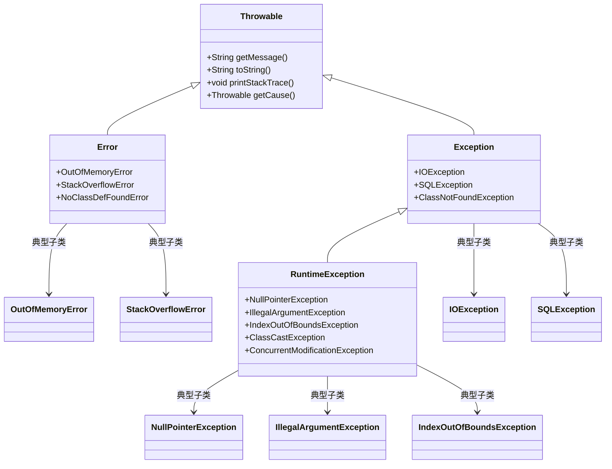
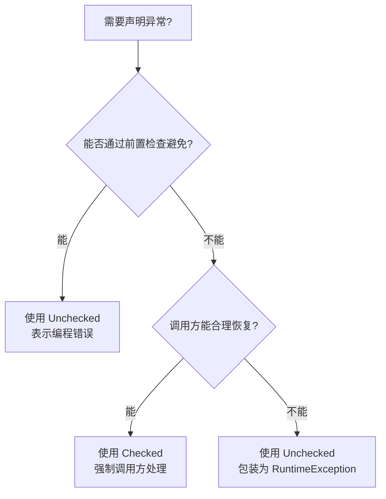
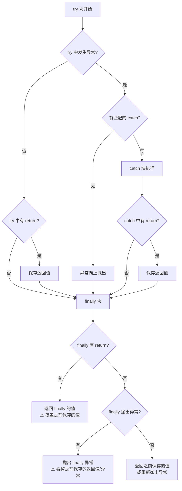
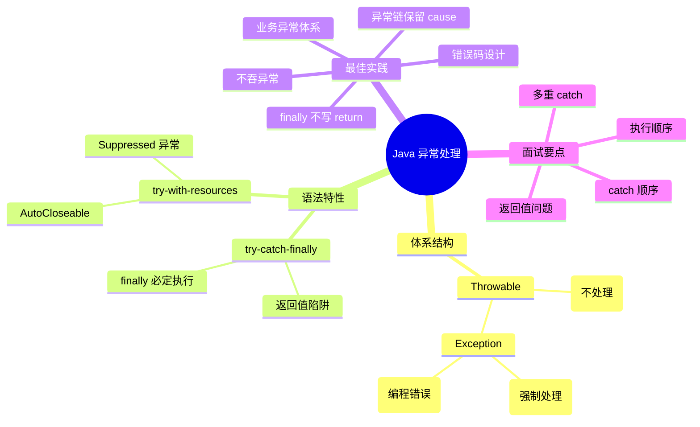

# Java 异常处理完全指南

异常处理是 Java 语言中最重要也最容易被误解的特性之一。本文从异常体系的设计哲学出发，深入到执行细节和最佳实践，帮助你彻底掌握这一核心知识点。

## 异常体系全貌

Java 的异常体系以 `Throwable` 为根，分为两大分支：`Error` 和 `Exception`。`Exception` 又进一步分为受检异常（Checked Exception）和非受检异常（Unchecked Exception）。



### 三层分类

| 层级 | 类别 | 编译器检查 | 典型场景 |
|------|------|-----------|---------|
| `Error` | JVM 级别错误 | 否 | 内存溢出、栈溢出 |
| `Checked Exception` | 受检异常 | 是（必须处理） | IO 操作、数据库访问 |
| `Unchecked Exception` | 非受检异常 | 否 | 空指针、参数非法 |

::: tip 核心区别
`Error` 通常是程序无法恢复的严重问题，不应被 `catch`。`Checked Exception` 强制调用方处理，`Unchecked Exception` 通常表示编程错误。
:::

## Checked vs Unchecked 的设计哲学

### Checked Exception 的初衷

Java 的设计者（James Gosling）认为：**如果某个方法可能失败，调用者必须知道并处理这种可能性**。这是"契约式设计"的体现。

```java
// Checked: 调用方必须处理 FileNotFoundException
public void readFile(String path) throws FileNotFoundException {
    FileInputStream fis = new FileInputStream(path);
}
```

### Unchecked Exception 的定位

`RuntimeException` 及其子类表示**编程错误**——调用方只要正确使用 API，就不会触发这类异常。

```java
// Unchecked: 传 null 是编程错误，调用方应确保参数合法
public int calculate(List<Integer> numbers) {
    // 如果 numbers 为 null，抛出 NullPointerException
    return numbers.stream().mapToInt(i -> i).sum();
}
```

### 何时使用哪种异常？



**Checked 适用场景**：
- 文件不存在但可以提示用户重新选择
- 网络超时但可以重试
- 数据库连接失败但可以切换数据源

**Unchecked 适用场景**：
- 传入 `null` 参数
- 数组越界访问
- 类型转换错误
- 非法参数值

::: warning 实践建议
现代 Java 框架（Spring、Hibernate）普遍倾向于使用 Unchecked Exception。原因是 Checked Exception 容易导致异常传播链上的每个方法都被 `throws` 污染，代码变得冗长且难以维护。
:::

## try-catch-finally 执行顺序

这是面试中的高频考点。理解 JVM 对 finally 的处理规则至关重要。

### 基本执行流程

```java
public static String test() {
    try {
        System.out.println("try");
        return "try-return";
    } catch (Exception e) {
        System.out.println("catch");
        return "catch-return";
    } finally {
        System.out.println("finally");
    }
}
// 输出：
// try
// finally
// 返回值："try-return"
```

::: important 核心规则
**finally 块一定会执行**（除了 `System.exit(0)`、虚拟机崩溃、线程被杀死等极端情况）。即使 try 或 catch 中有 `return` 语句，finally 也会在 return 之前执行。
:::

### finally 修改返回值的陷阱

```java
public static int trickyReturn() {
    int result = 0;
    try {
        result = 1;
        return result;  // JVM 将 result 的值 1 保存到局部变量表
    } finally {
        result = 2;     // 修改的是原始变量，不影响已保存的返回值
        System.out.println("finally: " + result);  // 输出 finally: 2
    }
}
// 返回值是 1，不是 2！
```

**原因**：JVM 在执行 `return` 时，会将返回值压入操作数栈（或保存到局部变量）。`finally` 中对原始变量的修改不会影响已保存的返回值。

但如果是引用类型：

```java
public static List<String> trickyReference() {
    List<String> list = new ArrayList<>();
    try {
        list.add("try");
        return list;  // 返回的是引用，不是值拷贝
    } finally {
        list.add("finally");  // 修改的是同一个对象
    }
}
// 返回的 list 包含 ["try", "finally"]
```

### finally 中也有 return

```java
public static int finallyReturn() {
    try {
        return 1;
    } finally {
        return 2;  // 警告: finally block does not complete normally
    }
}
// 返回值是 2，try 中的 return 被覆盖
```

::: danger 强烈禁止
**永远不要在 finally 中写 return 语句**。这会覆盖 try/catch 中的返回值，还会吞掉未处理的异常，使调试变得极其困难。
:::

### finally 中抛出异常

```java
public static void finallyThrows() {
    try {
        throw new RuntimeException("try 异常");
    } finally {
        throw new RuntimeException("finally 异常");
    }
}
// 结果：try 中的异常被丢弃，只抛出 finally 的异常
```

这是**异常丢失**的典型场景。在 Java 7 之后，被丢弃的异常可以通过 `Throwable.getSuppressed()` 获取（在 try-with-resources 场景下）。

### 完整执行顺序图



## try-with-resources

Java 7 引入的 `try-with-resources` 语法彻底简化了资源管理，消除了 finally 中冗余的关闭逻辑。

### 基本用法

```java
// Java 7 之前的写法
public String readFromFile(String path) throws IOException {
    BufferedReader reader = null;
    try {
        reader = new BufferedReader(new FileReader(path));
        return reader.readLine();
    } finally {
        if (reader != null) {
            try {
                reader.close();  // close 也可能抛异常！
            } catch (IOException e) {
                // 被吞掉的异常
            }
        }
    }
}

// Java 7+ 的写法
public String readFromFile(String path) throws IOException {
    try (BufferedReader reader = new BufferedReader(new FileReader(path))) {
        return reader.readLine();
    }
    // reader 自动关闭，无需 finally
}
```

### AutoCloseable 接口

任何实现了 `AutoCloseable` 接口的资源都可以在 try-with-resources 中使用：

```java
public interface AutoCloseable {
    void close() throws Exception;
}

// 自定义资源类
public class MyResource implements AutoCloseable {
    private final String name;

    public MyResource(String name) {
        this.name = name;
        System.out.println("打开资源: " + name);
    }

    public void doWork() {
        System.out.println("使用资源: " + name);
    }

    @Override
    public void close() {
        System.out.println("关闭资源: " + name);
    }
}

// 使用
try (MyResource r1 = new MyResource("资源1");
     MyResource r2 = new MyResource("资源2")) {
    r1.doWork();
    r2.doWork();
}
// 关闭顺序：先 r2，后 r1（后声明的先关闭）
```

### 编译后的字节码展开

编译器会将 try-with-resources 转换为 try-finally 结构。以下代码：

```java
try (MyResource r = new MyResource("test")) {
    r.doWork();
} catch (Exception e) {
    throw e;
}
```

编译后等价于：

```java
MyResource r = new MyResource("test");
try {
    r.doWork();
} catch (Exception e) {
    // 如果 close 也抛异常，原异常作为 suppressed
    try {
        r.close();
    } catch (Exception closeException) {
        e.addSuppressed(closeException);
    }
    throw e;
}
try {
    r.close();
} catch (Exception closeException) {
    throw closeException;
}
```

::: tip 关键细节
1. 资源的关闭顺序与声明顺序**相反**（栈式关闭）
2. 如果 try 块和 close() 都抛出异常，close 的异常会被添加到主异常的 suppressed 列表中
3. 可以通过 `Throwable.getSuppressed()` 获取被抑制的异常
:::

### 多资源的异常处理

```java
try (Connection conn = dataSource.getConnection();
     PreparedStatement ps = conn.prepareStatement(sql);
     ResultSet rs = ps.executeQuery()) {
    // 如果这里抛异常
    while (rs.next()) {
        // 处理结果
    }
}
// 如果 query() 抛异常：
// 1. rs.close() 抛异常 → 作为 suppressed 添加到主异常
// 2. ps.close() 抛异常 → 作为 suppressed 添加到主异常
// 3. conn.close() 抛异常 → 作为 suppressed 添加到主异常
```

## 自定义异常的最佳实践

### 业务异常体系设计

一个良好的业务异常体系应该满足：分类清晰、信息丰富、易于扩展。

```java
// === 基础异常类 ===
public class BaseException extends RuntimeException {
    private final String errorCode;
    private final String errorMessage;

    public BaseException(String errorCode, String errorMessage) {
        super(String.format("[%s] %s", errorCode, errorMessage));
        this.errorCode = errorCode;
        this.errorMessage = errorMessage;
    }

    public BaseException(String errorCode, String errorMessage, Throwable cause) {
        super(String.format("[%s] %s", errorCode, errorMessage), cause);
        this.errorCode = errorCode;
        this.errorMessage = errorMessage;
    }

    public String getErrorCode() { return errorCode; }
    public String getErrorMessage() { return errorMessage; }
}

// === 业务异常枚举 ===
public enum ErrorCode {
    // 通用错误 1xxxx
    PARAM_INVALID("10001", "参数校验失败"),
    PARAM_MISSING("10002", "缺少必要参数"),

    // 用户模块 2xxxx
    USER_NOT_FOUND("20001", "用户不存在"),
    USER_PASSWORD_ERROR("20002", "密码错误"),
    USER_ALREADY_EXISTS("20003", "用户已存在"),
    USER_ACCOUNT_LOCKED("20004", "账户已锁定"),

    // 订单模块 3xxxx
    ORDER_NOT_FOUND("30001", "订单不存在"),
    ORDER_STATUS_INVALID("30002", "订单状态异常"),
    ORDER_PAYMENT_FAILED("30003", "支付失败");

    private final String code;
    private final String message;

    ErrorCode(String code, String message) {
        this.code = code;
        this.message = message;
    }

    public String getCode() { return code; }
    public String getMessage() { return message; }
}

// === 具体业务异常 ===
public class BusinessException extends BaseException {
    public BusinessException(ErrorCode errorCode) {
        super(errorCode.getCode(), errorCode.getMessage());
    }

    public BusinessException(ErrorCode errorCode, Throwable cause) {
        super(errorCode.getCode(), errorCode.getMessage(), cause);
    }

    public BusinessException(ErrorCode errorCode, String detail) {
        super(errorCode.getCode(), errorCode.getMessage() + ": " + detail);
    }
}
```

### 使用示例

```java
@Service
public class UserService {
    public User getUser(Long id) {
        if (id == null) {
            throw new BusinessException(ErrorCode.PARAM_MISSING, "userId");
        }
        User user = userRepository.findById(id);
        if (user == null) {
            throw new BusinessException(ErrorCode.USER_NOT_FOUND);
        }
        if (user.isLocked()) {
            throw new BusinessException(ErrorCode.USER_ACCOUNT_LOCKED);
        }
        return user;
    }
}

@RestControllerAdvice
public class GlobalExceptionHandler {
    @ExceptionHandler(BusinessException.class)
    public ResponseEntity<ApiResponse<Void>> handleBusinessException(BusinessException e) {
        return ResponseEntity
            .status(HttpStatus.BAD_REQUEST)
            .body(ApiResponse.error(e.getErrorCode(), e.getErrorMessage()));
    }
}
```

### 自定义异常的设计原则

| 原则 | 说明 |
|------|------|
| 继承 `RuntimeException` | 避免污染调用链，简化代码 |
| 包含错误码 | 方便前端和国际化的错误展示 |
| 保留异常链 | 传递原始 cause，方便排查 |
| 不可变设计 | 异常对象创建后不应被修改 |
| 有意义的消息 | 面向开发者的诊断信息，不是面向用户的 |

## 异常链（Exception Chaining）

### 什么是异常链

异常链允许你将一个异常包装成另一个异常，同时保留原始异常的原因（cause）。这对于在架构的不同层次间转换异常类型特别有用。

```java
public class OrderService {
    public Order createOrder(CreateOrderRequest request) {
        try {
            // 调用库存服务
            inventoryService.deductStock(request.getProductId(), request.getQuantity());
            // 创建订单
            return orderRepository.save(new Order(request));
        } catch (RemoteServiceException e) {
            // 将底层技术异常转换为业务异常，同时保留原因
            throw new BusinessException(
                ErrorCode.ORDER_STATUS_INVALID,
                "库存扣减失败",
                e  // cause
            );
        }
    }
}
```

### 异常链的传递

```java
try {
    orderService.createOrder(request);
} catch (BusinessException e) {
    // 获取根因
    Throwable cause = e.getCause();
    if (cause instanceof RemoteServiceException) {
        // 处理远程服务调用失败
        log.error("远程服务调用失败: {}", cause.getMessage());
    }
    // 打印完整异常链
    e.printStackTrace();
    // 输出：
    // com.example.BusinessException: [30002] 订单状态异常: 库存扣减失败
    //     at com.example.OrderService.createOrder(OrderService.java:15)
    // Caused by: com.example.RemoteServiceException: Connection timeout
    //     at com.example.InventoryService.deductStock(InventoryService.java:42)
    // Caused by: java.net.SocketTimeoutException: timeout
    //     at java.net.SocketInputStream.socketRead0(Native Method)
}
```

### 异常丢失的常见坑

**坑 1：finally 中抛出异常**

```java
// ❌ try 中的异常被 finally 中的异常覆盖
try {
    throw new SQLException("数据库错误");
} finally {
    throw new RuntimeException("关闭连接失败");  // SQLException 丢失！
}

// ✅ 使用 addSuppressed 保留被覆盖的异常
try {
    throw new SQLException("数据库错误");
} catch (SQLException e) {
    try {
        connection.close();
    } catch (Exception closeEx) {
        e.addSuppressed(closeEx);  // 保留关闭异常
    }
    throw e;
}
```

**坑 2：catch 中捕获了过宽的异常**

```java
// ❌ 吞掉了所有异常，什么信息都没留下
try {
    riskyOperation();
} catch (Exception e) {
    // 什么都没做！异常被静默吞掉
}

// ✅ 至少记录日志
try {
    riskyOperation();
} catch (Exception e) {
    log.error("操作失败", e);
    throw new BusinessException(ErrorCode.INTERNAL_ERROR, e);
}
```

**坑 3：在日志中只记录 message 不记录 stack trace**

```java
// ❌ 只记录了消息，丢失了堆栈信息
log.error("操作失败: " + e.getMessage());

// ✅ 传递异常对象，保留完整堆栈
log.error("操作失败", e);
```

**坑 4：覆盖 getMessage() 但丢失原始信息**

```java
// ❌ 只返回了自定义信息，丢失了 cause 的信息
public class BadException extends RuntimeException {
    @Override
    public String getMessage() {
        return "自定义错误信息";  // cause 的信息丢失
    }
}

// ✅ 保留原始信息
public class GoodException extends RuntimeException {
    public GoodException(String message, Throwable cause) {
        super(message, cause);  // getMessage() 返回 "message" + cause 信息
    }
}
```

## 常见面试陷阱

### catch 顺序问题

```java
try {
    int[] arr = new int[1];
    arr[2] = 10;
} catch (RuntimeException e) {     // 父类
    System.out.println("RuntimeException");
} catch (ArrayIndexOutOfBoundsException e) {  // 子类
    System.out.println("ArrayIndexOutOfBoundsException");
}
// 编译错误！子类 catch 必须在父类之前
```

**规则**：catch 块的顺序必须从具体（子类）到通用（父类）。编译器会检查这一点。

### 多重 catch（Java 7+）

```java
// Java 7 之前
try {
    // ...
} catch (IOException e) {
    log.error("IO 错误", e);
} catch (SQLException e) {
    log.error("SQL 错误", e);
}

// Java 7+ 多重 catch
try {
    // ...
} catch (IOException | SQLException e) {
    log.error("IO/SQL 错误", e);
    // 注意：e 的类型是 IOException | SQLException 的最近公共父类
    // 即 e 是 final 的，不能重新赋值
}
```

### Suppressed Exceptions

```java
try (MyResource r = new MyResource("test")) {
    throw new RuntimeException("主异常");
} finally {
    // try-with-resources 的 close() 异常会被 suppressed
}

// 等价于
try {
    MyResource r = new MyResource("test");
    try {
        throw new RuntimeException("主异常");
    } finally {
        try {
            r.close();  // 如果这里也抛异常
        } catch (Exception suppressed) {
            // 被添加到主异常的 suppressed 列表
            // 可以通过 getSuppressed() 获取
        }
    }
}
```

```java
// 获取 suppressed 异常
try (Resource1 r1 = new Resource1();
     Resource2 r2 = new Resource2()) {
    throw new RuntimeException("主异常");
} catch (Exception e) {
    System.out.println("主异常: " + e.getMessage());
    for (Throwable suppressed : e.getSuppressed()) {
        System.out.println("被抑制的异常: " + suppressed.getMessage());
    }
}
```

### 经典面试题

**题目 1**：以下代码输出什么？

```java
public static int test() {
    int i = 0;
    try {
        i++;
        return i;
    } finally {
        i++;
    }
}
// 返回 1。try 中 return 时保存了 i=1，finally 中 i++ 不会影响返回值。
```

**题目 2**：以下代码输出什么？

```java
public static void test2() {
    System.out.println("start");
    try {
        System.out.println("try");
        System.exit(0);  // 直接退出 JVM
    } finally {
        System.out.println("finally");  // 不会执行！
    }
}
// 输出：start, try。System.exit(0) 终止 JVM，finally 不执行。
```

**题目 3**：以下代码能编译吗？

```java
public void test3() {
    try {
        throw new IOException();
    } finally {
        throw new RuntimeException();
    }
}
// 可以编译。但调用方捕获到的是 RuntimeException，
// IOException 被 finally 的异常覆盖（在 Java 7 之前丢失，之后可通过 suppressed 获取）。
```

## 总结



| 要点 | 结论 |
|------|------|
| finally 一定执行吗？ | 基本是的，`System.exit()` 等除外 |
| finally 中 return？ | 永远不要这样做 |
| Checked vs Unchecked？ | 现代框架倾向于 Unchecked |
| 自定义异常继承谁？ | 继承 `RuntimeException` |
| 异常信息怎么写？ | 面向开发者，包含上下文 |
| 异常要记录吗？ | 必须记录完整堆栈 `log.error("msg", e)` |
| 异常要传播吗？ | 向上传播，在合适的层次统一处理 |

掌握异常处理不仅仅是记住语法规则，更重要的是理解背后的设计哲学：**让错误可追踪、可恢复、可诊断**。
