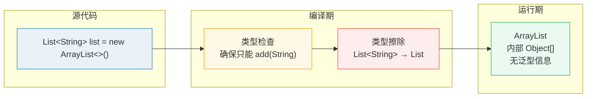
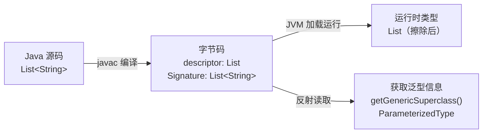
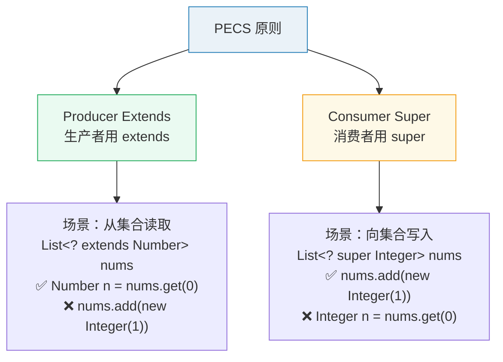
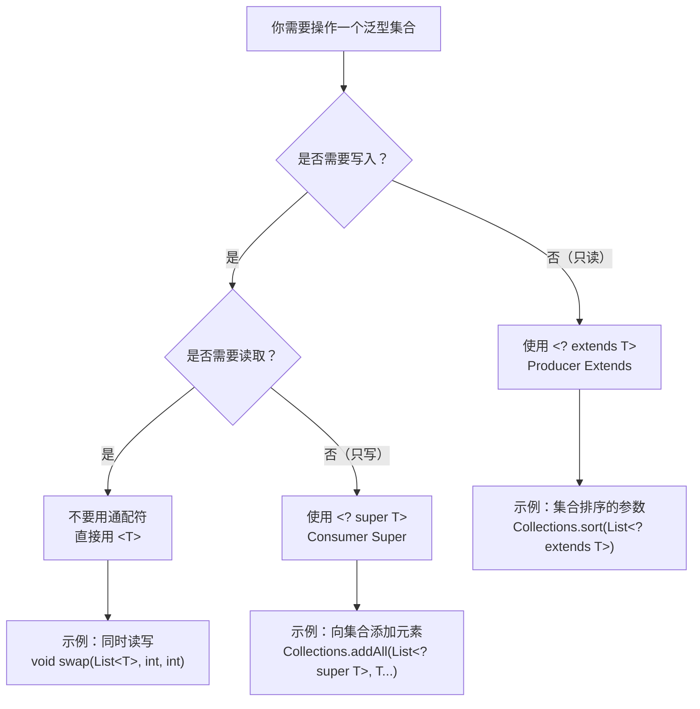
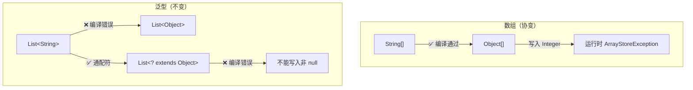

# Java 泛型与注解

> 泛型是 Java 类型系统的基石，注解是元编程的入口。它们看起来简单，但泛型的类型擦除机制、PECS 原则，以及注解在框架中的反射驱动方式，都是理解 Java 生态的关键。

## 泛型——编译时的安全网

### 为什么需要泛型？

```java
// 没有泛型的 Java（JDK 5 之前）—— 什么都能放，什么都能取
List list = new ArrayList();
list.add("hello");
list.add(123);
String s = (String) list.get(1);  // 运行时 ClassCastException！

// 有泛型——编译时就发现问题
List<String> list = new ArrayList<>();
list.add("hello");
// list.add(123);  // 编译错误！
String s = list.get(0);  // 不需要强转
```

泛型的核心价值：**把运行时的 ClassCastException 提前到编译期**。

### 类型擦除——泛型只存在于编译期

这是 Java 泛型最大的"坑"，也是和其他语言（C#、Kotlin）泛型最大的区别：



```java
// 你写的代码
public class Box<T> {
    private T value;
    public void set(T value) { this.value = value; }
    public T get() { return value; }
}

// 编译后的字节码（类型参数被擦除为 Object）
public class Box {
    private Object value;
    public void set(Object value) { this.value = value; }
    public Object get() { return value; }
}
```

**这意味着什么？**

```java
// 1. 运行时无法区分 List<String> 和 List<Integer>
List<String> strings = new ArrayList<>();
List<Integer> integers = new ArrayList<>();
System.out.println(strings.getClass() == integers.getClass());  // true！都是 ArrayList

// 2. 不能用 instanceof 检查泛型类型
// if (obj instanceof List<String>) {}  // 编译错误
if (obj instanceof List<?>) {}  // 可以

// 3. 不能创建泛型数组
// List<String>[] array = new List<String>[10];  // 编译错误
// 因为擦除后变成 List[]，类型不安全

// 4. 不能实例化类型参数
// public <T> T create() { return new T(); }  // 编译错误
public <T> T create(Class<T> clazz) throws Exception {
    return clazz.getDeclaredConstructor().newInstance();
}
```

::: tip 为什么 Java 用类型擦除而不是像 C# 那样保留泛型类型？
为了向后兼容。JDK 5 引入泛型时，需要让新旧代码能互操作。泛型信息被擦除后，编译后的 class 文件和 JDK 5 之前的代码完全兼容。这是 Java"兼容性至上"哲学的典型体现。
:::

#### 类型擦除的底层原理——Signature 属性

虽然泛型在运行时被擦除了，但 Java 并没有完全丢弃泛型信息。编译器会在字节码中保留一个 **Signature 属性**，记录原始的泛型签名，供反射使用。

```java
// 编译下面的类
public class GenericDemo {
    public List<String> names;
    public Map<String, Integer> ages;
}
```

通过 `javap -v` 查看，可以看到字节码中包含 Signature 属性：

```
  // names 字段
  private java.util.List names;
    descriptor: Ljava/util/List;
    Signature: #7                           // Ljava/util/List<Ljava/lang/String;>;

  // ages 字段
  private java.util.Map ages;
    descriptor: Ljava/util/Map;
    Signature: #9                           // Ljava/util/Map<Ljava/lang/String;Ljava/lang/Integer;>;
```

- **descriptor**：擦除后的类型（`List`、`Map`），运行时实际使用
- **Signature**：保留的泛型签名（`List<String>`、`Map<String, Integer>`），供反射读取



反射可以通过 `getGenericReturnType()`、`getGenericParameterTypes()` 等方法读取 Signature：

```java
import java.lang.reflect.*;
import java.util.*;

public class ReflectionGeneric {
    public Map<String, Integer> getMap() { return null; }

    public static void main(String[] args) throws Exception {
        Method method = ReflectionGeneric.class.getMethod("getMap");

        // getReturnType() 返回擦除后的类型
        Class<?> returnType = method.getReturnType();
        System.out.println(returnType);  // interface java.util.Map

        // getGenericReturnType() 返回带泛型的类型
        Type genericType = method.getGenericReturnType();
        System.out.println(genericType);  // java.util.Map<java.lang.String, java.lang.Integer>

        if (genericType instanceof ParameterizedType pt) {
            // 获取实际类型参数
            Type[] typeArgs = pt.getActualTypeArguments();
            System.out.println("Key: " + typeArgs[0]);    // class java.lang.String
            System.out.println("Value: " + typeArgs[1]);  // class java.lang.Integer
        }
    }
}
```

::: warning 注意边界
Signature 只在类、字段、方法的声明处保留。局部变量的泛型信息（如方法内 `List<String> list = ...`）不会被保留到字节码中，运行时无法通过反射获取。
:::

#### TypeToken——绕过类型擦除的经典技巧

既然泛型被擦除了，运行时怎么拿到 `List<String>` 的类型？答案是 **匿名内部类 + 反射**：

```java
import java.lang.reflect.ParameterizedType;
import java.lang.reflect.Type;

/**
 * 模拟 Guava TypeToken 的核心原理
 * 利用匿名内部类在编译时保留泛型签名，通过反射在运行时获取
 */
public abstract class TypeReference<T> {

    private final Type type;

    protected TypeReference() {
        // 获取当前类的父类的泛型类型参数
        // 例如 new TypeReference<List<String>>() {}
        // getGenericSuperclass() 返回 TypeReference<List<String>>
        // getActualTypeArguments()[0] 返回 List<String>
        Type superClass = getClass().getGenericSuperclass();
        if (superClass instanceof ParameterizedType pt) {
            this.type = pt.getActualTypeArguments()[0];
        } else {
            throw new RuntimeException("Missing type parameter.");
        }
    }

    public Type getType() {
        return type;
    }
}
```

使用示例：

```java
// 创建匿名内部类，泛型信息被保留在父类的 Signature 中
TypeReference<List<String>> stringListType = new TypeReference<List<String>>() {};
System.out.println(stringListType.getType());
// 输出：java.util.List<java.lang.String>

TypeReference<Map<String, Integer>> mapType = new TypeReference<Map<String, Integer>>() {};
System.out.println(mapType.getType());
// 输出：java.util.Map<java.lang.String, java.lang.Integer>
```

::: tip 为什么必须是匿名内部类？
`new TypeReference<List<String>>() {}` 创建了一个继承自 `TypeReference<List<String>>` 的匿名内部类。编译器必须把这个泛型信息写入 class 文件的 Signature 属性，否则父类无法正确链接。这就是"搭便车"——我们利用编译器必须保留父类泛型签名的机制，间接保留了子类传入的类型参数。
:::

### 泛型边界——约束类型参数的范围

#### 单一边界

```java
// T 必须是 Number 或其子类，这样就可以调用 Number 的方法
public static <T extends Number> double sum(List<T> list) {
    double total = 0;
    for (T num : list) {
        total += num.doubleValue();  // ✅ 可以调用 Number 的方法
    }
    return total;
}
```

#### 多重边界（Multiple Bounds）

Java 支持为类型参数指定多个上界，用 `&` 连接：

```java
// T 必须同时满足 Number 和 Serializable
public static <T extends Number & Serializable> void process(T value) {
    double d = value.doubleValue();        // ✅ Number 的方法
    // 可以安全地序列化 value（因为实现了 Serializable）
}

// ⚠️ 注意：类必须放在第一个，接口放在后面
// <T extends Serializable & Number>  // ❌ 编译错误！类 Number 必须在前面
// <T extends Number & Serializable>  // ✅ 正确
```

多重边界的擦除规则：**擦除到第一个边界的类型**。

```java
// <T extends Number & Serializable> 擦除后变成 Number（不是 Object）
// 这意味着你可以调用 Number 的方法而不需要强转

public class MultiBound<T extends Number & Serializable> {
    private T value;
    // 擦除后：private Number value;
    // 而不是 private Object value;
}
```

#### 自限定类型（Self-Bound Generics）

`<T extends Comparable<T>>` 是一种非常常见的泛型模式——类型参数本身必须能与自己比较：

```java
// 自限定类型：T 必须实现 Comparable<T>，即 T 必须能和 T 类型的对象比较
public static <T extends Comparable<T>> T max(List<T> list) {
    if (list.isEmpty()) throw new IllegalArgumentException("empty list");

    T max = list.get(0);
    for (int i = 1; i < list.size(); i++) {
        if (list.get(i).compareTo(max) > 0) {  // ✅ 可以调用 compareTo(T)
            max = list.get(i);
        }
    }
    return max;
}

// 使用
List<Integer> nums = Arrays.asList(3, 1, 4, 1, 5);
System.out.println(max(nums));  // 5

List<String> names = Arrays.asList("Charlie", "Alice", "Bob");
System.out.println(max(names));  // Charlie（字典序最大）
```

自限定类型在 Java 标准库中大量使用：`Comparable<T>`、`Enum<E extends Enum<E>>`、`Comparable<? super T>` 等。

### PECS 原则——泛型通配符的核心法则

这是《Effective Java》中最经典的法则之一，搞懂了它就搞懂了泛型通配符：



```
PECS = Producer Extends, Consumer Super

Producer（生产者）——从集合中读取数据 → 用 <? extends T>
Consumer（消费者）——向集合中写入数据 → 用 <? super T>

记忆口诀：读取用 extends，写入用 super
```

```java
// 场景1：你只需要从集合中读取（生产者）
public static double sum(List<? extends Number> list) {
    double total = 0;
    for (Number num : list) {
        total += num.doubleValue();  // ✅ 可以读取，因为都是 Number 的子类
    }
    // list.add(10);  // ❌ 不能写入！编译器不知道集合实际存的是什么类型
    return total;
}

// 可以传入 List<Integer>、List<Double>、List<Long>...
sum(Arrays.asList(1, 2, 3));
sum(Arrays.asList(1.1, 2.2, 3.3));

// 场景2：你需要向集合中写入（消费者）
public static void addNumbers(List<? super Integer> list) {
    list.add(1);       // ✅ 可以写入 Integer
    list.add(2);
    // Integer i = list.get(0);  // ❌ 不能读取为 Integer！只能读取为 Object
    Object obj = list.get(0);  // ✅
}

// 可以传入 List<Integer>、List<Number>、List<Object>...
List<Number> numbers = new ArrayList<>();
addNumbers(numbers);
```

::: warning 既读又写怎么办？
如果你的方法既要从集合中读取，又要向集合中写入，那就**不要用通配符**，直接用精确类型 `List<T>`。通配符的代价就是丧失某一方向的操作能力。
:::

#### PECS 决策流程图



### 通配符捕获（Wildcard Capture）

通配符 `?` 的一个限制是你不能把数据写入 `?` 类型的集合（除了 null）。但有时候你确实需要临时操作它，这时候可以用 **捕获辅助方法**：

```java
// 问题：你想交换一个通配符列表中的两个元素
// 但你无法向 List<?> 中写入任何非 null 的值
public static void swap(List<?> list, int i, int j) {
    // list.set(i, list.get(j));  // ❌ 编译错误！不能向 List<?> 写入
    swapHelper(list, i, j);       // ✅ 通过捕获辅助方法
}

// 捕获辅助方法：用一个具名类型参数 T 来"捕获" ?
private static <T> void swapHelper(List<T> list, int i, int j) {
    list.set(i, list.get(j));  // ✅ T 是具体类型，可以读写
    list.set(j, list.get(i));  // 需要用临时变量避免覆盖
}

// 更安全的 swapHelper
private static <T> void swapHelper(List<T> list, int i, int j) {
    T temp = list.get(i);
    list.set(i, list.get(j));
    list.set(j, temp);
}
```

::: tip 捕获辅助方法的本质
Java 编译器在推断泛型方法调用时，会把通配符 `?` 捕获为一个未知的具名类型变量。`swapHelper(list, i, j)` 中的 `list` 是 `List<?>`，编译器推断 `T` 为这个未知的具体类型，于是 `List<T>` 就可以正常读写了。这是一种"以毒攻毒"的技巧。
:::

### 泛型与数组——历史遗留的矛盾

Java 的数组是**协变**的（covariant），而泛型是**不变**的（invariant）。这个矛盾是 Java 类型系统中最令人困惑的设计之一。

```java
// 数组是协变的：String[] 可以赋给 Object[]
String[] strings = new String[3];
Object[] objects = strings;      // ✅ 编译通过
objects[0] = "hello";            // ✅ String
objects[1] = 42;                 // ❌ 运行时 ArrayStoreException！
// 数组在运行时知道自己的元素类型，会在写入时检查

// 泛型是不变的：List<String> 不能赋给 List<Object>
List<String> stringList = new ArrayList<>();
// List<Object> objectList = stringList;  // ❌ 编译错误！
List<? extends Object> objectList = stringList;  // ✅ 通配符可以
// objectList.add(42);  // ❌ 不能写入，从而避免了类型不安全
```



**为什么 `List<String>[]` 不合法？**

```java
// 如果允许泛型数组：
// List<String>[] stringLists = new List<String>[1];
// 擦除后变成 List[] stringLists = new List[1];
// Object[] objects = stringLists;       // 数组协变
// objects[0] = new ArrayList<Integer>();  // 运行时不报错！
// String s = stringLists[0].get(0);      // ClassCastException！
// 数组在运行时无法检查泛型类型（因为被擦除了），所以无法保证类型安全

// 解决方案：使用通配符数组（安全但不太方便）
List<?>[] stringLists = new List<?>[1];
stringLists[0] = new ArrayList<String>();   // ✅
// stringLists[0].add("hello");  // ❌ 但不能向 List<?> 中添加元素
```

::: warning 最佳实践
尽量避免泛型数组和数组的协变特性。优先使用 `List<E>` 而不是 `E[]`，用 `List.of(...).toArray(new T[0])` 来转换，用 `@SuppressWarnings("unchecked")` 并仔细验证类型安全。
:::

### Java 10+ var 与泛型

Java 10 引入了 `var` 局部变量类型推断，但它和泛型的钻石操作符有一个容易踩的坑：

```java
// ✅ 没有问题：左侧类型明确推断
var list1 = new ArrayList<String>();
// 推断为 ArrayList<String>

// ⚠️ 有问题：钻石操作符 + var = Object 类型！
var list2 = new ArrayList<>();
// 推断为 ArrayList<Object>，不是你期望的 ArrayList<String>！
// list2.add("hello");  // 可以
// String s = list2.get(0);  // ✅ 但类型安全靠你自己保证

// 为什么？钻石操作符要求编译器从上下文推断类型
// 但 var 没有目标类型，编译器只能推断为最宽的类型
```

```java
// 正确做法：显式指定类型参数
var stringList = new ArrayList<String>();     // ✅ ArrayList<String>

// 或者不用 var
ArrayList<String> stringList = new ArrayList<>();  // ✅ 更清晰

// 使用 Stream 的场景更安全
var names = List.of("Alice", "Bob", "Charlie");  // ✅ List<String>
```

::: warning 注意
`var list = new ArrayList<>()` 推断为 `ArrayList<Object>` 而非 `ArrayList<String>`。这是 var + 钻石操作符的经典陷阱。如果类型参数很重要，要么显式写出，要么不用 var。
:::

### 桥接方法——类型擦除的补偿

```java
// 编译前的代码
public class StringBox extends Box<String> {
    @Override
    public void set(String value) { super.set(value); }
}

// 类型擦除后，父类 set 变成了 set(Object)
// 子类 set(String) 的参数类型和父类不同了——不是重写！
// 所以编译器自动生成一个"桥接方法"：

// 编译后实际的字节码
public class StringBox extends Box {
    public void set(String value) { super.set(value); }     // 你写的方法

    // 编译器自动生成的桥接方法
    public void set(Object value) { set((String) value); }  // 桥接到你的方法
}
```

### 实际框架应用——Gson/Jackson 的 TypeReference

理解了 TypeToken 原理，就能看懂为什么反序列化需要传递类型信息：

```java
import com.google.gson.*;
import com.google.gson.reflect.TypeToken;
import java.lang.reflect.Type;
import java.util.*;

public class GsonGenericExample {

    // ❌ 错误：直接反序列化为 Map，无法还原自定义类型
    public static void wrong() {
        String json = "[{\"name\":\"Alice\",\"age\":25},{\"name\":\"Bob\",\"age\":30}]";
        Gson gson = new Gson();
        // 默认反序列化为 LinkedTreeMap，不是 User 对象！
        List<?> users = gson.fromJson(json, List.class);
        // users.get(0) 是 LinkedTreeMap，不是 User
    }

    // ✅ 正确：通过 TypeToken 传递泛型类型
    public static void correct() {
        String json = "[{\"name\":\"Alice\",\"age\":25},{\"name\":\"Bob\",\"age\":30}]";
        Gson gson = new Gson();

        // Guava/Gson 的 TypeToken 原理和我们写的 TypeReference 完全一样
        Type userListType = new TypeToken<List<User>>() {}.getType();
        List<User> users = gson.fromJson(json, userListType);
        // users.get(0) 是 User 对象 ✅
        System.out.println(users.get(0).getName());  // Alice
    }

    static class User {
        private String name;
        private int age;
        public String getName() { return name; }
        public int getAge() { return age; }
    }
}
```

Jackson 的 `TypeReference<T>` 原理完全相同：

```java
import com.fasterxml.jackson.core.type.TypeReference;
import com.fasterxml.jackson.databind.ObjectMapper;
import java.util.*;

ObjectMapper mapper = new ObjectMapper();
String json = "[{\"name\":\"Alice\"},{\"name\":\"Bob\"}]";

// 通过匿名内部类捕获泛型类型
List<User> users = mapper.readValue(json, new TypeReference<List<User>>() {});
```

::: tip 为什么框架需要你传类型？
JSON 反序列化时，框架需要知道目标类型才能正确创建对象。`List<User>.class` 不存在（泛型擦除），所以框架提供 `TypeToken` / `TypeReference` 让你通过匿名内部类"携带"类型信息。这是 Java 类型擦除最经典的工作模式。
:::

## 注解——元编程的入口

### 注解的本质

注解不是注释，不是修饰符。注解是**一种特殊的接口**，编译器或运行时可以通过反射读取注解信息来改变程序行为。

```java
// @Override 的定义——本质上就是一个接口
@Target(ElementType.METHOD)
@Retention(RetentionPolicy.SOURCE)
public @interface Override {
}
```

### 四种保留策略

```java
@Retention(RetentionPolicy.SOURCE)   // 只存在于源码中，编译后丢弃
                                       // 例：@Override, @SuppressWarnings
@Retention(RetentionPolicy.CLASS)    // 存在于字节码中，JVM 运行时不可读（默认）
                                       // 用得很少
@Retention(RetentionPolicy.RUNTIME)  // 运行时可通过反射读取
                                       // 例：几乎所有框架注解（@Autowired, @Entity 等）
```

::: tip 判断用哪种 Retention？
如果你只是让编译器做检查（如 @Override），用 SOURCE。如果框架需要在运行时读取注解来改变行为（如 Spring 的 @Autowired），用 RUNTIME。CLASS 几乎不用。
:::

### 自定义注解的实际应用

```java
// 场景：方法执行耗时监控

// 1. 定义注解
@Retention(RetentionPolicy.RUNTIME)
@Target(ElementType.METHOD)
public @interface CostTime {
    String value() default "";
    long warnMs() default 1000;  // 超过多少毫秒打印警告
}

// 2. AOP 切面读取注解（Spring 环境中）
@Aspect
@Component
public class CostTimeAspect {

    @Around("@annotation(costTime)")
    public Object logCostTime(ProceedingJoinPoint joinPoint, CostTime costTime) throws Throwable {
        long start = System.currentTimeMillis();
        try {
            return joinPoint.proceed();
        } finally {
            long cost = System.currentTimeMillis() - start;
            String name = costTime.value().isEmpty()
                ? joinPoint.getSignature().getName()
                : costTime.value();
            if (cost > costTime.warnMs()) {
                log.warn("方法 {} 耗时 {}ms，超过阈值 {}ms", name, cost, costTime.warnMs());
            } else {
                log.info("方法 {} 耗时 {}ms", name, cost);
            }
        }
    }
}

// 3. 使用
@CostTime(value = "查询用户", warnMs = 500)
public User getUserById(Long id) {
    return userRepository.findById(id);
}
```

### 注解 vs 配置文件

```java
// Spring 的演进：XML 配置 → 注解配置 → Spring Boot 自动配置

// XML 时代：集中配置，但 XML 膨胀后难以维护
<bean id="userService" class="com.example.UserService">
    <property name="userRepository" ref="userRepository"/>
</bean>

// 注解时代：配置和代码在一起，但配置分散在各个类中
@Service
public class UserService {
    @Autowired
    private UserRepository userRepository;
}

// Spring Boot：注解 + 约定大于配置 + application.yml
// 最复杂的配置放 yml，简单的用注解
```

::: tip 注解不是万能的
注解适合配置元数据（什么是什么），不适合配置业务逻辑（怎么做）。当注解的参数变得复杂（多层嵌套、条件判断），就该回到配置文件或代码中了。
:::

## 面试高频题

**Q1：什么是类型擦除？有什么影响？**

Java 泛型在编译后会被擦除为原始类型（Object 或上界）。影响：运行时 `List<String>` 和 `List<Integer>` 是同一类型；不能用 `instanceof` 检查泛型；不能创建泛型数组；不能实例化类型参数。

**Q2：什么是 PECS 原则？**

Producer Extends, Consumer Super。从集合中读取（生产者）用 `<? extends T>`，向集合中写入（消费者）用 `<? super T>`。既读又写就用精确类型 `<T>`，不用通配符。

**Q3：`List<?>` 和 `List<Object>` 有什么区别？**

`List<?>` 是未知类型的列表，只能读取为 Object，不能写入（除 null）。`List<Object>` 是明确类型为 Object 的列表，可以读写任何 Object。`List<String>` 可以赋值给 `List<?>`，但不能赋值给 `List<Object>`。

**Q4：泛型信息真的完全被擦除了吗？**

不完全。类、字段、方法声明处的泛型信息通过字节码的 **Signature 属性** 保留了下来，可以通过反射（`getGenericSuperclass()`、`getGenericReturnType()` 等）读取。但局部变量的泛型信息不会保留。

**Q5：TypeToken / TypeReference 的原理是什么？**

通过创建匿名内部类（如 `new TypeToken<List<String>>() {}`），利用编译器必须在字节码中保留父类泛型签名（Signature 属性）的机制，在运行时通过 `getGenericSuperclass()` 反射获取实际类型参数。Gson、Jackson、Guava 都使用了这个技巧。


### 泛型擦除深度解析

#### 类型擦除规则

```java
// 编译前
public class Container<T> {
    private T value;
    public T getValue() { return value; }
    public void setValue(T value) { this.value = value; }
}

// 编译后（类型擦除后）
public class Container {
    private Object value;
    public Object getValue() { return value; }
    public void setValue(Object value) { this.value = value; }
}

// 有上界的情况
public class NumberContainer<T extends Number> {
    private T value;
    // 擦除后 T 变为 Number，而不是 Object
}
```

#### 桥接方法（Bridge Method）

```java
public class StringList extends ArrayList<String> {
    @Override
    public String get(int index) { return super.get(index); }
}

// 编译器自动生成桥接方法（保持多态兼容）
// public Object get(int index) { return get(index); } // 桥接方法，调用原始方法
```

:::warning 类型擦除的常见陷阱
1. **不能创建泛型数组**：`new T[10]` 编译错误，因为擦除后变成 `new Object[10]`
2. **instanceof 不支持泛型**：`if (obj instanceof List<String>)` 编译错误
3. **不能 catch 泛型异常**：`catch (T e)` 编译错误
4. **重载冲突**：`void f(List<String>)` 和 `void f(List<Integer>)` 擦除后签名相同，编译错误
:::

### PECS 原则实战

```java
// PECS: Producer Extends, Consumer Super

// 场景1：从集合读取（生产者）→ extends
public static double sum(Collection<? extends Number> nums) {
    double total = 0;
    for (Number n : nums) total += n.doubleValue(); // 读取为 Number
    return total;
}
// 可以传入 List<Integer>、List<Double>、List<Long>

// 场景2：向集合写入（消费者）→ super
public static void addNumbers(Collection<? super Integer> list) {
    list.add(1);
    list.add(2);
    list.add(3);
}
// 可以传入 List<Integer>、List<Number>、List<Object>

// 场景3：既读又写 → 不用通配符
public static void copy(List<Integer> src, List<Integer> dest) {
    dest.addAll(src);
}

// JDK 源码中的 PECS
// Collections.copy: public static <T> void copy(List<? super T> dest, List<? extends T> src)
// Collections.addAll: public static <T> boolean addAll(Collection<? super T> c, T... elements)
```

### 泛型与反射的交互

```java
// 通过反射绕过泛型检查（⚠️ 不安全，但可以做到）
List<String> strList = new ArrayList<>();
strList.add("hello");

// 利用反射在运行时插入非 String 元素
Method addMethod = List.class.getMethod("add", Object.class);
addMethod.invoke(strList, 123);  // 编译通过，运行通过！
// strList 现在包含 "hello" 和 123
// 后续 strList.get(1) 会导致 ClassCastException

// 获取运行时泛型信息（通过 Signature 属性）
public class GenericType<T> {
    public Type getType() {
        // 匿名子类可以保留泛型信息
        return new TypeReference<T>() {}.getType();
    }
}
// 原理：编译器在字节码的 Signature 属性中保留声明处的泛型信息
```


## 延伸阅读

- 上一篇：[IO/NIO](io.md) — 字节流、字符流、NIO 详解
- 下一篇：[并发编程](concurrency.md) — 线程安全、锁机制、AQS
- [Spring IOC](../spring/ioc.md) — 注解驱动的依赖注入
