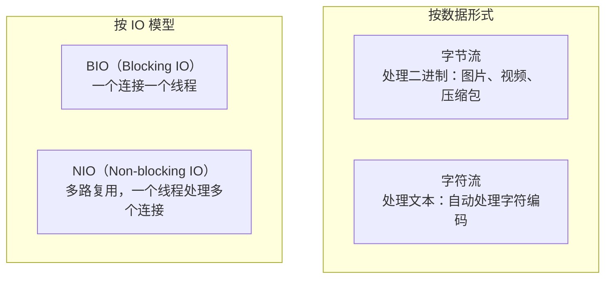
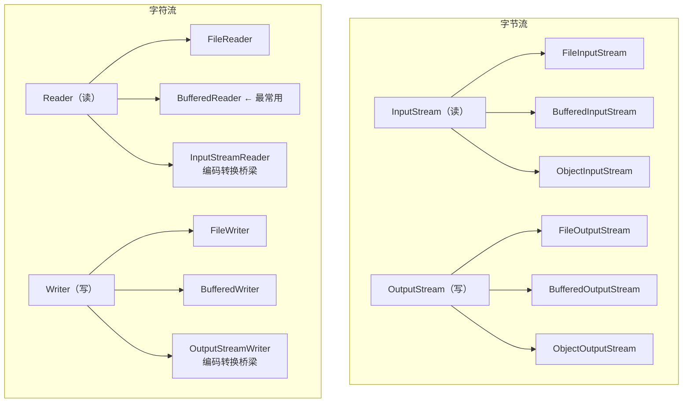

# Java IO/NIO

> Java 的 IO 体系是出了名的复杂——InputStream、OutputStream、Reader、Writer、Buffered、Channel、Buffer、Selector……光是类名就能列出一页纸。但拨开表面的复杂度，核心只有两件事：**数据从哪来、数据到哪去**。这篇文章帮你理清整个 IO 体系的脉络。

## IO 流体系全景





## BIO——Blocking IO

### 为什么 BIO 在高并发下不行？

```java
// BIO 的核心问题：每个连接独占一个线程
// 线程大部分时间在等 IO（阻塞），CPU 利用率极低

// 10000 个并发连接 → 10000 个线程
// 每个线程栈 1MB → 10GB 内存！
// 而且线程上下文切换的开销巨大

ServerSocket server = new ServerSocket(8080);
while (true) {
    Socket socket = server.accept();  // 阻塞，等待连接
    new Thread(() -> {               // 每个连接一个线程！
        InputStream in = socket.getInputStream();
        in.read();  // 阻塞，等待数据
        // 处理...
    }).start();
}
```

### try-with-resources——不要忘了关流

```java
// ❌ 传统写法：finally 里关闭，代码冗长
InputStream in = null;
try {
    in = new FileInputStream("test.txt");
    // 读取...
} finally {
    if (in != null) {
        try { in.close(); } catch (IOException e) { /* ... */ }
    }
}

// ✅ try-with-resources（Java 7+）：自动关闭，代码简洁
try (InputStream in = new FileInputStream("test.txt");
     BufferedReader reader = new BufferedReader(new InputStreamReader(in))) {
    String line;
    while ((line = reader.readLine()) != null) {
        System.out.println(line);
    }
}  // 自动调用 in.close()，即使发生异常也会关闭
```

::: danger 资源泄漏的后果
忘记关闭流会导致文件句柄泄漏。Linux 默认每个进程最多打开 1024 个文件（`ulimit -n`）。在高并发服务中，流不关闭会迅速耗尽文件句柄，导致无法打开新文件、无法建立新连接。**用 try-with-resources，养成习惯。**
:::

### Buffered 流——不要一行一行读文件

```java
// ❌ 无缓冲：每次 read() 都是一次系统调用
try (FileInputStream fis = new FileInputStream("big.txt")) {
    int data;
    while ((data = fis.read()) != -1) {  // 每次读 1 字节！
        // 处理...
    }
}

// ✅ 有缓冲：减少系统调用次数
try (BufferedInputStream bis = new BufferedInputStream(
        new FileInputStream("big.txt"))) {
    byte[] buffer = new byte[8192];  // 8KB 缓冲区
    int len;
    while ((len = bis.read(buffer)) != -1) {
        // 处理 buffer[0..len-1]
    }
}

// ✅ 读文本文件的最佳方式
try (BufferedReader reader = new BufferedReader(
        new FileReader("big.txt"))) {
    String line;
    while ((line = reader.readLine()) != null) {
        // 按行处理
    }
}
```

### 字节流 vs 字符流——什么时候用哪个？

```
用字节流：二进制文件（图片、视频、音频、压缩包、序列化对象）
用字符流：文本文件（txt、csv、json、xml、properties）

规则很简单：如果你需要关心字符编码，用字符流。
如果你不需要关心字符编码（或想自己控制），用字节流。
```

### 字符编码——乱码的根源

```java
// 编码问题是最常见的 IO bug 之一

// ❌ 用 FileReader 读 UTF-8 文件——在 GBK 环境下会乱码
// FileReader 使用平台默认编码（Windows 是 GBK，Linux 是 UTF-8）
try (FileReader reader = new FileReader("utf8.txt")) {
    // 可能乱码！
}

// ✅ 明确指定编码
try (BufferedReader reader = new BufferedReader(
        new InputStreamReader(new FileInputStream("utf8.txt"), StandardCharsets.UTF_8))) {
    // 编码安全
}

// ❌ String.getBytes() 用平台默认编码
byte[] bytes = "中文".getBytes();  // 不安全！

// ✅ 明确指定编码
byte[] bytes = "中文".getBytes(StandardCharsets.UTF_8);
String decoded = new String(bytes, StandardCharsets.UTF_8);
```

::: warning 永远不要依赖平台默认编码
`FileReader`、`FileWriter`、`String.getBytes()` 不带参数时使用平台默认编码，在不同环境下行为不同。**永远显式指定 `StandardCharsets.UTF_8`**。
:::

### 序列化—— Serializable 的高危陷阱

```java
// 实现 Serializable 很简单，但坑很多

// 1. serialVersionUID 不写会怎样？
// 每次修改类（加字段、改方法），编译器会自动生成新的 serialVersionUID
// 旧版本序列化的数据在新版本反序列化时会报 InvalidClassException

public class User implements Serializable {
    private static final long serialVersionUID = 1L;  // 必须写！
    private String name;
    private transient String password;  // transient：不参与序列化
}

// 2. transient 的字段反序列化后是 null/0/false
// 如果需要自定义序列化逻辑，实现 writeObject/readObject
private void writeObject(ObjectOutputStream out) throws IOException {
    out.defaultWriteObject();  // 默认序列化
    // 自定义：比如对 password 加密后再序列化
    out.writeObject(encrypt(password));
}

private void readObject(ObjectInputStream in) throws IOException, ClassNotFoundException {
    in.defaultReadObject();  // 默认反序列化
    // 自定义解密
    this.password = decrypt((String) in.readObject());
}
```

## NIO——Non-blocking IO

### Buffer——NIO 的核心概念

BIO 是面向流的（stream），NIO 是面向缓冲区的（buffer）。区别在于：

```
BIO（流）：
  线程 → 直接从流读/向流写 → 阻塞等待

NIO（缓冲区）：
  线程 → 先把数据读进 Buffer → 再从 Buffer 取数据
  线程 → 先把数据写入 Buffer → Buffer 再写入通道
```

```java
ByteBuffer buffer = ByteBuffer.allocate(1024);

// 写入数据
buffer.put("Hello".getBytes());
System.out.println("写入后: position=" + buffer.position()  // 5
    + ", limit=" + buffer.limit());                        // 1024

// 切换为读模式
buffer.flip();
System.out.println("flip后: position=" + buffer.position()  // 0
    + ", limit=" + buffer.limit());                        // 5

// 读取数据
while (buffer.hasRemaining()) {
    System.out.print((char) buffer.get());
}

// 重置
buffer.clear();  // position=0, limit=capacity，准备再次写入
// buffer.rewind();  // position=0，limit 不变，可以重新读取
// buffer.compact();  // 把未读完的数据移到头部，准备继续写入
```

```
Buffer 的核心属性：
- capacity（容量）：固定不变，分配时确定
- position（位置）：当前读写位置
- limit（限制）：可读写的边界
- 写模式：position 从 0 递增，limit = capacity
- flip()：切换为读模式
- 读模式：position 从 0 递增，limit = 写入的数据量
```

::: tip 直接缓冲区 vs 堆缓冲区
`ByteBuffer.allocateDirect(1024)` 创建堆外内存（直接缓冲区），减少一次 JVM 堆到 Native 内存的拷贝，适合大文件 IO 和网络 IO。代价是分配/回收成本高，不受 GC 管理。`ByteBuffer.allocate(1024)` 创建堆内缓冲区，由 GC 管理，适合小数据量。
:::

### Channel——双向数据通道

```java
// BIO 的流是单向的（InputStream 只能读，OutputStream 只能写）
// NIO 的 Channel 是双向的（既可以读也可以写）

// 文件复制——NIO 方式
try (FileChannel src = FileChannel.open(Paths.get("source.txt"), StandardOpenOption.READ);
     FileChannel dest = FileChannel.open(Paths.get("dest.txt"),
         StandardOpenOption.CREATE, StandardOpenOption.WRITE)) {

    // 方式1：transferTo——零拷贝（最佳性能）
    // 底层利用操作系统的 sendfile 系统调用
    // 数据直接从文件系统缓冲区到目标 Channel，不经过用户空间
    src.transferTo(0, src.size(), dest);

    // 方式2：手动用 Buffer
    // ByteBuffer buffer = ByteBuffer.allocate(8192);
    // while (src.read(buffer) != -1) {
    //     buffer.flip();
    //     dest.write(buffer);
    //     buffer.clear();
    // }
}
```

### Selector——多路复用

Selector 是 NIO 解决 BIO "一个连接一个线程"问题的方案：

```java
// NIO 多路复用：一个线程处理多个连接
Selector selector = Selector.open();
ServerSocketChannel serverChannel = ServerSocketChannel.open();
serverChannel.configureBlocking(false);  // 非阻塞模式
serverChannel.register(selector, SelectionKey.OP_ACCEPT);  // 注册关注的事件

while (true) {
    selector.select();  // 阻塞，直到有事件就绪（有连接、有数据可读等）

    Set<SelectionKey> readyKeys = selector.selectedKeys();
    for (SelectionKey key : readyKeys) {
        if (key.isAcceptable()) {
            // 新连接到来
            SocketChannel channel = serverChannel.accept();
            channel.configureBlocking(false);
            channel.register(selector, SelectionKey.OP_READ);  // 关注读事件
        }
        if (key.isReadable()) {
            // 数据可读
            SocketChannel channel = (SocketChannel) key.channel();
            ByteBuffer buffer = ByteBuffer.allocate(1024);
            int len = channel.read(buffer);
            // 处理数据...
        }
    }
    readyKeys.clear();
}
```

::: tip NIO vs BIO 的本质区别
BIO 是阻塞的：读不到数据就等，线程不能干别的。NIO 是非阻塞的 + 多路复用：一个线程通过 Selector 监听多个 Channel 的事件，哪个 Channel 有数据了就处理哪个。Netty、Tomcat NIO 模式都是基于这个原理。
:::

## NIO.2——现代 Java 的文件操作

### Files 工具类——一个类搞定常见操作

```java
Path path = Paths.get("data/users.json");

// 读写文件——简洁到不像 Java
String content = Files.readString(path);                    // 读全部
List<String> lines = Files.readAllLines(path);             // 按行读
Files.writeString(path, content);                           // 写全部（Java 11+）
Files.write(path, lines, StandardOpenOption.APPEND);        // 追加

// 文件操作
Files.copy(path, Paths.get("backup.json"));                // 复制
Files.move(path, Paths.get("archive/users.json"));          // 移动
Files.deleteIfExists(path);                                 // 删除

// 文件信息
BasicFileAttributes attrs = Files.readAttributes(path, BasicFileAttributes.class);
attrs.creationTime();
attrs.lastModifiedTime();
attrs.size();

// 遍历目录
try (Stream<Path> stream = Files.walk(Paths.get("src"))) {
    stream.filter(Files::isRegularFile)
          .filter(p -> p.toString().endsWith(".java"))
          .forEach(System.out::println);
}

// 读取大文件——流式处理，不会 OOM
try (Stream<String> stream = Files.lines(Paths.get("huge.log"))) {
    stream.filter(line -> line.contains("ERROR"))
          .limit(1000)
          .forEach(System.out::println);
}
```

::: warning Files.readAllLines() 的 OOM 风险
`Files.readAllLines()` 一次性把所有行读入内存。如果文件很大（几 GB），直接 OOM。大文件用 `Files.lines()`（返回 Stream，惰性加载）或 `BufferedReader.readLine()`。
:::

## 面试高频题

**Q1：BIO、NIO、AIO 的区别？**

BIO（Blocking IO）：同步阻塞，一个连接一个线程。NIO（Non-blocking IO）：同步非阻塞 + 多路复用，一个线程处理多个连接（Selector）。AIO（Asynchronous IO）：异步非阻塞，发起 IO 操作后不等待，通过回调或 Future 获取结果（Java 7 的 `AsynchronousFileChannel`）。Netty 基于 NIO 封装，是实际开发中最常用的网络框架。

**Q2：什么是零拷贝？**

传统 IO：数据从磁盘 → 内核缓冲区 → 用户空间缓冲区 → Socket 缓冲区 → 网卡。4 次数据拷贝 + 4 次上下文切换。零拷贝（`transferTo` / `sendfile`）：数据从磁盘 → 内核缓冲区 → 网卡。2 次拷贝 + 2 次上下文切换。省去了用户空间的一次拷贝。

**Q3：为什么 BufferedReader 比 FileReader 快？**

FileReader 每次调用 `read()` 都是一次系统调用，系统调用开销大。BufferedReader 内部维护了一个 char 缓冲区（默认 8KB），先从系统一次读一大块数据到缓冲区，后续 `read()` 从缓冲区取，减少了系统调用次数。

## 延伸阅读

- 上一篇：[语法基础](syntax.md) — 数据类型、运算符、字符串
- 下一篇：[泛型与注解](generics.md) — 类型擦除、PECS 原则
- [Java 高级特性](../java-advanced/jvm.md) — JVM 原理、内存模型
