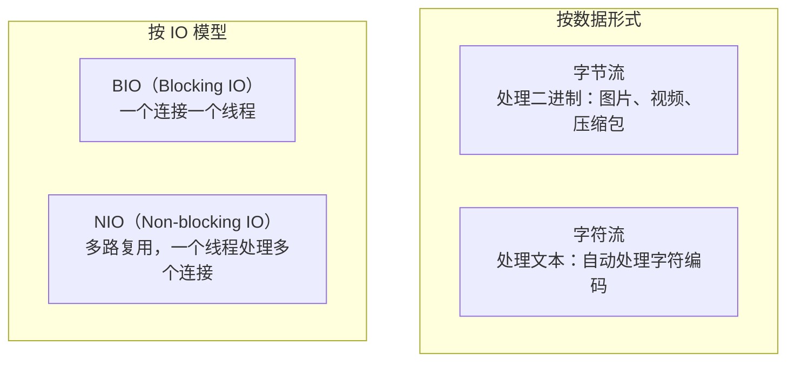
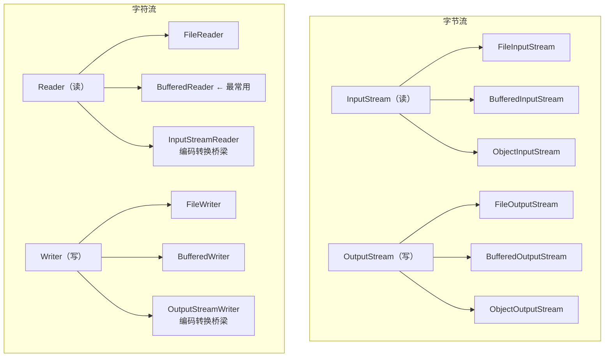
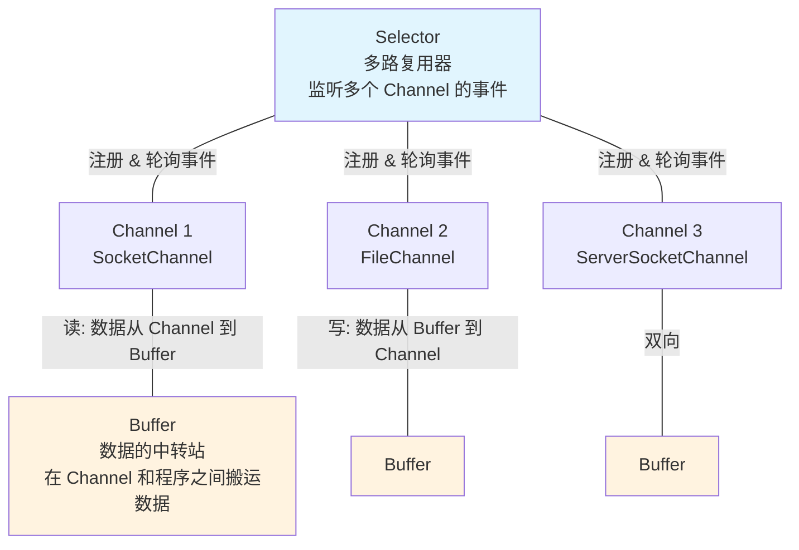
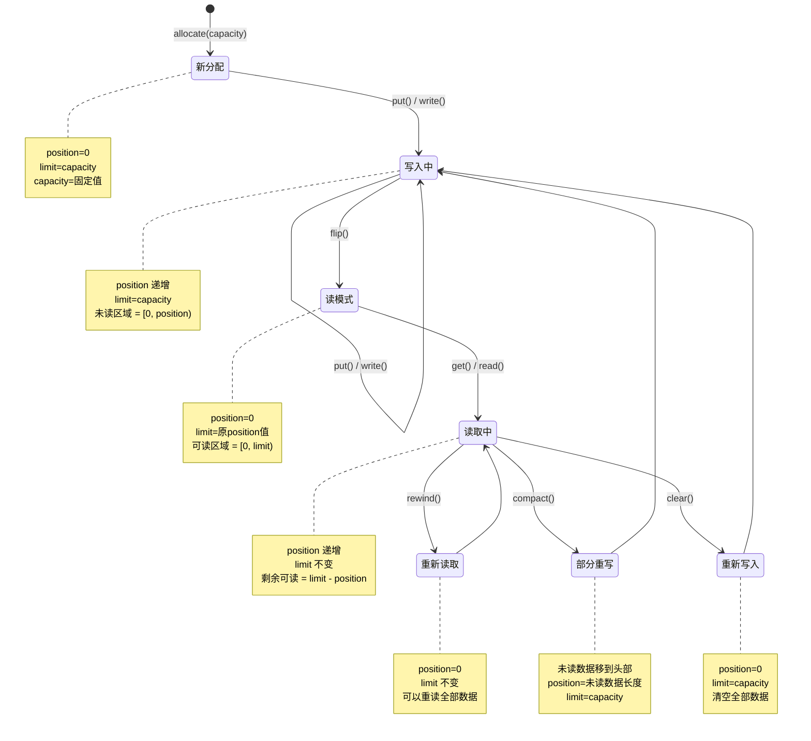
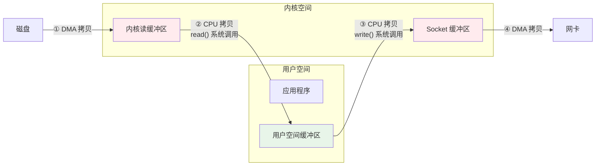
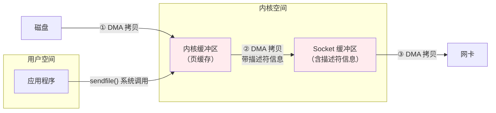
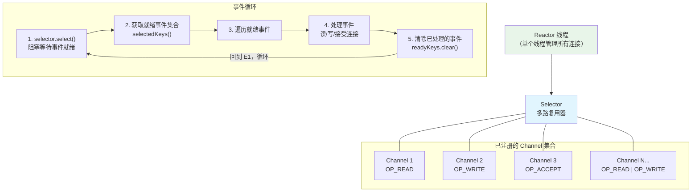
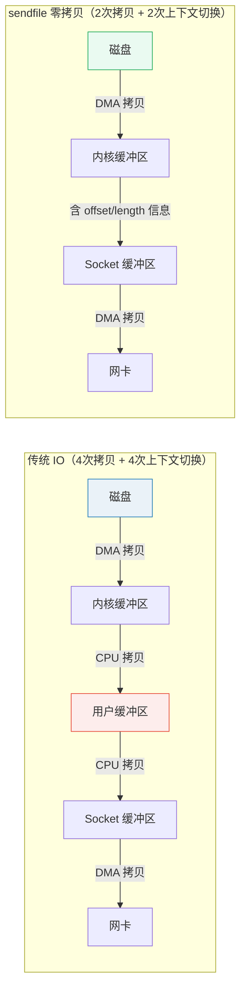

# Java IO/NIO

> Java 的 IO 体系是出了名的复杂——InputStream、OutputStream、Reader、Writer、Buffered、Channel、Buffer、Selector……光是类名就能列出一页纸。但拨开表面的复杂度，核心只有两件事：**数据从哪来、数据到哪去**。这篇文章帮你理清整个 IO 体系的脉络。

## IO 流体系全景





## BIO——Blocking IO

### 为什么 BIO 在高并发下不行？

```java
// BIO 的核心问题：每个连接独占一个线程
// 线程大部分时间在等 IO（阻塞），CPU 利用率极低

// 10000 个并发连接 → 10000 个线程
// 每个线程栈 1MB → 10GB 内存！
// 而且线程上下文切换的开销巨大

ServerSocket server = new ServerSocket(8080);
while (true) {
    Socket socket = server.accept();  // 阻塞，等待连接
    new Thread(() -> {               // 每个连接一个线程！
        InputStream in = socket.getInputStream();
        in.read();  // 阻塞，等待数据
        // 处理...
    }).start();
}
```

### try-with-resources——不要忘了关流

```java
// ❌ 传统写法：finally 里关闭，代码冗长
InputStream in = null;
try {
    in = new FileInputStream("test.txt");
    // 读取...
} finally {
    if (in != null) {
        try { in.close(); } catch (IOException e) { /* ... */ }
    }
}

// ✅ try-with-resources（Java 7+）：自动关闭，代码简洁
try (InputStream in = new FileInputStream("test.txt");
     BufferedReader reader = new BufferedReader(new InputStreamReader(in))) {
    String line;
    while ((line = reader.readLine()) != null) {
        System.out.println(line);
    }
}  // 自动调用 in.close()，即使发生异常也会关闭
```

::: danger 资源泄漏的后果
忘记关闭流会导致文件句柄泄漏。Linux 默认每个进程最多打开 1024 个文件（`ulimit -n`）。在高并发服务中，流不关闭会迅速耗尽文件句柄，导致无法打开新文件、无法建立新连接。**用 try-with-resources，养成习惯。**
:::

### Buffered 流——不要一行一行读文件

```java
// ❌ 无缓冲：每次 read() 都是一次系统调用
try (FileInputStream fis = new FileInputStream("big.txt")) {
    int data;
    while ((data = fis.read()) != -1) {  // 每次读 1 字节！
        // 处理...
    }
}

// ✅ 有缓冲：减少系统调用次数
try (BufferedInputStream bis = new BufferedInputStream(
        new FileInputStream("big.txt"))) {
    byte[] buffer = new byte[8192];  // 8KB 缓冲区
    int len;
    while ((len = bis.read(buffer)) != -1) {
        // 处理 buffer[0..len-1]
    }
}

// ✅ 读文本文件的最佳方式
try (BufferedReader reader = new BufferedReader(
        new FileReader("big.txt"))) {
    String line;
    while ((line = reader.readLine()) != null) {
        // 按行处理
    }
}
```

### 字节流 vs 字符流——什么时候用哪个？

```
用字节流：二进制文件（图片、视频、音频、压缩包、序列化对象）
用字符流：文本文件（txt、csv、json、xml、properties）

规则很简单：如果你需要关心字符编码，用字符流。
如果你不需要关心字符编码（或想自己控制），用字节流。
```

### 字符编码——乱码的根源

```java
// 编码问题是最常见的 IO bug 之一

// ❌ 用 FileReader 读 UTF-8 文件——在 GBK 环境下会乱码
// FileReader 使用平台默认编码（Windows 是 GBK，Linux 是 UTF-8）
try (FileReader reader = new FileReader("utf8.txt")) {
    // 可能乱码！
}

// ✅ 明确指定编码
try (BufferedReader reader = new BufferedReader(
        new InputStreamReader(new FileInputStream("utf8.txt"), StandardCharsets.UTF_8))) {
    // 编码安全
}

// ❌ String.getBytes() 用平台默认编码
byte[] bytes = "中文".getBytes();  // 不安全！

// ✅ 明确指定编码
byte[] bytes = "中文".getBytes(StandardCharsets.UTF_8);
String decoded = new String(bytes, StandardCharsets.UTF_8);
```

::: warning 永远不要依赖平台默认编码
`FileReader`、`FileWriter`、`String.getBytes()` 不带参数时使用平台默认编码，在不同环境下行为不同。**永远显式指定 `StandardCharsets.UTF_8`**。
:::

### 序列化—— Serializable 的高危陷阱

```java
// 实现 Serializable 很简单，但坑很多

// 1. serialVersionUID 不写会怎样？
// 每次修改类（加字段、改方法），编译器会自动生成新的 serialVersionUID
// 旧版本序列化的数据在新版本反序列化时会报 InvalidClassException

public class User implements Serializable {
    private static final long serialVersionUID = 1L;  // 必须写！
    private String name;
    private transient String password;  // transient：不参与序列化
}

// 2. transient 的字段反序列化后是 null/0/false
// 如果需要自定义序列化逻辑，实现 writeObject/readObject
private void writeObject(ObjectOutputStream out) throws IOException {
    out.defaultWriteObject();  // 默认序列化
    // 自定义：比如对 password 加密后再序列化
    out.writeObject(encrypt(password));
}

private void readObject(ObjectInputStream in) throws IOException, ClassNotFoundException {
    in.defaultReadObject();  // 默认反序列化
    // 自定义解密
    this.password = decrypt((String) in.readObject());
}
```

## NIO——Non-blocking IO

::: details BIO → NIO → AIO 的演进历程
- **BIO（JDK 1.0）**：同步阻塞，一个连接一个线程，适合连接数少的场景
- **NIO（JDK 1.4）**：同步非阻塞，一个线程管理多个连接（多路复用），适合高并发
- **AIO（JDK 1.7）**：异步非阻塞，回调机制，Linux 上底层用 epoll 模拟，Windows 上用 IOCP
- 实际生产中：Netty 基于 NIO 封装，是最主流的网络框架；AIO 使用较少
:::

### NIO 三大核心：Channel、Buffer、Selector 的关系

NIO 的设计围绕三个核心组件，它们各司其职又紧密协作：



**三者的分工：**

| 组件 | 职责 | 类比 |
|------|------|------|
| **Channel** | 数据的通道，连接数据源和数据目的地 | 高速公路 |
| **Buffer** | 数据的中转站，程序与 Channel 交互的载体 | 高速公路上的货车 |
| **Selector** | 监听多个 Channel 的事件（就绪状态） | 交通调度中心 |

**核心流程：** 线程通过 Selector 监听多个 Channel，当某个 Channel 有数据可读或可写时，Selector 通知线程，线程再通过 Buffer 从 Channel 读取数据或将数据写入 Channel。

### Buffer 详解——position / limit / capacity 状态变化

Buffer 是 NIO 最核心的概念。理解 Buffer 的状态变化，是掌握 NIO 的关键。

```java
ByteBuffer buffer = ByteBuffer.allocate(1024);

// 写入数据
buffer.put("Hello".getBytes());
System.out.println("写入后: position=" + buffer.position()  // 5
    + ", limit=" + buffer.limit());                        // 1024

// 切换为读模式
buffer.flip();
System.out.println("flip后: position=" + buffer.position()  // 0
    + ", limit=" + buffer.limit());                        // 5

// 读取数据
while (buffer.hasRemaining()) {
    System.out.print((char) buffer.get());
}

// 重置
buffer.clear();  // position=0, limit=capacity，准备再次写入
// buffer.rewind();  // position=0，limit 不变，可以重新读取
// buffer.compact();  // 把未读完的数据移到头部，准备继续写入
```

```
Buffer 的核心属性：
- capacity（容量）：固定不变，分配时确定
- position（位置）：当前读写位置
- limit（限制）：可读写的边界
- 写模式：position 从 0 递增，limit = capacity
- flip()：切换为读模式
- 读模式：position 从 0 递增，limit = 写入的数据量
```

#### Buffer 状态变化全景图



#### Buffer 的关键操作总结

| 方法 | 作用 | position | limit | 适用场景 |
|------|------|----------|-------|----------|
| `flip()` | 写 → 读 | 设为 0 | 设为写入的数据量 | 写完数据后准备读取 |
| `clear()` | 重置为写模式 | 设为 0 | 设为 capacity | 准备写入新数据（丢弃旧数据） |
| `compact()` | 压缩 + 切换写模式 | 设为未读数据长度 | 设为 capacity | 读了一部分，剩余的保留，继续追加写入 |
| `rewind()` | 重置 position | 设为 0 | 不变 | 重新读取已读过的数据 |
| `mark()` / `reset()` | 标记 + 回到标记 | 回到 mark 位置 | 不变 | 需要反复读取某段数据 |

#### 直接缓冲区 vs 堆缓冲区

::: tip 直接缓冲区 vs 堆缓冲区
`ByteBuffer.allocateDirect(1024)` 创建堆外内存（直接缓冲区），减少一次 JVM 堆到 Native 内存的拷贝，适合大文件 IO 和网络 IO。代价是分配/回收成本高，不受 GC 管理。`ByteBuffer.allocate(1024)` 创建堆内缓冲区，由 GC 管理，适合小数据量。
:::

```java
// 堆缓冲区——分配在 JVM 堆上，由 GC 管理
ByteBuffer heapBuffer = ByteBuffer.allocate(1024);

// 直接缓冲区——分配在堆外（Native 内存），不受 GC 直接管理
ByteBuffer directBuffer = ByteBuffer.allocateDirect(1024);

// 直接缓冲区的优势：减少一次内存拷贝
// 堆缓冲区路径：Channel → 堆外临时缓冲 → JVM 堆 Buffer → 用户代码
// 直接缓冲区路径：Channel → 堆外 Buffer → 用户代码（少一次拷贝）

// 如何判断？
System.out.println(heapBuffer.isDirect());    // false
System.out.println(directBuffer.isDirect());  // true

// 最佳实践：
// - 小数据量、频繁创建销毁 → 堆缓冲区（GC 管理更方便）
// - 大文件 IO、网络 IO、长期使用的 Buffer → 直接缓冲区（性能更好）
```

### Channel——双向数据通道

```java
// BIO 的流是单向的（InputStream 只能读，OutputStream 只能写）
// NIO 的 Channel 是双向的（既可以读也可以写）

// 文件复制——NIO 方式
try (FileChannel src = FileChannel.open(Paths.get("source.txt"), StandardOpenOption.READ);
     FileChannel dest = FileChannel.open(Paths.get("dest.txt"),
         StandardOpenOption.CREATE, StandardOpenOption.WRITE)) {

    // 方式1：transferTo——零拷贝（最佳性能）
    // 底层利用操作系统的 sendfile 系统调用
    // 数据直接从文件系统缓冲区到目标 Channel，不经过用户空间
    src.transferTo(0, src.size(), dest);

    // 方式2：手动用 Buffer
    // ByteBuffer buffer = ByteBuffer.allocate(8192);
    // while (src.read(buffer) != -1) {
    //     buffer.flip();
    //     dest.write(buffer);
    //     buffer.clear();
    // }
}
```

#### FileChannel 与零拷贝——sendfile 系统调用

零拷贝是 NIO 高性能的核心秘密。理解它需要从传统 IO 的数据流转说起：

**传统 IO（4 次拷贝 + 4 次上下文切换）：**



**零拷贝 sendfile（2 次拷贝 + 2 次上下文切换）：**



```java
// FileChannel.transferTo() 底层调用 sendfile 系统调用
// 在 Linux 上：当文件大小 < 2GB 时，只需 2 次数据拷贝（DMA 到页缓存 + DMA 到网卡）
// 当文件大小 > 2GB 时，需要分段调用（Linux 2.6.33 之前 sendfile 不支持 > 2GB）

try (FileChannel src = FileChannel.open(Paths.get("big.zip"), StandardOpenOption.READ);
     FileChannel dest = FileChannel.open(Paths.get("copy.zip"),
         StandardOpenOption.CREATE, StandardOpenOption.WRITE, StandardOpenOption.TRUNCATE_EXISTING)) {

    // transferTo 从 src 传输到 dest
    long transferred = 0;
    long size = src.size();
    while (transferred < size) {
        // 返回实际传输的字节数，可能一次传不完
        transferred += src.transferTo(transferred, size - transferred, dest);
    }
    System.out.println("传输完成: " + transferred + " 字节");
}

// transferFrom 是反向操作——从 src 读数据写入当前 channel
// dest.transferFrom(src, 0, src.size());
// 在网络传输场景中：FileChannel.transferTo(socketChannel) 是零拷贝的经典用法
```

::: tip 零拷贝在不同 OS 上的实现
- **Linux**：`sendfile` 系统调用，2 次拷贝（如果支持 DMA scatter/gather，甚至只需 1 次到页缓存）
- **macOS**：`fcntl(F_NOCACHE)` + `sendfile`
- **Windows**：`TransmitFile` API
- Java 的 `FileChannel.transferTo()` 会自动选择底层最优实现
:::

### Selector——多路复用

::: warning Selector 的常见坑
1. **wakeUp() 丢失**：如果在 `select()` 阻塞期间调用 `wakeup()`，下次 `select()` 会立即返回。但如果在非阻塞期间调用，效果会"丢失"到下一次 `select()`。
2. **selectionKey 未取消**：Channel 关闭后必须手动 `key.cancel()`，否则会一直出现在 `selectedKeys()` 中。
3. **selectedKeys 迭代器问题**：处理完 key 后必须调用 `iterator.remove()`，否则下次 select 还会返回已处理的 key。
4. **epoll 空轮询 bug**：JDK epoll 在 Linux 上有空轮询 bug，selector.select() 突然返回 0 次。Netty 的解决方式是计数器检测并重建 selector。
:::

Selector 是 NIO 解决 BIO "一个连接一个线程"问题的方案：

```java
// NIO 多路复用：一个线程处理多个连接
Selector selector = Selector.open();
ServerSocketChannel serverChannel = ServerSocketChannel.open();
serverChannel.configureBlocking(false);  // 非阻塞模式
serverChannel.register(selector, SelectionKey.OP_ACCEPT);  // 注册关注的事件

while (true) {
    selector.select();  // 阻塞，直到有事件就绪（有连接、有数据可读等）

    Set<SelectionKey> readyKeys = selector.selectedKeys();
    for (SelectionKey key : readyKeys) {
        if (key.isAcceptable()) {
            // 新连接到来
            SocketChannel channel = serverChannel.accept();
            channel.configureBlocking(false);
            channel.register(selector, SelectionKey.OP_READ);  // 关注读事件
        }
        if (key.isReadable()) {
            // 数据可读
            SocketChannel channel = (SocketChannel) key.channel();
            ByteBuffer buffer = ByteBuffer.allocate(1024);
            int len = channel.read(buffer);
            // 处理数据...
        }
    }
    readyKeys.clear();
}
```

#### Selector 多路复用原理——epoll 事件驱动模型



**epoll vs select/poll 的本质区别：**

| 特性 | select / poll | epoll |
|------|---------------|-------|
| 时间复杂度 | O(n)——每次都遍历所有 fd | O(1)——只返回就绪的 fd |
| 最大连接数 | 1024（FD_SETSIZE 限制） | 无限制（受系统内存） |
| 数据拷贝 | 每次都将 fd 集合从用户态拷贝到内核态 | 只在注册时拷贝一次 |
| 触发方式 | 水平触发（Level Triggered） | 支持边缘触发（Edge Triggered） |
| 内核实现 | 线性遍历 | 红黑树 + 就绪链表 |

```java
// 四种事件类型
SelectionKey.OP_ACCEPT   // 接受连接就绪（仅 ServerSocketChannel）
SelectionKey.OP_CONNECT  // 连接就绪（仅 SocketChannel 客户端）
SelectionKey.OP_READ     // 读就绪
SelectionKey.OP_WRITE    // 写就绪

// 事件可以组合注册
int interestOps = SelectionKey.OP_READ | SelectionKey.OP_WRITE;
channel.register(selector, interestOps);

// SelectionKey 还可以附加对象（如 Buffer 或业务上下文）
channel.register(selector, SelectionKey.OP_READ, ByteBuffer.allocate(1024));
// 之后通过 key.attachment() 取回
```

::: tip NIO vs BIO 的本质区别
BIO 是阻塞的：读不到数据就等，线程不能干别的。NIO 是非阻塞的 + 多路复用：一个线程通过 Selector 监听多个 Channel 的事件，哪个 Channel 有数据了就处理哪个。Netty、Tomcat NIO 模式都是基于这个原理。
:::

## NIO.2——现代 Java 的文件操作

### Files 工具类——一个类搞定常见操作

```java
Path path = Paths.get("data/users.json");

// 读写文件——简洁到不像 Java
String content = Files.readString(path);                    // 读全部
List<String> lines = Files.readAllLines(path);             // 按行读
Files.writeString(path, content);                           // 写全部（Java 11+）
Files.write(path, lines, StandardOpenOption.APPEND);        // 追加

// 文件操作
Files.copy(path, Paths.get("backup.json"));                // 复制
Files.move(path, Paths.get("archive/users.json"));          // 移动
Files.deleteIfExists(path);                                 // 删除

// 文件信息
BasicFileAttributes attrs = Files.readAttributes(path, BasicFileAttributes.class);
attrs.creationTime();
attrs.lastModifiedTime();
attrs.size();

// 遍历目录
try (Stream<Path> stream = Files.walk(Paths.get("src"))) {
    stream.filter(Files::isRegularFile)
          .filter(p -> p.toString().endsWith(".java"))
          .forEach(System.out::println);
}

// 读取大文件——流式处理，不会 OOM
try (Stream<String> stream = Files.lines(Paths.get("huge.log"))) {
    stream.filter(line -> line.contains("ERROR"))
          .limit(1000)
          .forEach(System.out::println);
}
```

::: warning Files.readAllLines() 的 OOM 风险
`Files.readAllLines()` 一次性把所有行读入内存。如果文件很大（几 GB），直接 OOM。大文件用 `Files.lines()`（返回 Stream，惰性加载）或 `BufferedReader.readLine()`。
:::

### Path——Java 7+ 的路径抽象

```java
// Path 替代了旧的 File 类，提供了更丰富的路径操作
Path path = Paths.get("/Users/hezhanwu/projects/java-fullstack-knowledge/src/java-basic/io.md");
// 或者
Path path = Path.of("/Users/hezhanwu/projects/java-fullstack-knowledge");  // Java 11+

// 路径组件操作
Path filename = path.getFileName();        // "io.md"
Path parent = path.getParent();            // ".../java-basic"
Path root = path.getRoot();                // "/"
int nameCount = path.getNameCount();       // 路径层级数
Path name = path.getName(2);              // "java-fullstack-knowledge"

// 路径组合与解析
Path resolved = path.resolve("images");    // 追加子路径
Path normalized = Paths.get("a/b/../c").normalize();  // "a/c"（消除 ..）
Path relativized = path.relativize(otherPath);        // 计算相对路径

// Path vs File 的核心区别
// Path 是接口，File 是类
// Path 支持更好的路径操作（resolve, relativize, normalize）
// Path 与 Files 工具类配合更自然
// Path 支持 URI 转换：path.toUri()
```

### WatchService——文件系统监控

```java
// WatchService 可以监控目录的变化（文件创建、修改、删除）
// 底层依赖操作系统的原生文件监控（Linux inotify、macOS FSEvents、Windows ReadDirectoryChangesW）

WatchService watchService = FileSystems.getDefault().newWatchService();

// 注册监控目录
Path dir = Paths.get("./config");
dir.register(watchService,
    StandardWatchEventKinds.ENTRY_CREATE,   // 文件创建
    StandardWatchEventKinds.ENTRY_DELETE,   // 文件删除
    StandardWatchEventKinds.ENTRY_MODIFY    // 文件修改
);

// 事件循环
WatchKey key;
while ((key = watchService.take()) != null) {
    for (WatchEvent<?> event : key.pollEvents()) {
        WatchEvent.Kind<?> kind = event.kind();
        Path fileName = (Path) event.context();  // 变化的文件名
        Path fullPath = dir.resolve(fileName);   // 完整路径
        
        System.out.println(kind + ": " + fullPath);
        
        if (kind == StandardWatchEventKinds.ENTRY_MODIFY) {
            // 文件被修改了——重新加载配置
            reloadConfig(fullPath);
        }
    }
    key.reset();  // 重要：重置 key 才能继续接收事件
}

// ⚠️ WatchService 的限制：
// 1. 不支持递归监控子目录（需要自己遍历子目录逐个注册）
// 2. 不能获取文件修改的具体内容（只知道"改了"，不知道"改了什么"）
// 3. 事件可能有重复或合并（OS 层面的行为）
```

## 序列化深入

::: details 为什么 Java 原生序列化不安全？
1. **反序列化漏洞**：攻击者可以构造恶意字节流，在反序列化时执行任意代码（如 `Runtime.exec()`）
2. **数据爆炸**：序列化一个包含 100 个对象的图结构可能产生 10MB+ 的字节流
3. **跨语言不兼容**：Java 序列化格式是 Java 私有的，Go/Python/Rust 无法反序列化
4. **性能差**：比 JSON 慢 10-100 倍，比 Protobuf 慢 100-1000 倍
- 安全建议：永远不要对外暴露 Java 原生序列化的端点，使用 JSON/Protobuf 替代
:::

### Externalizable vs Serializable

```java
// Serializable：自动化序列化，但控制力弱
// Externalizable：完全手动控制序列化过程，性能更好

// Serializable——反射自动序列化所有非 transient 字段
public class User implements Serializable {
    private static final long serialVersionUID = 1L;
    private String name;
    private transient String password;  // 不参与序列化
    
    // 可选：自定义序列化逻辑
    private void writeObject(ObjectOutputStream out) throws IOException {
        out.defaultWriteObject();
    }
    private void readObject(ObjectInputStream in) 
            throws IOException, ClassNotFoundException {
        in.defaultReadObject();
    }
}

// Externalizable——完全手动控制，性能更好（无反射开销）
public class UserExt implements Externalizable {
    private String name;
    private transient String password;  // transient 在 Externalizable 中无意义
    
    // 必须有无参构造函数！反序列化时先调用无参构造，再调用 readExternal
    public UserExt() {}
    
    public UserExt(String name, String password) {
        this.name = name;
        this.password = password;
    }
    
    @Override
    public void writeExternal(ObjectOutput out) throws IOException {
        // 完全手动控制哪些字段序列化、以什么顺序
        out.writeUTF(name);
        out.writeUTF(encrypt(password));  // 可以自由加密、压缩、选择字段
    }
    
    @Override
    public void readExternal(ObjectInput in) throws IOException {
        // 必须与 writeExternal 的顺序完全一致
        this.name = in.readUTF();
        this.password = decrypt(in.readUTF());
    }
}
```

| 维度 | Serializable | Externalizable |
|------|-------------|----------------|
| 序列化方式 | 自动（反射） | 手动（代码控制） |
| 性能 | 较慢（反射开销） | 较快（直接读写） |
| 控制力 | 弱（transient 排除字段） | 强（完全自定义） |
| 无参构造函数 | 不需要 | **必须** |
| serialVersionUID | 必须手动声明 | 不需要 |
| 适用场景 | 简单对象、快速实现 | 性能敏感、需要精细控制 |

### serialVersionUID 的版本兼容策略

```java
// serialVersionUID 的值变了 → 反序列化失败（InvalidClassException）
// serialVersionUID 的值不变 → 反序列化成功，新字段取默认值，旧字段忽略

public class Config implements Serializable {
    private static final long serialVersionUID = 1L;
    
    // v1: 只有 name
    private String name;
    
    // v2: 新增 version 字段（serialVersionUID 不变）
    // 旧数据反序列化时，version = null（引用类型默认值）
    private String version;
    
    // v3: 新增 maxConnections 字段
    // 旧数据反序列化时，maxConnections = 0（int 默认值）
    private int maxConnections;
}

// 最佳实践：
// 1. 从项目第一天就给所有 Serializable 类加上 serialVersionUID = 1L
// 2. 每次修改类结构时评估兼容性：
//    - 只新增字段 → serialVersionUID 不变（向后兼容）
//    - 删除字段 → serialVersionUID 不变（旧数据有冗余字段但无害）
//    - 修改字段类型 → serialVersionUID 必须变（不兼容）
// 3. 用 IDE 的 serialVersionUID 生成功能，不要让编译器自动生成
```

### 序列化的替代方案

```java
// 在现代 Java 开发中，Java 原生序列化越来越少用了，因为：
// 1. 安全漏洞：反序列化可以执行任意代码（反序列化攻击）
// 2. 性能差：序列化后体积大、速度慢
// 3. 跨语言不兼容

// ✅ JSON 序列化（最常用）
// Jackson / Gson
ObjectMapper mapper = new ObjectMapper();
String json = mapper.writeValueAsString(user);  // 对象 → JSON
User user = mapper.readValue(json, User.class);  // JSON → 对象

// ✅ Protocol Buffers（高性能、跨语言）
// 定义 .proto 文件，编译生成 Java 类
// 序列化后体积小、速度快，适合 RPC 和存储

// ✅ 自定义二进制格式（极致性能）
// 用 ByteBuffer 手动控制字节布局，零开销

// ❌ Java 原生序列化——除非有特殊需求（如 RMI、Session 复制），否则不要用
```

## 大文件实战

### 按行读取 vs 按块读取

```java
// 方式1：按行读取（BufferedReader）——适合文本处理
// 优点：逐行处理，内存友好
// 缺点：需要完整的一行在内存中，如果单行很长（如没有换行符的 JSON），可能 OOM
try (BufferedReader reader = new BufferedReader(
        new InputStreamReader(new FileInputStream("big.log"), StandardCharsets.UTF_8), 65536)) {
    String line;
    while ((line = reader.readLine()) != null) {
        // 逐行处理
        if (line.contains("ERROR")) {
            // 处理错误行
        }
    }
}

// 方式2：按块读取（BufferedInputStream）——适合二进制处理
// 优点：内存可控，不受单行长度限制
// 缺点：需要在块边界处处理数据切分
try (BufferedInputStream bis = new BufferedInputStream(
        new FileInputStream("big.zip"), 8192 * 4)) {  // 32KB 缓冲
    byte[] buffer = new byte[8192];
    int bytesRead;
    while ((bytesRead = bis.read(buffer)) != -1) {
        // 处理 buffer[0..bytesRead-1]
    }
}

// 方式3：Files.lines()——最简洁的文本流式处理
try (Stream<String> lines = Files.lines(Paths.get("big.log"))) {
    lines.parallel()  // 并行处理（适合 CPU 密集型操作）
         .filter(line -> line.contains("ERROR"))
         .forEach(this::processLine);
}

// 方式4：FileChannel + ByteBuffer——NIO 方式
try (FileChannel channel = FileChannel.open(Paths.get("big.zip"), StandardOpenOption.READ)) {
    ByteBuffer buffer = ByteBuffer.allocateDirect(8192 * 8);  // 直接缓冲区，64KB
    while (channel.read(buffer) != -1) {
        buffer.flip();
        // 处理 buffer
        buffer.clear();
    }
}
```

### 文件复制性能对比

```java
// 4 种文件复制方式的性能对比（复制 1GB 文件的典型耗时）

// 方式1：BIO 字节流——最慢（约 15 秒）
// 每次 read() 一个字节，系统调用次数 = 文件大小
try (InputStream in = new FileInputStream("source.zip");
     OutputStream out = new FileOutputStream("dest.zip")) {
    int data;
    while ((data = in.read()) != -1) {
        out.write(data);
    }
}

// 方式2：BIO 缓冲流——较快（约 3 秒）
// 系统调用次数 = 文件大小 / 缓冲区大小
try (BufferedInputStream in = new BufferedInputStream(new FileInputStream("source.zip"));
     BufferedOutputStream out = new BufferedOutputStream(new FileOutputStream("dest.zip"))) {
    byte[] buffer = new byte[8192];
    int len;
    while ((len = in.read(buffer)) != -1) {
        out.write(buffer, 0, len);
    }
}

// 方方式3：NIO Buffer——快（约 2 秒）
// 数据经过 JVM 堆缓冲区
try (FileChannel src = FileChannel.open(Paths.get("source.zip"), StandardOpenOption.READ);
     FileChannel dest = FileChannel.open(Paths.get("dest.zip"),
         StandardOpenOption.CREATE, StandardOpenOption.WRITE)) {
    ByteBuffer buffer = ByteBuffer.allocate(8192 * 8);
    while (src.read(buffer) != -1) {
        buffer.flip();
        dest.write(buffer);
        buffer.clear();
    }
}

// 方式4：NIO transferTo——最快（约 0.5 秒）
// 零拷贝，数据不经过用户空间
try (FileChannel src = FileChannel.open(Paths.get("source.zip"), StandardOpenOption.READ);
     FileChannel dest = FileChannel.open(Paths.get("dest.zip"),
         StandardOpenOption.CREATE, StandardOpenOption.WRITE)) {
    src.transferTo(0, src.size(), dest);
}

// 方式5：Files.copy（Java 7+）——推荐日常使用
// 内部使用 NIO，性能与方式3接近，但代码最简洁
Files.copy(Paths.get("source.zip"), Paths.get("dest.zip"), StandardCopyOption.REPLACE_EXISTING);
```

| 方式 | 原理 | 典型耗时（1GB） | 适用场景 |
|------|------|-----------------|----------|
| BIO 字节流 | 逐字节系统调用 | ~15s | 永远不要用 |
| BIO 缓冲流 | 带缓冲的块拷贝 | ~3s | 简单文件操作 |
| NIO Buffer | JVM 堆缓冲区中转 | ~2s | 需要对数据做处理时 |
| NIO transferTo | 零拷贝（sendfile） | ~0.5s | 纯文件复制（最优） |
| Files.copy | 封装 NIO | ~2s | 日常使用（代码简洁） |

::: tip 文件复制的最佳实践
纯复制文件用 `Files.copy()` 或 `transferTo()`；需要处理文件内容用 `BufferedReader` / `BufferedInputStream`；大文件复制注意用缓冲区和直接缓冲区。
:::

## 面试高频题

**Q1：BIO、NIO、AIO 的区别？**

BIO（Blocking IO）：同步阻塞，一个连接一个线程。NIO（Non-blocking IO）：同步非阻塞 + 多路复用，一个线程处理多个连接（Selector）。AIO（Asynchronous IO）：异步非阻塞，发起 IO 操作后不等待，通过回调或 Future 获取结果（Java 7 的 `AsynchronousFileChannel`）。Netty 基于 NIO 封装，是实际开发中最常用的网络框架。

**Q2：什么是零拷贝？**

传统 IO：数据从磁盘 → 内核缓冲区 → 用户空间缓冲区 → Socket 缓冲区 → 网卡。4 次数据拷贝 + 4 次上下文切换。零拷贝（`transferTo` / `sendfile`）：数据从磁盘 → 内核缓冲区 → 网卡。2 次拷贝 + 2 次上下文切换。省去了用户空间的一次拷贝。

**Q3：为什么 BufferedReader 比 FileReader 快？**

FileReader 每次调用 `read()` 都是一次系统调用，系统调用开销大。BufferedReader 内部维护了一个 char 缓冲区（默认 8KB），先从系统一次读一大块数据到缓冲区，后续 `read()` 从缓冲区取，减少了系统调用次数。

**Q4：Selector 的 select()、selectNow()、select(long timeout) 有什么区别？**

`select()` 无限阻塞，直到有至少一个 Channel 就绪。`selectNow()` 不阻塞，立即返回当前就绪的 Channel 数量（可能为 0）。`select(long timeout)` 阻塞最多 timeout 毫秒。在 Reactor 模式中，通常使用 `select()`，配合 `wakeup()` 从外部唤醒 Selector。

**Q5：直接缓冲区（Direct Buffer）为什么性能更好？有什么代价？**

直接缓冲区分配在堆外内存（Native Memory），IO 操作时数据不需要在 JVM 堆和 Native 内存之间拷贝。代价是：分配和回收成本高（不受 GC 直接管理，通过 Cleaner 机制回收）、不受 GC 保护可能导致内存泄漏、堆外内存大小受限（通过 `-XX:MaxDirectMemorySize` 配置）。


### 零拷贝技术详解

#### 传统 IO vs 零拷贝



```java
// Java 零拷贝 API
FileChannel channel = new FileInputStream("data.log").getChannel();
// transferTo 内部调用 sendfile 系统调用
channel.transferTo(0, channel.size(), socketChannel);

// mmap 内存映射：文件直接映射到内存地址空间
FileChannel fc = FileChannel.open(Paths.get("data.log"));
MappedByteBuffer mbb = fc.map(FileChannel.MapMode.READ_ONLY, 0, fc.size());
// 访问 mbb 就像访问内存，OS 按需加载页面
```

| 方式 | 拷贝次数 | 上下文切换 | 适用场景 |
|------|---------|-----------|---------|
| 传统 read+write | 4 | 4 | 需要处理数据 |
| sendfile | 2（CPU 0次） | 2 | 静态文件传输 |
| sendfile + DMA Scatter/Gather | 2（CPU 0次） | 2 | 零拷贝终极方案 |
| mmap | 2（CPU 1次） | 4 | 需要修改文件 |

### NIO Selector 原理

```java
Selector selector = Selector.open();
ServerSocketChannel ssc = ServerSocketChannel.open();
ssc.configureBlocking(false);
ssc.register(selector, SelectionKey.OP_ACCEPT);

while (true) {
    int ready = selector.select();  // 阻塞直到有事件就绪
    Set<SelectionKey> keys = selector.selectedKeys();
    for (SelectionKey key : keys) {
        if (key.isAcceptable()) { /* 接受连接 */ }
        if (key.isReadable())   { /* 读取数据 */ }
        if (key.isWritable())   { /* 写入数据 */ }
    }
    keys.clear();
}
```

:::tip Netty 为什么基于 NIO？
Netty 封装了 NIO 的复杂性：
- **EventLoop**：每个 EventLoop 绑定一个 Thread + Selector，处理多个 Channel
- **ByteBuf**：比 ByteBuffer 更好用，支持池化、引用计数、零拷贝
- **FastThreadLocal**：比 JDK ThreadLocal 性能更好
- **零拷贝**：CompositeByteBuf（逻辑合并）、FileRegion（transferTo 封装）
:::


## 延伸阅读

- 上一篇：[语法基础](syntax.md) — 数据类型、运算符、字符串
- 下一篇：[泛型与注解](generics.md) — 类型擦除、PECS 原则
- [Java 高级特性](../java-advanced/jvm.md) — JVM 原理、内存模型
